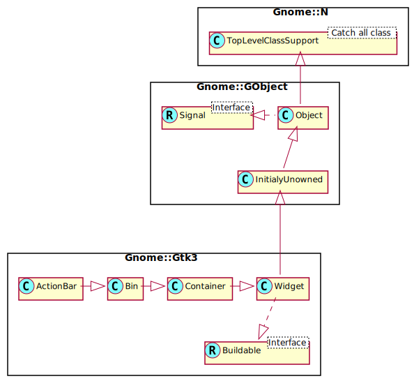

Gnome::Gtk3::ActionBar
======================

A full width bar for presenting contextual actions

Description
===========

**Gnome::Gtk3::ActionBar** is designed to present contextual actions. It is expected to be displayed below the content and expand horizontally to fill the area.

It allows placing children at the start or the end. In addition, it contains an internal centered box which is centered with respect to the full width of the box, even if the children at either side take up different amounts of space.

Css Nodes **Gnome::Gtk3::ActionBar** has a single CSS node with name actionbar.
-------------------------------------------------------------------------------

See Also
--------

**Gnome::Gtk3::Box**

Synopsis
========

Declaration
-----------

    unit class Gnome::Gtk3::ActionBar;
    also is Gnome::Gtk3::Bin;

Uml Diagram
-----------

Inheriting this class
---------------------

Inheriting is done in a special way in that it needs a call from new() to get the native object created by the class you are inheriting from.

    use Gnome::Gtk3::ActionBar;

    unit class MyGuiClass;
    also is Gnome::Gtk3::ActionBar;

    submethod new ( |c ) {
      # let the Gnome::Gtk3::ActionBar class process the options
      self.bless( :GtkActionBar, |c);
    }

    submethod BUILD ( ... ) {
      ...
    }

Methods
=======

new
---

### default, no options

Create a new ActionBar object.

    multi method new ( )

### :native-object

Create a ActionBar object using a native object from elsewhere. See also **Gnome::N::TopLevelClassSupport**.

    multi method new ( N-GObject :$native-object! )

### :build-id

Create a ActionBar object using a native object returned from a builder. See also **Gnome::GObject::Object**.

    multi method new ( Str :$build-id! )

get-center-widget, get-center-widget-rk
---------------------------------------

Retrieves the center bar widget of the bar or `undefined`.

    method get-center-widget ( --> N-GObject )
    method get-center-widget-rk ( --> Gnome::Gtk3::Widget )

pack-end
--------

Adds *child* to *action-bar*, packed with reference to the end of the *action-bar*.

    method pack-end ( N-GObject $child )

  * N-GObject $child; the **Gnome::Gtk3::Widget** to be added to *action-bar*

pack-start
----------

Adds *child* to *action-bar*, packed with reference to the start of the *action-bar*.

    method pack-start ( N-GObject $child )

  * N-GObject $child; the **Gnome::Gtk3::Widget** to be added to *action-bar*

set-center-widget
-----------------

Sets the center widget for the **Gnome::Gtk3::ActionBar**.

    method set-center-widget ( N-GObject $center_widget )

  * N-GObject $center_widget; a widget to use for the center

