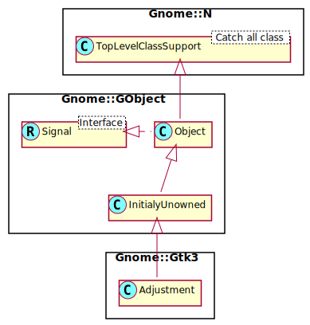

Gnome::Gtk3::Adjustment
=======================

A representation of an adjustable bounded value

Description
===========

The **Gnome::Gtk3::Adjustment** object represents a value which has an associated lower and upper bound, together with step and page increments, and a page size. It is used within several GTK+ widgets, including **Gnome::Gtk3::SpinButton**, **Gnome::Gtk3::Viewport**, and **Gnome::Gtk3::Range** (which is a base class for **Gnome::Gtk3::Scrollbar** and **Gnome::Gtk3::Scale**).

The **Gnome::Gtk3::Adjustment** object does not update the value itself. Instead it is left up to the owner of the **Gnome::Gtk3::Adjustment** to control the value.

Synopsis
========

Declaration
-----------

    unit class Gnome::Gtk3::Adjustment;
    also is Gnome::GObject::InitiallyUnowned;

Uml Diagram
-----------

Methods
=======

new
---

### :value, :lower, :upper, :step-increment, :page-increment, :page-size

Create a new Adjustment object.

    multi method new (
      Num() :$value!, Num() :$lower!, Num() :$upper!,
      Num() :$step-increment!, Num() :$page-increment!,
      Num() :$page-size!
    )

  * $value; the initial value.

  * $lower; the minimum value.

  * $upper; the maximum value

  * $step_increment; the step increment

  * $page_increment; the page increment

  * $page_size; the page size

### :native-object

Create an object using a native object from elsewhere. See also **Gnome::N::TopLevelSupportClass**.

    multi method new ( N-GtkTreePath :$native-object! )

clamp-page
----------

Updates the *value* property to ensure that the range between *lower* and *upper* is in the current page (i.e. between *value* and *value* + *page-size*). If the range is larger than the page size, then only the start of it will be in the current page.

A *value-changed* signal will be emitted if the value is changed.

    method clamp-page ( Num() $lower, Num() $upper )

  * $lower; the lower value

  * $upper; the upper value

configure
---------

Sets all properties of the adjustment at once.

Use this function to avoid multiple emissions of the *changed* signal. See `set-lower()` for an alternative way of compressing multiple emissions of *changed* into one.

    method configure ( Num() $value, Num() $lower, Num() $upper, Num() $step_increment, Num() $page_increment, Num() $page_size )

  * $value; the new value

  * $lower; the new minimum value

  * $upper; the new maximum value

  * $step_increment; the new step increment

  * $page_increment; the new page increment

  * $page_size; the new page size

get-lower
---------

Retrieves the minimum value of the adjustment.

Returns: The current minimum value of the adjustment

    method get-lower ( --> Num() )

get-minimum-increment
---------------------

Gets the smaller of step increment and page increment.

Returns: the minimum increment of *adjustment*

    method get-minimum-increment ( --> Num() )

get-page-increment
------------------

Retrieves the page increment of the adjustment.

Returns: The current page increment of the adjustment

    method get-page-increment ( --> Num() )

get-page-size
-------------

Retrieves the page size of the adjustment.

Returns: The current page size of the adjustment

    method get-page-size ( --> Num() )

get-step-increment
------------------

Retrieves the step increment of the adjustment.

Returns: The current step increment of the adjustment.

    method get-step-increment ( --> Num() )

get-upper
---------

Retrieves the maximum value of the adjustment.

Returns: The current maximum value of the adjustment

    method get-upper ( --> Num() )

get-value
---------

Gets the current value of the adjustment. See `set-value()`.

Returns: The current value of the adjustment

    method get-value ( --> Num() )

set-lower
---------

Sets the minimum value of the adjustment.

When setting multiple adjustment properties via their individual setters, multiple *changed* signals will be emitted. However, since the emission of the *changed* signal is tied to the emission of the *notify* signals of the changed properties, it’s possible to compress the *changed* signals into one by calling `g-object-freeze-notify()` and `g-object-thaw-notify()` around the calls to the individual setters.

Alternatively, using a single `g-object-set()` for all the properties to change, or using `configure()` has the same effect of compressing *changed* emissions.

    method set-lower ( Num() $lower )

  * $lower; the new minimum value

set-page-increment
------------------

Sets the page increment of the adjustment.

See `set-lower()` about how to compress multiple emissions of the *changed* signal when setting multiple adjustment properties.

    method set-page-increment ( Num() $page_increment )

  * $page_increment; the new page increment

set-page-size
-------------

Sets the page size of the adjustment.

See `set-lower()` about how to compress multiple emissions of the GtkAdjustment::changed signal when setting multiple adjustment properties.

    method set-page-size ( Num() $page_size )

  * $page_size; the new page size

set-step-increment
------------------

Sets the step increment of the adjustment.

See `set-lower()` about how to compress multiple emissions of the *changed* signal when setting multiple adjustment properties.

    method set-step-increment ( Num() $step_increment )

  * $step_increment; the new step increment

set-upper
---------

Sets the maximum value of the adjustment.

Note that values will be restricted by `upper - page-size` if the page-size property is nonzero.

See `set-lower()` about how to compress multiple emissions of the *changed* signal when setting multiple adjustment properties.

    method set-upper ( Num() $upper )

  * $upper; the new maximum value

set-value
---------

Sets the **Gnome::Gtk3::Adjustment** value. The value is clamped to lie between *lower* and *upper*.

Note that for adjustments which are used in a **Gnome::Gtk3::Scrollbar**, the effective range of allowed values goes from *lower* to *upper* - *page-size*.

    method set-value ( Num() $value )

  * $value; the new value

Signals
=======

changed
-------

Emitted when one or more of the **Gnome::Gtk3::Adjustment** properties have been changed, other than the *value* property.

    method handler (
      Gnome::Gtk3::Adjustment :_widget($adjustment),
      Int :$_handler-id,
      N-GObject :$_native-object,
      *%user-options
    )

  * $adjustment; The instance which registered the signal

  * $_handler-id; The handler id which is returned from the registration

  * $_native-object; The native object provided by the caller wrapped in the Raku object.

  * %user-options; A list of named arguments provided at the `register-signal()` method

value-changed
-------------

Emitted when the *value* property has been changed.

    method handler (
      Gnome::Gtk3::Adjustment :_widget($adjustment),
      Int :$_handler-id,
      N-GObject :$_native-object,
      *%user-options
    )

  * $adjustment; The instance which registered the signal

  * $_handler-id; The handler id which is returned from the registration

  * $_native-object; The native object provided by the caller wrapped in the Raku object.

  * %user-options; A list of named arguments provided at the `register-signal()` method

Properties
==========

lower
-----

The minimum value of the adjustment.

The **Gnome::GObject::Value** type of property *lower* is `G_TYPE_DOUBLE`.

page-increment
--------------

The page increment of the adjustment.

The **Gnome::GObject::Value** type of property *page-increment* is `G_TYPE_DOUBLE`.

page-size
---------

The page size of the adjustment.

Note that the page-size is irrelevant and should be set to zero if the adjustment is used for a simple scalar value, e.g. in a **Gnome::Gtk3::SpinButton**.

The **Gnome::GObject::Value** type of property *page-size* is `G_TYPE_DOUBLE`.

step-increment
--------------

The step increment of the adjustment.

The **Gnome::GObject::Value** type of property *step-increment* is `G_TYPE_DOUBLE`.

upper
-----

The maximum value of the adjustment.

Note that values will be restricted by upper - page-size` if the page-size property is nonzero.

The **Gnome::GObject::Value** type of property *upper* is `G_TYPE_DOUBLE`.

value
-----

The value of the adjustment.

The **Gnome::GObject::Value** type of property *value* is `G_TYPE_DOUBLE`.

