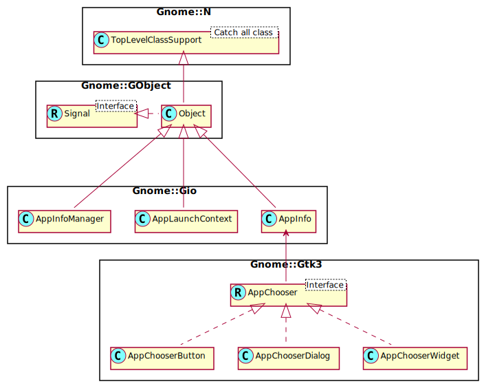

Gnome::Gtk3::AppChooser
=======================

Interface implemented by widgets for choosing an application

Description
===========

**Gnome::Gtk3::AppChooser** is an interface that can be implemented by widgets which allow the user to choose an application (typically for the purpose of opening a file). The main objects that implement this interface are **Gnome::Gtk3::AppChooserWidget**, **Gnome::Gtk3::AppChooserDialog** and **Gnome::Gtk3::AppChooserButton**.

Applications are represented by **Gnome::Gio::AppInfo** objects here. GIO has a concept of recommended and fallback applications for a given content type. Recommended applications are those that claim to handle the content type itself, while fallback also includes applications that handle a more generic content type. GIO also knows the default and last-used application for a given content type. The **Gnome::Gtk3::AppChooserWidget** provides detailed control over whether the shown list of applications should include default, recommended or fallback applications.

To obtain the application that has been selected in a **Gnome::Gtk3::AppChooser**, use `get-app-info()`.

See Also
--------

**Gnome::Gio::AppInfo**

Synopsis
========

Declaration
-----------

    unit role Gnome::Gtk3::AppChooser;

Uml
---

Methods
=======

get-app-info, get-app-info-rk
-----------------------------

Returns the currently selected application.

Returns: a (native **Gnome::Gio::AppInfo** for the currently selected application, or `undefined` if none is selected. Free with `clear-object()`

    method get-app-info ( --> N-GObject )
    method get-app-info-rk ( --> Gnome::Gio::AppInfo )

get-content-type
----------------

Returns the current value of the *content-type* property.

    method get-content-type ( --> Str )

refresh
-------

Reloads the list of applications.

    method refresh ( )

