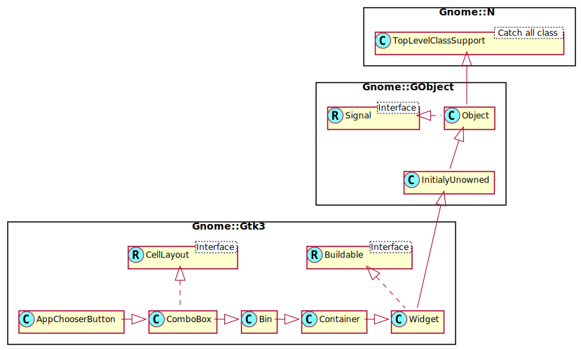

Gnome::Gtk3::AppChooserButton
=============================

A button to launch an application chooser dialog

Description
===========

The **Gnome::Gtk3::AppChooserButton** is a widget that lets the user select an application. It implements the **Gnome::Gtk3::AppChooser** interface.

Initially, a **Gnome::Gtk3::AppChooserButton** selects the first application in its list, which will either be the most-recently used application or, if *show-default-item* property is `True`, the default application.

The list of applications shown in a **Gnome::Gtk3::AppChooserButton** includes the recommended applications for the given content type. When *show-default-item* is set, the default application is also included. To let the user choose other applications, you can set the *show-dialog-item* property, which allows to open a full **Gnome::Gtk3::AppChooserDialog**.

It is possible to add custom items to the list, using `append-custom-item()`. These items cause the *custom-item-activated* signal to be emitted when they are selected.

To track changes in the selected application, use the *changed* signal.

Synopsis
========

Declaration
-----------

    unit class Gnome::Gtk3::AppChooserButton;
    also is Gnome::Gtk3::ComboBox;
    also does Gnome::Gtk3::AppChooser;

Uml Diagram
-----------

Inheriting this class
---------------------

Inheriting is done in a special way in that it needs a call from new() to get the native object created by the class you are inheriting from.

    use Gnome::Gtk3::AppChooserButton;

    unit class MyGuiClass;
    also is Gnome::Gtk3::AppChooserButton;

    submethod new ( |c ) {
      # let the Gnome::Gtk3::AppChooserButton class process the options
      self.bless( :GtkAppChooserButton, |c);
    }

    submethod BUILD ( ... ) {
      ...
    }

Methods
=======

new
---

### :content-type

Creates a new **Gnome::Gtk3::AppChooserButton** for applications that can handle content of the given type.

    multi method new ( Str :$content-type! )

### :native-object

Create a AppChooserButton object using a native object from elsewhere. See also **Gnome::N::TopLevelClassSupport**.

    multi method new ( N-GObject :$native-object! )

### :build-id

Create a AppChooserButton object using a native object returned from a builder. See also **Gnome::GObject::Object**.

    multi method new ( Str :$build-id! )

append-custom-item
------------------

Appends a custom item to the list of applications that is shown in the popup; the item name must be unique per-widget. Clients can use the provided name as a detail for the *custom-item-activated* signal, to add a callback for the activation of a particular custom item in the list. See also `append-separator()`.

    method append-custom-item ( Str $name, Str $label, N-GObject $icon )

  * Str $name; the name of the custom item

  * Str $label; the label for the custom item

  * N-GObject $icon; the icon for the custom item

append-separator
----------------

Appends a separator to the list of applications that is shown in the popup.

    method append-separator ( )

get-heading
-----------

Returns the text to display at the top of the dialog.

Returns: the text to display at the top of the dialog, or `undefined`, in which case a default text is displayed

    method get-heading ( --> Str )

get-show-default-item
---------------------

Returns the current value of the *show-default-item* property.

Returns: the value of *show-default-item*

    method get-show-default-item ( --> Bool )

get-show-dialog-item
--------------------

Returns the current value of the *show-dialog-item* property.

Returns: the value of *show-dialog-item*

    method get-show-dialog-item ( --> Bool )

set-active-custom-item
----------------------

Selects a custom item previously added with `append-custom-item()`.

Use `Gnome::Gtk3::AppChooser.refresh()` to bring the selection to its initial state.

    method set-active-custom-item ( Str $name )

  * Str $name; the name of the custom item

set-heading
-----------

Sets the text to display at the top of the dialog. If the heading is not set, the dialog displays a default text.

    method set-heading ( Str $heading )

  * Str $heading; a string containing Pango markup

set-show-default-item
---------------------

Sets whether the dropdown menu of this button should show the default application for the given content type at top.

    method set-show-default-item ( Bool $setting )

  * Bool $setting; the new value for *show-default-item*

set-show-dialog-item
--------------------

Sets whether the dropdown menu of this button should show an entry to trigger a **Gnome::Gtk3::AppChooserDialog**.

    method set-show-dialog-item ( Bool $setting )

  * Bool $setting; the new value for *show-dialog-item*

Signals
=======

There are two ways to connect to a signal. The first option you have is to use `register-signal()` from **Gnome::GObject::Object**. The second option is to use `connect-object()` directly from **Gnome::GObject::Signal**.

First method
------------

The positional arguments of the signal handler are all obligatory as well as their types. The named attributes `:$widget` and user data are optional.

    # handler method
    method mouse-event ( GdkEvent $event, :$widget ) { ... }

    # connect a signal on window object
    my Gnome::Gtk3::Window $w .= new( ... );
    $w.register-signal( self, 'mouse-event', 'button-press-event');

Second method
-------------

    my Gnome::Gtk3::Window $w .= new( ... );
    my Callable $handler = sub (
      N-GObject $native, GdkEvent $event, OpaquePointer $data
    ) {
      ...
    }

    $w.connect-object( 'button-press-event', $handler);

Also here, the types of positional arguments in the signal handler are important. This is because both methods `register-signal()` and `connect-object()` are using the signatures of the handler routines to setup the native call interface.

Supported signals
-----------------

### custom-item-activated

Emitted when a custom item, previously added with `append-custom-item()`, is activated from the dropdown menu.

    method handler (
      Str $item_name,
      Int :$_handle_id,
      Gnome::GObject::Object :_widget($self),
      *%user-options
    );

  * $self; the object which received the signal

  * $item_name; the name of the activated item

  * $_handle_id; the registered event handler id

Properties
==========

An example of using a string type property of a **Gnome::Gtk3::Label** object. This is just showing how to set/read a property, not that it is the best way to do it. This is because a) The class initialization often provides some options to set some of the properties and b) the classes provide many methods to modify just those properties. In the case below one can use **new(:label('my text label'))** or **.set-text('my text label')**.

    my Gnome::Gtk3::Label $label .= new;
    my Gnome::GObject::Value $gv .= new(:init(G_TYPE_STRING));
    $label.get-property( 'label', $gv);
    $gv.set-string('my text label');

Supported properties
--------------------

### Heading: heading

The text to show at the top of the dialog that can be * opened from the button. The string may contain Pango markup. The **Gnome::GObject::Value** type of property *heading* is `G_TYPE_STRING`.

### Show default item: show-default-item

The *show-default-item* property determines whether the dropdown menu should show the default application on top for the provided content type.

The **Gnome::GObject::Value** type of property *show-default-item* is `G_TYPE_BOOLEAN`.

### Include an 'Other…' item: show-dialog-item

The *show-dialog-item* property determines whether the dropdown menu should show an item that triggers * a **Gnome::Gtk3::AppChooserDialog** when clicked. The **Gnome::GObject::Value** type of property *show-dialog-item* is `G_TYPE_BOOLEAN`.

