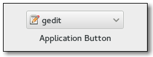

Gnome::Gtk3::AppChooserButton
=============================

A button to launch an application chooser dialog

Description
===========

The **Gnome::Gtk3::AppChooserButton** is a widget that lets the user select an application. It implements the **Gnome::Gtk3::AppChooser** interface.

Initially, a **Gnome::Gtk3::AppChooserButton** selects the first application in its list, which will either be the most-recently used application or, if *show-default-item* property is `True`, the default application.

The list of applications shown in a **Gnome::Gtk3::AppChooserButton** includes the recommended applications for the given content type. When *show-default-item* is set, the default application is also included. To let the user choose other applications, you can set the *show-dialog-item* property, which allows to open a full **Gnome::Gtk3::AppChooserDialog**.

It is possible to add custom items to the list, using `append-custom-item()`. These items cause the *custom-item-activated* signal to be emitted when they are selected.

To track changes in the selected application, use the *changed* signal.

Synopsis
========

Declaration
-----------

    unit class Gnome::Gtk3::AppChooserButton;
    also is Gnome::Gtk3::ComboBox;
    also does Gnome::Gtk3::AppChooser;

Uml Diagram
-----------

Inheriting this class
---------------------

Inheriting is done in a special way in that it needs a call from new() to get the native object created by the class you are inheriting from.

    use Gnome::Gtk3::AppChooserButton;

    unit class MyGuiClass;
    also is Gnome::Gtk3::AppChooserButton;

    submethod new ( |c ) {
      # let the Gnome::Gtk3::AppChooserButton class process the options
      self.bless( :GtkAppChooserButton, |c);
    }

    submethod BUILD ( ... ) {
      ...
    }

Methods
=======

new
---

### :content-type

Creates a new **Gnome::Gtk3::AppChooserButton** for applications that can handle content of the given type.

    multi method new ( Str :$content-type! )

### :native-object

Create a AppChooserButton object using a native object from elsewhere. See also **Gnome::N::TopLevelClassSupport**.

    multi method new ( N-GObject :$native-object! )

### :build-id

Create a AppChooserButton object using a native object returned from a builder. See also **Gnome::GObject::Object**.

    multi method new ( Str :$build-id! )

append-custom-item
------------------

Appends a custom item to the list of applications that is shown in the popup; the item name must be unique per-widget. Clients can use the provided name as a detail for the *custom-item-activated* signal, to add a callback for the activation of a particular custom item in the list. See also `append-separator()`.

    method append-custom-item ( Str $name, Str $label, N-GObject() $icon )

  * $name; the name of the custom item

  * $label; the label for the custom item

  * $icon; the icon for the custom item

append-separator
----------------

Appends a separator to the list of applications that is shown in the popup.

    method append-separator ( )

get-heading
-----------

Returns the text to display at the top of the dialog.

Returns: the text to display at the top of the dialog, or `undefined`, in which case a default text is displayed

    method get-heading ( --> Str )

get-show-default-item
---------------------

Returns the current value of the *show-default-item* property.

Returns: the value of *show-default-item*

    method get-show-default-item ( --> Bool )

get-show-dialog-item
--------------------

Returns the current value of the *show-dialog-item* property.

Returns: the value of *show-dialog-item*

    method get-show-dialog-item ( --> Bool )

set-active-custom-item
----------------------

Selects a custom item previously added with `append-custom-item()`.

Use `Gnome::Gtk3::AppChooser.refresh()` to bring the selection to its initial state.

    method set-active-custom-item ( Str $name )

  * $name; the name of the custom item

set-heading
-----------

Sets the text to display at the top of the dialog. If the heading is not set, the dialog displays a default text.

    method set-heading ( Str $heading )

  * $heading; a string containing Pango markup

set-show-default-item
---------------------

Sets whether the dropdown menu of this button should show the default application for the given content type at top.

    method set-show-default-item ( Bool $setting )

  * $setting; the new value for *show-default-item*

set-show-dialog-item
--------------------

Sets whether the dropdown menu of this button should show an entry to trigger a **Gnome::Gtk3::AppChooserDialog**.

    method set-show-dialog-item ( Bool $setting )

  * $setting; the new value for *show-dialog-item*

Signals
=======

custom-item-activated
---------------------

Emitted when a custom item, previously added with `append_custom_item()`, is activated from the dropdown menu.

    method handler (
      Str $item_name,
      Gnome::Gtk3::AppChooserButton :_widget($button),
      Int :$_handler-id,
      N-GObject :$_native-object,
      *%user-options
    )

  * $item_name; the name of the activated item

  * $button; The instance which registered the signal

  * $_handler-id; The handler id which is returned from the registration

  * $_native-object; The native object provided by the caller wrapped in the Raku object.

  * %user-options; A list of named arguments provided at the `register-signal()` method

Properties
==========

heading
-------

The text to show at the top of the dialog that can be opened from the button. The string may contain Pango markup.

The **Gnome::GObject::Value** type of property *heading* is `G_TYPE_STRING`.

show-default-item
-----------------

The *show-default-item* property determines whether the dropdown menu should show the default application on top for the provided content type.

The **Gnome::GObject::Value** type of property *show-default-item* is `G_TYPE_BOOLEAN`.

show-dialog-item
----------------

The *show-dialog-item* property determines whether the dropdown menu should show an item that triggers a **Gnome::Gtk3::AppChooserDialog** when clicked.

The **Gnome::GObject::Value** type of property *show-dialog-item* is `G_TYPE_BOOLEAN`.

