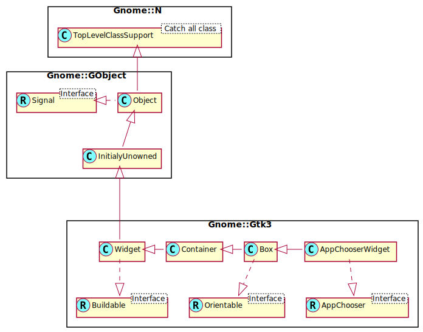

Gnome::Gtk3::AppChooserWidget
=============================

Application chooser widget that can be embedded in other widgets

Description
===========

**Gnome::Gtk3::AppChooserWidget** is a widget for selecting applications. It is the main building block for **Gnome::Gtk3::AppChooserDialog**. Most applications only need to use the latter; but you can use this widget as part of a larger widget if you have special needs.

**Gnome::Gtk3::AppChooserWidget** offers detailed control over what applications are shown, using the *show-default*, *show-recommended*, *show-fallback*, *show-other* and *show-all* properties. See the **Gnome::Gtk3::AppChooser** documentation for more information about these groups of applications.

To keep track of the selected application, use the *application-selected* and *application-activated* signals.

Css Nodes
---------

GtkAppChooserWidget has a single CSS node with name appchooser.

Synopsis
========

Declaration
-----------

    unit class Gnome::Gtk3::AppChooserWidget;
    also is Gnome::Gtk3::Box;
    also does Gnome::Gtk3::AppChooser;

Uml Diagram
-----------

Inheriting this class
---------------------

Inheriting is done in a special way in that it needs a call from new() to get the native object created by the class you are inheriting from.

    use Gnome::Gtk3::AppChooserWidget;

    unit class MyGuiClass;
    also is Gnome::Gtk3::AppChooserWidget;

    submethod new ( |c ) {
      # let the Gnome::Gtk3::AppChooserWidget class process the options
      self.bless( :GtkAppChooserWidget, |c);
    }

    submethod BUILD ( ... ) {
      ...
    }

Methods
=======

new
---

### :content-type

Creates a new **Gnome::Gtk3::AppChooserWidget** for applications that can handle content of the given type.

    multi method new ( Str :$content-type! )

### :native-object

Create a AppChooserWidget object using a native object from elsewhere. See also **Gnome::N::TopLevelClassSupport**.

    multi method new ( N-GObject :$native-object! )

### :build-id

Create a AppChooserWidget object using a native object returned from a builder. See also **Gnome::GObject::Object**.

    multi method new ( Str :$build-id! )

get-default-text
----------------

Returns the text that is shown if there are no applications that can handle the content type.

Returns: the value of *default-text*

    method get-default-text ( --> Str )

get-show-all
------------

Returns the current value of the *show-all* property.

Returns: the value of *show-all*

    method get-show-all ( --> Bool )

get-show-default
----------------

Returns the current value of the *show-default* property.

Returns: the value of *show-default*

    method get-show-default ( --> Bool )

get-show-fallback
-----------------

Returns the current value of the *show-fallback* property.

Returns: the value of *show-fallback*

    method get-show-fallback ( --> Bool )

get-show-other
--------------

Returns the current value of the *show-other* property.

Returns: the value of *show-other*

    method get-show-other ( --> Bool )

get-show-recommended
--------------------

Returns the current value of the *show-recommended* property.

Returns: the value of *show-recommended*

    method get-show-recommended ( --> Bool )

set-default-text
----------------

Sets the text that is shown if there are not applications that can handle the content type.

    method set-default-text ( Str $text )

  * $text; the new value for *default-text*

set-show-all
------------

Sets whether the app chooser should show all applications in a flat list.

    method set-show-all ( Bool $setting )

  * $setting; the new value for *show-all*

set-show-default
----------------

Sets whether the app chooser should show the default handler for the content type in a separate section.

    method set-show-default ( Bool $setting )

  * $setting; the new value for *show-default*

set-show-fallback
-----------------

Sets whether the app chooser should show related applications for the content type in a separate section.

    method set-show-fallback ( Bool $setting )

  * $setting; the new value for *show-fallback*

set-show-other
--------------

Sets whether the app chooser should show applications which are unrelated to the content type.

    method set-show-other ( Bool $setting )

  * $setting; the new value for *show-other*

set-show-recommended
--------------------

Sets whether the app chooser should show recommended applications for the content type in a separate section.

    method set-show-recommended ( Bool $setting )

  * $setting; the new value for *show-recommended*

Signals
=======

application-activated
---------------------

Emitted when an application item is activated from the widget's list.

This usually happens when the user double clicks an item, or an item is selected and the user presses one of the keys Space, Shift+Space, Return or Enter.

    method handler (
      N-GObject #`{ native Gnome::Gio::AppInfo } $application,
      Gnome::Gtk3::AppChooserWidget :_widget($self),
      Int :$_handler-id,
      N-GObject :$_native-object,
      *%user-options
    )

  * $application; the activated **Gnome::Gio::AppInfo**

  * $self; The instance which registered the signal

  * $_handler-id; The handler id which is returned from the registration

  * $_native-object; The native object provided by the caller wrapped in the Raku object.

  * %user-options; A list of named arguments provided at the `register-signal()` method

application-selected
--------------------

Emitted when an application item is selected from the widget's list.

    method handler (
      N-GObject #`{ native Gnome::Gio::AppInfo } $application,
      Gnome::Gtk3::AppChooserWidget :_widget($self),
      Int :$_handler-id,
      N-GObject :$_native-object,
      *%user-options
    )

  * $application; the selected **Gnome::Gio::AppInfo**

  * $self; The instance which registered the signal

  * $_handler-id; The handler id which is returned from the registration

  * $_native-object; The native object provided by the caller wrapped in the Raku object.

  * %user-options; A list of named arguments provided at the `register-signal()` method

populate-popup
--------------

Emitted when a context menu is about to popup over an application item. Clients can insert menu items into the provided **Gnome::Gtk3::Menu** object in the callback of this signal; the context menu will be shown over the item if at least one item has been added to the menu.

    method handler (
      N-GObject #`{ native widget } $menu,
      N-GObject #`{ native Gnome::Gio::AppInfo } $application,
      Gnome::Gtk3::AppChooserWidget :_widget($self),
      Int :$_handler-id,
      N-GObject :$_native-object,
      *%user-options
    )

  * $menu; the **Gnome::Gtk3::Menu** to populate

  * $application; the current **Gnome::Gio::AppInfo**

  * $self; The instance which registered the signal

  * $_handler-id; The handler id which is returned from the registration

  * $_native-object; The native object provided by the caller wrapped in the Raku object.

  * %user-options; A list of named arguments provided at the `register-signal()` method

Properties
==========

default-text
------------

GtkAppChooserWidget*default-text*:

The *default-text* property determines the text that appears in the widget when there are no applications for the given content type. See also `set_default_text()`.

The **Gnome::GObject::Value** type of property *default-text* is `G_TYPE_STRING`.

  * Parameter is readable and writable.

  * Default value is undefined.

show-all
--------

GtkAppChooserWidget*show-all*:

If the *show-all* property is `True`, the app chooser presents all applications in a single list, without subsections for default, recommended or related applications.

The **Gnome::GObject::Value** type of property *show-all* is `G_TYPE_BOOLEAN`.

  * Parameter is readable and writable.

  * Parameter is set on construction of object.

  * Default value is FALSE.

show-default
------------

The *show-default* property determines whether the app chooser should show the default handler for the content type in a separate section. If `False`, the default handler is listed among the recommended applications.

The **Gnome::GObject::Value** type of property *show-default* is `G_TYPE_BOOLEAN`.

  * Parameter is readable and writable.

  * Parameter is set on construction of object.

  * Default value is FALSE.

show-fallback
-------------

GtkAppChooserWidget*show-fallback*:

The *show-fallback* property determines whether the app chooser should show a section for fallback applications. If `False`, the fallback applications are listed among the other applications.

The **Gnome::GObject::Value** type of property *show-fallback* is `G_TYPE_BOOLEAN`.

  * Parameter is readable and writable.

  * Parameter is set on construction of object.

  * Default value is FALSE.

show-other
----------

GtkAppChooserWidget*show-other*:

The *show-other* property determines whether the app chooser should show a section for other applications.

The **Gnome::GObject::Value** type of property *show-other* is `G_TYPE_BOOLEAN`.

  * Parameter is readable and writable.

  * Parameter is set on construction of object.

  * Default value is FALSE.

show-recommended
----------------

GtkAppChooserWidget*show-recommended*:

The *show-recommended* property determines whether the app chooser should show a section for recommended applications. If `False`, the recommended applications are listed among the other applications.

The **Gnome::GObject::Value** type of property *show-recommended* is `G_TYPE_BOOLEAN`.

  * Parameter is readable and writable.

  * Parameter is set on construction of object.

  * Default value is TRUE.

