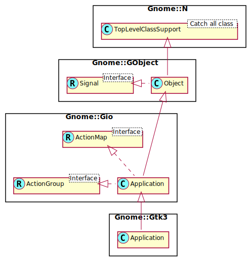

Gnome::Gtk3::Application
========================

Application class

Description
===========

**Gnome::Gtk3::Application** is a class that handles many important aspects of a GTK+ application in a convenient fashion, without enforcing a one-size-fits-all application model.

Currently, **Gnome::Gtk3::Application** handles GTK+ initialization, application uniqueness, session management, provides some basic scriptability and desktop shell integration by exporting actions and menus and manages a list of toplevel windows whose life-cycle is automatically tied to the life-cycle of your application.

While **Gnome::Gtk3::Application** works fine with plain **Gnome::Gtk3::Windows**, it is recommended to use it together with **Gnome::Gtk3::ApplicationWindow**.

When GDK threads are enabled, **Gnome::Gtk3::Application** will acquire the GDK lock when invoking actions that arrive from other processes. The GDK lock is not touched for local action invocations. In order to have actions invoked in a predictable context it is therefore recommended that the GDK lock be held while invoking actions locally with `g_action_group_activate_action()`. The same applies to actions associated with **Gnome::Gtk3::ApplicationWindow** and to the “activate” and “open” **GApplication** methods.

Automatic resources
-------------------

**Gnome::Gtk3::Application** will automatically load menus from the **Gnome::Gtk3::Builder** resource located at "gtk/menus.ui", relative to the application's resource base path (see `g_application_set_resource_base_path()`). The menu with the ID "app-menu" is taken as the application's app menu and the menu with the ID "menubar" is taken as the application's menubar. Additional menus (most interesting submenus) can be named and accessed via `get_menu_by_id()` which allows for dynamic population of a part of the menu structure.

If the resources "gtk/menus-appmenu.ui" or "gtk/menus-traditional.ui" are present then these files will be used in preference, depending on the value of `prefers_app_menu()`. If the resource "gtk/menus-common.ui" is present it will be loaded as well. This is useful for storing items that are referenced from both "gtk/menus-appmenu.ui" and "gtk/menus-traditional.ui".

It is also possible to provide the menus manually using `set_app_menu()` and `set_menubar()`.

If there is a resource located at "gtk/help-overlay.ui" which defines a **Gnome::Gtk3::ShortcutsWindow** with ID "help_overlay" then **Gnome::Gtk3::Application** associates an instance of this shortcuts window with each **Gnome::Gtk3::ApplicationWindow** and sets up keyboard accelerators (Control-F1 and Control-?) to open it. To create a menu item that displays the shortcuts window, associate the item with the action `win.show-help-overlay`.

See Also
--------

  * [HowDoI: Using **Gnome::Gtk3::Application**](https://wiki.gnome.org/HowDoI/GtkApplication)

  * [Getting Started with GTK+: Basics](https://developer.gnome.org/gtk3/stable/gtk-getting-started.html#id-1.2.3.3)

Synopsis
========

Declaration
-----------

    unit class Gnome::Gtk3::Application;
    also is Gnome::Gio::Application;

Uml Diagram 
-----------------------------------------

Inheriting this class
---------------------

Inheriting is done in a special way in that it needs a call from new() to get the native object created by the class you are inheriting from.

    use Gnome::Gtk3::Application;

    unit class MyGuiClass;
    also is Gnome::Gtk3::Application;

    submethod new ( |c ) {
      # let the Gnome::Gtk3::Application class process the options
      self.bless( :GtkApplication, |c);
    }

    submethod BUILD ( ... ) {
      ...
    }

Types
=====

GtkApplicationInhibitFlags
--------------------------

  * GTK_APPLICATION_INHIBIT_LOGOUT; Inhibit ending the user session by logging out or by shutting down the computer

  * GTK_APPLICATION_INHIBIT_SWITCH; Inhibit user switching

  * GTK_APPLICATION_INHIBIT_SUSPEND; Inhibit suspending the session or computer

  * GTK_APPLICATION_INHIBIT_IDLE; Inhibit the session being marked as idle (and possibly locked)

Methods
=======

new
---

### :app-id, :flags

Create a new Application object.

If the application ID is defined, it must be valid. See also `id-is-valid()` in **Gnome::Gio::Application**.

If no application ID is given then some features (most notably application uniqueness) will be disabled.

    multi method new (
      Str :$app-id!,
      GApplicationFlags :$flags = G_APPLICATION_FLAGS_NONE
    )

### :native-object

Create an object using a native object from elsewhere. See also **Gnome::N::TopLevelSupportClass**.

    multi method new ( N-GObject :$native-object! )

### :build-id

Create an object using a native object from a builder. See also **Gnome::GObject::Object**.

    multi method new ( Str :$build-id! )

add-window
----------

Adds a window to *application*.

This call can only happen after the *application* has started; typically, you should add new application windows in response to the emission of the *activate* signal.

This call is equivalent to setting the *application* property of *window* to *application*.

Normally, the connection between the application and the window will remain until the window is destroyed, but you can explicitly remove it with `remove-window()`.

GTK+ will keep the *application* running as long as it has any windows.

    method add-window ( N-GObject $window )

  * N-GObject $window; a **Gnome::Gtk3::Window**

get-accels-for-action
---------------------

Gets the accelerators that are currently associated with the given action.

Returns: accelerators for *detailed-action-name*, as a `undefined`-terminated array. Free with `g-strfreev()` when no longer needed

    method get-accels-for-action ( Str $detailed_action_name --> CArray[Str] )

  * Str $detailed_action_name; a detailed action name, specifying an action and target to obtain accelerators for

get-actions-for-accel
---------------------

Returns the list of actions (possibly empty) that *accel* maps to. Each item in the list is a detailed action name in the usual form.

This might be useful to discover if an accel already exists in order to prevent installation of a conflicting accelerator (from an accelerator editor or a plugin system, for example). Note that having more than one action per accelerator may not be a bad thing and might make sense in cases where the actions never appear in the same context.

In case there are no actions for a given accelerator, an empty array is returned. `undefined` is never returned.

It is a programmer error to pass an invalid accelerator string. If you are unsure, check it with `gtk-accelerator-parse()` first.

Returns: a `undefined`-terminated array of actions for *accel*

    method get-actions-for-accel ( Str $accel --> CArray[Str] )

  * Str $accel; an accelerator that can be parsed by `gtk-accelerator-parse()`

get-active-window, get-active-window-rk
---------------------------------------

Gets the “active” window for the application.

The active window is the one that was most recently focused (within the application). This window may not have the focus at the moment if another application has it — this is just the most recently-focused window within this application.

Returns: the active window, or `undefined` if there isn't one.

    method get-active-window ( --> N-GObject )
    method get-active-window-rk ( :$child-type? --> Gnome::GObject::Object )

  * $child-type: This is an optional argument. You can specify a real type or a type as a string. In the latter case the type must be defined in a module which can be found by the Raku require call.

get-app-menu, get-app-menu-rk
-----------------------------

Returns the menu model that has been set with `set-app-menu()`.

Returns: the application menu of *application* or `undefined` if no application menu has been set.

    method get-app-menu ( --> N-GObject )
    method get-app-menu-rk ( :$child-type? --> Gnome::GObject::Object )

  * $child-type: This is an optional argument. You can specify a real type or a type as a string. In the latter case the type must be defined in a module which can be found by the Raku require call.

get-menu-by-id, get-menu-by-id-rk
---------------------------------

Gets a menu from automatically loaded resources. See [automatic-resources](ttps://developer-old.gnome.org/gtk3/stable/GtkApplication.html#automatic-resources) for more information.

    method get-menu-by-id ( Str $id --> N-GObject )
    method get-menu-by-id-rk ( Str $id, :$child-type? --> Gnome::GObject::Object )

  * Str $id; the id of the menu to look up

  * $child-type: This is an optional argument. You can specify a real type or a type as a string. In the latter case the type must be defined in a module which can be found by the Raku require call.

get-menubar, get-menubar-rk
---------------------------

Returns the menu model that has been set with `set-menubar()`.

Returns: the menubar for windows of *application*

    method get-menubar ( --> N-GObject )
    method get-menubar-rk ( :$child-type? --> Gnome::GObject::Object )

  * $child-type: This is an optional argument. You can specify a real type or a type as a string. In the latter case the type must be defined in a module which can be found by the Raku require call.

get-window-by-id, get-window-by-id-rk
-------------------------------------

Returns the **Gnome::Gtk3::ApplicationWindow** with the given ID.

The ID of a **Gnome::Gtk3::ApplicationWindow** can be retrieved with `window-get-id()`.

Returns: the window with ID *id*, or `undefined` if there is no window with this ID

    method get-window-by-id ( UInt $id --> N-GObject )
    method get-window-by-id-rk (
      UInt $id, :$child-type? --> Gnome::GObject::Object
    )

  * UInt $id; an identifier number

  * $child-type: This is an optional argument. You can specify a real type or a type as a string. In the latter case the type must be defined in a module which can be found by the Raku require call.

get-windows
-----------

Gets a list of the **Gnome::Gtk3::Windows** associated with *application*.

The list is sorted by most recently focused window, such that the first element is the currently focused window. (Useful for choosing a parent for a transient window.)

The list that is returned should not be modified in any way. It will only remain valid until the next focus change or window creation or deletion.

Returns: (element-type GtkWindow) : a **Gnome::Gtk3::List** of **Gnome::Gtk3::Window**

    method get-windows ( --> N-GList )

inhibit
-------

Inform the session manager that certain types of actions should be inhibited. This is not guaranteed to work on all platforms and for all types of actions.

Applications should invoke this method when they begin an operation that should not be interrupted, such as creating a CD or DVD. The types of actions that may be blocked are specified by the *flags* parameter. When the application completes the operation it should call `uninhibit()` to remove the inhibitor. Note that an application can have multiple inhibitors, and all of them must be individually removed. Inhibitors are also cleared when the application exits.

Applications should not expect that they will always be able to block the action. In most cases, users will be given the option to force the action to take place.

Reasons should be short and to the point.

If *window* is given, the session manager may point the user to this window to find out more about why the action is inhibited.

Returns: A non-zero cookie that is used to uniquely identify this request. It should be used as an argument to `gtk-application-uninhibit()` in order to remove the request. If the platform does not support inhibiting or the request failed for some reason, 0 is returned.

    method inhibit ( N-GObject $window, Int $flags, Str $reason --> UInt )

  * N-GObject $window; a **Gnome::Gtk3::Window**, or `undefined`

  * Int $flags; GtkApplicationInhibitFlags mask of what types of actions should be inhibited

  * Str $reason; a short, human-readable string that explains why these operations are inhibited

is-inhibited
------------

Determines if any of the actions specified in *flags* are currently inhibited (possibly by another application).

Note that this information may not be available (for example when the application is running in a sandbox).

Returns: `True` if any of the actions specified in *flags* are inhibited

    method is-inhibited ( Int $flags --> Bool )

  * Int $flags; GtkApplicationInhibitFlags mask of what types of actions should be queried

list-action-descriptions
------------------------

Lists the detailed action names which have associated accelerators. See `set-accels-for-action()`.

Returns: a `undefined`-terminated array of strings, free with `g-strfreev()` when done

    method list-action-descriptions ( --> CArray[Str] )

prefers-app-menu
----------------

Determines if the desktop environment in which the application is running would prefer an application menu be shown.

If this function returns `True` then the application should call `set-app-menu()` with the contents of an application menu, which will be shown by the desktop environment. If it returns `False` then you should consider using an alternate approach, such as a menubar.

The value returned by this function is purely advisory and you are free to ignore it. If you call `gtk-application-set-app-menu()` even if the desktop environment doesn't support app menus, then a fallback will be provided.

Applications are similarly free not to set an app menu even if the desktop environment wants to show one. In that case, a fallback will also be created by the desktop environment (GNOME, for example, uses a menu with only a "Quit" item in it).

The value returned by this function never changes. Once it returns a particular value, it is guaranteed to always return the same value.

You may only call this function after the application has been registered and after the base startup handler has run. You're most likely to want to use this from your own startup handler. It may also make sense to consult this function while constructing UI (in activate, open or an action activation handler) in order to determine if you should show a gear menu or not.

This function will return `False` on Mac OS and a default app menu will be created automatically with the "usual" contents of that menu typical to most Mac OS applications. If you call `gtk-application-set-app-menu()` anyway, then this menu will be replaced with your own.

Returns: `True` if you should set an app menu

    method prefers-app-menu ( --> Bool )

remove-window
-------------

Remove a window from *application*.

If *window* belongs to *application* then this call is equivalent to setting the *application* property of *window* to `undefined`.

The application may stop running as a result of a call to this function.

    method remove-window ( N-GObject $window )

  * N-GObject $window; a **Gnome::Gtk3::Window**

set-accels-for-action
---------------------

Sets zero or more keyboard accelerators that will trigger the given action. The first item in *accels* will be the primary accelerator, which may be displayed in the UI.

To remove all accelerators for an action, use an empty, zero-terminated array for *accels*.

For the *detailed-action-name*, see `g-action-parse-detailed-name()` and `g-action-print-detailed-name()`.

    method set-accels-for-action ( Str $detailed_action_name, CArray[Str] $accels )

  * Str $detailed_action_name; a detailed action name, specifying an action and target to associate accelerators with

  * CArray[Str] $accels; a list of accelerators in the format understood by `gtk-accelerator-parse()`

set-app-menu
------------

Sets or unsets the application menu for *application*.

This can only be done in the primary instance of the application, after it has been registered. *startup* is a good place to call this.

The application menu is a single menu containing items that typically impact the application as a whole, rather than acting on a specific window or document. For example, you would expect to see “Preferences” or “Quit” in an application menu, but not “Save” or “Print”.

If supported, the application menu will be rendered by the desktop environment.

Use the base **Gnome::Gtk3::ActionMap** interface to add actions, to respond to the user selecting these menu items.

    method set-app-menu ( N-GObject $app_menu )

  * N-GObject $app_menu; a **Gnome::Gtk3::MenuModel**, or `undefined`

set-menubar
-----------

Sets or unsets the menubar for windows of *application*.

This is a menubar in the traditional sense.

This can only be done in the primary instance of the application, after it has been registered. *startup* is a good place to call this.

Depending on the desktop environment, this may appear at the top of each window, or at the top of the screen. In some environments, if both the application menu and the menubar are set, the application menu will be presented as if it were the first item of the menubar. Other environments treat the two as completely separate — for example, the application menu may be rendered by the desktop shell while the menubar (if set) remains in each individual window.

Use the base **Gnome::Gtk3::ActionMap** interface to add actions, to respond to the user selecting these menu items.

    method set-menubar ( N-GObject $menubar )

  * N-GObject $menubar; a **Gnome::Gtk3::MenuModel**, or `undefined`

uninhibit
---------

Removes an inhibitor that has been established with `inhibit()`. Inhibitors are also cleared when the application exits.

    method uninhibit ( UInt $cookie )

  * UInt $cookie; a cookie that was returned by `inhibit()`

Signals
=======

There are two ways to connect to a signal. The first option you have is to use `register-signal()` from **Gnome::GObject::Object**. The second option is to use `connect-object()` directly from **Gnome::GObject::Signal**.

First method
------------

The positional arguments of the signal handler are all obligatory as well as their types. The named attributes `:$widget` and user data are optional.

    # handler method
    method mouse-event ( GdkEvent $event, :$widget ) { ... }

    # connect a signal on window object
    my Gnome::Gtk3::Window $w .= new( ... );
    $w.register-signal( self, 'mouse-event', 'button-press-event');

Second method
-------------

    my Gnome::Gtk3::Window $w .= new( ... );
    my Callable $handler = sub (
      N-GObject $native, GdkEvent $event, OpaquePointer $data
    ) {
      ...
    }

    $w.connect-object( 'button-press-event', $handler);

Also here, the types of positional arguments in the signal handler are important. This is because both methods `register-signal()` and `connect-object()` are using the signatures of the handler routines to setup the native call interface.

Supported signals
-----------------

### query-end

Emitted when the session manager is about to end the session, only if *register-session* is `True`. Applications can connect to this signal and call `inhibit()` with `GTK-APPLICATION-INHIBIT-LOGOUT` to delay the end of the session until state has been saved.

    method handler (
      Int :$_handle_id,
      Gnome::GObject::Object :_widget($application),
      *%user-options
    );

  * $application; the **Gnome::Gtk3::Application** which emitted the signal

  * $_handle_id; the registered event handler id

### window-added

Emitted when a **Gnome::Gtk3::Window** is added to *application* through `add-window()`.

    method handler (
      Unknown type GTK_TYPE_WINDOW $window,
      Int :$_handle_id,
      Gnome::GObject::Object :_widget($application),
      *%user-options
    );

  * $application; the **Gnome::Gtk3::Application** which emitted the signal

  * $window; the newly-added **Gnome::Gtk3::Window**

  * $_handle_id; the registered event handler id

### window-removed

Emitted when a **Gnome::Gtk3::Window** is removed from *application*, either as a side-effect of being destroyed or explicitly through `remove-window()`.

    method handler (
      Unknown type GTK_TYPE_WINDOW $window,
      Int :$_handle_id,
      Gnome::GObject::Object :_widget($application),
      *%user-options
    );

  * $application; the **Gnome::Gtk3::Application** which emitted the signal

  * $window; the **Gnome::Gtk3::Window** that is being removed

  * $_handle_id; the registered event handler id

Properties
==========

An example of using a string type property of a **Gnome::Gtk3::Label** object. This is just showing how to set/read a property, not that it is the best way to do it. This is because a) The class initialization often provides some options to set some of the properties and b) the classes provide many methods to modify just those properties. In the case below one can use **new(:label('my text label'))** or **.set-text('my text label')**.

    my Gnome::Gtk3::Label $label .= new;
    my Gnome::GObject::Value $gv .= new(:init(G_TYPE_STRING));
    $label.get-property( 'label', $gv);
    $gv.set-string('my text label');

Supported properties
--------------------

### Active window: active-window

The window which most recently had focus Widget type: GTK-TYPE-WINDOW

The **Gnome::GObject::Value** type of property *active-window* is `G_TYPE_OBJECT`.

### Application menu: app-menu

The N-GObject for the application menu Widget type: G-TYPE-MENU-MODEL

The **Gnome::GObject::Value** type of property *app-menu* is `G_TYPE_OBJECT`.

### Menubar: menubar

The N-GObject for the menubar Widget type: G-TYPE-MENU-MODEL

The **Gnome::GObject::Value** type of property *menubar* is `G_TYPE_OBJECT`.

### Register session: register-session

Set this property to `True` to register with the session manager.

The **Gnome::GObject::Value** type of property *register-session* is `G_TYPE_BOOLEAN`.

### Screensaver Active: screensaver-active

This property is `True` if GTK+ believes that the screensaver is currently active. GTK+ only tracks session state (including this) when *register-session* is set to `True`.

Tracking the screensaver state is supported on Linux.

The **Gnome::GObject::Value** type of property *screensaver-active* is `G_TYPE_BOOLEAN`.

