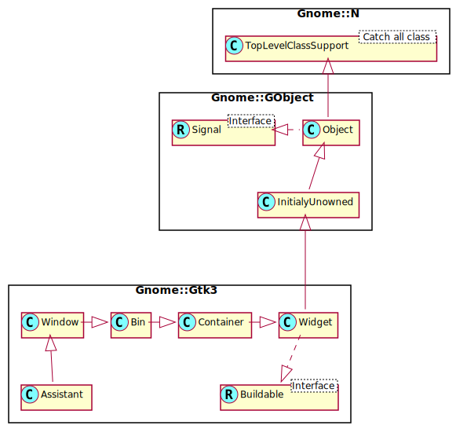

Gnome::Gtk3::Assistant
======================

A widget used to guide users through multi-step operations

Description
===========

A **Gnome::Gtk3::Assistant** is a widget used to represent a generally complex operation splitted in several steps, guiding the user through its pages and controlling the page flow to collect the necessary data.

The design of **Gnome::Gtk3::Assistant** is that it controls what buttons to show and to make sensitive, based on what it knows about the page sequence and the `AssistantPageType` of each page, in addition to state information like the page completion and committed status.

If you have a case that doesn’t quite fit in **Gnome::Gtk3::Assistants** way of handling buttons, you can use the **GTK_ASSISTANT_PAGE_CUSTOM** page type and handle buttons yourself.

**Gnome::Gtk3::Assistant** as **Gnome::Gtk3::Buildable**
--------------------------------------------------------

The **Gnome::Gtk3::Assistant** implementation of the **Gnome::Gtk3::Buildable** interface exposes the *action_area* as internal children with the name “action_area”.

To add pages to an assistant in **Gnome::Gtk3::Builder**, simply add it as a child to the **Gnome::Gtk3::Assistant** object, and set its child properties as necessary.

Css Nodes
---------

**Gnome::Gtk3::Assistant** has a single CSS node with the name assistant.

Synopsis
========

Declaration
-----------

    unit class Gnome::Gtk3::Assistant;
    also is Gnome::Gtk3::Window;

Uml Diagram
-----------

Inheriting this class
---------------------

Inheriting is done in a special way in that it needs a call from new() to get the native object created by the class you are inheriting from.

    use Gnome::Gtk3::Assistant;

    unit class MyGuiClass;
    also is Gnome::Gtk3::Assistant;

    submethod new ( |c ) {
      # let the Gnome::Gtk3::Assistant class process the options
      self.bless( :GtkAssistant, |c);
    }

    submethod BUILD ( ... ) {
      ...
    }

Example
-------

    unit class MyGuiClass;
    also is Gnome::Gtk3::Assistant;

    submethod new ( |c ) {
      self.bless( :GtkAssistant, |c);
    }

    submethod BUILD ( ) {
      my Gnome::Gtk3::Frame $intro-page .= new(...);
      ...
      self.add-page(
        $intro-page, GTK_ASSISTANT_PAGE_INTRO, 'Introduction'
      );

      my Gnome::Gtk3::Frame $install-page .= new(...);
      ...
      self.add-page(
        $install-page, GTK_ASSISTANT_PAGE_CONTENT, 'Installing'
      );
      ...
    }

    method add-page ( $page, GtkAssistantPageType $type, Str $title ) {
      self.append-page($page);
      self.set-page-type(
        $install-page, $type // GTK_ASSISTANT_PAGE_CONTENT
      );
      self.set-page-title($title);
    }

Types
=====

enum GtkAssistantPageType
-------------------------

An enum for determining the page role inside the **Gnome::Gtk3::Assistant**. It's used to handle buttons sensitivity and visibility.

Note that an assistant needs to end its page flow with a page of type `GTK_ASSISTANT_PAGE_CONFIRM`, `GTK_ASSISTANT_PAGE_SUMMARY` or `GTK_ASSISTANT_PAGE_PROGRESS` to be correct.

The Cancel button will only be shown if the page isn’t “committed”. See `gtk_assistant_commit()` for details.

  * GTK_ASSISTANT_PAGE_CONTENT: The page has regular contents. Both the Back and forward buttons will be shown.

  * GTK_ASSISTANT_PAGE_INTRO: The page contains an introduction to the assistant task. Only the Forward button will be shown if there is a next page.

  * GTK_ASSISTANT_PAGE_CONFIRM: The page lets the user confirm or deny the changes. The Back and Apply buttons will be shown.

  * GTK_ASSISTANT_PAGE_SUMMARY: The page informs the user of the changes done. Only the Close button will be shown.

  * GTK_ASSISTANT_PAGE_PROGRESS: Used for tasks that take a long time to complete, blocks the assistant until the page is marked as complete. Only the back button will be shown.

  * GTK_ASSISTANT_PAGE_CUSTOM: Used for when other page types are not appropriate. No buttons will be shown, and the application must add its own buttons through `gtk_assistant_add_action_widget()`.

Methods
=======

new
---

### default, no options

Create a new Assistant object.

    multi method new ( )

### :native-object

Create an object using a native object from elsewhere. See also **Gnome::N::TopLevelSupportClass**.

    multi method new ( N-GObject :$native-object! )

### :build-id

Create an object using a native object from a builder. See also **Gnome::GObject::Object**.

    multi method new ( Str :$build-id! )

add-action-widget
-----------------

Adds a widget to the action area of a **Gnome::Gtk3::Assistant**.

    method add-action-widget ( N-GObject $child )

  * $child; an action widget.

append-page
-----------

Appends a *$page* to the assistant. Returns the index (starting at 0) of the inserted page. `$page` can be any widget making up the content of a page in this assistant.

    method append-page ( N-GObject $page --> Int )

  * $page; a **Gnome::Gtk3::Widget**

commit
------

Erases the visited page history so the back button is not shown on the current page, and removes the cancel button from subsequent pages.

Use this when the information provided up to the current page is hereafter deemed permanent and cannot be modified or undone. For example, showing a progress page to track a long-running, unreversible operation after the user has clicked apply on a confirmation page.

    method commit ( )

get-current-page
----------------

Returns the page number of the current page. This is the index (starting from 0) of the current page in the assistant, or -1 if the assistant has no pages, or no current page.

    method get-current-page ( --> Int )

get-n-pages
-----------

Returns the number of pages in the assistant.

    method get-n-pages ( --> Int )

get-nth-page
------------

Returns the child widget contained in page number *$page_num*, or `Any` if *$page_num* is out of bounds

    method get-nth-page ( Int $page_num --> N-GObject )

  * $page_num; the index of a page in the assistant, or -1 to get the last page

get-page-complete
-----------------

Gets whether *$page* is complete. `True` if *$page* is complete.

    method get-page-complete ( N-GObject() $page --> Bool )

  * $page; a page of assistant

get-page-has-padding
--------------------

Gets whether page has padding.

Returns: `True` if *$page* has padding

    method gtk_assistant_get_page_has_padding ( N-GObject() $page --> Bool )

  * $page; a page of *assistant*

get-page-title
--------------

Gets the title for *$page*. `$page` is a previously added widget.

    method get-page-title ( N-GObject() $page --> Str )

  * $page; a page of assistant

get-page-type
-------------

Gets the page type of *$page*. `$page` is a previously added widget.

    method get-page-type (
      N-GObject() $page --> GtkAssistantPageType
    )

  * $page; a page of Iassistant

insert-page
-----------

Inserts a *$page* in the assistant at a given position. `$page` can be any widget making up the content of a page in this assistant.

Returns: the index (starting from 0) of the inserted page

    method insert-page (
      N-GObject() $page, Int $position --> Int
    )

  * $page; a **Gnome::Gtk3::Widget**

  * $position; the index (starting at 0) at which to insert the page, or -1 to append the page to the assistant

next-page
---------

Navigate to the next page. It is a programming error to call this function when there is no next page. This function is for use when creating pages of the **GTK_ASSISTANT_PAGE_CUSTOM** type.

    method next-page ( )

prepend-page
------------

Prepends a *$page* to the assistant. Returns the index (starting at 0) of the inserted page. `$page` can be any widget making up the content of a page in this assistant.

    method prepend-page ( N-GObject() $page --> Int )

  * $page; a **Gnome::Gtk3::Widget**

previous-page
-------------

Navigate to the previous visited page. It is a programming error to call this function when no previous page is available. This function is for use when creating pages of the **GTK_ASSISTANT_PAGE_CUSTOM** type.

    method previous-page ( )

remove-action-widget
--------------------

Removes a widget from the action area of a **Gnome::Gtk3::Assistant**.

    method remove-action-widget ( N-GObject() $child )

  * $child; a previously added action widget

remove-page
-----------

Removes the *$page-num*’s page from assistant. `$page` is a previously inserted widget.

    method remove-page ( Int $page-num )

  * $page-num; the index of a page in the assistant, or -1 to remove the last page

set-current-page
----------------

Switches the page to *$page_num*. Note that this will only be necessary in custom buttons, as the assistant flow can be set with `gtk_assistant_set_forward_page_func()`.

    method set-current-page ( Int $page_num )

  * $page_num; index of the page to switch to, starting from 0. If negative, the last page will be used. If greater than the number of pages in the assistant, nothing will be done.

set-page-complete
-----------------

Sets whether *$page* contents are complete. This will make assistant update the buttons state to be able to continue the task. `$page` is a previously added widget.

    method set-page-complete ( N-GObject() $page, Bool $complete )

  * $page; a page of assistant

  * $complete; the completeness status of the page. `True` to set page complete.

set-page-has-padding
--------------------

Sets whether the assistant is adding padding around the page.

    method set-page-has-padding ( N-GObject() $page, Bool $has_padding )

  * $page; a page of *assistant*

  * $has_padding; whether this page has padding

set-page-type
-------------

Sets the page type for *$page*. The page type determines the page behavior in the assistant. `$page` is a previously added page.

    method set-page-type (
      N-GObject() $page, GtkAssistantPageType $type
    )

  * $page; a page of assistant

  * $type; the new type for *$page*

set-page-title
--------------

Sets a title for *$page*. The title is displayed in the header area of the assistant when *$page* is the current page. `$page` is a previously added widget.

    method set-page-title ( N-GObject() $page, Str $title )

  * $page; a page of assistant

  * $title; the new title for *$page*

update-buttons-state
--------------------

Forces the *assistant* to recompute the buttons state.

GTK+ automatically takes care of this in most situations, e.g. when the user goes to a different page, or when the visibility or completeness of a page changes.

One situation where it can be necessary to call this function is when changing a value on the current page affects the future page flow of the assistant.

    method update-buttons-state ( )

Signals
=======

apply
-----

The *apply* signal is emitted when the apply button is clicked.

The default behavior of the **Gnome::Gtk3::Assistant** is to switch to the page after the current page, unless the current page is the last one.

A handler for the *apply* signal should carry out the actions for which the wizard has collected data. If the action takes a long time to complete, you might consider putting a page of type `GTK_ASSISTANT_PAGE_PROGRESS` after the confirmation page and handle this operation within the *prepare* signal of the progress page.

    method handler (
      Gnome::Gtk3::Assistant :_widget($assistant),
      Int :$_handler-id,
      N-GObject :$_native-object,
      *%user-options
    )

  * $assistant; The instance which registered the signal

  * $_handler-id; The handler id which is returned from the registration

  * $_native-object; The native object provided by the caller wrapped in the Raku object.

  * %user-options; A list of named arguments provided at the `register-signal()` method

cancel
------

The *cancel* signal is emitted when then the cancel button is clicked.

    method handler (
      Gnome::Gtk3::Assistant :_widget($assistant),
      Int :$_handler-id,
      N-GObject :$_native-object,
      *%user-options
    )

  * $assistant; The instance which registered the signal

  * $_handler-id; The handler id which is returned from the registration

  * $_native-object; The native object provided by the caller wrapped in the Raku object.

  * %user-options; A list of named arguments provided at the `register-signal()` method

close
-----

The *close* signal is emitted either when the close button of a summary page is clicked, or when the apply button in the last page in the flow (of type `GTK_ASSISTANT_PAGE_CONFIRM`) is clicked.

    method handler (
      Gnome::Gtk3::Assistant :_widget($assistant),
      Int :$_handler-id,
      N-GObject :$_native-object,
      *%user-options
    )

  * $assistant; The instance which registered the signal

  * $_handler-id; The handler id which is returned from the registration

  * $_native-object; The native object provided by the caller wrapped in the Raku object.

  * %user-options; A list of named arguments provided at the `register-signal()` method

prepare
-------

The *prepare* signal is emitted when a new page is set as the assistant's current page, before making the new page visible.

A handler for this signal can do any preparations which are necessary before showing *page*.

    method handler (
      N-GObject #`{ native widget } $page,
      Gnome::Gtk3::Assistant :_widget($assistant),
      Int :$_handler-id,
      N-GObject :$_native-object,
      *%user-options
    )

  * $page; the current page

  * $assistant; The instance which registered the signal

  * $_handler-id; The handler id which is returned from the registration

  * $_native-object; The native object provided by the caller wrapped in the Raku object.

  * %user-options; A list of named arguments provided at the `register-signal()` method

Properties
==========

complete
--------

Whether all required fields on the page have been filled out

The **Gnome::GObject::Value** type of property *complete* is `G_TYPE_BOOLEAN`.

  * Parameter is readable and writable.

  * Default value is FALSE.

has-padding
-----------

Whether the assistant adds padding around the page

The **Gnome::GObject::Value** type of property *has-padding* is `G_TYPE_BOOLEAN`.

  * Parameter is readable and writable.

  * Default value is TRUE.

header-image
------------

Header image for the assistant page

The **Gnome::GObject::Value** type of property *header-image* is `G_TYPE_OBJECT`.

  * Parameter is readable and writable.

page-type
---------

The type of the assistant page

The **Gnome::GObject::Value** type of property *page-type* is `G_TYPE_ENUM`.

  * Parameter is readable and writable.

  * Default value is GTK_ASSISTANT_PAGE_CONTENT.

sidebar-image
-------------

Sidebar image for the assistant page

The **Gnome::GObject::Value** type of property *sidebar-image* is `G_TYPE_OBJECT`.

  * Parameter is readable and writable.

title
-----

The title of the assistant page

The **Gnome::GObject::Value** type of property *title* is `G_TYPE_STRING`.

  * Parameter is readable and writable.

  * Default value is undefined.

use-header-bar
--------------

Use Header Bar for actions.

The **Gnome::GObject::Value** type of property *use-header-bar* is `G_TYPE_INT`.

  * Parameter is readable and writable.

  * Parameter is set on construction of object.

  * Minimum value is -1.

  * Maximum value is 1.

  * Default value is -1.

