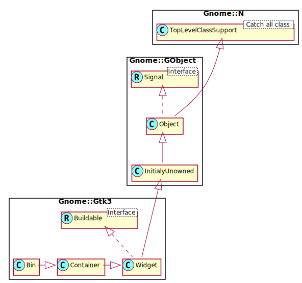

Gnome::Gtk3::Bin
================

A container with just one child

Description
===========

The **Gnome::Gtk3::Bin** widget is a container with just one child. It is not very useful itself, but it is useful for deriving subclasses, since it provides common code needed for handling a single child widget.

Synopsis
========

Declaration
-----------

    unit class Gnome::Gtk3::Bin;
    also is Gnome::Gtk3::Container;

Uml Diagram
-----------

Example
-------

An example using a **Gnome::Gtk3::Button** which is a direct descendant of **Gnome::Gtk3::Bin**. Here it is shown that a button is also a kind of a container which in principle can hold anything but by default it holds a label. The widget's name is by default set to its class name. So, a Button has 'GtkButton' and a Label has 'GtkLabel'.

    my Gnome::Gtk3::Button $button .= new(:label('xyz'));
    my Gnome::Gtk3::Widget $w .= new(:widget($button.get-child));
    say $w.get-name; # 'GtkLabel'

Methods
=======

new
---

### :native-object

Create a Grid object using a native object from elsewhere. See also **Gnome::N::TopLevelClassSupport**.

    multi method new ( N-GObject :$native-object! )

### :build-id

Create a Grid object using a native object returned from a builder. See also **Gnome::GObject::Object**.

    multi method new ( Str :$build-id! )

get_child
---------

Gets the child of the **Gnome::Gtk3::Bin**, or `Any` if the bin contains no child widget. The returned widget does not have a reference added, so you do not need to unref it.

Returns: The child of the **Gnome::Gtk3::Bin**;

    method get-child ( --> N-GObject )

