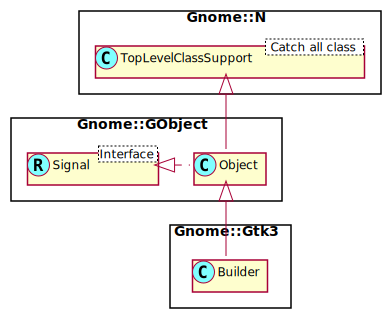

Gnome::Gtk3::Builder
====================

Build an interface from an XML UI definition

Description
===========

A **Gnome::Gtk3::Builder** is an auxiliary object that reads textual descriptions of a user interface and instantiates the described objects. To create a **Gnome::Gtk3::Builder** from a user interface description, call `.new(:file)`, `.new(:resource)` or `.new(:string)`.

In the (unusual) case that you want to add user interface descriptions from multiple sources to the same **Gnome::Gtk3::Builder** you can call `.new()` to get an empty builder and populate it by (multiple) calls to `gtk_builder_add_from_file()`, `gtk_builder_add_from_resource()` or `gtk_builder_add_from_string()`.

A **Gnome::Gtk3::Builder** holds a reference to all objects that it has constructed and drops these references when it is finalized. This finalization can cause the destruction of non-widget objects or widgets which are not contained in a toplevel window. For toplevel windows constructed by a builder, it is the responsibility of the user to call `gtk_widget_destroy()` to get rid of them and all the widgets they contain.

The function `gtk_builder_get_object()` can be used to access the widgets in the interface by the names assigned to them (id's) inside the UI description. Toplevel windows returned by these functions will stay around until the user explicitly destroys them with `gtk_widget_destroy()`. Other widgets will either be part of a larger hierarchy constructed by the builder (in which case you should not have to worry about their lifecycle), or without a parent, in which case they have to be added to some container to make use of them. All widget classes have the ability to be initialized using the named argument `.new(:build-id)`. This will end up using `gtk_builder_get_object()`. A builder must be created first and data fed to the builder before you are able to use it.

The function `gtk_builder_connect_signals_full()` and variants thereof can be used to connect handlers to the named signals defined in a handler table. The signals can also be handled individualy using `.register-signal()`.

Gnome::Gtk3::Builder UI Definitions
-----------------------------------

**Gnome::Gtk3::Builder** parses textual descriptions of user interfaces which are specified in an XML format which can be roughly described by the RELAX NG schema below. We refer to these descriptions as “**GtkBuilder** UI definitions” or just “UI definitions” if the context is clear.

It is common to use `.ui` as the filename extension for files containing **Gnome::Gtk3::Builder** UI definitions.

<!--[RELAX NG Compact Syntax](https://git.gnome.org/browse/gtk+/tree/gtk/gtkbuilder.rnc)-->

The toplevel element is <interface>. It optionally takes a “domain” attribute, which will make the builder look for translated strings using `dgettext()` in the domain specified. This can also be done by calling `gtk_builder_set_translation_domain()` on the builder. Objects are described by <object> elements, which can contain <property> elements to set properties, <signal> elements which connect signals to handlers, and <child> elements, which describe child objects (most often widgets inside a container, but also e.g. actions in an action group, or columns in a tree model). A <child> element contains an <object> element which describes the child object. The target toolkit version(s) are described by <requires> elements, the “lib” attribute specifies the widget library in question (currently the only supported value is “gtk+”) and the “version” attribute specifies the target version in the form “<major>.<minor>”. The builder will error out if the version requirements are not met.

Typically, the specific kind of object represented by an <object> element is specified by the “class” attribute. If the type has not been loaded yet, GTK+ tries to find the `get_type()` function from the class name by applying heuristics. This works in most cases, but if necessary, it is possible to specify the name of the `get_type()` function explictly with the "type-func" attribute. As a special case, **Gnome::Gtk3::Builder** allows to use an object that has been constructed by a **GtkUIManager** in another part of the UI definition by specifying the id of the **GtkUIManager** in the “constructor” attribute and the name of the object in the “id” attribute.

Objects may be given a name with the “id” attribute, which allows the application to retrieve them from the builder with `gtk_builder_get_object()` which is also used indirectly when a widget is created using `.new(:$build-id)`. An id is also necessary to use the object as property value in other parts of the UI definition. GTK+ reserves ids starting and ending with ___ (3 underscores) for its own purposes.

Setting properties of objects is pretty straightforward with the <property> element: the “name” attribute specifies the name of the property, and the content of the element specifies the value. If the “translatable” attribute is set to a true value, GTK+ uses `gettext()` (or `dgettext()` if the builder has a translation domain set) to find a translation for the value. This happens before the value is parsed, so it can be used for properties of any type, but it is probably most useful for string properties. It is also possible to specify a context to disambiguate short strings, and comments which may help the translators.

**Gnome::Gtk3::Builder** can parse textual representations for the most common property types: characters, strings, integers, floating-point numbers, booleans (strings like “TRUE”, “t”, “yes”, “y”, “1” are interpreted as `1`, strings like “FALSE”, “f”, “no”, “n”, “0” are interpreted as `0`), enumerations (can be specified by their name, nick or integer value), flags (can be specified by their name, nick, integer value, optionally combined with “|”, e.g. “GTK_VISIBLE|GTK_REALIZED”) and colors (in a format understood by `gdk_rgba_parse()`).

Objects can be referred to by their name and by default refer to objects declared in the local xml fragment and objects exposed via `gtk_builder_expose_object()`. In general, **Gnome::Gtk3::Builder** allows forward references to objects — declared in the local xml; an object doesn’t have to be constructed before it can be referred to. The exception to this rule is that an object has to be constructed before it can be used as the value of a construct-only property.

Signal handlers are set up with the <signal> element. The “name” attribute specifies the name of the signal, and the “handler” attribute specifies the function to connect to the signal. The remaining attributes, “after” and “swapped” attributes are ignored by the Raku modules. The "object" field has a meaning in **Gnome::Gtk3::Glade**.

Sometimes it is necessary to refer to widgets which have implicitly been constructed by GTK+ as part of a composite widget, to set properties on them or to add further children (e.g. the *vbox* of a **Gnome::Gtk3::Dialog**). This can be achieved by setting the “internal-child” propery of the <child> element to a true value. Note that **Gnome::Gtk3::Builder** still requires an <object> element for the internal child, even if it has already been constructed.

A number of widgets have different places where a child can be added (e.g. tabs vs. page content in notebooks). This can be reflected in a UI definition by specifying the “type” attribute on a <child>. The possible values for the “type” attribute are described in the sections describing the widget-specific portions of UI definitions.

A Gnome::Gtk3::Builder UI Definition
------------------------------------

Note the class names are e.g. GtkDialog, not Gnome::Gtk3::Dialog. This is because those are the c-source class names of the GTK+ objects.

    <interface>
      <object class="GtkDialog>" id="dialog1">
        <child internal-child="vbox">
          <object class="GtkBox>" id="vbox1">
            <property name="border-width">10</property>
            <child internal-child="action_area">
              <object class="GtkButtonBox>" id="hbuttonbox1">
                <property name="border-width">20</property>
                <child>
                  <object class="GtkButton>" id="ok_button">
                    <property name="label">gtk-ok</property>
                    <property name="use-stock">TRUE</property>
                    <signal name="clicked" handler="ok_button_clicked"/>
                  </object>
                </child>
              </object>
            </child>
          </object>
        </child>
      </object>
    </interface>

To load it and use it do the following (assume above text is in $gui).

    my Gnome::Gtk3::Builder $builder .= new(:string($gui));
    my Gnome::Gtk3::Button $button .= new(:build-id<ok_button>));

Synopsis
========

Declaration
-----------

    unit class Gnome::Gtk3::Builder;
    also is Gnome::GObject::Object;

Uml Diagram
-----------

Example
-------

    my Gnome::Gtk3::Builder $builder .= new;
    my Gnome::Glib::Error $e = $builder.add-from-file($ui-file);
    die $e.message if $e.is-valid;

    my Gnome::Gtk3::Button .= new(:build-id<my-glade-button-id>);

Types
=====

enum GtkBuilderError
--------------------

Error codes that identify various errors that can occur while using **Gnome::Gtk3::Builder**.

  * GTK_BUILDER_ERROR_INVALID_TYPE_FUNCTION: A type-func attribute didn’t name a function that returns a `GType`.

  * GTK_BUILDER_ERROR_UNHANDLED_TAG: The input contained a tag that **Gnome::Gtk3::Builder** can’t handle.

  * GTK_BUILDER_ERROR_MISSING_ATTRIBUTE: An attribute that is required by **Gnome::Gtk3::Builder** was missing.

  * GTK_BUILDER_ERROR_INVALID_ATTRIBUTE: **Gnome::Gtk3::Builder** found an attribute that it doesn’t understand.

  * GTK_BUILDER_ERROR_INVALID_TAG: **Gnome::Gtk3::Builder** found a tag that it doesn’t understand.

  * GTK_BUILDER_ERROR_MISSING_PROPERTY_VALUE: A required property value was missing.

  * GTK_BUILDER_ERROR_INVALID_VALUE: **Gnome::Gtk3::Builder** couldn’t parse some attribute value.

  * GTK_BUILDER_ERROR_VERSION_MISMATCH: The input file requires a newer version of GTK+.

  * GTK_BUILDER_ERROR_DUPLICATE_ID: An object id occurred twice.

  * GTK_BUILDER_ERROR_OBJECT_TYPE_REFUSED: A specified object type is of the same type or derived from the type of the composite class being extended with builder XML.

  * GTK_BUILDER_ERROR_TEMPLATE_MISMATCH: The wrong type was specified in a composite class’s template XML

  * GTK_BUILDER_ERROR_INVALID_PROPERTY: The specified property is unknown for the object class.

  * GTK_BUILDER_ERROR_INVALID_SIGNAL: The specified signal is unknown for the object class.

  * GTK_BUILDER_ERROR_INVALID_ID: An object id is unknown

Methods
=======

new
---

### default, no options

Create an empty builder. This is only useful if you intend to make multiple calls to `add-from-file()`, `add-from-resource()` or `add-from-string()` in order to merge multiple UI descriptions into a single builder.

Most users will probably want to use `.new(:file)`, `.new(:resource)` or `.new(:string)`, particularly when there is only one file, resource or string.

    multi method new ( )

### :file

Create builder object and load gui design. Builds the UI definition from a file. If there is an error opening the file or parsing the description then the program will be aborted. You should only ever attempt to parse user interface descriptions that are shipped as part of your program.

    multi method new ( Str :$file! )

### :string

Same as above but read the design from the string. Builds the user interface described by *$string* (in the UI definition format). If there is an error parsing *string* then the program will be aborted. You should not attempt to parse user interface description from untrusted sources.

    multi method new ( Str :$string! )

### :resource

The interface is build using the UI definition from the given resource path. If there is an error locating the resource or parsing the description, then the program will be aborted.

    multi method new ( Str :$resource! )

### :native-object

Create a Builder object using a native object from elsewhere. See also **Gnome::N::TopLevelClassSupport**.

    multi method new ( N-GObject :$native-object! )

add-from-file
-------------

Parses a file containing a [GtkBuilder UI definition][BUILDER-UI] and merges it with the current contents of *builder*.

Most users will probably want to use `new-from-file()`.

If an error occurs, 0 will be returned and *error* will be assigned a **Gnome::Gtk3::Error** from the **Gnome::Gtk3::TK-BUILDER-ERROR**, **Gnome::Gtk3::-MARKUP-ERROR** or **Gnome::Gtk3::-FILE-ERROR** domain.

It’s not really reasonable to attempt to handle failures of this call. You should not use this function with untrusted files (ie: files that are not part of your application). Broken **Gnome::Gtk3::Builder** files can easily crash your program, and it’s possible that memory was leaked leading up to the reported failure.

Returns: An invalid error object on success, Otherwise call `.message()` on the error object to find out what went wrong.

    method add-from-file ( Str $filename --> Gnome::Glib::Error )

  * Str $filename; the name of the file to parse

add-from-resource
-----------------

Parses a resource file containing a [GtkBuilder UI definition][BUILDER-UI] and merges it with the current contents of *builder*.

Most users will probably want to use `new-from-resource()`.

If an error occurs, 0 will be returned and *error* will be assigned a **Gnome::Gtk3::Error** from the **Gnome::Gtk3::TK-BUILDER-ERROR**, **Gnome::Gtk3::-MARKUP-ERROR** or **Gnome::Gtk3::-RESOURCE-ERROR** domain.

It’s not really reasonable to attempt to handle failures of this call. The only reasonable thing to do when an error is detected is to call `g-error()`.

Returns: An invalid error object on success, Otherwise call `.message()` on the error object to find out what went wrong.

    method add-from-resource ( Str $resource_path --> Gnome::Glib::Error )

  * Str $resource_path; the path of the resource file to parse

add-from-string
---------------

Parses a string containing a [GtkBuilder UI definition][BUILDER-UI] and merges it with the current contents of *builder*.

Most users will probably want to use `new-from-string()`.

Upon errors 0 will be returned and *error* will be assigned a **Gnome::Gtk3::Error** from the **Gnome::Gtk3::TK-BUILDER-ERROR**, **Gnome::Gtk3::-MARKUP-ERROR** or **Gnome::Gtk3::-VARIANT-PARSE-ERROR** domain.

It’s not really reasonable to attempt to handle failures of this call. The only reasonable thing to do when an error is detected is to call `g-error()`.

Returns: An invalid error object on success, Otherwise call `.message()` on the error object to find out what went wrong.

    method add-from-string ( Str $buffer --> Gnome::Glib::Error )

  * Str $buffer; the string to parse

connect-signals-full
--------------------

This method will process the signal elements from the loaded XML and with the help of the provided $handlers table register each handler to a signal.

    method gtk_builder_connect_signals_full ( Hash $handlers )

  * Hash $handlers; a table used to register handlers to process a signal. Each entry in this table has a key which is the name of the handler method. The value is a list of which the first element is the object wherin the method is defined. The rest of the list are optional named attributes and are provided to the method. See also `register-signal()` in **Gnome::GObject::Object**.

An example where a gui is described in XML. It has a Window with a Button, both having a signal description;

    my Str $ui = q:to/EOUI/;
        <?xml version="1.0" encoding="UTF-8"?>
        <interface>
          <requires lib="gtk+" version="3.20"/>

          <object class="GtkWindow" id="top">
            <property name="title">top window</property>
            <signal name="destroy" handler="window-quit"/>
            <child>
              <object class="GtkButton" id="help">
                <property name="label">Help</property>
                <signal name="clicked" handler="button-click"/>
              </object>
            </child>
          </object>
        </interface>
        EOUI

    # First handler class
    class X {
      method window-quit ( :$o1, :$o2 ) {
        # ... do something with options $o1 and $o2 ...

        Gnome::Gtk3::Main.new.gtk-main-quit;
      }
    }

    # Second handler class
    class Y {
      method button-click ( :$o3, :$o4 ) {
        # ... do something with options $o3 and $o4 ...
      }
    }

    # Load the user interface description
    my Gnome::Gtk3::Builder $builder .= new(:string($ui));
    my Gnome::Gtk3::Window $w .= new(:build-id<top>);

    # It is possible to devide the works over more than one class
    my X $x .= new;
    my Y $y .= new;

    # Create the handlers table
    my Hash $handlers = %(
      :window-quit( $x, :o1<o1>, :o2<o2>),
      :button-click( $y, :o3<o3>, :o4<o4>)
    );

    # Register all signals
    $builder.connect-signals-full($handlers);

error-quark
-----------

Return the domain code of the builder error domain.

    method error-quark ( --> UInt )

The following example shows the fields of a returned error when a faulty string is provided in the call.

    my Gnome::Glib::Quark $quark .= new;
    my Gnome::Glib::Error $e = $builder.add-from-string($text);
    is $e.domain, $builder.gtk_builder_error_quark(),
       "domain code: $e.domain()";
    is $quark.to-string($e.domain), 'gtk-builder-error-quark',
       "error domain: $quark.to-string($e.domain())";

get-application, get-application-rk
-----------------------------------

Gets the **Gnome::Gtk3::Application** associated with the builder.

The **Gnome::Gtk3::Application** is used for creating action proxies as requested from XML that the builder is loading.

By default, the builder uses the default application: the one from `g-application-get-default()`. If you want to use another application for constructing proxies, use `set-application()`.

Returns: the application being used by the builder, or `undefined`

    method get-application ( --> N-GObject )
    method get-application-rk ( --> Gnome::Gtk3::Application )

get-object, get-object-rk
-------------------------

Gets the object named *$name*. Note that this function does not increment the reference count of the returned object.

Returns: the object named *$name* or `undefined` if it could not be found in the object tree.

    method get-object ( Str $name --> N-GObject )
    method get-object-rk ( Str $name --> Gnome::GObject::Object )

  * Str $name; name of object to get

get-type-from-name
------------------

Looks up a type by name, using the virtual function that **Gnome::Gtk3::Builder** has for that purpose. This is mainly used when implementing the **Gnome::Gtk3::Buildable** interface on a type.

Returns: the **Gnome::Gtk3::Type** found for *$type-name* or **Gnome::Gtk3::-TYPE-INVALID** if no type was found

    method get-type-from-name ( Str $type-name --> UInt )

  * Str $type_name; type name to lookup

set-application
---------------

Sets the application associated with *builder*.

You only need this function if there is more than one **Gnome::Gtk3::Application** in your process. *$application* cannot be `undefined`.

    method set-application ( N-GObject $application )

  * N-GObject $application; a **Gnome::Gtk3::Application**

set-translation-domain
----------------------

Sets the translation domain of *builder*. See *translation-domain*.

    method set-translation-domain ( Str $domain )

  * Str $domain; the translation domain or `undefined`

Properties
==========

An example of using a string type property of a **Gnome::Gtk3::Label** object. This is just showing how to set/read a property, not that it is the best way to do it. This is because a) The class initialization often provides some options to set some of the properties and b) the classes provide many methods to modify just those properties. In the case below one can use **new(:label('my text label'))** or **.set-text('my text label')**.

    my Gnome::Gtk3::Label $label .= new;
    my Gnome::GObject::Value $gv .= new(:init(G_TYPE_STRING));
    $label.get-property( 'label', $gv);
    $gv.set-string('my text label');

Supported properties
--------------------

### Translation Domain: translation-domain

The translation domain used when translating property values that have been marked as translatable in interface descriptions. If the translation domain is `undefined`, **Gnome::Gtk3::Builder** uses `gettext()`, otherwise `g-dgettext()`.

The **Gnome::GObject::Value** type of property *translation-domain* is `G_TYPE_STRING`.

