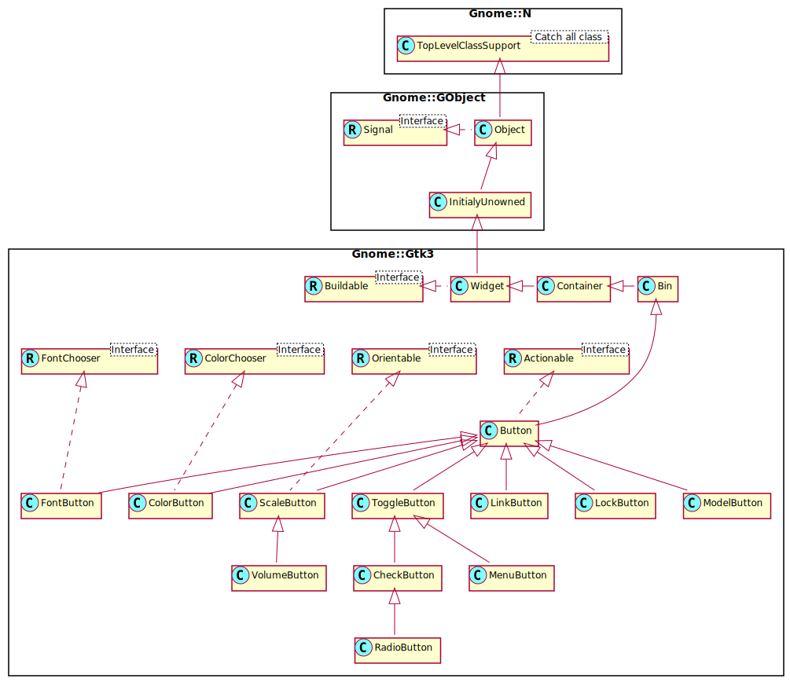

Gnome::Gtk3::Button
===================

A widget that emits a signal when clicked on

Description
===========

The **Gnome::Gtk3::Button** widget is generally used to trigger a callback function that is called when the button is pressed. The various signals and how to use them are outlined below.

The **Gnome::Gtk3::Button** widget can hold any valid child widget. That is, it can hold almost any other standard **Gnome::Gtk3::Widget**. The most commonly used child is the **Gnome::Gtk3::Label** and is the default.

Css Nodes
---------

**Gnome::Gtk3::Button** has a single CSS node with name button. The node will get the style classes .image-button or .text-button, if the content is just an image or label, respectively. It may also receive the .flat style class.

Other style classes that are commonly used with **Gnome::Gtk3::Button** include .suggested-action and .destructive-action. In special cases, buttons can be made round by adding the .circular style class.

Button-like widgets like **Gnome::Gtk3::ToggleButton**, **Gnome::Gtk3::MenuButton**, **Gnome::Gtk3::VolumeButton**, **Gnome::Gtk3::LockButton**, **Gnome::Gtk3::ColorButton**, **Gnome::Gtk3::FontButton** or **Gnome::Gtk3::FileChooserButton** use style classes such as .toggle, .popup, .scale, .lock, .color, .font, .file to differentiate themselves from a plain **Gnome::Gtk3::Button**.

Synopsis
========

Declaration
-----------

    unit class Gnome::Gtk3::Button;
    also is Gnome::Gtk3::Bin;
    also does Gnome::Gtk3::Actionable;

Uml Diagram 
-------------------------------------

Inheriting this class
---------------------

Inheriting is done in a special way in that it needs a call from new() to get the native object created by the class you are inheriting from.

    use Gnome::Gtk3::Button:api<1>;

    unit class MyGuiClass;
    also is Gnome::Gtk3::Button;

    submethod new ( |c ) {
      # let the Gnome::Gtk3::Button class process the options
      self.bless( :GtkButton, |c);
    }

    submethod BUILD ( ... ) {
      ...
    }

Example
-------

    my Gnome::Gtk3::Button $start-button .= new(:label<Start>);

Methods
=======

new
---

### default, no options

Creates a new **Gnome::Gtk3::Button** widget. To add a child widget to the button, use `gtk_container_add()`.

    multi method new ( )

### :label

Creates a **Gnome::Gtk3::Button** widget with a **Gnome::Gtk3::Label** child containing the given text.

    multi method new ( Str :$label! )

### :icon-name, :icon-size

Creates a new button containing an icon from the current icon theme.

If the icon name isn’t known, a “broken image” icon will be displayed instead. If the current icon theme is changed, the icon will be updated appropriately.

This function is a convenience wrapper around `gtk_button_new()` and `gtk_button_set_image()`.

You can use the *gtk3-icon-browser* tool to browse through currently installed icons. The default for `$icon-size` is `GTK_ICON_SIZE_SMALL_TOOLBAR`.

    multi method new ( Str :$icon-name!, GtkIconSize :$icon-size?)

### :mnemonic

Creates a new **Gnome::Gtk3::Button** containing a label. If characters in *label* are preceded by an underscore, they are underlined. If you need a literal underscore character in a label, use “__” (two underscores). The first underlined character represents a keyboard accelerator called a mnemonic. Pressing Alt and that key activates the button.

    multi method new ( Str :$mnemonic! )

### :native-object

Create an object using a native object from elsewhere. See also **Gnome::N::TopLevelSupportClass**.

    multi method new ( N-GObject :$native-object! )

### :build-id

Create an object using a native object from a builder. See also **Gnome::GObject::Object**.

    multi method new ( Str :$build-id! )

clicked
-------

Emits a *clicked* signal to the given **Gnome::Gtk3::Button**.

    method clicked ( )

get-always-show-image
---------------------

Returns whether the button will ignore the *gtk-button-images* setting and always show the image, if available.

Returns: `True` if the button will always show the image

    method get-always-show-image ( --> Bool )

get-event-window
----------------

Returns the button’s event window if it is realized, `undefined` otherwise. This function should be rarely needed.

Returns: *button*’s event window.

    method get-event-window ( --> N-GObject )

get-image
---------

Gets the widget that is currenty set as the image of *button*. This may have been explicitly set by `set-image()` or constructed by `gtk-button-new-from-stock()`.

Returns: a native object if defined or N-GObject if not. The '-rk' version returns a **Gnome::Gtk3::Image** which is invalid in case there is no image.

    method get-image ( --> N-GObject )

get-image-position
------------------

Gets the position of the image relative to the text inside the button.

Returns: the position

    method get-image-position ( --> GtkPositionType )

get-label
---------

Fetches the text from the label of the button, as set by `set-label()`. If the label text has not been set the return value will be `undefined`. This will be the case if you create an empty button with `gtk-button-new()` to use as a container.

Returns: The text of the label widget. This string is owned by the widget and must not be modified or freed.

    method get-label ( --> Str )

get-relief
----------

Returns the current relief style of the given **Gnome::Gtk3::Button**.

Returns: The current GtkReliefStyle

    method get-relief ( --> GtkReliefStyle )

get-use-underline
-----------------

Returns whether an embedded underline in the button label indicates a mnemonic. See `set-use-underline()`.

Returns: `True` if an embedded underline in the button label indicates the mnemonic accelerator keys.

    method get-use-underline ( --> Bool )

set-always-show-image
---------------------

If `True`, the button will ignore the *gtk-button-images* setting and always show the image, if available.

Use this property if the button would be useless or hard to use without the image.

    method set-always-show-image ( Bool $always_show )

  * $always_show; `True` if the menuitem should always show the image

set-image
---------

Set the image of *button* to the given widget. The image will be displayed if the label text is `undefined` or if *always-show-image* is `True`. You don’t have to call `Gnome::Gtk3:Widget.show()` on *$image* yourself.

    method set-image ( N-GObject() $image )

  * $image; a widget to set as the image for the button, or `undefined` to unset

set-image-position
------------------

Sets the position of the image relative to the text inside the button.

    method set-image-position ( GtkPositionType $position )

  * $position; the position

set-label
---------

Sets the text of the label of the button to *str*. This text is also used to select the stock item if `set-use-stock()` is used.

This will also clear any previously set labels.

    method set-label ( Str $label )

  * $label; a string

set-relief
----------

Sets the relief style of the edges of the given **Gnome::Gtk3::Button** widget. Two styles exist, `GTK-RELIEF-NORMAL` and `GTK-RELIEF-NONE`. The default style is, as one can guess, `GTK-RELIEF-NORMAL`. The deprecated value `GTK-RELIEF-HALF` behaves the same as `GTK-RELIEF-NORMAL`.

    method set-relief ( GtkReliefStyle $relief )

  * $relief; The GtkReliefStyle as described above

set-use-underline
-----------------

If true, an underline in the text of the button label indicates the next character should be used for the mnemonic accelerator key.

    method set-use-underline ( Bool $use_underline )

  * $use_underline; `True` if underlines in the text indicate mnemonics

Signals
=======

activate
--------

The *activate* signal on GtkButton is an action signal and emitting it causes the button to animate press then release. Applications should never connect to this signal, but use the *clicked* signal.

    method handler (
      Gnome::Gtk3::Button :_widget($widget),
      Int :$_handler-id,
      N-GObject :$_native-object,
      *%user-options
    )

  * $widget; The instance which registered the signal

  * $_handler-id; The handler id which is returned from the registration

  * $_native-object; The native object provided by the caller wrapped in the Raku object.

  * %user-options; A list of named arguments provided at the `register-signal()` method

clicked
-------

Emitted when the button has been activated (pressed and released).

    method handler (
      Gnome::Gtk3::Button :_widget($button),
      Int :$_handler-id,
      N-GObject :$_native-object,
      *%user-options
    )

  * $button; The instance which registered the signal

  * $_handler-id; The handler id which is returned from the registration

  * $_native-object; The native object provided by the caller wrapped in the Raku object.

  * %user-options; A list of named arguments provided at the `register-signal()` method

Properties
==========

always-show-image
-----------------

If `True`, the button will ignore the *gtk-button-images from Gnome::Gtk3::Settings* setting and always show the image, if available.

Use this property if the button would be useless or hard to use without the image.

The **Gnome::GObject::Value** type of property *always-show-image* is `G_TYPE_BOOLEAN`.

  * Parameter is readable and writable.

  * Parameter is set on construction of object.

  * Default value is FALSE.

image
-----

The child widget to appear next to the button text.

The **Gnome::GObject::Value** type of property *image* is `G_TYPE_OBJECT`.

  * Parameter is readable and writable.

image-position
--------------

The position of the image relative to the text inside the button.

The **Gnome::GObject::Value** type of property *image-position* is `G_TYPE_ENUM`.

  * Parameter is readable and writable.

  * Default value is GTK_POS_LEFT.

label
-----

Text of the label widget inside the button, if the button contains a label widget

The **Gnome::GObject::Value** type of property *label* is `G_TYPE_STRING`.

  * Parameter is readable and writable.

  * Parameter is set on construction of object.

  * Default value is undefined.

relief
------

The border relief style

The **Gnome::GObject::Value** type of property *relief* is `G_TYPE_ENUM`.

  * Parameter is readable and writable.

  * Default value is GTK_RELIEF_NORMAL.

use-underline
-------------

If set, an underline in the text indicates the next character should be used for the mnemonic accelerator key

The **Gnome::GObject::Value** type of property *use-underline* is `G_TYPE_BOOLEAN`.

  * Parameter is readable and writable.

  * Parameter is set on construction of object.

  * Default value is FALSE.

