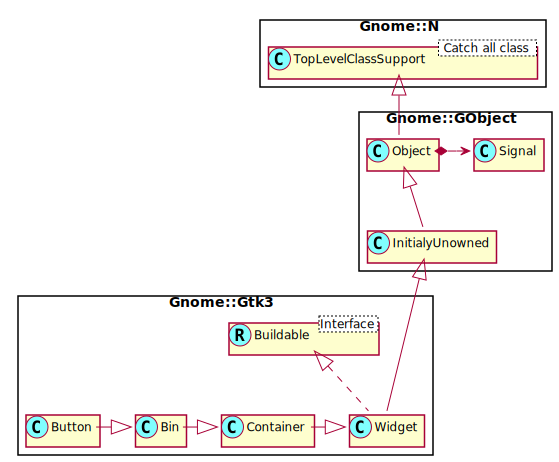

Gnome::Gtk3::Button
===================

A widget that emits a signal when clicked on

Description
===========

The **Gnome::Gtk3::Button** widget is generally used to trigger a callback function that is called when the button is pressed. The various signals and how to use them are outlined below.

The **Gnome::Gtk3::Button** widget can hold any valid child widget. That is, it can hold almost any other standard **Gnome::Gtk3::Widget**. The most commonly used child is the **Gnome::Gtk3::Label** and is the default.

Css Nodes
---------

**Gnome::Gtk3::Button** has a single CSS node with name button. The node will get the style classes .image-button or .text-button, if the content is just an image or label, respectively. It may also receive the .flat style class.

Other style classes that are commonly used with **Gnome::Gtk3::Button** include .suggested-action and .destructive-action. In special cases, buttons can be made round by adding the .circular style class.

Button-like widgets like **Gnome::Gtk3::ToggleButton**, **Gnome::Gtk3::MenuButton**, **Gnome::Gtk3::VolumeButton**, **Gnome::Gtk3::LockButton**, **Gnome::Gtk3::ColorButton**, **Gnome::Gtk3::FontButton** or **Gnome::Gtk3::FileChooserButton** use style classes such as .toggle, .popup, .scale, .lock, .color, .font, .file to differentiate themselves from a plain **Gnome::Gtk3::Button**.

Synopsis
========

Declaration
-----------

    unit class Gnome::Gtk3::Button;
    also is Gnome::Gtk3::Bin;
    also does Gnome::Gtk3::Actionable;

Uml Diagram 
------------------------------------

Inheriting this class
---------------------

Inheriting is done in a special way in that it needs a call from new() to get the native object created by the class you are inheriting from.

    use Gnome::Gtk3::Button;

    unit class MyGuiClass;
    also is Gnome::Gtk3::Button;

    submethod new ( |c ) {
      # let the Gnome::Gtk3::Button class process the options
      self.bless( :GtkButton, |c);
    }

    submethod BUILD ( ... ) {
      ...
    }

Example
-------

    my Gnome::Gtk3::Button $start-button .= new(:label<Start>);

Methods
=======

new
---

### new()

Creates a new **Gnome::Gtk3::Button** widget. To add a child widget to the button, use `gtk_container_add()`.

    multi method new ( )

### new(:label)

Creates a **Gnome::Gtk3::Button** widget with a **Gnome::Gtk3::Label** child containing the given text.

    multi method new ( Str :$label! )

### new( :icon-name, :icon-size)

Creates a new button containing an icon from the current icon theme.

If the icon name isn’t known, a “broken image” icon will be displayed instead. If the current icon theme is changed, the icon will be updated appropriately.

This function is a convenience wrapper around `gtk_button_new()` and `gtk_button_set_image()`.

You can use the *gtk3-icon-browser* tool to browse through currently installed icons. The default for `$icon-size` is `GTK_ICON_SIZE_SMALL_TOOLBAR`.

    multi method new ( Str :$icon-name!, GtkIconSize :$icon-size?)

### new(:mnemonic)

Creates a new **Gnome::Gtk3::Button** containing a label. If characters in *label* are preceded by an underscore, they are underlined. If you need a literal underscore character in a label, use “__” (two underscores). The first underlined character represents a keyboard accelerator called a mnemonic. Pressing Alt and that key activates the button.

    multi method new ( Str :$mnemonic! )

[gtk_] button_clicked
---------------------

Emits a prop *clicked* signal to the given **Gnome::Gtk3::Button**.

    method gtk_button_clicked ( )

[[gtk_] button_] set_relief
---------------------------

Sets the relief style of the edges of the given **Gnome::Gtk3::Button** widget. Two styles exist, `GTK_RELIEF_NORMAL` and `GTK_RELIEF_NONE`. The default style is, as one can guess, `GTK_RELIEF_NORMAL`. The deprecated value `GTK_RELIEF_HALF` behaves the same as `GTK_RELIEF_NORMAL`.

    method gtk_button_set_relief ( GtkReliefStyle $relief )

  * GtkReliefStyle $relief; The **Gnome::Gtk3::ReliefStyle** as described above

[[gtk_] button_] get_relief
---------------------------

Returns the current relief style of the given **Gnome::Gtk3::Button**.

Returns: The current **Gnome::Gtk3::ReliefStyle**

    method gtk_button_get_relief ( --> GtkReliefStyle  )

[[gtk_] button_] set_label
--------------------------

Sets the text of the label of the button to *str*. This text is also used to select the stock item if `gtk_button_set_use_stock()` is used.

This will also clear any previously set labels.

    method gtk_button_set_label ( Str $label )

  * Str $label; a string

[[gtk_] button_] get_label
--------------------------

Fetches the text from the label of the button, as set by `gtk_button_set_label()`. If the label text has not been set the return value will be `Any`. This will be the case if you create an empty button with `gtk_button_new()` to use as a container.

Returns: The text of the label widget. This string is owned by the widget and must not be modified or freed.

    method gtk_button_get_label ( --> Str  )

[[gtk_] button_] set_use_underline
----------------------------------

If true, an underline in the text of the button label indicates the next character should be used for the mnemonic accelerator key.

    method gtk_button_set_use_underline ( Int $use_underline )

  * Int $use_underline; `1` if underlines in the text indicate mnemonics

[[gtk_] button_] get_use_underline
----------------------------------

Returns whether an embedded underline in the button label indicates a mnemonic. See `gtk_button_set_use_underline()`.

Returns: `1` if an embedded underline in the button label indicates the mnemonic accelerator keys.

    method gtk_button_get_use_underline ( --> Int  )

[[gtk_] button_] set_image
--------------------------

Set the image of *button* to the given widget. The image will be displayed if the label text is `Any` or if sig **always-show-image** is `1`. You don’t have to call `gtk_widget_show()` on *image* yourself.

    method gtk_button_set_image ( N-GObject $image )

  * N-GObject $image; a widget to set as the image for the button

[[gtk_] button_] get_image
--------------------------

Gets the widget that is currenty set as the image of *button*. This may have been explicitly set by `gtk_button_set_image()` or constructed by `gtk_button_new_from_stock()`.

Returns: (nullable) (transfer none): a **Gnome::Gtk3::Widget** or `Any` in case there is no image

    method gtk_button_get_image ( --> N-GObject  )

[[gtk_] button_] set_image_position
-----------------------------------

Sets the position of the image relative to the text inside the button.

    method gtk_button_set_image_position ( GtkPositionType $position )

  * GtkPositionType $position; the position

[[gtk_] button_] get_image_position
-----------------------------------

Gets the position of the image relative to the text inside the button.

Returns: the position

    method gtk_button_get_image_position ( --> GtkPositionType  )

[[gtk_] button_] set_always_show_image
--------------------------------------

If `1`, the button will ignore the sig **gtk-button-images** setting and always show the image, if available.

Use this property if the button would be useless or hard to use without the image.

    method gtk_button_set_always_show_image ( Int $always_show )

  * Int $always_show; `1` if the menuitem should always show the image

[[gtk_] button_] get_always_show_image
--------------------------------------

Returns whether the button will ignore the sig **gtk-button-images** setting and always show the image, if available.

Returns: `1` if the button will always show the image

    method gtk_button_get_always_show_image ( --> Int  )

[[gtk_] button_] get_event_window
---------------------------------

Returns the button’s event window if it is realized, `Any` otherwise. This function should be rarely needed.

Returns: (transfer none): *button*’s event window.

    method gtk_button_get_event_window ( --> N-GObject  )

Signals
=======

There are two ways to connect to a signal. The first option you have is to use `register-signal()` from **Gnome::GObject::Object**. The second option is to use `g_signal_connect_object()` directly from **Gnome::GObject::Signal**.

First method
------------

The positional arguments of the signal handler are all obligatory as well as their types. The named attributes `:$widget` and user data are optional.

    # handler method
    method mouse-event ( N-GdkEvent $event, :$widget ) { ... }

    # connect a signal on window object
    my Gnome::Gtk3::Window $w .= new( ... );
    $w.register-signal( self, 'mouse-event', 'button-press-event');

Second method
-------------

    my Gnome::Gtk3::Window $w .= new( ... );
    my Callable $handler = sub (
      N-GObject $native, N-GdkEvent $event, OpaquePointer $data
    ) {
      ...
    }

    $w.connect-object( 'button-press-event', $handler);

Also here, the types of positional arguments in the signal handler are important. This is because both methods `register-signal()` and `g_signal_connect_object()` are using the signatures of the handler routines to setup the native call interface.

Supported signals
-----------------

### clicked

Emitted when the button has been activated (pressed and released).

    method handler (
      Int :$_handler_id,
      Gnome::GObject::Object :_widget($button),
      *%user-options
    );

  * $button; the object that received the signal

Properties
==========

An example of using a string type property of a **Gnome::Gtk3::Label** object. This is just showing how to set/read a property, not that it is the best way to do it. This is because a) The class initialization often provides some options to set some of the properties and b) the classes provide many methods to modify just those properties. In the case below one can use **new(:label('my text label'))** or **gtk_label_set_text('my text label')**.

    my Gnome::Gtk3::Label $label .= new;
    my Gnome::GObject::Value $gv .= new(:init(G_TYPE_STRING));
    $label.g-object-get-property( 'label', $gv);
    $gv.g-value-set-string('my text label');

Supported properties
--------------------

### Label

Text of the label widget inside the button, if the button contains a label widget Default value: Any

The **Gnome::GObject::Value** type of property *label* is `G_TYPE_STRING`.

### Use underline

If set, an underline in the text indicates the next character should be used for the mnemonic accelerator key Default value: False

The **Gnome::GObject::Value** type of property *use-underline* is `G_TYPE_BOOLEAN`.

### Border relief

The border relief style Default value: False

The **Gnome::GObject::Value** type of property *relief* is `G_TYPE_ENUM`.

### Image position

The position of the image relative to the text inside the button. Widget type: GTK_TYPE_POSITION_TYPE

The **Gnome::GObject::Value** type of property *image-position* is `G_TYPE_ENUM`.

### Always show image

If `1`, the button will ignore the *gtk-button-images* setting and always show the image, if available. Use this property if the button would be useless or hard to use without the image.

The **Gnome::GObject::Value** type of property *always-show-image* is `G_TYPE_BOOLEAN`.

