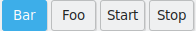
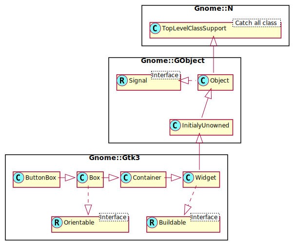

Gnome::Gtk3::ButtonBox
======================

A container for arranging buttons

Description
===========

A button box should be used to provide a consistent layout of buttons throughout your application. The layout/spacing can be altered by the programmer, or if desired, by the user to alter the “feel” of a program to a small degree.

`get-layout()` and `set-layout()` retrieve and alter the method used to spread the buttons in a button box across the container, respectively.

The main purpose of GtkButtonBox is to make sure the children have all the same size. GtkButtonBox gives all children the same size, but it does allow 'outliers' to keep their own larger size.

To exempt individual children from homogeneous sizing regardless of their 'outlier' status, you can set the non-homogeneous child property.

Css Nodes
---------

GtkButtonBox uses a single CSS node with name buttonbox.

Synopsis
========

Declaration
-----------

    unit class Gnome::Gtk3::ButtonBox;
    also is Gnome::Gtk3::Box;

Uml Diagram
-----------

Inheriting this class
---------------------

Inheriting is done in a special way in that it needs a call from new() to get the native object created by the class you are inheriting from.

    use Gnome::Gtk3::ButtonBox;

    unit class MyGuiClass;
    also is Gnome::Gtk3::ButtonBox;

    submethod new ( |c ) {
      # let the Gnome::Gtk3::ButtonBox class process the options
      self.bless( :GtkButtonBox, |c);
    }

    submethod BUILD ( ... ) {
      ...
    }

Example
-------

The below example creates a ButtonBox with 4 buttons. The result is shown in the picture at the start of this document.

    my Gnome::Gtk3::ButtonBox $bb .= new;
    $bb.set-layout(GTK_BUTTONBOX_EXPAND);

    my Gnome::Gtk3::Button $button1 .= new(:label<Start>);
    $bb.add($button1);
    my Gnome::Gtk3::Button $button2 .= new(:label<Stop>);
    $bb.add($button2);

    my Gnome::Gtk3::Button $button3 .= new(:label<Foo>);
    $bb.add($button3);
    $bb.set-child-secondary( $button3, True);
    my Gnome::Gtk3::Button $button4 .= new(:label<Bar>);
    $bb.add($button4);
    $bb.set-child-secondary( $button4, True);

Types
=====

enum GtkButtonBoxStyle
----------------------

Used to dictate the style that a **Gnome::Gtk3::ButtonBox** uses to layout the buttons it contains.

  * GTK-BUTTONBOX-SPREAD: Buttons are evenly spread across the box.

  * GTK-BUTTONBOX-EDGE: Buttons are placed at the edges of the box.

  * GTK-BUTTONBOX-START: Buttons are grouped towards the start of the box, (on the left or at the top).

  * GTK-BUTTONBOX-END: Buttons are grouped towards the end of the box, (on the right or at the bottom).

  * GTK-BUTTONBOX-CENTER: Buttons are centered in the box.

  * GTK-BUTTONBOX-EXPAND: Buttons expand to fill the box. This entails giving buttons a "linked" appearance, making button sizes homogeneous, and setting spacing to 0 (same as calling `Gnome::Gtk3::Box.set-homogeneous()` and `Gnome::Gtk3::Box.set-spacing()` manually).

Methods
=======

new
---

### :orientation

Create a new ButtonBox object.

    multi method new ( GtkOrientation :$orientation = GTK_ORIENTATION_HORIZONTAL )

  * $layout_style; the new layout style

### :native-object

Create a ButtonBox object using a native object from elsewhere. See also **Gnome::N::TopLevelClassSupport**.

    multi method new ( N-GObject :$native-object! )

### :build-id

Create a ButtonBox object using a native object returned from a builder. See also **Gnome::GObject::Object**.

    multi method new ( Str :$build-id! )

get-child-non-homogeneous
-------------------------

Returns whether the child is exempted from homogenous sizing.

Returns: `True` if the child is not subject to homogenous sizing

    method get-child-non-homogeneous ( N-GObject() $child --> Bool )

  * $child; a child of the button box

get-child-secondary
-------------------

Returns whether *$child* should appear in a secondary group of children.

    method get-child-secondary ( N-GObject() $child --> Bool )

  * $child; a child of the button box

get-layout
----------

Retrieves the method being used to arrange the buttons in a button box.

    method get-layout ( --> GtkButtonBoxStyle )

set-child-non-homogeneous
-------------------------

Sets whether the child is exempted from homogeous sizing.

    method set-child-non-homogeneous (
      N-GObject() $child, Bool $non_homogeneous
    )

  * $child; a child of the button box

  * $non_homogeneous; the new value

set-child-secondary
-------------------

Sets whether *$child* should appear in a secondary group of children. A typical use of a secondary child is the help button in a dialog.

This group appears after the other children if the style is `GTK-BUTTONBOX-START`, `GTK-BUTTONBOX-SPREAD` or `GTK-BUTTONBOX-EDGE`, and before the other children if the style is `GTK-BUTTONBOX-END`. For horizontal button boxes, the definition of before/after depends on direction of the widget (see `gtk-widget-set-direction()`). If the style is `GTK-BUTTONBOX-START` or `GTK-BUTTONBOX-END`, then the secondary children are aligned at the other end of the button box from the main children. For the other styles, they appear immediately next to the main children.

    method set-child-secondary ( N-GObject() $child, Bool $is_secondary )

  * $child; a child of the button box

  * $is_secondary; if `True`, the *$child* appears in a secondary group of the button box.

set-layout
----------

Changes the way buttons are arranged in their container.

    method set-layout ( GtkButtonBoxStyle $layout_style )

  * GtkButtonBoxStyle $layout_style; the new layout style

Properties
==========

An example of using a string type property of a **Gnome::Gtk3::Label** object. This is just showing how to set/read a property, not that it is the best way to do it. This is because a) The class initialization often provides some options to set some of the properties and b) the classes provide many methods to modify just those properties. In the case below one can use **new(:label('my text label'))** or **.set-text('my text label')**.

    my Gnome::Gtk3::Label $label .= new;
    my Gnome::GObject::Value $gv .= new(:init(G_TYPE_STRING));
    $label.get-property( 'label', $gv);
    $gv.set-string('my text label');

Supported properties
--------------------

### Layout style: layout-style

How to lay out the buttons in the box. Possible values are: spread, edge-COMMA- start and end Default value: False

The **Gnome::GObject::Value** type of property *layout-style* is `G_TYPE_ENUM`.

