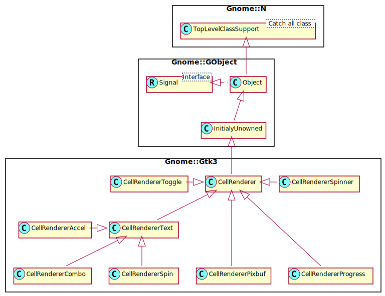

Gnome::Gtk3::CellRenderer
=========================

An object for rendering a single cell

Description
===========

The **Gnome::Gtk3::CellRenderer** is a base class of a set of objects used for rendering a cell to a **cairo_t**. These objects are used primarily by the **Gnome::Gtk3::TreeView** widget, though they aren’t tied to them in any specific way. It is worth noting that **Gnome::Gtk3::CellRenderer** is not a **Gnome::Gtk3::Widget** and cannot be treated as such.

The primary use of a **Gnome::Gtk3::CellRenderer** is for drawing certain graphical elements on a **cairo_t**. Typically, one cell renderer is used to draw many cells on the screen. To this extent, it isn’t expected that a CellRenderer keeps any permanent state around. Instead, any state is set just prior to use using **GObjects** property system. Then, the cell is measured using `gtk_cell_renderer_get_size()`. Finally, the cell is rendered in the correct location using `gtk_cell_renderer_render()`.

Many properties of **Gnome::Gtk3::CellRenderer** and its subclasses have a corresponding “set” property, e.g. “cell-background-set” corresponds to “cell-background”. These “set” properties reflect whether a property has been set or not. You should not set them independently.

See Also
--------

**Gnome::Gtk3::CellRendererText**, **Gnome::Gtk3::CellRendererPixbuf**, **Gnome::Gtk3::CellRendererToggle**, **Gnome::Gtk3::CellRendererProgress**, **Gnome::Gtk3::CellRendererSpinner**

Synopsis
========

Declaration
-----------

    unit class Gnome::Gtk3::CellRenderer;
    also is Gnome::GObject::InitiallyUnowned;

Uml Diagram
-----------

Types
=====

enum GtkCellRendererMode
------------------------

Identifies how the user can interact with a particular cell.

  * GTK_CELL_RENDERER_MODE_INERT: The cell is just for display and cannot be interacted with. Note that this doesn’t mean that eg. the row being drawn can’t be selected -- just that a particular element of it cannot be individually modified.

  * GTK_CELL_RENDERER_MODE_ACTIVATABLE: The cell can be clicked.

  * GTK_CELL_RENDERER_MODE_EDITABLE: The cell can be edited or otherwise modified.

enum GtkCellRendererState
-------------------------

Tells how a cell is to be rendered.

  * GTK_CELL_RENDERER_SELECTED: The cell is currently selected, and probably has a selection colored background to render to.

  * GTK_CELL_RENDERER_PRELIT: The mouse is hovering over the cell.

  * GTK_CELL_RENDERER_INSENSITIVE: The cell is drawn in an insensitive manner

  * GTK_CELL_RENDERER_SORTED: The cell is in a sorted row

  * GTK_CELL_RENDERER_FOCUSED: The cell is in the focus row.

  * GTK_CELL_RENDERER_EXPANDABLE: The cell is in a row that can be expanded.

  * GTK_CELL_RENDERER_EXPANDED: The cell is in a row that is expanded.

N-GtkRequisition
----------------

A N-GtkRequisition represents the desired size of a widget. See GtkWidget’s geometry management section for more information.

  * Int width; the widget’s desired width

  * Int height; the widget’s desired height

Methods
=======

new
---

### :native-object

Create a CellRenderer object using a native object from elsewhere. See also **Gnome::N::TopLevelClassSupport**.

    multi method new ( N-GObject :$native-object! )

activate
--------

Passes an activate event to the cell renderer for possible processing. Some cell renderers may use events; for example, **Gnome::Gtk3::CellRendererToggle** toggles when it gets a mouse click.

Returns: `True` if the event was consumed/handled

    method activate ( N-GdkEvent $event, N-GObject() $widget, Str $path, N-GObject() $background_area, N-GObject() $cell_area, GtkCellRendererState $flags --> Bool )

  * $event; a **Gnome::Gtk3::Event**

  * $widget; widget that received the event

  * $path; widget-dependent string representation of the event location; e.g. for **Gnome::Gtk3::TreeView**, a string representation of **Gnome::Gtk3::TreePath**

  * $background_area; background area as passed to `render()`

  * $cell_area; cell area as passed to `render()`

  * $flags; render flags

get-aligned-area
----------------

Gets the aligned area used by *cell* inside *cell_area*. Used for finding the appropriate edit and focus rectangle.

    method get-aligned-area ( N-GObject() $widget, UInt $flags, N-GObject() $cell_area, N-GObject() $aligned_area )

  * $widget; the **Gnome::Gtk3::Widget** this cell will be rendering to

  * $flags; render flags. Mask of bits from GtkCellRendererState

  * $cell_area; cell area which would be passed to `render()`

  * $aligned_area; the return location for the space inside *cell_area* that would acually be used to render.

get-alignment
-------------

Fills in *xalign* and *yalign* with the appropriate values of *cell*.

    method get-alignment ( --> List )

List returns

  * Num; the x alignment of the cell, or `undefined`

  * Num; the y alignment of the cell, or `undefined`

get-fixed-size
--------------

Fills in *width* and *height* with the appropriate size of *cell*.

    method get-fixed-size ( --> List )

List returns

  * Int; the fixed width of the cell, or `undefined`

  * Int; the fixed height of the cell, or `undefined`

get-padding
-----------

Fills in *xpad* and *ypad* with the appropriate values of *cell*.

    method get-padding ( --> List )

List returns

  * Int; the x padding of the cell, or `undefined`

  * Int; the y padding of the cell, or `undefined`

get-preferred-height
--------------------

Retreives a renderer’s natural size when rendered to *widget*.

    method get-preferred-height ( N-GObject() $widget --> List )

  * $widget; the **Gnome::Gtk3::Widget** this cell will be rendering to

List returns

  * Int; the minimum size, or `undefined`

  * Int; the natural size, or `undefined`

get-preferred-height-for-width
------------------------------

Retreives a cell renderers’s minimum and natural height if it were rendered to *widget* with the specified *width*.

    method get-preferred-height-for-width (
      N-GObject() $widget, Int() $width --> List
    )

  * $widget; the **Gnome::Gtk3::Widget** this cell will be rendering to

  * $width; the size which is available for allocation

List returns

  * Int; the minimum size, or `undefined`

  * Int; the preferred size, or `undefined`

get-preferred-size
------------------

Retrieves the minimum and natural size of a cell taking into account the widget’s preference for height-for-width management.

    method get-preferred-size ( N-GObject() $widget --> List )

  * $widget; the **Gnome::Gtk3::Widget** this cell will be rendering to

List returns

  * N-GtkRequisition; the minimum size, or `undefined`

  * N-GtkRequisition; the natural size, or `undefined`

get-preferred-width
-------------------

Retreives a renderer’s natural size when rendered to *widget*.

    method get-preferred-width ( N-GObject() $widget --> List )

  * $widget; the **Gnome::Gtk3::Widget** this cell will be rendering to

List returns

  * Int; the minimum size, or `undefined`

  * Int; the natural size, or `undefined`

get-preferred-width-for-height
------------------------------

Retreives a cell renderers’s minimum and natural width if it were rendered to *widget* with the specified *height*.

    method get-preferred-width-for-height (
      N-GObject() $widget, Int() $height --> List
    )

  * $widget; the **Gnome::Gtk3::Widget** this cell will be rendering to

  * $height; the size which is available for allocation

List returns

  * $minimum_width; location for storing the minimum size, or `undefined`

  * $natural_width; location for storing the preferred size, or `undefined`

get-request-mode
----------------

Gets whether the cell renderer prefers a height-for-width layout or a width-for-height layout.

Returns: The enum `GtkSizeRequestMode` preferred by this renderer.

    method get-request-mode ( --> GtkSizeRequestMode )

get-sensitive
-------------

Returns the cell renderer’s sensitivity.

Returns: `True` if the cell renderer is sensitive

    method get-sensitive ( --> Bool )

get-state
---------

Translates the cell renderer state to a mask of `GtkStateFlags`, based on the cell renderer and widget sensitivity, and the given **Gnome::Gtk3::CellRendererState**.

Returns: the widget state flags applying to *cell*

    method get-state (
      N-GObject() $widget, GtkCellRendererState $cell_state
      --> UInt
    )

  * $widget; a **Gnome::Gtk3::Widget**, or `undefined`

  * $cell_state; cell renderer state

get-visible
-----------

Returns the cell renderer’s visibility.

Returns: `True` if the cell renderer is visible

    method get-visible ( --> Bool )

is-activatable
--------------

Checks whether the cell renderer can do something when activated.

Returns: `True` if the cell renderer can do anything when activated

    method is-activatable ( --> Bool )

render
------

Invokes the virtual render function of the **Gnome::Gtk3::CellRenderer**. The three passed-in rectangles are areas in *cr*. Most renderers will draw within *cell_area*; the xalign, yalign, xpad, and ypad fields of the **Gnome::Gtk3::CellRenderer** should be honored with respect to *cell_area*. *background_area* includes the blank space around the cell, and also the area containing the tree expander; so the *background_area* rectangles for all cells tile to cover the entire *window*.

    method render (
      cairo_t $cr, N-GObject() $widget, N-GObject() $background_area,
      N-GObject() $cell_area, GtkCellRendererState $flags
    )

  * $cr; a cairo context to draw to

  * $widget; the widget owning *window*

  * $background_area; entire cell area (including tree expanders and maybe padding on the sides)

  * $cell_area; area normally rendered by a cell renderer

  * $flags; flags that affect rendering

set-alignment
-------------

Sets the renderer’s alignment within its available space.

    method set-alignment ( Num() $xalign, Num() $yalign )

  * $xalign; the x alignment of the cell renderer

  * $yalign; the y alignment of the cell renderer

set-fixed-size
--------------

Sets the renderer size to be explicit, independent of the properties set.

    method set-fixed-size ( Int() $width, Int() $height )

  * $width; the width of the cell renderer, or -1

  * $height; the height of the cell renderer, or -1

set-padding
-----------

Sets the renderer’s padding.

    method set-padding ( Int() $xpad, Int() $ypad )

  * $xpad; the x padding of the cell renderer

  * $ypad; the y padding of the cell renderer

set-sensitive
-------------

Sets the cell renderer’s sensitivity.

    method set-sensitive ( Bool $sensitive )

  * $sensitive; the sensitivity of the cell

set-visible
-----------

Sets the cell renderer’s visibility.

    method set-visible ( Bool $visible )

  * $visible; the visibility of the cell

start-editing
-------------

Starts editing the contents of this *cell*, through a new **Gnome::Gtk3::CellEditable** widget created by the **Gnome::Gtk3::CellRendererClass**.start_editing virtual function.

Returns: A new **Gnome::Gtk3::CellEditable** for editing this *cell*, or `undefined` if editing is not possible

    method start-editing (
      N-GdkEvent $event, N-GObject() $widget, Str $path,
      N-GObject() $background_area, N-GObject() $cell_area,
      GtkCellRendererState $flags
      --> N-GObject
    )

  * $event; a **Gnome::Gtk3::Event**

  * $widget; widget that received the event

  * $path; widget-dependent string representation of the event location; e.g. for **Gnome::Gtk3::TreeView**, a string representation of **Gnome::Gtk3::TreePath**

  * $background_area; background area as passed to `render()`

  * $cell_area; cell area as passed to `render()`

  * $flags; render flags

stop-editing
------------

Informs the cell renderer that the editing is stopped. If *canceled* is `True`, the cell renderer will emit the *editing-canceled* signal.

This function should be called by cell renderer implementations in response to the *editing-done* signal of **Gnome::Gtk3::CellEditable**.

    method stop-editing ( Bool $canceled )

  * $canceled; `True` if the editing has been canceled

Signals
=======

editing-canceled
----------------

This signal gets emitted when the user cancels the process of editing a cell. For example, an editable cell renderer could be written to cancel editing when the user presses Escape.

See also: `stop_editing()`.

    method handler (
      Gnome::Gtk3::CellRenderer :_widget($renderer),
      Int :$_handler-id,
      N-GObject :$_native-object,
      *%user-options
    )

  * $renderer; The instance which registered the signal

  * $_handler-id; The handler id which is returned from the registration

  * $_native-object; The native object provided by the caller wrapped in the Raku object.

  * %user-options; A list of named arguments provided at the `register-signal()` method

editing-started
---------------

This signal gets emitted when a cell starts to be edited. The intended use of this signal is to do special setup on *editable*, e.g. adding a **Gnome::Gtk3::EntryCompletion** or setting up additional columns in a **Gnome::Gtk3::ComboBox**.

See `gtk_cell_editable_start_editing()` for information on the lifecycle of the *editable* and a way to do setup that doesn’t depend on the *renderer*.

    method handler (
      N-GObject $editable,
      Str $path,
      Gnome::Gtk3::CellRenderer :_widget($renderer),
      Int :$_handler-id,
      N-GObject :$_native-object,
      *%user-options
    )

  * $editable; the **Gnome::Gtk3::CellEditable**

  * $path; the path identifying the edited cell

  * $renderer; The instance which registered the signal

  * $_handler-id; The handler id which is returned from the registration

  * $_native-object; The native object provided by the caller wrapped in the Raku object.

  * %user-options; A list of named arguments provided at the `register-signal()` method

Properties
==========

Cell background color name: cell-background
-------------------------------------------

Cell background color as a string Default value: Any

The **Gnome::GObject::Value** type of property *cell-background* is `G_TYPE_STRING`.

Editing: editing
----------------

Whether the cell renderer is currently in editing mode Default value: False

The **Gnome::GObject::Value** type of property *editing* is `G_TYPE_BOOLEAN`.

height: height
--------------

The **Gnome::GObject::Value** type of property *height* is `G_TYPE_INT`.

Is Expanded: is-expanded
------------------------

Row is an expander row, and is expanded Default value: False

The **Gnome::GObject::Value** type of property *is-expanded* is `G_TYPE_BOOLEAN`.

Is Expander: is-expander
------------------------

Row has children Default value: False

The **Gnome::GObject::Value** type of property *is-expander* is `G_TYPE_BOOLEAN`.

mode: mode
----------

Editable mode of the CellRenderer Default value: False

The **Gnome::GObject::Value** type of property *mode* is `G_TYPE_ENUM`.

Sensitive: sensitive
--------------------

Display the cell sensitive Default value: True

The **Gnome::GObject::Value** type of property *sensitive* is `G_TYPE_BOOLEAN`.

visible: visible
----------------

Display the cell Default value: True

The **Gnome::GObject::Value** type of property *visible* is `G_TYPE_BOOLEAN`.

width: width
------------

The **Gnome::GObject::Value** type of property *width* is `G_TYPE_INT`.

xalign: xalign
--------------

The **Gnome::GObject::Value** type of property *xalign* is `G_TYPE_FLOAT`.

xpad: xpad
----------

The **Gnome::GObject::Value** type of property *xpad* is `G_TYPE_UINT`.

yalign: yalign
--------------

The **Gnome::GObject::Value** type of property *yalign* is `G_TYPE_FLOAT`.

ypad: ypad
----------

The **Gnome::GObject::Value** type of property *ypad* is `G_TYPE_UINT`.

