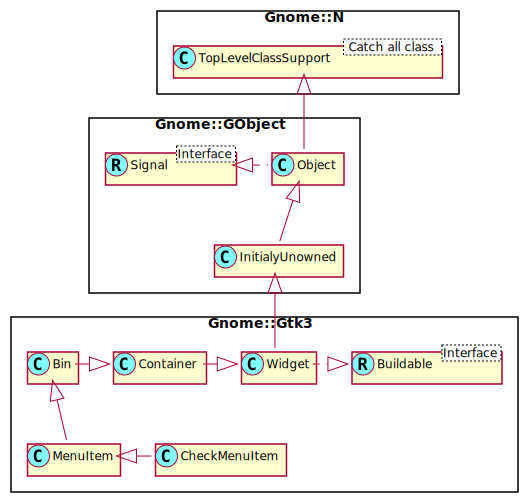

Gnome::Gtk3::CheckMenuItem
==========================

A menu item with a check box

Description
===========

A **Gnome::Gtk3::CheckMenuItem** is a menu item that maintains the state of a boolean value in addition to a **Gnome::Gtk3::MenuItem** usual role in activating application code.

A check box indicating the state of the boolean value is displayed at the left side of the **Gnome::Gtk3::MenuItem**. Activating the **Gnome::Gtk3::MenuItem** toggles the value.

Css Nodes
---------

    menuitem
    ├── check.left
    ╰── <child>

**Gnome::Gtk3::CheckMenuItem** has a main CSS node with name menuitem, and a subnode with name check, which gets the .left or .right style class.

Synopsis
========

Declaration
-----------

    unit class Gnome::Gtk3::CheckMenuItem;
    also is Gnome::Gtk3::MenuItem;

Uml Diagram
-----------

Inheriting this class
---------------------

Inheriting is done in a special way in that it needs a call from new() to get the native object created by the class you are inheriting from.

    use Gnome::Gtk3::CheckMenuItem;

    unit class MyGuiClass;
    also is Gnome::Gtk3::CheckMenuItem;

    submethod new ( |c ) {
      # let the Gnome::Gtk3::CheckMenuItem class process the options
      self.bless( :GtkCheckMenuItem, |c);
    }

    submethod BUILD ( ... ) {
      ...
    }

Methods
=======

new
---

### default, no options

Create a new CheckMenuItem object.

    multi method new ( )

### :label

Creates a new **Gnome::Gtk3::CheckMenuItem** with a label.

    multi method new ( Str :$label! )

### :mnemonic

Creates a new **Gnome::Gtk3::CheckMenuItem** containing a label. The label will be created using the `:mnemonic` option to the `.new()` call of **Gnome::Gtk3::Label**, so underscores in *label* indicate the mnemonic for the menu item.

    multi method new ( Str :$mnemonic! )

### :native-object

Create a CheckMenuItem object using a native object from elsewhere. See also **Gnome::N::TopLevelClassSupport**.

    multi method new ( N-GObject :$native-object! )

### :build-id

Create a CheckMenuItem object using a native object returned from a builder. See also **Gnome::GObject::Object**.

    multi method new ( Str :$build-id! )

set-active
----------

Sets the active state of the menu item’s check box.

    method set-active ( Bool $is_active )

  * Bool $is_active; boolean value indicating whether the check box is active.

get-active
----------

Returns whether the check menu item is active. See `.set-active()`.

Returns: `True` if the menu item is checked.

    method get-active ( --> Bool )

toggled
-------

Emits the *toggled* signal.

    method toggled ( )

set-inconsistent
----------------

If the user has selected a range of elements (such as some text or spreadsheet cells) that are affected by a boolean setting, and the current values in that range are inconsistent, you may want to display the check in an “in between” state. This function turns on “in between” display. Normally you would turn off the inconsistent state again if the user explicitly selects a setting. This has to be done manually, `gtk_check_menu_item_set_inconsistent()` only affects visual appearance, it doesn’t affect the semantics of the widget.

    method set-inconsistent ( Bool $setting )

  * Bool $setting; `True` to display an “inconsistent” third state check

get-inconsistent
----------------

Retrieves the value set by `gtk_check_menu_item_set_inconsistent()`.

Returns: `1` if inconsistent

    method get-inconsistent ( --> Bool )

set-draw-as-radio
-----------------

Sets whether *check_menu_item* is drawn like a **Gnome::Gtk3::RadioMenuItem**

    method set-draw-as-radio ( Bool $draw_as_radio )

  * Bool $draw_as_radio; whether *check_menu_item* is drawn like a **Gnome::Gtk3::RadioMenuItem**

get-draw-as-radio
-----------------

Returns whether *check_menu_item* looks like a **Gnome::Gtk3::RadioMenuItem**

    method get-draw-as-radio ( --> Bool )

Signals
=======

There are two ways to connect to a signal. The first option you have is to use `register-signal()` from **Gnome::GObject::Object**. The second option is to use `g_signal_connect_object()` directly from **Gnome::GObject::Signal**.

First method
------------

The positional arguments of the signal handler are all obligatory as well as their types. The named attributes `:$widget` and user data are optional.

    # handler method
    method mouse-event ( GdkEvent $event, :$widget ) { ... }

    # connect a signal on window object
    my Gnome::Gtk3::Window $w .= new( ... );
    $w.register-signal( self, 'mouse-event', 'button-press-event');

Second method
-------------

    my Gnome::Gtk3::Window $w .= new( ... );
    my Callable $handler = sub (
      N-GObject $native, GdkEvent $event, OpaquePointer $data
    ) {
      ...
    }

    $w.connect-object( 'button-press-event', $handler);

Also here, the types of positional arguments in the signal handler are important. This is because both methods `register-signal()` and `g_signal_connect_object()` are using the signatures of the handler routines to setup the native call interface.

Supported signals
-----------------

### toggled

This signal is emitted when the state of the check box is changed.

A signal handler can use `gtk_check_menu_item_get_active()` to discover the new state.

    method handler (
      Int :$_handle_id,
      Gnome::GObject::Object :_widget($checkmenuitem),
      *%user-options
    );

  * $checkmenuitem; the object which received the signal.

Properties
==========

An example of using a string type property of a **Gnome::Gtk3::Label** object. This is just showing how to set/read a property, not that it is the best way to do it. This is because a) The class initialization often provides some options to set some of the properties and b) the classes provide many methods to modify just those properties. In the case below one can use **new(:label('my text label'))** or **gtk_label_set_text('my text label')**.

    my Gnome::Gtk3::Label $label .= new;
    my Gnome::GObject::Value $gv .= new(:init(G_TYPE_STRING));
    $label.g-object-get-property( 'label', $gv);
    $gv.g-value-set-string('my text label');

Supported properties
--------------------

### Active

Whether the menu item is checked Default value: False

The **Gnome::GObject::Value** type of property *active* is `G_TYPE_BOOLEAN`.

### Inconsistent

Whether to display an \inconsistent\ state Default value: False

The **Gnome::GObject::Value** type of property *inconsistent* is `G_TYPE_BOOLEAN`.

### Draw as radio menu item

Whether the menu item looks like a radio menu item Default value: False

The **Gnome::GObject::Value** type of property *draw-as-radio* is `G_TYPE_BOOLEAN`.

