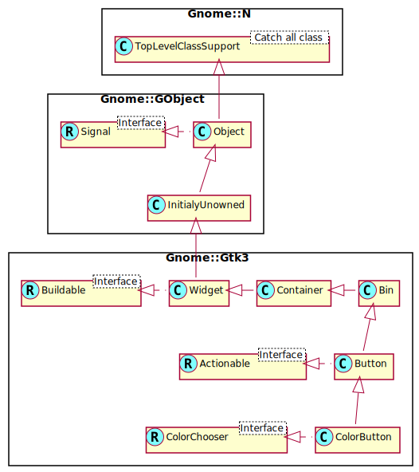

Gnome::Gtk3::ColorButton
========================

A button to launch a color selection dialog

Description
===========

The **Gnome::Gtk3::ColorButton** is a button which displays the currently selected color and allows to open a color selection dialog to change the color. It is a suitable widget for selecting a color in a preference dialog.

Css Nodes
---------

**Gnome::Gtk3::ColorButton** has a single CSS node with name button. To differentiate it from a plain **Gnome::Gtk3::Button**, it gets the .color style class.

See Also
--------

**Gnome::Gtk3::ColorSelectionDialog**, **Gnome::Gtk3::FontButton**

Synopsis
========

Declaration
-----------

    unit class Gnome::Gtk3::ColorButton;
    also is Gnome::Gtk3::Button;
    also does Gnome::Gtk3::ColorChooser;

Uml Diagram
-----------

Inheriting this class
---------------------

Inheriting is done in a special way in that it needs a call from new() to get the native object created by the class you are inheriting from.

    use Gnome::Gtk3::ColorButton;

    unit class MyGuiClass;
    also is Gnome::Gtk3::ColorButton;

    submethod new ( |c ) {
      # let the Gnome::Gtk3::ColorButton class process the options
      self.bless( :GtkColorButton, |c);
    }

    submethod BUILD ( ... ) {
      ...
    }

Example
-------

    my GdkRGBA $color .= new(
      :red(.5e0), :green(.5e0), :blue(.5e0), :alpha(.5e0)
    );
    my Gnome::Gtk3::ColorButton $color-button .= new(:$color));

Methods
=======

new
---

### default, no options

Creates a new color button. This creates a widget in the form of a small button containing a swatch representing the current selected color. When the button is clicked, a color-selection dialog will open, allowing the user to select a color. The swatch will be updated to reflect the new color when the user finishes.

    multi method new ( )

### :color

Create a color button with a new color

    multi method_new ( N-GdkRGBA :$color! )

### :native-object

Create a ColorButton object using a native object from elsewhere. See also **Gnome::N::TopLevelClassSupport**.

    multi method new ( N-GObject :$native-object! )

### :build-id

Create a ColorButton object using a native object returned from a builder. See also **Gnome::GObject::Object**.

    multi method new ( Str :$build-id! )

get-title
---------

Gets the title of the color selection dialog.

Returns: An internal string, do not free the return value

    method get-title ( --> Str )

set-title
---------

Sets the title for the color selection dialog.

    method set-title ( Str $title )

  * Str $title; String containing new window title

Signals
=======

color-set
---------

The *color-set* signal is emitted when the user selects a color. When handling this signal, use `get_rgba()` to find out which color was just selected.

Note that this signal is only emitted when the user changes the color. If you need to react to programmatic color changes as well, use the notify::color signal.

    method handler (
      Gnome::Gtk3::ColorButton :_widget($widget),
      Int :$_handler-id,
      N-GObject :$_native-object,
      *%user-options
    )

  * $widget; The instance which registered the signal

  * $_handler-id; The handler id which is returned from the registration

  * $_native-object; The native object provided by the caller wrapped in the Raku object.

  * %user-options; A list of named arguments provided at the `register-signal()` method

Properties
==========

alpha
-----

The selected opacity value (0 fully transparent, 65535 fully opaque)

  * **Gnome::GObject::Value** type of this property is G_TYPE_UINT

  * Parameter is readable and writable.

  * Minimum value is 0.

  * Maximum value is 65535.

  * Default value is 65535.

rgba
----

The selected RGBA color

  * **Gnome::GObject::Value** type of this property is G_TYPE_BOXED

  * the type of this G_TYPE_BOXED object is GDK_TYPE_RGBA

  * Parameter is readable and writable.

show-editor
-----------

Whether to show the color editor right away

  * **Gnome::GObject::Value** type of this property is G_TYPE_BOOLEAN

  * Parameter is readable and writable.

  * Default value is FALSE.

title
-----

The title of the color selection dialog

  * **Gnome::GObject::Value** type of this property is G_TYPE_STRING

  * Parameter is readable and writable.

  * Default value is _(Pick a Color.

use-alpha
---------

Whether to give the color an alpha value

  * **Gnome::GObject::Value** type of this property is G_TYPE_BOOLEAN

  * Parameter is readable and writable.

  * Default value is FALSE.

