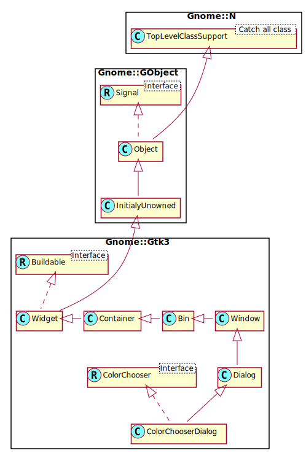

Gnome::Gtk3::ColorChooserDialog
===============================

A dialog for choosing colors

Description
===========

The **Gnome::Gtk3::ColorChooserDialog** widget is a dialog for choosing a color. It implements the **Gnome::Gtk3::ColorChooser** interface.

See Also
--------

**Gnome::Gtk3::ColorChooser**, **Gnome::Gtk3::Dialog**

Synopsis
========

Declaration
-----------

    unit class Gnome::Gtk3::ColorChooserDialog;
    also is Gnome::Gtk3::Dialog;
    also does Gnome::Gtk3::ColorChooser;

Uml Diagram
-----------

Inheriting this class
---------------------

Inheriting is done in a special way in that it needs a call from new() to get the native object created by the class you are inheriting from.

    use Gnome::Gtk3::ColorChooserDialog;

    unit class MyGuiClass;
    also is Gnome::Gtk3::ColorChooserDialog;

    submethod new ( |c ) {
      # let the Gnome::Gtk3::ColorChooserDialog class process the options
      self.bless( :GtkColorChooserDialog, |c);
    }

    submethod BUILD ( ... ) {
      ...
    }

Example
-------

    my Gnome::Gtk3::ColorChooserDialog $dialog .= new(
      :title('my color dialog')
    );

Methods
=======

new
---

### :title, :parent-window

Create a new object with a title. The transient $parent-window which may be `Any`.

    multi method new ( Str :$title!, N-GObject() :$parent-window )

### :native-object

Create a ColorChooserDialog object using a native object from elsewhere. See also **Gnome::N::TopLevelClassSupport**.

    multi method new ( N-GObject() :$native-object! )

### :build-id

Create a ColorChooserDialog object using a native object returned from a builder. See also **Gnome::GObject::Object**.

    multi method new ( Str :$build-id! )

Properties
==========

An example of using a string type property of a **Gnome::Gtk3::Label** object. This is just showing how to set/read a property, not that it is the best way to do it. This is because a) The class initialization often provides some options to set some of the properties and b) the classes provide many methods to modify just those properties. In the case below one can use **new(:label('my text label'))** or **.set-text('my text label')**.

    my Gnome::Gtk3::Label $label .= new;
    my Gnome::GObject::Value $gv .= new(:init(G_TYPE_STRING));
    $label.get-property( 'label', $gv);
    $gv.set-string('my text label');

Supported properties
--------------------

### Show editor: show-editor

Show editor Default value: False

The **Gnome::GObject::Value** type of property *show-editor* is `G_TYPE_BOOLEAN`.

