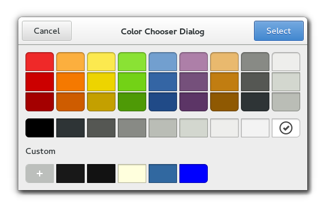

Gnome::Gtk3::ColorChooserDialog
===============================

A dialog for choosing colors

Description
===========

The **Gnome::Gtk3::ColorChooserDialog** widget is a dialog for choosing a color. It implements the **Gnome::Gtk3::ColorChooser** interface.

See Also
--------

**Gnome::Gtk3::ColorChooser**, **Gnome::Gtk3::Dialog**

Synopsis
========

Declaration
-----------

    unit class Gnome::Gtk3::ColorChooserDialog;
    also is Gnome::Gtk3::Dialog;
    also does Gnome::Gtk3::ColorChooser;

Uml Diagram
-----------

Inheriting this class
---------------------

Inheriting is done in a special way in that it needs a call from new() to get the native object created by the class you are inheriting from.

    use Gnome::Gtk3::ColorChooserDialog;

    unit class MyGuiClass;
    also is Gnome::Gtk3::ColorChooserDialog;

    submethod new ( |c ) {
      # let the Gnome::Gtk3::ColorChooserDialog class process the options
      self.bless( :GtkColorChooserDialog, |c);
    }

    submethod BUILD ( ... ) {
      ...
    }

Example
-------

    my Gnome::Gtk3::ColorChooserDialog $dialog .= new(
      :title('my color dialog')
    );

Methods
=======

new
---

### :title, :parent-window

Create a new object with a title. The transient $parent-window which may be `Any`.

    multi method new ( Str :$title!, N-GObject() :$parent-window )

### :native-object

Create a ColorChooserDialog object using a native object from elsewhere. See also **Gnome::N::TopLevelClassSupport**.

    multi method new ( N-GObject() :$native-object! )

### :build-id

Create a ColorChooserDialog object using a native object returned from a builder. See also **Gnome::GObject::Object**.

    multi method new ( Str :$build-id! )

Properties
==========

show-editor
-----------

Show editor

  * **Gnome::GObject::Value** type of this property is G_TYPE_BOOLEAN

  * Parameter is readable and writable.

  * Default value is FALSE.

