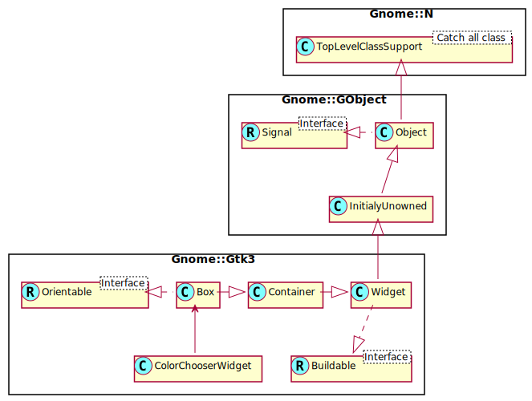

Gnome::Gtk3::ColorChooserWidget
===============================

A widget for choosing colors

Description
===========

The **Gnome::Gtk3::ColorChooserWidget** widget lets the user select a color. By default, the chooser presents a predefined palette of colors, plus a small number of settable custom colors. It is also possible to select a different color with the single-color editor. To enter the single-color editing mode, use the context menu of any color of the palette, or use the '+' button to add a new custom color.

The chooser automatically remembers the last selection, as well as custom colors.

To change the initially selected color, use `gtk_color_chooser_set_rgba()`. To get the selected color use `gtk_color_chooser_get_rgba()`.

The **Gnome::Gtk3::ColorChooserWidget** is used in the **Gnome::Gtk3::ColorChooserDialog** to provide a dialog for selecting colors.

CSS names
---------

**Gnome::Gtk3::ColorChooserWidget** has a single CSS node with name colorchooser.

See Also
--------

**Gnome::Gtk3::ColorChooserDialog**

Synopsis
========

Declaration
-----------

    unit class Gnome::Gtk3::ColorChooserWidget;
    also is Gnome::Gtk3::Box;
    also does Gnome::Gtk3::ColorChooser;

Uml Diagram
-----------

Inheriting this class
---------------------

Inheriting is done in a special way in that it needs a call from new() to get the native object created by the class you are inheriting from.

    use Gnome::Gtk3::ColorChooserWidget;

    unit class MyGuiClass;
    also is Gnome::Gtk3::ColorChooserWidget;

    submethod new ( |c ) {
      # let the Gnome::Gtk3::ColorChooserWidget class process the options
      self.bless( :GtkColorChooserWidget, |c);
    }

    submethod BUILD ( ... ) {
      ...
    }

Methods
=======

new
---

### default, no options

Create a new ColorChooserWidget object.

    multi method new ( )

### :native-object

Create a ColorChooserWidget object using a native object from elsewhere. See also **Gnome::N::TopLevelClassSupport**.

    multi method new ( N-GObject :$native-object! )

### :build-id

Create a ColorChooserWidget object using a native object returned from a builder. See also **Gnome::GObject::Object**.

    multi method new ( Str :$build-id! )

Properties
==========

show-editor
-----------

Show editor

  * **Gnome::GObject::Value** type of this property is G_TYPE_BOOLEAN

  * Parameter is readable and writable.

  * Default value is FALSE.

