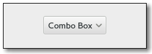

Gnome::Gtk3::ComboBox
=====================

A widget used to choose from a list of items

Description
===========

A **Gnome::Gtk3::ComboBox** is a widget that allows the user to choose from a list of valid choices. The **Gnome::Gtk3::ComboBox** displays the selected choice. When activated, the **Gnome::Gtk3::ComboBox** displays a popup which allows the user to make a new choice. The style in which the selected value is displayed, and the style of the popup is determined by the current theme. It may be similar to a Windows-style combo box.

The **Gnome::Gtk3::ComboBox** uses the model-view pattern; the list of valid choices is specified in the form of a tree model, and the display of the choices can be adapted to the data in the model by using cell renderers, as you would in a tree view. This is possible since **Gnome::Gtk3::ComboBox** implements the **Gnome::Gtk3::CellLayout** interface. The tree model holding the valid choices is not restricted to a flat list, it can be a real tree, and the popup will reflect the tree structure.

To allow the user to enter values not in the model, the “has-entry” property allows the **Gnome::Gtk3::ComboBox** to contain a **Gnome::Gtk3::Entry**. This entry can be accessed by calling `gtk_bin_get_child()` on the combo box.

For a simple list of textual choices, the model-view API of **Gnome::Gtk3::ComboBox** can be a bit overwhelming. In this case, **Gnome::Gtk3::ComboBoxText** offers a simple alternative. Both **Gnome::Gtk3::ComboBox** and **Gnome::Gtk3::ComboBoxText** can contain an entry.

Css Nodes
---------

    combobox
    ├── box.linked
    │   ╰── button.combo
    │       ╰── box
    │           ├── cellview
    │           ╰── arrow
    ╰── window.popup

A normal combobox contains a box with the .linked class, a button with the .combo class and inside those buttons, there are a cellview and an arrow.

    combobox
    ├── box.linked
    │   ├── entry.combo
    │   ╰── button.combo
    │       ╰── box
    │           ╰── arrow
    ╰── window.popup

A **Gnome::Gtk3::ComboBox** with an entry has a single CSS node with name combobox. It contains a bx with the .linked class and that box contains an entry and a button, both with the .combo class added. The button also contains another node with name arrow.

Implemented Interfaces
----------------------

Gnome::Gtk3::ComboBox implements

  * Gnome::Gtk3::CellLayout

  * Gnome::Gtk3::CellEditable

See Also
--------

**Gnome::Gtk3::ComboBoxText**, **Gnome::Gtk3::TreeModel**, **Gnome::Gtk3::CellRenderer**

Synopsis
========

Declaration
-----------

    unit class Gnome::Gtk3::ComboBox;
    also is Gnome::Gtk3::Bin;
    also does Gnome::Gtk3::Buildable;

Example
-------

Methods
=======

new
---

Create a new plain object.

    multi method new ( Bool :empty! )

Create an object using a native object from elsewhere. See also **Gnome::GObject::Object**.

    multi method new ( N-GObject :$widget! )

Create an object using a native object from a builder. See also **Gnome::GObject::Object**.

    multi method new ( Str :$build-id! )

gtk_combo_box_new
-----------------

Creates a new empty **Gnome::Gtk3::ComboBox**.

Returns: A new **Gnome::Gtk3::ComboBox**.

Since: 2.4

    method gtk_combo_box_new ( --> N-GObject  )

[gtk_combo_box_] new_with_area
------------------------------

Creates a new empty **Gnome::Gtk3::ComboBox** using *area* to layout cells.

Returns: A new **Gnome::Gtk3::ComboBox**.

    method gtk_combo_box_new_with_area ( N-GObject $area --> N-GObject  )

  * N-GObject $area; the **Gnome::Gtk3::CellArea** to use to layout cell renderers

[gtk_combo_box_] new_with_area_and_entry
----------------------------------------

Creates a new empty **Gnome::Gtk3::ComboBox** with an entry.

The new combo box will use *area* to layout cells.

Returns: A new **Gnome::Gtk3::ComboBox**.

    method gtk_combo_box_new_with_area_and_entry ( N-GObject $area --> N-GObject  )

  * N-GObject $area; the **Gnome::Gtk3::CellArea** to use to layout cell renderers

[gtk_combo_box_] new_with_entry
-------------------------------

Creates a new empty **Gnome::Gtk3::ComboBox** with an entry.

Returns: A new **Gnome::Gtk3::ComboBox**.

Since: 2.24

    method gtk_combo_box_new_with_entry ( --> N-GObject  )

[gtk_combo_box_] new_with_model
-------------------------------

Creates a new **Gnome::Gtk3::ComboBox** with the model initialized to *model*.

Returns: A new **Gnome::Gtk3::ComboBox**.

Since: 2.4

    method gtk_combo_box_new_with_model ( N-GObject $model --> N-GObject  )

  * N-GObject $model; A **Gnome::Gtk3::TreeModel**.

[gtk_combo_box_] new_with_model_and_entry
-----------------------------------------

Creates a new empty **Gnome::Gtk3::ComboBox** with an entry and with the model initialized to *model*.

Returns: A new **Gnome::Gtk3::ComboBox**

Since: 2.24

    method gtk_combo_box_new_with_model_and_entry ( N-GObject $model --> N-GObject  )

  * N-GObject $model; A **Gnome::Gtk3::TreeModel**

[gtk_combo_box_] get_wrap_width
-------------------------------

Returns the wrap width which is used to determine the number of columns for the popup menu. If the wrap width is larger than 1, the combo box is in table mode.

Returns: the wrap width.

Since: 2.6

    method gtk_combo_box_get_wrap_width ( --> Int  )

[gtk_combo_box_] set_wrap_width
-------------------------------

Sets the wrap width of *combo_box* to be *width*. The wrap width is basically the preferred number of columns when you want the popup to be layed out in a table.

Since: 2.4

    method gtk_combo_box_set_wrap_width ( Int $width )

  * Int $width; Preferred number of columns

[gtk_combo_box_] get_row_span_column
------------------------------------

Returns the column with row span information for *combo_box*.

Returns: the row span column.

Since: 2.6

    method gtk_combo_box_get_row_span_column ( --> Int  )

[gtk_combo_box_] set_row_span_column
------------------------------------

Sets the column with row span information for *combo_box* to be *row_span*. The row span column contains integers which indicate how many rows an item should span.

Since: 2.4

    method gtk_combo_box_set_row_span_column ( Int $row_span )

  * Int $row_span; A column in the model passed during construction.

[gtk_combo_box_] get_column_span_column
---------------------------------------

Returns the column with column span information for *combo_box*.

Returns: the column span column.

Since: 2.6

    method gtk_combo_box_get_column_span_column ( --> Int  )

[gtk_combo_box_] set_column_span_column
---------------------------------------

Sets the column with column span information for *combo_box* to be *column_span*. The column span column contains integers which indicate how many columns an item should span.

Since: 2.4

    method gtk_combo_box_set_column_span_column ( Int $column_span )

  * Int $column_span; A column in the model passed during construction

[gtk_combo_box_] get_active
---------------------------

Returns the index of the currently active item, or -1 if there’s no active item. If the model is a non-flat treemodel, and the active item is not an immediate child of the root of the tree, this function returns `gtk_tree_path_get_indices (path)[0]`, where `path` is the **Gnome::Gtk3::TreePath** of the active item.

Returns: An integer which is the index of the currently active item, or -1 if there’s no active item.

Since: 2.4

    method gtk_combo_box_get_active ( --> Int  )

[gtk_combo_box_] set_active
---------------------------

Sets the active item of *combo_box* to be the item at *index*.

Since: 2.4

    method gtk_combo_box_set_active ( Int $index_ )

  * Int $index_; An index in the model passed during construction, or -1 to have no active item

[gtk_combo_box_] set_model
--------------------------

Sets the model used by *combo_box* to be *model*. Will unset a previously set model (if applicable). If model is `Any`, then it will unset the model.

Note that this function does not clear the cell renderers, you have to call `gtk_cell_layout_clear()` yourself if you need to set up different cell renderers for the new model.

Since: 2.4

    method gtk_combo_box_set_model ( N-GObject $model )

  * N-GObject $model; (allow-none): A **Gnome::Gtk3::TreeModel**

[gtk_combo_box_] get_model
--------------------------

Returns the **Gnome::Gtk3::TreeModel** which is acting as data source for *combo_box*.

Returns: (transfer none): A **Gnome::Gtk3::TreeModel** which was passed during construction.

Since: 2.4

    method gtk_combo_box_get_model ( --> N-GObject  )

[gtk_combo_box_] set_button_sensitivity
---------------------------------------

Sets whether the dropdown button of the combo box should be always sensitive (`GTK_SENSITIVITY_ON`), never sensitive (`GTK_SENSITIVITY_OFF`) or only if there is at least one item to display (`GTK_SENSITIVITY_AUTO`).

Since: 2.14

    method gtk_combo_box_set_button_sensitivity ( GtkSensitivityType $sensitivity )

  * GtkSensitivityType $sensitivity; specify the sensitivity of the dropdown button

[gtk_combo_box_] get_button_sensitivity
---------------------------------------

Returns whether the combo box sets the dropdown button sensitive or not when there are no items in the model.

Returns: `GTK_SENSITIVITY_ON` if the dropdown button is sensitive when the model is empty, `GTK_SENSITIVITY_OFF` if the button is always insensitive or `GTK_SENSITIVITY_AUTO` if it is only sensitive as long as the model has one item to be selected.

Since: 2.14

    method gtk_combo_box_get_button_sensitivity ( --> GtkSensitivityType  )

[gtk_combo_box_] get_has_entry
------------------------------

Returns whether the combo box has an entry.

Returns: whether there is an entry in *combo_box*.

Since: 2.24

    method gtk_combo_box_get_has_entry ( --> Int )

[gtk_combo_box_] set_entry_text_column
--------------------------------------

Sets the model column which *combo_box* should use to get strings from to be *text_column*. The column *text_column* in the model of *combo_box* must be of type `G_TYPE_STRING`.

This is only relevant if *combo_box* has been created with *has-entry* as `1`.

Since: 2.24

    method gtk_combo_box_set_entry_text_column ( Int $text_column )

  * Int $text_column; A column in *model* to get the strings from for the internal entry

[gtk_combo_box_] get_entry_text_column
--------------------------------------

Returns the column which *combo_box* is using to get the strings from to display in the internal entry.

Returns: A column in the data source model of *combo_box*.

Since: 2.24

    method gtk_combo_box_get_entry_text_column ( --> Int  )

[gtk_combo_box_] set_popup_fixed_width
--------------------------------------

Specifies whether the popup’s width should be a fixed width matching the allocated width of the combo box.

Since: 3.0

    method gtk_combo_box_set_popup_fixed_width ( Int $fixed )

  * Int $fixed; whether to use a fixed popup width

[gtk_combo_box_] get_popup_fixed_width
--------------------------------------

Gets whether the popup uses a fixed width matching the allocated width of the combo box.

Returns: `1` if the popup uses a fixed width

Since: 3.0

    method gtk_combo_box_get_popup_fixed_width ( --> Int  )

gtk_combo_box_popup
-------------------

Pops up the menu or dropdown list of *combo_box*.

This function is mostly intended for use by accessibility technologies; applications should have little use for it.

Since: 2.4

    method gtk_combo_box_popup ( )

[gtk_combo_box_] popup_for_device
---------------------------------

Pops up the menu or dropdown list of *combo_box*, the popup window will be grabbed so only *device* and its associated pointer/keyboard are the only **Gnome::Gdk3::Devices** able to send events to it.

Since: 3.0

    method gtk_combo_box_popup_for_device ( N-GObject $device )

  * N-GObject $device; a **Gnome::Gdk3::Device**

gtk_combo_box_popdown
---------------------

Hides the menu or dropdown list of *combo_box*.

This function is mostly intended for use by accessibility technologies; applications should have little use for it.

Since: 2.4

    method gtk_combo_box_popdown ( )

[gtk_combo_box_] get_id_column
------------------------------

Returns the column which *combo_box* is using to get string IDs for values from.

Returns: A column in the data source model of *combo_box*.

Since: 3.0

    method gtk_combo_box_get_id_column ( --> Int  )

[gtk_combo_box_] set_id_column
------------------------------

Sets the model column which *combo_box* should use to get string IDs for values from. The column *id_column* in the model of *combo_box* must be of type `G_TYPE_STRING`.

Since: 3.0

    method gtk_combo_box_set_id_column ( Int $id_column )

  * Int $id_column; A column in *model* to get string IDs for values from

[gtk_combo_box_] get_active_id
------------------------------

Returns the ID of the active row of *combo_box*. This value is taken from the active row and the column specified by the *id-column* property of *combo_box* (see `gtk_combo_box_set_id_column()`).

The returned value is an interned string which means that you can compare the pointer by value to other interned strings and that you must not free it.

If the *id-column* property of *combo_box* is not set, or if no row is active, or if the active row has a `Any` ID value, then `Any` is returned.

Returns: (nullable): the ID of the active row, or `Any`

Since: 3.0

    method gtk_combo_box_get_active_id ( --> Str  )

[gtk_combo_box_] set_active_id
------------------------------

Changes the active row of *combo_box* to the one that has an ID equal to *active_id*, or unsets the active row if *active_id* is `Any`. Rows having a `Any` ID string cannot be made active by this function.

If the *id-column* property of *combo_box* is unset or if no row has the given ID then the function does nothing and returns `0`.

Returns: `1` if a row with a matching ID was found. If a `Any` *active_id* was given to unset the active row, the function always returns `1`.

Since: 3.0

    method gtk_combo_box_set_active_id ( Str $active_id --> Int  )

  * Str $active_id; (allow-none): the ID of the row to select, or `Any`

Signals
=======

There are two ways to connect to a signal. The first option you have is to use `register-signal()` from **Gnome::GObject::Object**. The second option is to use `g_signal_connect_object()` directly from **Gnome::GObject::Signal**.

First method
------------

The positional arguments of the signal handler are all obligatory as well as their types. The named attributes `:$widget` and user data are optional.

    # handler method
    method mouse-event ( GdkEvent $event, :$widget ) { ... }

    # connect a signal on window object
    my Gnome::Gtk3::Window $w .= new( ... );
    $w.register-signal( self, 'mouse-event', 'button-press-event');

Second method
-------------

    my Gnome::Gtk3::Window $w .= new( ... );
    my Callable $handler = sub (
      N-GObject $native, GdkEvent $event, OpaquePointer $data
    ) {
      ...
    }

    $w.connect-object( 'button-press-event', $handler);

Also here, the types of positional arguments in the signal handler are important. This is because both methods `register-signal()` and `g_signal_connect_object()` are using the signatures of the handler routines to setup the native call interface.

Supported signals
-----------------

### changed

The changed signal is emitted when the active item is changed. The can be due to the user selecting a different item from the list, or due to a call to `gtk_combo_box_set_active_iter()`. It will also be emitted while typing into the entry of a combo box with an entry.

Since: 2.4

    method handler (
      Gnome::GObject::Object :widget($widget),
      *%user-options
    );

  * $widget; the object which received the signal

### move-active

The *move-active* signal is a [keybinding signal][**Gnome::Gtk3::BindingSignal**] which gets emitted to move the active selection.

Since: 2.12

    method handler (
      Gnome::Gtk3::ScrollType $scroll_type,
      Gnome::GObject::Object :widget($widget),
      *%user-options
    );

  * $widget; the object that received the signal

  * $scroll_type; a **Gnome::Gtk3::ScrollType**

### popup

The *popup* signal is a [keybinding signal][**Gnome::Gtk3::BindingSignal**] which gets emitted to popup the combo box list.

The default binding for this signal is Alt+Down.

Since: 2.12

    method handler (
      Gnome::GObject::Object :widget($widget),
      *%user-options
    );

  * $widget; the object that received the signal

### popdown

The *popdown* signal is a [keybinding signal][**Gnome::Gtk3::BindingSignal**] which gets emitted to popdown the combo box list.

The default bindings for this signal are Alt+Up and Escape.

Since: 2.12

    method handler (
      Gnome::GObject::Object :widget($button),
      *%user-options
      --> Int
    );

  * $button; the object which received the signal

### format-entry-text

For combo boxes that are created with an entry (See **Gnome::Gtk3::ComboBox**:has-entry).

A signal which allows you to change how the text displayed in a combo box's entry is displayed.

Connect a signal handler which returns an allocated string representing *path*. That string will then be used to set the text in the combo box's entry. The default signal handler uses the text from the **Gnome::Gtk3::ComboBox**::entry-text-column model column.

Returns: (transfer full): a newly allocated string representing *path* for the current **Gnome::Gtk3::ComboBox** model.

Since: 3.4

    method handler (
      Str $path,
      Gnome::GObject::Object :widget($combo),
      *%user-options
      --> Unknown type G_TYPE_STRING
    );

  * $combo; the object which received the signal

  * $path; the **Gnome::Gtk3::TreePath** string from the combo box's current model to format text for

Properties
==========

An example of using a string type property of a **Gnome::Gtk3::Label** object. This is just showing how to set/read a property, not that it is the best way to do it. This is because a) The class initialization often provides some options to set some of the properties and b) the classes provide many methods to modify just those properties. In the case below one can use **new(:label('my text label'))** or **gtk_label_set_text('my text label')**.

    my Gnome::Gtk3::Label $label .= new(:empty);
    my Gnome::GObject::Value $gv .= new(:init(G_TYPE_STRING));
    $label.g-object-get-property( 'label', $gv);
    $gv.g-value-set-string('my text label');

Supported properties
--------------------

### Wrap width

If wrap-width is set to a positive value, the list will be displayed in multiple columns, the number of columns is determined by wrap-width. Since: 2.4

The **Gnome::GObject::Value** type of property *wrap-width* is `G_TYPE_INT`.

### Row span column

If this is set to a non-negative value, it must be the index of a column of type `G_TYPE_INT` in the model. The values of that column are used to determine how many rows a value in the list will span. Therefore, the values in the model column pointed to by this property must be greater than zero and not larger than wrap-width. Since: 2.4

The **Gnome::GObject::Value** type of property *row-span-column* is `G_TYPE_INT`.

### Column span column

If this is set to a non-negative value, it must be the index of a column of type `G_TYPE_INT` in the model. The values of that column are used to determine how many columns a value in the list will span. Since: 2.4

The **Gnome::GObject::Value** type of property *column-span-column* is `G_TYPE_INT`.

### Active item

The item which is currently active. If the model is a non-flat treemodel, and the active item is not an immediate child of the root of the tree, this property has the value `gtk_tree_path_get_indices (path)[0]`, where `path` is the **Gnome::Gtk3::TreePath** of the active item. Since: 2.4

The **Gnome::GObject::Value** type of property *active* is `G_TYPE_INT`.

### Has Frame

The has-frame property controls whether a frame is drawn around the entry. Since: 2.6

The **Gnome::GObject::Value** type of property *has-frame* is `G_TYPE_BOOLEAN`.

### Popup shown

Whether the combo boxes dropdown is popped up. Note that this property is mainly useful, because it allows you to connect to notify::popup-shown. Since: 2.10

The **Gnome::GObject::Value** type of property *popup-shown* is `G_TYPE_BOOLEAN`.

### Button Sensitivity

Whether the dropdown button is sensitive when the model is empty. Since: 2.14 Widget type: GTK_TYPE_SENSITIVITY_TYPE

The **Gnome::GObject::Value** type of property *button-sensitivity* is `G_TYPE_ENUM`.

### Has Entry

Whether the combo box has an entry. Since: 2.24

The **Gnome::GObject::Value** type of property *has-entry* is `G_TYPE_BOOLEAN`.

### Entry Text Column

The column in the combo box's model to associate with strings from the entry if the combo was created with *has-entry* = `1`. Since: 2.24

The **Gnome::GObject::Value** type of property *entry-text-column* is `G_TYPE_INT`.

### ID Column

The column in the combo box's model that provides string IDs for the values in the model, if != -1. Since: 3.0

The **Gnome::GObject::Value** type of property *id-column* is `G_TYPE_INT`.

### Active id

The value of the ID column of the active row. Since: 3.0

The **Gnome::GObject::Value** type of property *active-id* is `G_TYPE_STRING`.

### Popup Fixed Width

Whether the popup's width should be a fixed width matching the allocated width of the combo box. Since: 3.0

The **Gnome::GObject::Value** type of property *popup-fixed-width* is `G_TYPE_BOOLEAN`.

