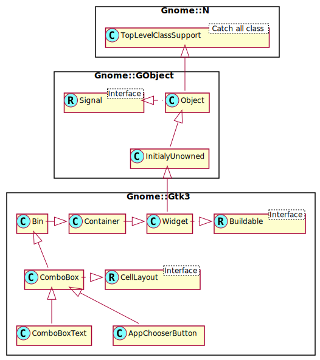

Gnome::Gtk3::ComboBoxText
=========================

A simple, text-only combo box

Description
===========

A **Gnome::Gtk3::ComboBoxText** is a simple variant of **Gnome::Gtk3::ComboBox** that hides the model-view complexity for simple text-only use cases.

To create a **Gnome::Gtk3::ComboBoxText**, use .

You can add items to a `Gnome::Gtk3::ComboBoxText` with `append-text()`, `insert_text()` or `gprepend-text()` and remove options with `remove()`.

If the **Gnome::Gtk3::ComboBoxText** contains an entry (via the “has-entry” property), its contents can be retrieved using `get-active-text()`. The entry itself can be accessed by calling `Gnome::Gtk3::Bin get-child()` on the combo box.

You should not call `Gnome::Gtk3::ComboBox set-model()` or attempt to pack more cells into this combo box via its **Gnome::Gtk3::CellLayout** interface.

Gnome::Gtk3::ComboBoxText as Gnome::Gtk3::Buildable
---------------------------------------------------

The **Gnome::Gtk3::ComboBoxText** implementation of the **Gnome::Gtk3::Buildable** interface supports adding items directly using the <items> element and specifying <item> elements for each item. Each <item> element can specify the “id” corresponding to the appended text and also supports the regular translation attributes “translatable”, “context” and “comments”.

Here is a UI definition fragment specifying `GtkComboBoxText` items:

    <object class="GtkComboBoxText">
      <items>
        <item translatable="yes" id="factory">Factory</item>
        <item translatable="yes" id="home">Home</item>
        <item translatable="yes" id="subway">Subway</item>
      </items>
    </object>

Css Nodes
---------

    combobox
    ╰── box.linked
        ├── entry.combo
        ├── button.combo
        ╰── window.popup

**Gnome::Gtk3::ComboBoxText** has a single CSS node with name combobox. It adds the style class .combo to the main CSS nodes of its entry and button children, and the .linked class to the node of its internal box.

See Also
--------

`Gnome::Gtk3::ComboBox`

Synopsis
========

Declaration
-----------

    unit class Gnome::Gtk3::ComboBoxText;
    also is Gnome::Gtk3::ComboBox;

Uml Diagram
-----------

Inheriting this class
---------------------

Inheriting is done in a special way in that it needs a call from new() to get the native object created by the class you are inheriting from.

    use Gnome::Gtk3::ComboBoxText;

    unit class MyGuiClass;
    also is Gnome::Gtk3::ComboBoxText;

    submethod new ( |c ) {
      # let the Gnome::Gtk3::ComboBoxText class process the options
      self.bless( :GtkComboBoxText, |c);
    }

    submethod BUILD ( ... ) {
      ...
    }

Example
-------

Methods
=======

new
---

### default, no options

Creates a new **Gnome::Gtk3::ComboBoxText**, which is a **Gnome::Gtk3::ComboBox** just displaying strings.

    multi method new ( )

### :entry

Creates a new **Gnome::Gtk3::ComboBoxText**, which is a **Gnome::Gtk3::ComboBox** just displaying strings. The combo box created by this function has an entry.

    multi method new ( Bool :$entry! )

  * $entry; named argument only checkd for its existence

### :native-object

Create a ComboBoxText object using a native object from elsewhere. See also **Gnome::N::TopLevelClassSupport**.

    multi method new ( N-GObject :$native-object! )

### :build-id

Create a ComboBoxText object using a native object returned from a builder. See also **Gnome::GObject::Object**.

    multi method new ( Str :$build-id! )

append
------

Appends *$text* to the list of strings stored in this combo box. If *id* is defined, then it is used as the ID of the row.

This is the same as calling `insert()` with a position of -1.

    method append ( Str $id, Str $text )

  * $id; a string ID for this value, or `undefined`

  * $text; A string

append-text
-----------

Appends *text* to the list of strings stored in this combo box.

This is the same as calling `insert_text()` with a position of -1.

    method append-text ( Str $text )

  * $text; A string

get-active-text
---------------

Returns the currently active string in this combo box, or `undefined` if none is selected. If this combo box contains an entry, this function will return its contents (which will not necessarily be an item from the list).

Returns: a newly allocated string containing the currently active text. Must be freed with `g_free()`.

    method get-active-text ( --> Str )

insert
------

Inserts *$text* at *$position* in the list of strings stored in this combo box. If *$id* is defined, then it is used as the ID of the row. See *id-column from Gnome::Gtk3::ComboBox*.

If *$position* is negative then *$text* is appended.

    method insert ( Int() $position, Str $id, Str $text )

  * $position; An index to insert *$text*

  * $id; a string ID for this value, or `undefined`

  * $text; A string to display

insert-text
-----------

Inserts *$text* at *$position* in the list of strings stored in this combo box. If *$position* is negative then *$text* is appended.

This is the same as calling `insert()` with a `undefined` ID string.

    method insert-text ( Int() $position, Str $text )

  * $position; An index to insert *text*

  * $text; A string

prepend
-------

Prepends *text* to the list of strings stored in this combo box. If *id* is defined then it is used as the ID of the row.

This is the same as calling `insert()` with a position of 0.

    method prepend ( Str $id, Str $text )

  * $id; a string ID for this value, or `undefined`

  * $text; a string

prepend-text
------------

Prepends *text* to the list of strings stored in this combo box.

This is the same as calling `insert_text()` with a position of 0.

    method prepend-text ( Str $text )

  * $text; A string

remove
------

Removes the string at *position* from this combo box.

    method remove ( Int() $position )

  * $position; Index of the item to remove

remove-all
----------

Removes all the text entries from the combo box.

    method remove-all ( )

