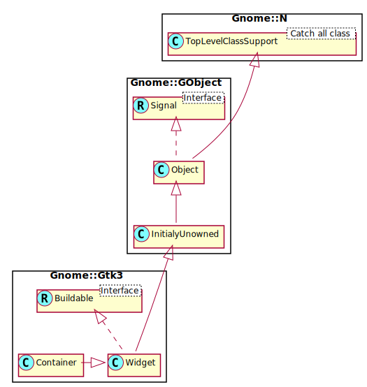

Gnome::Gtk3::Container
======================

Base class for widgets which contain other widgets

Description
===========

A GTK+ user interface is constructed by nesting widgets inside widgets. Container widgets are the inner nodes in the resulting tree of widgets: they contain other widgets. So, for example, you might have a **Gnome::Gtk3::Window** containing a **Gnome::Gtk3::Frame** containing a **Gnome::Gtk3::Label**. If you wanted an image instead of a textual label inside the frame, you might replace the **Gnome::Gtk3::Label** widget with a **Gnome::Gtk3::Image** widget.

There are two major kinds of container widgets in GTK+. Both are subclasses of the abstract **Gnome::Gtk3::Container** base class.

The first type of container widget has a single child widget and derives from **Gnome::Gtk3::Bin**. These containers are decorators, which add some kind of functionality to the child. For example, a **Gnome::Gtk3::Button** makes its child into a clickable button; a **Gnome::Gtk3::Frame** draws a frame around its child and a **Gnome::Gtk3::Window** places its child widget inside a top-level window.

The second type of container can have more than one child; its purpose is to manage layout. This means that these containers assign sizes and positions to their children. For example, a **Gnome::Gtk3::HBox** arranges its children in a horizontal row, and a **Gnome::Gtk3::Grid** arranges the widgets it contains in a two-dimensional grid.

Height for width geometry management
------------------------------------

GTK+ uses a height-for-width (and width-for-height) geometry management system. Height-for-width means that a widget can change how much vertical space it needs, depending on the amount of horizontal space that it is given (and similar for width-for-height).

There are some things to keep in mind when implementing container widgets that make use of GTK+’s height for width geometry management system. First, it’s important to note that a container must prioritize one of its dimensions, that is to say that a widget or container can only have a **Gnome::Gtk3::SizeRequestMode** that is `GTK_SIZE_REQUEST_HEIGHT_FOR_WIDTH` or `GTK_SIZE_REQUEST_WIDTH_FOR_HEIGHT`. However, every widget and container must be able to respond to the APIs for both dimensions, i.e. even if a widget has a request mode that is height-for-width, it is possible that its parent will request its sizes using the width-for-height APIs.

To ensure that everything works properly, here are some guidelines to follow when implementing height-for-width (or width-for-height) containers.

Each request mode involves 2 virtual methods. Height-for-width apis run through `gtk_widget_get_preferred_width()` and then through `gtk_widget_get_preferred_height_for_width()`. When handling requests in the opposite **Gnome::Gtk3::SizeRequestMode** it is important that every widget request at least enough space to display all of its content at all times.

When `gtk_widget_get_preferred_height()` is called on a container that is height-for-width, the container must return the height for its minimum width. This is easily achieved by simply calling the reverse apis implemented for itself.

Similarly, when `gtk_widget_get_preferred_width_for_height()` is called for a container or widget that is height-for-width, it then only needs to return the base minimum width

Height for width requests are generally implemented in terms of a virtual allocation of widgets in the input orientation. Assuming an height-for-width request mode, a container would implement the `get_preferred_height_for_width()` virtual function by first calling `gtk_widget_get_preferred_width()` for each of its children.

For each potential group of children that are lined up horizontally, the values returned by `gtk_widget_get_preferred_width()` should be collected in an array of **Gnome::Gtk3::RequestedSize** structures. Any child spacing should be removed from the input *for_width* and then the collective size should be allocated using the `gtk_distribute_natural_allocation()` convenience function.

The container will then move on to request the preferred height for each child by using `gtk_widget_get_preferred_height_for_width()` and using the sizes stored in the **Gnome::Gtk3::RequestedSize** array.

To allocate a height-for-width container, it’s again important to consider that a container must prioritize one dimension over the other. So if a container is a height-for-width container it must first allocate all widgets horizontally using a **Gnome::Gtk3::RequestedSize** array and `gtk_distribute_natural_allocation()` and then add any extra space (if and where appropriate) for the widget to expand.

After adding all the expand space, the container assumes it was allocated sufficient height to fit all of its content. At this time, the container must use the total horizontal sizes of each widget to request the height-for-width of each of its children and store the requests in a **Gnome::Gtk3::RequestedSize** array for any widgets that stack vertically (for tabular containers this can be generalized into the heights and widths of rows and columns). The vertical space must then again be distributed using `gtk_distribute_natural_allocation()` while this time considering the allocated height of the widget minus any vertical spacing that the container adds. Then vertical expand space should be added where appropriate and available and the container should go on to actually allocating the child widgets.

See [**Gnome::Gtk3::Widget**’s geometry management section](https://developer.gnome.org/gtk3/3.24/GtkWidget.html#geometry-managementgeometry-management) to learn more about implementing height-for-width geometry management for widgets.

Gnome::Gtk3::Container as Gnome::Gtk3::Buildable
------------------------------------------------

The **Gnome::Gtk3::Container** implementation of the **Gnome::Gtk3::Buildable** interface supports a <packing> element for children, which can contain multiple <property> elements that specify child properties for the child.

Since 2.16, child properties can also be marked as translatable using the same “translatable”, “comments” and “context” attributes that are usedfor regular properties.

Since 3.16, containers can have a <focus-chain> element containing multiple <widget> elements, one for each child that should be added to the focus chain. The ”name” attribute gives the id of the widget.

An example of these properties in UI definitions:

    <object class="GtkBox>">
      <child>
        <object class="GtkEntry>" id="entry1"/>
        <packing>
          <property name="pack-type">start</property>
        </packing>
      </child>
      <child>
        <object class="GtkEntry>" id="entry2"/>
      </child>
      <focus-chain>
        <widget name="entry1"/>
        <widget name="entry2"/>
      </focus-chain>
    </object>

Synopsis
========

Declaration
-----------

    unit class Gnome::Gtk3::Container;
    also is Gnome::Gtk3::Widget;

Uml Diagram
-----------

Methods
=======

new
---

### multi method new ( N-GObject :$native-object! )

Create an object using a native object from elsewhere. See also **Gnome::GObject::Object**.

### multi method new ( Str :$build-id! )

Create an object using a native object from a builder. See also **Gnome::GObject::Object**.

add
---

Adds *$widget* to this container. Typically used for simple containers such as **Gnome::Gtk3::Window**, **Gnome::Gtk3::Frame**, or **Gnome::Gtk3::Button**; for more complicated layout containers such as **Gnome::Gtk3::Box** or **Gnome::Gtk3::Grid**, this function will pick default packing parameters that may not be correct. So consider functions such as `Gnome::Gtk3::Box.pack-start()` and `Gnome::Gtk3::Grid.attach()` as an alternative to `add()` in those cases. A widget may be added to only one container at a time; you can’t place the same widget inside two different containers.

Note that some containers, such as **Gnome::Gtk3::ScrolledWindow** or **Gnome::Gtk3::ListBox**, may add intermediate children between the added widget and the container.

    method add ( N-GObject() $widget )

  * $widget; a widget to be placed inside this container

child-get-property
------------------

Gets the value of a child property for *child* and this container.

    method child-get-property (
      N-GObject() $child, Str $property-name, $property-type
      --> Gnome::GObject::Value
    )

  * $child; a widget which is a child of this container.

  * $property-name; the name of the property to get.

  * The type for the return value, e.g. G_TYPE_INT32. See also **Gnome::GObject::Type**.

### Example

The **Gnome::Gtk3::Fixed** can contain widgets at fixed locations. The locations of each widget can be asked for using this call.

    my Gnome::Gtk3::Fixed $f .= new;
    my Gnome::Gtk3::Button $b .= new(:label<Some Button On The Fixed Field>);
    $f.put( $b, 10, 10);

    # somewhat later
    my Int $x = $f.child-get-property( $b, 'x', G_TYPE_INT).get-int;
    my Int $y = $f.child-get-property( $b, 'y', G_TYPE_INT).get-int;

    say "Widget is at ($x, $y)";

foreach
-------

Invokes a callback method on each child of this container. For all practical purposes, this function should iterate over precisely those child widgets that were added to the container by the application with explicit `add()` calls.

    method foreach (
      Any:D $callback-object, Str:D $callback-name, *%user-options
    )

  * $callback-object; An object where the callback method is defined

  * $callback-name; method name of the callback.

  * %user-options; A list of named arguments which are provided to the callback.

### Example

An example from the `t/Container.t` test program where both methods are used;

    class X {
      method cb2 ( Gnome::Gtk3::Label() $rk, :$label ) {
        is $rk.get-name, 'GtkLabel', '.foreach(): cb2()';
        is $rk.get-text, $label, 'label text';
      }

      method cb3 ( N-GObject $o, Str :$label ) {
        is $o.().get-name, 'GtkLabel', '.foreach(): cb3()';
        is $o.().get-text, $label, 'label text';
      }
    }

    $b .= new(:label<some-text>);
    $b.foreach( X.new, 'cb2', :label<some-text>);
    $b.foreach( X.new, 'cb3', :label<some-text>);

get-border-width
----------------

Retrieves the border width of the container. See `set-border-width()`.

Returns: the current border width

    method get-border-width ( --> UInt )

get-children
------------

Returns the container’s non-internal children. See `forall()` for details on what constitutes an "internal" child.

Returns: a newly-allocated list of the container’s non-internal children.

    method get-children ( --> N-GList )

get-focus-child
---------------

Returns the current focus child widget inside this container. This is not the currently focused widget. That can be obtained by calling `Gnome::Gtk3::Window.get-focus()`.

Returns: The child widget which will receive the focus inside this container when the this container is focused, or `undefined` if none is set.

    method get-focus-child ( --> N-GObject )

get-focus-hadjustment
---------------------

Retrieves the horizontal focus adjustment for the container. See `set-focus-hadjustment()`.

Returns: the horizontal focus adjustment, or `undefined` if none has been set.

    method get-focus-hadjustment ( --> N-GObject )

get-focus-vadjustment
---------------------

Retrieves the vertical focus adjustment for the container. See `set-focus-vadjustment()`.

Returns: the vertical focus adjustment, or `undefined` if none has been set. It is a native object for **Gnome::Gtk3::Adjustment**.

    method get-focus-vadjustment ( --> N-GObject )

get-path-for-child
------------------

Returns a newly created widget path representing all the widget hierarchy from the toplevel down to and including *child*.

Returns: A native object for **Gnome::Gtk3::WidgetPath**

    method get-path-for-child ( N-GObject() $child --> N-GObject )

  * $child; a child of this container

propagate-draw
--------------

When a container receives a call to the draw function, it must send synthetic *draw* calls to all children that don’t have their own **Gnome::Gtk3::Windows**. This function provides a convenient way of doing this. A container, when it receives a call to its *draw* function, calls `propagate-draw()` once for each child, passing in the *cr* the container received.

`gtk-container-propagate-draw()` takes care of translating the origin of *cr*, and deciding whether the draw needs to be sent to the child. It is a convenient and optimized way of getting the same effect as calling `gtk-widget-draw()` on the child directly.

In most cases, a container can simply either inherit the *draw* implementation from **Gnome::Gtk3::Container**, or do some drawing and then chain to the *draw* implementation from **Gnome::Gtk3::Container**.

    method propagate-draw ( N-GObject() $child, cairo_t $cr )

  * $child; a child of this container

  * $cr; Cairo context as passed to the container. If you want to use *cr* in container’s draw function, consider using `cairo-save()` and `cairo-restore()` before calling this function.

remove
------

Removes *widget* from this container. *widget* must be inside this container. Note that this container will own a reference to *widget*, and that this may be the last reference held; so removing a widget from its container can destroy that widget. If you want to use *widget* again, you need to add a reference to it before removing it from a container, using `g-object-ref()`. If you don’t want to use *widget* again it’s usually more efficient to simply destroy it directly using `gtk-widget-destroy()` since this will remove it from the container and help break any circular reference count cycles.

    method remove ( N-GObject() $widget )

  * $widget; a current child of this container

set-border-width
----------------

Sets the border width of the container.

The border width of a container is the amount of space to leave around the outside of the container. The only exception to this is **Gnome::Gtk3::Window**; because toplevel windows can’t leave space outside, they leave the space inside. The border is added on all sides of the container. To add space to only one side, use a specific *margin* property on the child widget, for example *margin-top*.

    method set-border-width ( UInt $border_width )

  * $border_width; amount of blank space to leave outside the container. Valid values are in the range 0-65535 pixels.

set-focus-child
---------------

Sets, or unsets if *child* is `undefined`, the focused child of this container.

This function emits the GtkContainer::set-focus-child signal of this container. Implementations of **Gnome::Gtk3::Container** can override the default behaviour by overriding the class closure of this signal.

This is function is mostly meant to be used by widgets. Applications can use `gtk-widget-grab-focus()` to manually set the focus to a specific widget.

    method set-focus-child ( N-GObject() $child )

  * $child; a **Gnome::Gtk3::Widget**, or `undefined`

set-focus-hadjustment
---------------------

Hooks up an adjustment to focus handling in a container, so when a child of the container is focused, the adjustment is scrolled to show that widget. This function sets the horizontal alignment. See `gtk-scrolled-window-get-hadjustment()` for a typical way of obtaining the adjustment and `set-focus-vadjustment()` for setting the vertical adjustment.

The adjustments have to be in pixel units and in the same coordinate system as the allocation for immediate children of the container.

    method set-focus-hadjustment ( N-GObject() $adjustment )

  * $adjustment; an adjustment which should be adjusted when the focus is moved among the descendents of this container

set-focus-vadjustment
---------------------

Hooks up an adjustment to focus handling in a container, so when a child of the container is focused, the adjustment is scrolled to show that widget. This function sets the vertical alignment. See `gtk-scrolled-window-get-vadjustment()` for a typical way of obtaining the adjustment and `set-focus-hadjustment()` for setting the horizontal adjustment.

The adjustments have to be in pixel units and in the same coordinate system as the allocation for immediate children of the container.

    method set-focus-vadjustment ( N-GObject() $adjustment )

  * $adjustment; an adjustment which should be adjusted when the focus is moved among the descendents of this container

Signals
=======

add
---

    method handler (
      N-GObject #`{ native widget } $n-widget,
      Gnome::Gtk3::Container :_widget($container),
      Int :$_handler-id,
      N-GObject :$_native-object,
      *%user-options
    )

  * $n-widget; the added widget

  * $container; The instance which registered the signal

  * $_handler-id; The handler id which is returned from the registration

  * $_native-object; The native object provided by the caller wrapped in the Raku object.

  * %user-options; A list of named arguments provided at the `register-signal()` method

check-resize
------------

    method handler (
      Gnome::Gtk3::Container :_widget($container),
      Int :$_handler-id,
      N-GObject :$_native-object,
      *%user-options
    )

  * $container; The instance which registered the signal

  * $_handler-id; The handler id which is returned from the registration

  * $_native-object; The native object provided by the caller wrapped in the Raku object.

  * %user-options; A list of named arguments provided at the `register-signal()` method

remove
------

    method handler (
      N-GObject #`{ native widget } $n-widget,
      Gnome::Gtk3::Container :_widget($container),
      Int :$_handler-id,
      N-GObject :$_native-object,
      *%user-options
    )

  * $n-widget; The removed widget

  * $container; The instance which registered the signal

  * $_handler-id; The handler id which is returned from the registration

  * $_native-object; The native object provided by the caller wrapped in the Raku object.

  * %user-options; A list of named arguments provided at the `register-signal()` method

set-focus-child
---------------

    method handler (
      N-GObject #`{ native widget } $widget,
      Gnome::Gtk3::Container :_widget($container),
      Int :$_handler-id,
      N-GObject :$_native-object,
      *%user-options
    )

  * $widget; The focussed child

  * $container; The instance which registered the signal

  * $_handler-id; The handler id which is returned from the registration

  * $_native-object; The native object provided by the caller wrapped in the Raku object.

  * %user-options; A list of named arguments provided at the `register-signal()` method

Properties
==========

border-width
------------

The width of the empty border outside the containers children

  * **Gnome::GObject::Value** type of this property is G_TYPE_UINT

  * Parameter is readable and writable.

  * Minimum value is 0.

  * Maximum value is 65535.

  * Default value is 0.

