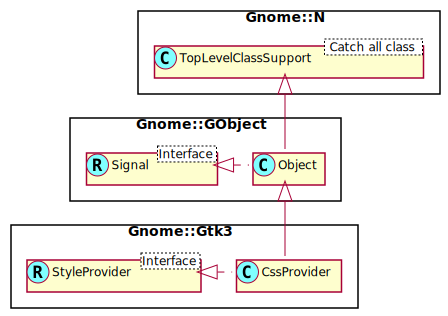

Gnome::Gtk3::CssProvider
========================

CSS-like styling for widgets

Description
===========

**Gnome::Gtk3::CssProvider** is an object implementing the **Gnome::Gtk3::StyleProvider** interface. It is able to parse [CSS-like](https://developer-old.gnome.org/gtk3/3.24/chap-css-overview.html#css-overview) input in order to style widgets.

An application can make GTK+ parse a specific CSS style sheet by calling `load_from_file()` or `load_from_resource()` and adding the provider with `Gnome::Gtk3::StyleContext.add_provider()` or `Gnome::Gtk3::StyleContext.add_provider_for_screen()`.

In addition, certain files will be read when GTK+ is initialized. First, the file `$XDG_CONFIG_HOME/gtk-3.0/gtk.css` is loaded if it exists. Then, GTK+ loads the first existing file among `$XDG_DATA_HOME/themes/theme-name/gtk-VERSION/gtk.css`, `$HOME/.themes/theme-name/gtk-VERSION/gtk.css`, `$XDG_DATA_DIRS/themes/theme-name/gtk-VERSION/gtk.css` and `DATADIR/share/themes/THEME/gtk-VERSION/gtk.css`, where `THEME` is the name of the current theme (see the prop [gtk-theme-name](https://developer-old.gnome.org/gtk3/stable/GtkSettings.html#GtkSettings--gtk-theme-name) setting), `DATADIR` is the prefix configured when GTK+ was compiled (unless overridden by the `GTK_DATA_PREFIX` environment variable), and `VERSION` is the GTK+ version number. If no file is found for the current version, GTK+ tries older versions all the way back to 3.0.

In the same way, GTK+ tries to load a `gtk-keys.css` file for the current key theme, as defined by prop [gtk-key-theme-name](https://developer-old.gnome.org/gtk3/stable/GtkSettings.html#GtkSettings--gtk-key-theme-name) setting.

See Also
--------

**Gnome::Gtk3::StyleContext**, **Gnome::Gtk3::StyleProvider**

Synopsis
========

Declaration
-----------

    unit class Gnome::Gtk3::CssProvider;
    also is Gnome::GObject::Object;
    also does Gnome::Gtk3::StyleProvider;

Uml Diagram
-----------

Types
=====

enum GtkCssProviderError
------------------------

Error codes for `GTK_CSS_PROVIDER_ERROR`.

  * GTK_CSS_PROVIDER_ERROR_FAILED: Failed.

  * GTK_CSS_PROVIDER_ERROR_SYNTAX: Syntax error.

  * GTK_CSS_PROVIDER_ERROR_IMPORT: Import error.

  * GTK_CSS_PROVIDER_ERROR_NAME: Name error.

  * GTK_CSS_PROVIDER_ERROR_DEPRECATED: Deprecation error.

  * GTK_CSS_PROVIDER_ERROR_UNKNOWN_VALUE: Unknown value.

Methods
=======

new
---

### default, no options

Create a new CssProvider object.

    multi method new ( )

### :named

Loads a theme from the usual theme paths

Creates a CssProvider> with the theme loaded. This memory is owned by GTK+, and you must not free it.

    method new( Str :$name!, Str :$variant? )

  * $name; A theme name like 'Breeze' or 'Oxygen'.

  * $variant; variant to load, for example, 'dark'.

### :native-object

Create a CssProvider object using a native object from elsewhere. See also **Gnome::N::TopLevelClassSupport**.

    multi method new ( N-GObject :$native-object! )

### :build-id

Create a CssProvider object using a native object returned from a builder. See also **Gnome::GObject::Object**.

    multi method new ( Str :$build-id! )

error-quark
-----------

Return the domain code of the builder error domain.

    method error-quark ( --> UInt )

load-from-data
--------------

Loads *data* into *css-provider*, and by doing so clears any previously loaded information.

Returns: Gnome::Glib::Error. Test `.is-valid()` of that object to see if there was an error.

A way to track errors while loading CSS is to connect to the sig `parsing-error` signal.

    method load-from-data ( Str $data --> Gnome::Glib::Error )

  * $data; CSS data loaded in memory

load-from-file
--------------

Loads the data contained in *file* into *css-provider*, making it clear any previously loaded information.

Returns: Gnome::Glib::Error. Test `.is-valid()` of that object to see if there was an error.

    method load-from-file ( N-GObject() $file --> Gnome::Glib::Error )

  * $file; a **Gnome::Gio::File** pointing to a file to load

load-from-path
--------------

Loads the data contained in *path* into *css-provider*, making it clear any previously loaded information.

Returns: Gnome::Glib::Error. Test `.is-valid()` of that object to see if there was an error.

    method load-from-path ( Str $path --> Gnome::Glib::Error )

  * $path; the path of a filename to load, in the GLib filename encoding

load-from-resource
------------------

Loads the data contained in the resource at *resource-path* into the **Gnome::Gtk3::CssProvider**, clearing any previously loaded information.

To track errors while loading CSS, connect to the *parsing-error* signal.

    method load-from-resource ( Str $resource_path )

  * $resource_path; a **Gnome::Gtk3::Resource** resource path

to-string
---------

Converts the *provider* into a string representation in CSS format.

Using `load-from-data()` with the return value from this function on a new provider created with `new()` will basically create a duplicate of this *provider*.

Returns: a new string representing the *provider*.

    method to-string ( --> Str )

Signals
=======

### parsing-error

Signals that a parsing error occurred. the *path*, *line* and *position* describe the actual location of the error as accurately as possible.

Parsing errors are never fatal, so the parsing will resume after the error. Errors may however cause parts of the given data or even all of it to not be parsed at all. So it is a useful idea to check that the parsing succeeds by connecting to this signal.

Note that this signal may be emitted at any time as the css provider may opt to defer parsing parts or all of the input to a later time than when a loading function was called.

    method handler (
      N-GObject $section,
      N-GError $error,
      Int :$_handle_id,
      Gnome::GObject::Object :_widget($provider),
      *%user-options
    );

  * $section; section the error happened in, a native **Gnome::Gtk3::Section**.

  * $error; the parsing error.

  * $provider; the provider that had a parsing error.

  * $_handle_id; the registered event handler id.

  * $_native-object; The native object provided by the caller wrapped in the Raku object.

  * %user-options; A list of named arguments provided at the `register-signal()` method

