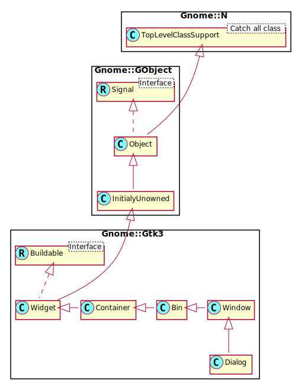

Gnome::Gtk3::Dialog
===================

Create popup windows

Description
===========

Dialog boxes are a convenient way to prompt the user for a small amount of input, e.g. to display a message, ask a question, or anything else that does not require extensive effort on the user’s part.

GTK+ treats a dialog as a window split vertically. The top section is a VBox, and is where widgets such as a **Gnome::Gtk3::Label** or a be packed. The bottom area is known as the “action area”. This is generally used for packing buttons into the dialog which may perform functions such as cancel, ok, or apply.

**Gnome::Gtk3::Dialog** boxes are created with a call to `.new()` or `.new(:$title)`. `.new(:$title)` is recommended; it allows you to set the dialog title, some convenient flags (with `:$flags`), and add simple buttons (with `:$buttons`).

If “dialog” is a newly created dialog, the two primary areas of the window can be accessed through `gtk_dialog_get_content_area()` and `gtk_dialog_get_action_area()`, as can be seen from the example below.

A “modal” dialog (that is, one which freezes the rest of the application from user input), can be created by calling `gtk_window_set_modal()` on the dialog. Use the `GTK_WINDOW()` macro to cast the widget returned from `gtk_dialog_new()` into a **Gnome::Gtk3::Window**. When using `gtk_dialog_new_with_buttons()` you can also pass the **GTK_DIALOG_MODAL** flag to make a dialog modal.

If you add buttons to **Gnome::Gtk3::Dialog** using `.new(:$buttons)`, `gtk_dialog_add_button()`, `gtk_dialog_add_buttons()`, or `gtk_dialog_add_action_widget()`, clicking the button will emit a signal called *response* with a response ID that you specified. GTK+ will never assign a meaning to positive response IDs; these are entirely user-defined. But for convenience, you can use the response IDs in the **Gnome::Gtk3::ResponseType** enumeration (these all have values less than zero). If a dialog receives a delete event, the *response* signal will be emitted with a response ID of **GTK_RESPONSE_DELETE_EVENT**.

If you want to block waiting for a dialog to return before returning control flow to your code, you can call `run()`. This function enters a recursive main loop and waits for the user to respond to the dialog, returning the response ID corresponding to the button the user clicked.

For the simple dialog in the following example, in reality you’d probably use **Gnome::Gtk3::MessageDialog** to save yourself some effort. But you’d need to create the dialog contents manually if you had more than a simple message in the dialog.

An example for simple **Gnome::Gtk3::Dialog** usage:

    method quick-message ( Gnome::Gtk3::Window $parent, Str $message ) {

      my Gnome::Gtk3::Dialog $dialog .= new(
        :title<Message>, :$parent, :flags(GTK_DIALOG_DESTROY_WITH_PARENT),
        :button-spec( "Ok", GTK_RESPONSE_NONE)
      );

      my $content-area = $dialog.get-content-area;
      my Gnome::Gtk3::Label $label .= new(:label($message));
      $dialog.gtk_container_add($label);

      # Show the dialog. After return (Ok pressed) the dialog widget
      # is destroyed. show-all() must be called, otherwise the message
      # will not be seen.
      $dialog.show-all;
      $dialog.gtk-dialog-run;
      $dialog.gtk_widget_destroy;
    }

Gnome::Gtk3::Dialog as Gnome::Gtk3::Buildable
---------------------------------------------

The **Gnome::Gtk3::Dialog** implementation of the **Gnome::Gtk3::Buildable** interface exposes the *vbox* and *action_area* as internal children with the names “vbox” and “action_area”.

**Gnome::Gtk3::Dialog** supports a custom <action-widgets> element, which can contain multiple <action-widget> elements. The “response” attribute specifies a numeric response, and the content of the element is the id of widget (which should be a child of the dialogs *action_area*). To mark a response as default, set the “default“ attribute of the <action-widget> element to true.

**Gnome::Gtk3::Dialog** supports adding action widgets by specifying “action“ as the “type“ attribute of a <child> element. The widget will be added either to the action area or the headerbar of the dialog, depending on the “use-header-bar“ property. The response id has to be associated with the action widget using the <action-widgets> element.

An example of a dialog UI definition fragment:

    <object class="GtkDialog" id="dialog1">
      <child type="action">
        <object class="GtkButton" id="button_cancel"/>
      </child>
      <child type="action">
        <object class="GtkButton" id="button_ok">
          <property name="can-default">True</property>
        </object>
      </child>
      <action-widgets>
        <action-widget response="cancel">button_cancel</action-widget>
        <action-widget response="ok" default="true">button_ok</action-widget>
      </action-widgets>
    </object>

See Also
--------

**Gnome::Gtk3::Window**, **Gnome::Gtk3::Button**

Synopsis
========

Declaration
-----------

    unit class Gnome::Gtk3::Dialog;
    also is Gnome::Gtk3::Window;

Uml Diagram
-----------

Inheriting this class
---------------------

Inheriting is done in a special way in that it needs a call from new() to get the native object created by the class you are inheriting from.

    use Gnome::Gtk3::Dialog;

    unit class MyGuiClass;
    also is Gnome::Gtk3::Dialog;

    submethod new ( |c ) {
      # let the Gnome::Gtk3::Dialog class process the options
      self.bless( :GtkDialog, |c);
    }

    submethod BUILD ( ... ) {
      ...
    }

Example
-------

    my Gnome::Gtk3::Dialog $dialog .= new(:build-id<simple-dialog>);

    # show the dialog
    my Int $response = $dialog.gtk-dialog-run;
    if $response == GTK_RESPONSE_ACCEPT {
      …
    }

Types
=====

enum GtkDialogFlags
-------------------

Flags used to influence dialog construction.

  * GTK_DIALOG_MODAL: Make the constructed dialog modal, see `gtk_window_set_modal()`

  * GTK_DIALOG_DESTROY_WITH_PARENT: Destroy the dialog when its parent is destroyed, see `gtk_window_set_destroy_with_parent()`

  * GTK_DIALOG_USE_HEADER_BAR: Create dialog with actions in header bar instead of action area. Since 3.12.

enum GtkResponseType
--------------------

Predefined values for use as response ids in `gtk_dialog_add_button()`. All predefined values are negative; GTK+ leaves values of 0 or greater for application-defined response ids.

  * GTK_RESPONSE_NONE: Returned if an action widget has no response id, or if the dialog gets programmatically hidden or destroyed

  * GTK_RESPONSE_REJECT: Generic response id, not used by GTK+ dialogs

  * GTK_RESPONSE_ACCEPT: Generic response id, not used by GTK+ dialogs

  * GTK_RESPONSE_DELETE_EVENT: Returned if the dialog is deleted

  * GTK_RESPONSE_OK: Returned by OK buttons in GTK+ dialogs

  * GTK_RESPONSE_CANCEL: Returned by Cancel buttons in GTK+ dialogs

  * GTK_RESPONSE_CLOSE: Returned by Close buttons in GTK+ dialogs

  * GTK_RESPONSE_YES: Returned by Yes buttons in GTK+ dialogs

  * GTK_RESPONSE_NO: Returned by No buttons in GTK+ dialogs

  * GTK_RESPONSE_APPLY: Returned by Apply buttons in GTK+ dialogs

  * GTK_RESPONSE_HELP: Returned by Help buttons in GTK+ dialogs

Methods
=======

new
---

### default, no options

Create a new plain object.

    multi method new ( )

### :title, :parent, :flags, :buttons-spec

Creates a new **Gnome::Gtk3::Dialog** with title *title* (or `undefined` for the default title; see `Gnome::Gtk3::Window.set-title()`) and transient parent *parent* (or `undefined` for none; see `Gnome::Gtk3::Window.set-transient-for()`).

The *flags* argument can be used to make the dialog modal (`GTK-DIALOG-MODAL`) and/or to have it destroyed along with its transient parent (`GTK-DIALOG-DESTROY-WITH-PARENT`). After *flags*, button text/response ID pairs should be listed.

Button text can be arbitrary text. A response ID can be any positive number, or one of the values in the `GtkResponseType` enumeration.

If the user clicks one of these dialog buttons, **Gnome::Gtk3::Dialog** will emit the *response* signal with the corresponding response ID. If a **Gnome::Gtk3::Dialog** receives the *delete-event* signal, it will emit *response* with a response ID of `GTK-RESPONSE-DELETE-EVENT`. However, destroying a dialog does not emit the *response* signal; so be careful relying on *response* when using the `GTK-DIALOG-DESTROY-WITH-PARENT` flag. Buttons are from left to right, so the first button in the list will be the leftmost button in the dialog.

    multi method new (
      Str :$title!, Gnome::GObject::Object :$parent = N-GObject,
      Int :$flags = 0, List :$buttons-spec
    )

  * Str $title; Title of the dialog, or `undefined`.

  * N-GObject $parent; Transient parent of the dialog, or `undefined`.

  * GtkDialogFlags $flags; from **Gnome::Gtk3::DialogFlags**.

  * List $buttons-spec; A list of alternating names and response codes i.e. an `Str` text for the first button then an `Int` response ID for first button, then additional buttons if any.

### :native-object

Create a Dialog object using a native object from elsewhere. See also **Gnome::N::TopLevelClassSupport**.

    multi method new ( N-GObject :$native-object! )

### :build-id

Create a Dialog object using a native object returned from a builder. See also **Gnome::GObject::Object**.

    multi method new ( Str :$build-id! )

add-action-widget
-----------------

Adds an activatable widget to the action area of a **Gnome::Gtk3::Dialog**, connecting a signal handler that will emit the *response* signal on the dialog when the widget is activated. The widget is appended to the end of the dialog’s action area.

    method add-action-widget ( N-GObject $child, Int() $response_id )

  * N-GObject $child; an activatable widget

  * Int() $response_id; response ID for *child*

add-button
----------

Adds a button with the given text and sets things up so that clicking the button will emit the *response* signal with the given *response-id*. The button is appended to the end of the dialog’s action area. The button widget is returned, but usually you don’t need it.

Returns: the **Gnome::Gtk3::Button** widget that was added

    method add-button ( Str $button_text, Int() $response_id --> N-GObject )

  * Str $button_text; text of button

  * Int() $response_id; response ID for the button

get-content-area, get-content-area-rk
-------------------------------------

Returns the content area of *dialog*.

Returns: (type Gtk.Box) : the content area **Gnome::Gtk3::Box**.

    method get-content-area ( --> N-GObject )
    method get-content-area ( --> Gnome::Gtk3::Box )

get-header-bar, get-header-bar-rk
---------------------------------

Returns the header bar of *dialog*. Note that the headerbar is only used by the dialog if the *use-header-bar* property is `True`.

Returns: the header bar

    method get-header-bar ( --> N-GObject )
    method get-header-bar-rk ( --> Gnome::Gtk3::HeaderBar )

get-response-for-widget
-----------------------

Gets the response id of a widget in the action area of a dialog.

Returns: the response id of *widget*, or `GTK_RESPONSE_NONE` if *widget* doesn’t have a response id set.

    method get-response-for-widget ( N-GObject $widget --> Int )

  * N-GObject $widget; a widget in the action area of *dialog*

get-widget-for-response
-----------------------

Gets the widget button that uses the given response ID in the action area of a dialog.

Returns: the *widget* button that uses the given *response-id*, or `undefined`.

    method get-widget-for-response ( Int() $response_id --> N-GObject )

  * Int() $response_id; the response ID used by the *dialog* widget

response
--------

Emits the *response* signal with the given response ID. Used to indicate that the user has responded to the dialog in some way; typically either you or `run()` will be monitoring the *response* signal and take appropriate action.

    method response ( Int() $response_id )

  * Int() $response_id; response ID

run
---

Blocks in a recursive main loop until the *dialog* either emits the *response* signal, or is destroyed. If the dialog is destroyed during the call to `run()`, `gtk-dialog-run()` returns **Gnome::Gtk3::TK-RESPONSE-NONE**. Otherwise, it returns the response ID from the *response* signal emission.

Before entering the recursive main loop, `gtk-dialog-run()` calls `gtk-widget-show()` on the dialog for you. Note that you still need to show any children of the dialog yourself.

During `gtk-dialog-run()`, the default behavior of *delete-event* is disabled; if the dialog receives *delete-event*, it will not be destroyed as windows usually are, and `gtk-dialog-run()` will return **Gnome::Gtk3::TK-RESPONSE-DELETE-EVENT**. Also, during `gtk-dialog-run()` the dialog will be modal. You can force `gtk-dialog-run()` to return at any time by calling `gtk-dialog-response()` to emit the *response* signal. Destroying the dialog during `gtk-dialog-run()` is a very bad idea, because your post-run code won’t know whether the dialog was destroyed or not.

After `gtk-dialog-run()` returns, you are responsible for hiding or destroying the dialog if you wish to do so.

Typical usage of this function might be: |[<!-- language="C" --> GtkWidget *dialog = `gtk-dialog-new()`; // Set up dialog...

int result = gtk-dialog-run (GTK-DIALOG (dialog)); switch (result) { case GTK-RESPONSE-ACCEPT: // `do-application-specific-something()`; break; default: // `do-nothing-since-dialog-was-cancelled()`; break; } gtk-widget-destroy (dialog); ]|

Note that even though the recursive main loop gives the effect of a modal dialog (it prevents the user from interacting with other windows in the same window group while the dialog is run), callbacks such as timeouts, IO channel watches, DND drops, etc, will be triggered during a `gtk-dialog-run()` call.

Returns: response ID

    method run ( --> Int )

set-default-response
--------------------

Sets the last widget in the dialog’s action area with the given *response-id* as the default widget for the dialog. Pressing “Enter” normally activates the default widget.

    method set-default-response ( Int() $response_id )

  * Int() $response_id; a response ID

set-response-sensitive
----------------------

Calls `gtk-widget-set-sensitive (widget, *setting*)` for each widget in the dialog’s action area with the given *response-id*. A convenient way to sensitize/desensitize dialog buttons.

    method set-response-sensitive ( Int() $response_id, Bool $setting )

  * Int() $response_id; a response ID

  * Bool $setting; `True` for sensitive

Signals
=======

There are two ways to connect to a signal. The first option you have is to use `register-signal()` from **Gnome::GObject::Object**. The second option is to use `connect-object()` directly from **Gnome::GObject::Signal**.

First method
------------

The positional arguments of the signal handler are all obligatory as well as their types. The named attributes `:$widget` and user data are optional.

    # handler method
    method mouse-event ( GdkEvent $event, :$widget ) { ... }

    # connect a signal on window object
    my Gnome::Gtk3::Window $w .= new( ... );
    $w.register-signal( self, 'mouse-event', 'button-press-event');

Second method
-------------

    my Gnome::Gtk3::Window $w .= new( ... );
    my Callable $handler = sub (
      N-GObject $native, GdkEvent $event, OpaquePointer $data
    ) {
      ...
    }

    $w.connect-object( 'button-press-event', $handler);

Also here, the types of positional arguments in the signal handler are important. This is because both methods `register-signal()` and `connect-object()` are using the signatures of the handler routines to setup the native call interface.

Supported signals
-----------------

### close

The *close* signal is a [keybinding signal][GtkBindingSignal] which gets emitted when the user uses a keybinding to close the dialog.

The default binding for this signal is the Escape key.

    method handler (
      ,
      *%user-options
    );

  * $_handle_id; the registered event handler id

### response

Emitted when an action widget is clicked, the dialog receives a delete event, or the application programmer calls `response()`. On a delete event, the response ID is **Gnome::Gtk3::TK-RESPONSE-DELETE-EVENT**. Otherwise, it depends on which action widget was clicked.

    method handler (
      Int $response_id,
      Int :$_handle_id,
      Gnome::GObject::Object :_widget($dialog),
      *%user-options
    );

  * $dialog; the object on which the signal is emitted

  * $response_id; the response ID

  * $_handle_id; the registered event handler id

Properties
==========

An example of using a string type property of a **Gnome::Gtk3::Label** object. This is just showing how to set/read a property, not that it is the best way to do it. This is because a) The class initialization often provides some options to set some of the properties and b) the classes provide many methods to modify just those properties. In the case below one can use **new(:label('my text label'))** or **.set-text('my text label')**.

    my Gnome::Gtk3::Label $label .= new;
    my Gnome::GObject::Value $gv .= new(:init(G_TYPE_STRING));
    $label.get-property( 'label', $gv);
    $gv.set-string('my text label');

Supported properties
--------------------

### Content area border: content-area-border

The default border width used around the content area of the dialog, as returned by `get-content-area()`, unless `gtk-container-set-border-width()` * was called on that widget directly. The **Gnome::GObject::Value** type of property *content-area-border* is `G_TYPE_INT`.

