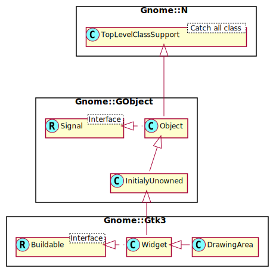

Gnome::Gtk3::DrawingArea
========================

A widget for custom user interface elements

Description
===========

The **Gnome::Gtk3::DrawingArea** widget is used for creating custom user interface elements. It’s essentially a blank widget; you can draw on it. After creating a drawing area, the application may want to connect to:

  * Mouse and button press signals to respond to input from the user. (Use `Gnome::Gtk3::Widget.add_events()` to enable events you wish to receive.)

  * The *realize* signal to take any necessary actions when the widget is instantiated on a particular display. (Create GDK resources in response to this signal.)

  * The *size-allocate* signal to take any necessary actions when the widget changes size.

  * The *draw* signal to handle redrawing the contents of the widget.

The following code portion demonstrates using a drawing area to display a circle in the normal widget foreground color.

Note that GDK automatically clears the exposed area before sending the expose event, and that drawing is implicitly clipped to the exposed area. If you want to have a theme-provided background, you need to call `Gnome::Gtk3::StyleContext.render_background()` in your *draw* method.

Simple **Gnome::Gtk3::DrawingArea** usage
-----------------------------------------

    class DA {
      method draw-callback (
        cairo_t $cr-no, Gnome::Gtk3::DrawingArea _widget($area) --> gboolean
      ) {
        my UInt ( $width, $height);
        $width = $area.get-allocated-width;
        $height = $area.get-allocated-height;

        with my Gnome::Cairo $cr .= new(:native-object($cr-no)) {
          .arc(
            $width/2.0, $height/2.0, min( $width, $height)/2.0, 0, 2.0 * π
          );
          .set-source-rgba( 0, 0, 0.4, 1);
          .cairo-fill;
        }

        false;
      }
    }

    with my Gnome::Gtk3::DrawingArea $drawing-area .= new {
      .set-size-request( 100, 100);
      .register-signal( DA.new, 'draw-callback', 'draw');
    }

Note; `false` (lowercase!) and `gboolean` are types set in **Gnome::N::GlibToRakuTypes**

Draw signals are normally delivered when a drawing area first comes on screen, or when it is covered by another window and then uncovered. You can also force an expose event by adding to the “damage region” of the drawing area’s window; `Gnome::Gtk3::Widget.queue-draw-area()` and `Gnome::Gdk3::Window.invalidate-rect()` are equally good ways to do this. You’ll then get a draw signal for the invalid region.

To receive mouse events on a drawing area, you will need to enable them with `Gnome::Gtk3::Widget.add-events()`. To receive keyboard events, you will need to set the “can-focus” property on the drawing area, and you should probably draw some user-visible indication that the drawing area is focused. Use `Gnome::Gtk3::Widget.has-focus()` in your expose event handler to decide whether to draw the focus indicator. See `Gnome::Gtk3::StyleContext.render-focus()` for one way to draw focus.

See Also
--------

**Gnome::Gtk3::Image**

Synopsis
========

Declaration
-----------

    unit class Gnome::Gtk3::DrawingArea;
    also is Gnome::Gtk3::Widget;

Uml Diagram
-----------

Inheriting this class
---------------------

Inheriting is done in a special way in that it needs a call from new() to get the native object created by the class you are inheriting from.

    use Gnome::Gtk3::DrawingArea:api<1>;

    unit class MyGuiClass;
    also is Gnome::Gtk3::DrawingArea;

    submethod new ( |c ) {
      # let the Gnome::Gtk3::DrawingArea class process the options
      self.bless( :GtkDrawingArea, |c);
    }

    submethod BUILD ( ... ) {
      ...
    }

Methods
=======

new
---

### default, no options

Create a new DrawingArea object.

    multi method new ( )

