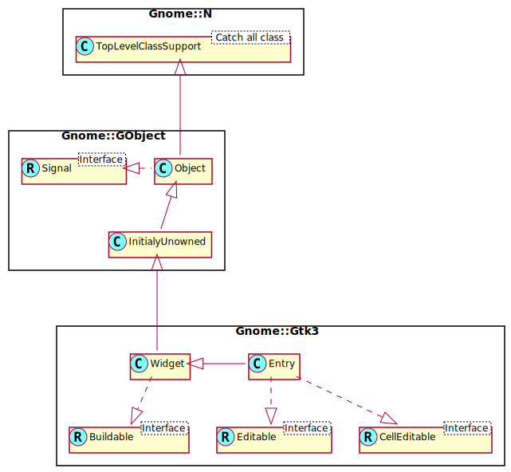

Gnome::Gtk3::Entry
==================

A single line text entry field

Description
===========

The **Gnome::Gtk3::Entry** widget is a single line text entry widget. A fairly large set of key bindings are supported by default. If the entered text is longer than the allocation of the widget, the widget will scroll so that the cursor position is visible.

When using an entry for passwords and other sensitive information, it can be put into “password mode” using `gtk_entry_set_visibility()`. In this mode, entered text is displayed using a “invisible” character. By default, GTK+ picks the best invisible character that is available in the current font, but it can be changed with `gtk_entry_set_invisible_char()`. Since 2.16, GTK+ displays a warning when Caps Lock or input methods might interfere with entering text in a password entry. The warning can be turned off with the *caps-lock-warning* property.

Since 2.16, **Gnome::Gtk3::Entry** has the ability to display progress or activity information behind the text. To make an entry display such information, use `gtk_entry_set_progress_fraction()` or `gtk_entry_set_progress_pulse_step()`.

Note that functionality or information that is only available by clicking on an icon in an entry may not be accessible at all to users which are not able to use a mouse or other pointing device. It is therefore recommended that any such functionality should also be available by other means, e.g. via the context menu of the entry.

Css Nodes
---------

    entry
    ├── image.left
    ├── image.right
    ├── undershoot.left
    ├── undershoot.right
    ├── [selection]
    ├── [progress[.pulse]]
    ╰── [window.popup]

**Gnome::Gtk3::Entry** has a main node with the name entry. Depending on the properties of the entry, the style classes .read-only and .flat may appear. The style classes .warning and .error may also be used with entries.

When the entry shows icons, it adds subnodes with the name image and the style class .left or .right, depending on where the icon appears.

When the entry has a selection, it adds a subnode with the name selection.

When the entry shows progress, it adds a subnode with the name progress. The node has the style class .pulse when the shown progress is pulsing.

The CSS node for a context menu is added as a subnode below entry as well.

The undershoot nodes are used to draw the underflow indication when content is scrolled out of view. These nodes get the .left and .right style classes added depending on where the indication is drawn.

When touch is used and touch selection handles are shown, they are using CSS nodes with name cursor-handle. They get the .top or .bottom style class depending on where they are shown in relation to the selection. If there is just a single handle for the text cursor, it gets the style class .insertion-cursor.

Implemented Interfaces
----------------------

Gnome::Gtk3::Entry implements

  * Gnome::Gtk3::Editable

  * Gnome::Gtk3::CellEditable

See Also
--------

**Gnome::Gtk3::TextView**, **Gnome::Gtk3::EntryCompletion**

Synopsis
========

Declaration
-----------

    unit class Gnome::Gtk3::Entry;
    also is Gnome::Gtk3::Widget;

Inheriting this class
---------------------

Inheriting is done in a special way in that it needs a call from new() to get the native object created by the class you are inheriting from.

    use Gnome::Gtk3::Entry;

    unit class MyGuiClass;
    also is Gnome::Gtk3::Entry;
    also does Gnome::Gtk3::Editable;

    submethod new ( |c ) {
      # let the Gnome::Gtk3::Entry class process the options
      self.bless( :GtkEntry, |c);
    }

    submethod BUILD ( ... ) {
      ...
    }

Types
=====

enum GtkEntryIconPosition
-------------------------

Specifies the side of the entry at which an icon is placed.

Since: 2.16

  * GTK_ENTRY_ICON_PRIMARY: At the beginning of the entry (depending on the text direction).

  * GTK_ENTRY_ICON_SECONDARY: At the end of the entry (depending on the text direction).

Methods
=======

new
---

Create a new plain object.

    multi method new ( )

Create an object using a native object from elsewhere. See also **Gnome::GObject::Object**.

    multi method new ( N-GObject :$native-object! )

Create an object using a native object from a builder. See also **Gnome::GObject::Object**.

    multi method new ( Str :$build-id! )

get-activates-default
---------------------

Retrieves the value set by `set_activates_default()`.

Returns: `True` if the entry will activate the default widget

    method get-activates-default ( --> Bool )

get-alignment
-------------

Gets the value set by `set_alignment()`.

Returns: the alignment

    method get-alignment ( --> Num )

get-buffer
----------

Get the **Gnome::Gtk3::EntryBuffer** object which holds the text for this widget.

Returns: A **Gnome::Gtk3::EntryBuffer** object.

    method get-buffer ( --> N-GObject )

get-completion
--------------

Returns the auxiliary completion object currently in use by *entry*.

Returns: The auxiliary completion object currently in use by *entry*.

    method get-completion ( --> N-GObject )

get-current-icon-drag-source
----------------------------

Returns the index of the icon which is the source of the current DND operation, or -1.

This function is meant to be used in a *drag-data-get from Gnome::Gtk3::Widget* callback.

Returns: index of the icon which is the source of the current DND operation, or -1.

    method get-current-icon-drag-source ( --> Int )

get-cursor-hadjustment
----------------------

Retrieves the horizontal cursor adjustment for the entry. See `set_cursor_hadjustment()`.

Returns: the horizontal cursor adjustment, or `undefined` if none has been set.

    method get-cursor-hadjustment ( --> N-GObject )

get-has-frame
-------------

Gets the value set by `set_has_frame()`.

Returns: whether the entry has a beveled frame

    method get-has-frame ( --> Bool )

get-icon-activatable
--------------------

Returns whether the icon is activatable.

Returns: `True` if the icon is activatable.

    method get-icon-activatable ( GtkEntryIconPosition $icon_pos --> Bool )

  * $icon_pos; Icon position

get-icon-area
-------------

Gets the area where entry’s icon at *icon_pos* is drawn. This function is useful when drawing something to the entry in a draw callback.

If the entry is not realized or has no icon at the given position, *icon_area* is filled with zeros. Otherwise, *icon_area* will be filled with the icon’s allocation, relative to *entry*’s allocation.

See also `get_text_area()`

    method get-icon-area ( GtkEntryIconPosition $icon_pos, N-GObject() $icon_area )

  * $icon_pos; Icon position

  * $icon_area; Return location for the icon’s area

get-icon-at-pos
---------------

Finds the icon at the given position and return its index. The position’s coordinates are relative to the *entry*’s top left corner. If *x*, *y* doesn’t lie inside an icon, -1 is returned. This function is intended for use in a *query-tooltip from Gnome::Gtk3::Widget* signal handler.

Returns: the index of the icon at the given position, or -1

    method get-icon-at-pos ( Int() $x, Int() $y --> Int )

  * $x; the x coordinate of the position to find

  * $y; the y coordinate of the position to find

get-icon-gicon
--------------

Retrieves the **Gnome::Gio::Icon** used for the icon, or `undefined` if there is no icon or if the icon was set by some other method (e.g., by stock, pixbuf, or icon name).

Returns: A **Gnome::Gio::Icon**, or `undefined` if no icon is set or if the icon is not a **Gnome::Gio::Icon**

    method get-icon-gicon ( GtkEntryIconPosition $icon_pos --> N-GObject )

  * $icon_pos; Icon position

get-icon-name
-------------

Retrieves the icon name used for the icon, or `undefined` if there is no icon or if the icon was set by some other method (e.g., by pixbuf, stock or gicon).

Returns: An icon name, or `undefined` if no icon is set or if the icon wasn’t set from an icon name

    method get-icon-name ( GtkEntryIconPosition $icon_pos --> Str )

  * $icon_pos; Icon position

get-icon-pixbuf
---------------

Retrieves the image used for the icon.

Unlike the other methods of setting and getting icon data, this method will work regardless of whether the icon was set using a **Gnome::Gdk3::Pixbuf**, a **Gnome::Gio::Icon**, a stock item, or an icon name.

Returns: A **Gnome::Gdk3::Pixbuf**, or `undefined` if no icon is set for this position.

    method get-icon-pixbuf ( GtkEntryIconPosition $icon_pos --> N-GObject )

  * $icon_pos; Icon position

get-icon-sensitive
------------------

Returns whether the icon appears sensitive or insensitive.

Returns: `True` if the icon is sensitive.

    method get-icon-sensitive ( GtkEntryIconPosition $icon_pos --> Bool )

  * $icon_pos; Icon position

get-icon-storage-type
---------------------

Gets the type of representation being used by the icon to store image data. If the icon has no image data, the return value will be `GTK_IMAGE_EMPTY`.

Returns: image representation being used

    method get-icon-storage-type ( GtkEntryIconPosition $icon_pos --> GtkImageType )

  * $icon_pos; Icon position

get-icon-tooltip-markup
-----------------------

Gets the contents of the tooltip on the icon at the specified position in *entry*.

Returns: the tooltip text, or `undefined`. Free the returned string with `g_free()` when done.

    method get-icon-tooltip-markup ( GtkEntryIconPosition $icon_pos --> Str )

  * $icon_pos; the icon position

get-icon-tooltip-text
---------------------

Gets the contents of the tooltip on the icon at the specified position in *entry*.

Returns: the tooltip text, or `undefined`. Free the returned string with `g_free()` when done.

    method get-icon-tooltip-text ( GtkEntryIconPosition $icon_pos --> Str )

  * $icon_pos; the icon position

get-input-hints
---------------

Gets the value of the *input-hints* property.

    method get-input-hints ( --> GtkInputHints )

get-input-purpose
-----------------

Gets the value of the *input-purpose* property.

    method get-input-purpose ( --> GtkInputPurpose )

get-invisible-char
------------------

Retrieves the character displayed in place of the real characters for entries with visibility set to false. See `set_invisible_char()`.

Returns: the current invisible char, or 0, if the entry does not show invisible text at all.

    method get-invisible-char ( --> gunichar )

get-max-length
--------------

Retrieves the maximum allowed length of the text in *entry*. See `set_max_length()`.

This is equivalent to getting *entry*'s **Gnome::Gtk3::EntryBuffer** and calling `buffer_get_max_length()` on it.

Returns: the maximum allowed number of characters in **Gnome::Gtk3::Entry**, or 0 if there is no maximum.

    method get-max-length ( --> Int )

get-max-width-chars
-------------------

Retrieves the desired maximum width of *entry*, in characters. See `set_max_width_chars()`.

Returns: the maximum width of the entry, in characters

    method get-max-width-chars ( --> Int )

get-overwrite-mode
------------------

Gets the value set by `set_overwrite_mode()`.

Returns: whether the text is overwritten when typing.

    method get-overwrite-mode ( --> Bool )

get-placeholder-text
--------------------

Retrieves the text that will be displayed when *entry* is empty and unfocused

Returns: a pointer to the placeholder text as a string. This string points to internally allocated storage in the widget and must not be freed, modified or stored.

    method get-placeholder-text ( --> Str )

get-progress-fraction
---------------------

Returns the current fraction of the task that’s been completed. See `set_progress_fraction()`.

Returns: a fraction from 0.0 to 1.0

    method get-progress-fraction ( --> Num )

get-progress-pulse-step
-----------------------

Retrieves the pulse step set with `set_progress_pulse_step()`.

Returns: a fraction from 0.0 to 1.0

    method get-progress-pulse-step ( --> Num )

get-text
--------

Retrieves the contents of the entry widget. See also `gtk_editable_get_chars()`.

This is equivalent to getting *entry*'s **Gnome::Gtk3::EntryBuffer** and calling `buffer_get_text()` on it.

Returns: a pointer to the contents of the widget as a string. This string points to internally allocated storage in the widget and must not be freed, modified or stored.

    method get-text ( --> Str )

get-text-area
-------------

Gets the area where the entry’s text is drawn. This function is useful when drawing something to the entry in a draw callback.

If the entry is not realized, *text_area* is filled with zeros.

See also `get_icon_area()`.

    method get-text-area ( N-GObject() $text_area )

  * $text_area; Return location for the text area.

get-text-length
---------------

Retrieves the current length of the text in *entry*.

This is equivalent to getting *entry*'s **Gnome::Gtk3::EntryBuffer** and calling `buffer_get_length()` on it.

Returns: the current number of characters in **Gnome::Gtk3::Entry**, or 0 if there are none.

    method get-text-length ( --> UInt )

get-visibility
--------------

Retrieves whether the text in *entry* is visible. See `set_visibility()`.

Returns: `True` if the text is currently visible

    method get-visibility ( --> Bool )

get-width-chars
---------------

Gets the value set by `set_width_chars()`.

Returns: number of chars to request space for, or negative if unset

    method get-width-chars ( --> Int )

grab-focus-without-selecting
----------------------------

Causes *entry* to have keyboard focus.

It behaves like `gtk_widget_grab_focus()`, except that it doesn't select the contents of the entry. You only want to call this on some special entries which the user usually doesn't want to replace all text in, such as search-as-you-type entries.

    method grab-focus-without-selecting ( )

im-context-filter-keypress
--------------------------

Allow the **Gnome::Gtk3::Entry** input method to internally handle key press and release events. If this function returns `True`, then no further processing should be done for this key event. See `gtk_im_context_filter_keypress()`.

Note that you are expected to call this function from your handler when overriding key event handling. This is needed in the case when you need to insert your own key handling between the input method and the default key event handling of the **Gnome::Gtk3::Entry**. See `gtk_text_view_reset_im_context()` for an example of use.

Returns: `True` if the input method handled the key event.

    method im-context-filter-keypress ( N-GdkEvent $event --> Bool )

  * $event; (type Gdk.EventKey): the key event

progress-pulse
--------------

Indicates that some progress is made, but you don’t know how much. Causes the entry’s progress indicator to enter “activity mode,” where a block bounces back and forth. Each call to `progress_pulse()` causes the block to move by a little bit (the amount of movement per pulse is determined by `set_progress_pulse_step()`).

    method progress-pulse ( )

reset-im-context
----------------

Reset the input method context of the entry if needed.

This can be necessary in the case where modifying the buffer would confuse on-going input method behavior.

    method reset-im-context ( )

set-activates-default
---------------------

If *setting* is `True`, pressing Enter in the *entry* will activate the default widget for the window containing the entry. This usually means that the dialog box containing the entry will be closed, since the default widget is usually one of the dialog buttons.

(For experts: if *setting* is `True`, the entry calls `gtk_window_activate_default()` on the window containing the entry, in the default handler for the *activate* signal.)

    method set-activates-default ( Bool $setting )

  * $setting; `True` to activate window’s default widget on Enter keypress

set-alignment
-------------

Sets the alignment for the contents of the entry. This controls the horizontal positioning of the contents when the displayed text is shorter than the width of the entry.

    method set-alignment ( Num() $xalign )

  * $xalign; The horizontal alignment, from 0 (left) to 1 (right). Reversed for RTL layouts

set-buffer
----------

Set the **Gnome::Gtk3::EntryBuffer** object which holds the text for this widget.

    method set-buffer ( N-GObject() $buffer )

  * $buffer; a **Gnome::Gtk3::EntryBuffer**

set-completion
--------------

Sets *completion* to be the auxiliary completion object to use with *entry*. All further configuration of the completion mechanism is done on *completion* using the **Gnome::Gtk3::EntryCompletion** API. Completion is disabled if *completion* is set to `undefined`.

    method set-completion ( N-GObject() $completion )

  * $completion; The **Gnome::Gtk3::EntryCompletion** or `undefined`

set-cursor-hadjustment
----------------------

Hooks up an adjustment to the cursor position in an entry, so that when the cursor is moved, the adjustment is scrolled to show that position. See `gtk_scrolled_window_get_hadjustment()` for a typical way of obtaining the adjustment.

The adjustment has to be in pixel units and in the same coordinate system as the entry.

    method set-cursor-hadjustment ( N-GObject() $adjustment )

  * $adjustment; an adjustment which should be adjusted when the cursor is moved, or `undefined`

set-has-frame
-------------

Sets whether the entry has a beveled frame around it.

    method set-has-frame ( Bool $setting )

  * $setting; new value

set-icon-activatable
--------------------

Sets whether the icon is activatable.

    method set-icon-activatable ( GtkEntryIconPosition $icon_pos, Bool $activatable )

  * $icon_pos; Icon position

  * $activatable; `True` if the icon should be activatable

set-icon-drag-source
--------------------

Sets up the icon at the given position so that GTK+ will start a drag operation when the user clicks and drags the icon.

To handle the drag operation, you need to connect to the usual *drag-data-get from Gnome::Gtk3::Widget* (or possibly *drag-data-delete from Gnome::Gtk3::Widget*) signal, and use `get_current_icon_drag_source()` in your signal handler to find out if the drag was started from an icon.

By default, GTK+ uses the icon as the drag icon. You can use the *drag-begin from Gnome::Gtk3::Widget* signal to set a different icon. Note that you have to use `g_signal_connect_after()` to ensure that your signal handler gets executed after the default handler.

    method set-icon-drag-source ( GtkEntryIconPosition $icon_pos, N-GtkTargetList $target_list, GdkDragAction $actions )

  * $icon_pos; icon position

  * $target_list; the targets (data formats) in which the data can be provided

  * $actions; a bitmask of the allowed drag actions

set-icon-from-gicon
-------------------

Sets the icon shown in the entry at the specified position from the current icon theme. If the icon isn’t known, a “broken image” icon will be displayed instead.

If *icon* is `undefined`, no icon will be shown in the specified position.

    method set-icon-from-gicon ( GtkEntryIconPosition $icon_pos, N-GObject() $icon )

  * $icon_pos; The position at which to set the icon

  * $icon; The icon to set, or `undefined`

set-icon-from-icon-name
-----------------------

Sets the icon shown in the entry at the specified position from the current icon theme.

If the icon name isn’t known, a “broken image” icon will be displayed instead.

If *icon_name* is `undefined`, no icon will be shown in the specified position.

    method set-icon-from-icon-name ( GtkEntryIconPosition $icon_pos, Str $icon_name )

  * $icon_pos; The position at which to set the icon

  * $icon_name; An icon name, or `undefined`

set-icon-from-pixbuf
--------------------

Sets the icon shown in the specified position using a pixbuf.

If *pixbuf* is `undefined`, no icon will be shown in the specified position.

    method set-icon-from-pixbuf ( GtkEntryIconPosition $icon_pos, N-GObject() $pixbuf )

  * $icon_pos; Icon position

  * $pixbuf; A **Gnome::Gdk3::Pixbuf**, or `undefined`

set-icon-sensitive
------------------

Sets the sensitivity for the specified icon.

    method set-icon-sensitive ( GtkEntryIconPosition $icon_pos, Bool $sensitive )

  * $icon_pos; Icon position

  * $sensitive; Specifies whether the icon should appear sensitive or insensitive

set-icon-tooltip-text
---------------------

Sets *tooltip* as the contents of the tooltip for the icon at the specified position.

Use `undefined` for *tooltip* to remove an existing tooltip.

See also `gtk_widget_set_tooltip_text()` and `set_icon_tooltip_markup()`.

If you unset the widget tooltip via `gtk_widget_set_tooltip_text()` or `gtk_widget_set_tooltip_markup()`, this sets GtkWidget:has-tooltip to `False`, which suppresses icon tooltips too. You can resolve this by then calling `gtk_widget_set_has_tooltip()` to set GtkWidget:has-tooltip back to `True`, or setting at least one non-empty tooltip on any icon achieves the same result.

    method set-icon-tooltip-text ( GtkEntryIconPosition $icon_pos, Str $tooltip )

  * $icon_pos; the icon position

  * $tooltip; the contents of the tooltip for the icon, or `undefined`

set-input-hints
---------------

Sets the *input-hints* property, which allows input methods to fine-tune their behaviour.

    method set-input-hints ( GtkInputHints $hints )

  * $hints; the hints

set-input-purpose
-----------------

Sets the *input-purpose* property which can be used by on-screen keyboards and other input methods to adjust their behaviour.

    method set-input-purpose ( GtkInputPurpose $purpose )

  * $purpose; the purpose

set-invisible-char
------------------

Sets the character to use in place of the actual text when `set_visibility()` has been called to set text visibility to `False`. i.e. this is the character used in “password mode” to show the user how many characters have been typed. By default, GTK+ picks the best invisible char available in the current font. If you set the invisible char to 0, then the user will get no feedback at all; there will be no text on the screen as they type.

    method set-invisible-char ( gunichar $ch )

  * $ch; a Unicode character

set-max-length
--------------

Sets the maximum allowed length of the contents of the widget. If the current contents are longer than the given length, then they will be truncated to fit.

This is equivalent to getting *entry*'s **Gnome::Gtk3::EntryBuffer** and calling `buffer_set_max_length()` on it. ]|

    method set-max-length ( Int() $max )

  * $max; the maximum length of the entry, or 0 for no maximum. (other than the maximum length of entries.) The value passed in will be clamped to the range 0-65536.

set-max-width-chars
-------------------

Sets the desired maximum width in characters of *entry*.

    method set-max-width-chars ( Int() $n_chars )

  * $n_chars; the new desired maximum width, in characters

set-overwrite-mode
------------------

Sets whether the text is overwritten when typing in the **Gnome::Gtk3::Entry**.

    method set-overwrite-mode ( Bool $overwrite )

  * $overwrite; new value

set-placeholder-text
--------------------

Sets text to be displayed in *entry* when it is empty and unfocused. This can be used to give a visual hint of the expected contents of the **Gnome::Gtk3::Entry**.

Note that since the placeholder text gets removed when the entry received focus, using this feature is a bit problematic if the entry is given the initial focus in a window. Sometimes this can be worked around by delaying the initial focus setting until the first key event arrives.

    method set-placeholder-text ( Str $text )

  * $text; a string to be displayed when *entry* is empty and unfocused, or `undefined`

set-progress-fraction
---------------------

Causes the entry’s progress indicator to “fill in” the given fraction of the bar. The fraction should be between 0.0 and 1.0, inclusive.

    method set-progress-fraction ( Num() $fraction )

  * $fraction; fraction of the task that’s been completed

set-progress-pulse-step
-----------------------

Sets the fraction of total entry width to move the progress bouncing block for each call to `progress_pulse()`.

    method set-progress-pulse-step ( Num() $fraction )

  * $fraction; fraction between 0.0 and 1.0

set-text
--------

Sets the text in the widget to the given value, replacing the current contents.

See `buffer_set_text()`.

    method set-text ( Str $text )

  * $text; the new text

set-visibility
--------------

Sets whether the contents of the entry are visible or not. When visibility is set to `False`, characters are displayed as the invisible char, and will also appear that way when the text in the entry widget is copied elsewhere.

By default, GTK+ picks the best invisible character available in the current font, but it can be changed with `set_invisible_char()`.

Note that you probably want to set *input-purpose* to `GTK_INPUT_PURPOSE_PASSWORD` or `GTK_INPUT_PURPOSE_PIN` to inform input methods about the purpose of this entry, in addition to setting visibility to `False`.

    method set-visibility ( Bool $visible )

  * $visible; `True` if the contents of the entry are displayed as plaintext

set-width-chars
---------------

Changes the size request of the entry to be about the right size for *n_chars* characters. Note that it changes the size request, the size can still be affected by how you pack the widget into containers. If *n_chars* is -1, the size reverts to the default entry size.

    method set-width-chars ( Int() $n_chars )

  * $n_chars; width in chars

unset-invisible-char
--------------------

Unsets the invisible char previously set with `set_invisible_char()`. So that the default invisible char is used again.

    method unset-invisible-char ( )

Signals
=======

activate
--------

The *activate* signal is emitted when the user hits the Enter key.

While this signal is used as a [keybinding signal][GtkBindingSignal], it is also commonly used by applications to intercept activation of entries.

The default bindings for this signal are all forms of the Enter key.

    method handler (
      Int :$_handler-id,
      N-GObject :$_native-object,
      *%user-options
    )

  * $_handler-id; The handler id which is returned from the registration

  * $_native-object; The native object provided by the caller wrapped in the Raku object which registered the signal.

  * %user-options; A list of named arguments provided at the `register-signal()` method

backspace
---------

The *backspace* signal is a [keybinding signal][GtkBindingSignal] which gets emitted when the user asks for it.

The default bindings for this signal are Backspace and Shift-Backspace.

    method handler (
      Int :$_handler-id,
      N-GObject :$_native-object,
      *%user-options
    )

  * $_handler-id; The handler id which is returned from the registration

  * $_native-object; The native object provided by the caller wrapped in the Raku object which registered the signal.

  * %user-options; A list of named arguments provided at the `register-signal()` method

copy-clipboard
--------------

The *copy-clipboard* signal is a [keybinding signal][GtkBindingSignal] which gets emitted to copy the selection to the clipboard.

The default bindings for this signal are Ctrl-c and Ctrl-Insert.

    method handler (
      Int :$_handler-id,
      N-GObject :$_native-object,
      *%user-options
    )

  * $_handler-id; The handler id which is returned from the registration

  * $_native-object; The native object provided by the caller wrapped in the Raku object which registered the signal.

  * %user-options; A list of named arguments provided at the `register-signal()` method

cut-clipboard
-------------

The *cut-clipboard* signal is a [keybinding signal][GtkBindingSignal] which gets emitted to cut the selection to the clipboard.

The default bindings for this signal are Ctrl-x and Shift-Delete.

    method handler (
      Int :$_handler-id,
      N-GObject :$_native-object,
      *%user-options
    )

  * $_handler-id; The handler id which is returned from the registration

  * $_native-object; The native object provided by the caller wrapped in the Raku object which registered the signal.

  * %user-options; A list of named arguments provided at the `register-signal()` method

delete-from-cursor
------------------

The *delete-from-cursor* signal is a [keybinding signal][GtkBindingSignal] which gets emitted when the user initiates a text deletion.

If the *type* is `GTK_DELETE_CHARS`, GTK+ deletes the selection if there is one, otherwise it deletes the requested number of characters.

The default bindings for this signal are Delete for deleting a character and Ctrl-Delete for deleting a word.

    method handler (
      Unknown type: GTK_TYPE_DELETE_TYPE $type,
      Int $count,
      Int :$_handler-id,
      N-GObject :$_native-object,
      *%user-options
    )

  * $type; the granularity of the deletion, as a **Gnome::Gtk3::DeleteType**

  * $count; the number of *type* units to delete

  * $_handler-id; The handler id which is returned from the registration

  * $_native-object; The native object provided by the caller wrapped in the Raku object which registered the signal.

  * %user-options; A list of named arguments provided at the `register-signal()` method

icon-press
----------

The *icon-press* signal is emitted when an activatable icon is clicked.

    method handler (
      Unknown type: GTK_TYPE_ENTRY_ICON_POSITION $icon_pos,
      Unknown type: GDK_TYPE_EVENT | G_SIGNAL_TYPE_STATIC_SCOPE $event,
      Int :$_handler-id,
      N-GObject :$_native-object,
      *%user-options
    )

  * $icon_pos; The position of the clicked icon

  * $event; the button press event

  * $_handler-id; The handler id which is returned from the registration

  * $_native-object; The native object provided by the caller wrapped in the Raku object which registered the signal.

  * %user-options; A list of named arguments provided at the `register-signal()` method

icon-release
------------

The *icon-release* signal is emitted on the button release from a mouse click over an activatable icon.

    method handler (
      Unknown type: GTK_TYPE_ENTRY_ICON_POSITION $icon_pos,
      Unknown type: GDK_TYPE_EVENT | G_SIGNAL_TYPE_STATIC_SCOPE $event,
      Int :$_handler-id,
      N-GObject :$_native-object,
      *%user-options
    )

  * $icon_pos; The position of the clicked icon

  * $event; the button release event

  * $_handler-id; The handler id which is returned from the registration

  * $_native-object; The native object provided by the caller wrapped in the Raku object which registered the signal.

  * %user-options; A list of named arguments provided at the `register-signal()` method

insert-at-cursor
----------------

The *insert-at-cursor* signal is a [keybinding signal][GtkBindingSignal] which gets emitted when the user initiates the insertion of a fixed string at the cursor.

This signal has no default bindings.

    method handler (
      Str $string,
      Int :$_handler-id,
      N-GObject :$_native-object,
      *%user-options
    )

  * $string; the string to insert

  * $_handler-id; The handler id which is returned from the registration

  * $_native-object; The native object provided by the caller wrapped in the Raku object which registered the signal.

  * %user-options; A list of named arguments provided at the `register-signal()` method

insert-emoji
------------

The *insert-emoji* signal is a [keybinding signal][GtkBindingSignal] which gets emitted to present the Emoji chooser for the *entry*.

The default bindings for this signal are Ctrl-. and Ctrl-;.27

    method handler (
      Int :$_handler-id,
      N-GObject :$_native-object,
      *%user-options
    )

  * $_handler-id; The handler id which is returned from the registration

  * $_native-object; The native object provided by the caller wrapped in the Raku object which registered the signal.

  * %user-options; A list of named arguments provided at the `register-signal()` method

move-cursor
-----------

The *move-cursor* signal is a [keybinding signal][GtkBindingSignal] which gets emitted when the user initiates a cursor movement. If the cursor is not visible in *entry*, this signal causes the viewport to be moved instead.

Applications should not connect to it, but may emit it with `g_signal_emit_by_name()` if they need to control the cursor programmatically.

The default bindings for this signal come in two variants, the variant with the Shift modifier extends the selection, the variant without the Shift modifer does not. There are too many key combinations to list them all here. - Arrow keys move by individual characters/lines - Ctrl-arrow key combinations move by words/paragraphs - Home/End keys move to the ends of the buffer

    method handler (
      Unknown type: GTK_TYPE_MOVEMENT_STEP $step,
      Int $count,
      Bool $extend_selection,
      Int :$_handler-id,
      N-GObject :$_native-object,
      *%user-options
    )

  * $step; the granularity of the move, as a **Gnome::Gtk3::MovementStep**

  * $count; the number of *step* units to move

  * $extend_selection; `True` if the move should extend the selection

  * $_handler-id; The handler id which is returned from the registration

  * $_native-object; The native object provided by the caller wrapped in the Raku object which registered the signal.

  * %user-options; A list of named arguments provided at the `register-signal()` method

paste-clipboard
---------------

The *paste-clipboard* signal is a [keybinding signal][GtkBindingSignal] which gets emitted to paste the contents of the clipboard into the text view.

The default bindings for this signal are Ctrl-v and Shift-Insert.

    method handler (
      Int :$_handler-id,
      N-GObject :$_native-object,
      *%user-options
    )

  * $_handler-id; The handler id which is returned from the registration

  * $_native-object; The native object provided by the caller wrapped in the Raku object which registered the signal.

  * %user-options; A list of named arguments provided at the `register-signal()` method

populate-popup
--------------

The *populate-popup* signal gets emitted before showing the context menu of the entry.

If you need to add items to the context menu, connect to this signal and append your items to the *widget*, which will be a **Gnome::Gtk3::Menu** in this case.

If *populate-all* is `True`, this signal will also be emitted to populate touch popups. In this case, *widget* will be a different container, e.g. a **Gnome::Gtk3::Toolbar**. The signal handler should not make assumptions about the type of *widget*.

    method handler (
      N-GObject #`{ native widget } $widget,
      Int :$_handler-id,
      N-GObject :$_native-object,
      *%user-options
    )

  * $widget; the container that is being populated

  * $_handler-id; The handler id which is returned from the registration

  * $_native-object; The native object provided by the caller wrapped in the Raku object which registered the signal.

  * %user-options; A list of named arguments provided at the `register-signal()` method

preedit-changed
---------------

If an input method is used, the typed text will not immediately be committed to the buffer. So if you are interested in the text, connect to this signal.

    method handler (
      Str $preedit,
      Int :$_handler-id,
      N-GObject :$_native-object,
      *%user-options
    )

  * $preedit; the current preedit string

  * $_handler-id; The handler id which is returned from the registration

  * $_native-object; The native object provided by the caller wrapped in the Raku object which registered the signal.

  * %user-options; A list of named arguments provided at the `register-signal()` method

toggle-overwrite
----------------

The *toggle-overwrite* signal is a [keybinding signal][GtkBindingSignal] which gets emitted to toggle the overwrite mode of the entry.

The default bindings for this signal is Insert.

    method handler (
      Int :$_handler-id,
      N-GObject :$_native-object,
      *%user-options
    )

  * $_handler-id; The handler id which is returned from the registration

  * $_native-object; The native object provided by the caller wrapped in the Raku object which registered the signal.

  * %user-options; A list of named arguments provided at the `register-signal()` method

Properties
==========

activates-default
-----------------

Whether to activate the default widget (such as the default button in a dialog when Enter is pressed)

  * **Gnome::GObject::Value** type of this property is G_TYPE_BOOLEAN

  * Parameter is readable and writable.

  * Default value is FALSE.

attributes
----------

A list of style attributes to apply to the text of the label

  * **Gnome::GObject::Value** type of this property is G_TYPE_BOXED

  * The type of this G_TYPE_BOXED object is PANGO_TYPE_ATTR_LIST

  * Parameter is readable and writable.

buffer
------

Text buffer object which actually stores entry text

  * **Gnome::GObject::Value** type of this property is G_TYPE_OBJECT

  * The type of this G_TYPE_OBJECT object is GTK_TYPE_ENTRY_BUFFER

  * Parameter is readable and writable.

  * Parameter is set on construction of object.

caps-lock-warning
-----------------

Whether password entries will show a warning when Caps Lock is on

  * **Gnome::GObject::Value** type of this property is G_TYPE_BOOLEAN

  * Parameter is readable and writable.

  * Default value is TRUE.

completion
----------

The auxiliary completion object

  * **Gnome::GObject::Value** type of this property is G_TYPE_OBJECT

  * The type of this G_TYPE_OBJECT object is GTK_TYPE_ENTRY_COMPLETION

  * Parameter is readable and writable.

cursor-position
---------------

The current position of the insertion cursor in chars

  * **Gnome::GObject::Value** type of this property is G_TYPE_INT

  * Parameter is readable.

  * Minimum value is 0.

  * Maximum value is GTK_ENTRY_BUFFER_MAX_SIZE.

  * Default value is 0.

editable
--------

Whether the entry contents can be edited

  * **Gnome::GObject::Value** type of this property is G_TYPE_BOOLEAN

  * Parameter is readable and writable.

  * Default value is TRUE.

enable-emoji-completion
-----------------------

Whether to suggest Emoji replacements

  * **Gnome::GObject::Value** type of this property is G_TYPE_BOOLEAN

  * Parameter is readable and writable.

  * Default value is FALSE.

has-frame
---------

FALSE removes outside bevel from entry

  * **Gnome::GObject::Value** type of this property is G_TYPE_BOOLEAN

  * Parameter is readable and writable.

  * Default value is TRUE.

im-module
---------

Which IM module should be used

  * **Gnome::GObject::Value** type of this property is G_TYPE_STRING

  * Parameter is readable and writable.

  * Default value is undefined.

input-hints
-----------

Hints for the text field behaviour

  * **Gnome::GObject::Value** type of this property is G_TYPE_FLAGS

  * The type of this G_TYPE_FLAGS object is GTK_TYPE_INPUT_HINTS

  * Parameter is readable and writable.

  * Default value is GTK_INPUT_HINT_NONE.

input-purpose
-------------

Purpose of the text field

  * **Gnome::GObject::Value** type of this property is G_TYPE_ENUM

  * The type of this G_TYPE_ENUM object is GTK_TYPE_INPUT_PURPOSE

  * Parameter is readable and writable.

  * Default value is GTK_INPUT_PURPOSE_FREE_FORM.

invisible-char
--------------

The character to use when masking entry contents (in \password mode\)

  * **Gnome::GObject::Value** type of this property is G_TYPE_UNICHAR

invisible-char-set
------------------

Whether the invisible character has been set

  * **Gnome::GObject::Value** type of this property is G_TYPE_BOOLEAN

  * Parameter is readable and writable.

  * Default value is FALSE.

max-length
----------

Maximum number of characters for this entry. Zero if no maximum

  * **Gnome::GObject::Value** type of this property is G_TYPE_INT

  * Parameter is readable and writable.

  * Minimum value is 0.

  * Maximum value is GTK_ENTRY_BUFFER_MAX_SIZE.

  * Default value is 0.

max-width-chars
---------------

The desired maximum width of the entry, in characters

  * **Gnome::GObject::Value** type of this property is G_TYPE_INT

  * Parameter is readable and writable.

  * Minimum value is -1.

  * Maximum value is G_MAXINT.

  * Default value is -1.

overwrite-mode
--------------

Whether new text overwrites existing text

  * **Gnome::GObject::Value** type of this property is G_TYPE_BOOLEAN

  * Parameter is readable and writable.

  * Default value is FALSE.

placeholder-text
----------------

Show text in the entry when it's empty and unfocused

  * **Gnome::GObject::Value** type of this property is G_TYPE_STRING

  * Parameter is readable and writable.

  * Default value is undefined.

populate-all
------------

Whether to emit *populate-popup* for touch popups

  * **Gnome::GObject::Value** type of this property is G_TYPE_BOOLEAN

  * Parameter is readable and writable.

  * Default value is FALSE.

primary-icon-activatable
------------------------

Whether the primary icon is activatable

  * **Gnome::GObject::Value** type of this property is G_TYPE_BOOLEAN

  * Parameter is readable and writable.

  * Default value is TRUE.

primary-icon-gicon
------------------

GIcon for primary icon

  * **Gnome::GObject::Value** type of this property is G_TYPE_OBJECT

  * The type of this G_TYPE_OBJECT object is G_TYPE_ICON

  * Parameter is readable and writable.

primary-icon-name
-----------------

Icon name for primary icon

  * **Gnome::GObject::Value** type of this property is G_TYPE_STRING

  * Parameter is readable and writable.

  * Default value is undefined.

primary-icon-pixbuf
-------------------

Primary pixbuf for the entry

  * **Gnome::GObject::Value** type of this property is G_TYPE_OBJECT

  * The type of this G_TYPE_OBJECT object is GDK_TYPE_PIXBUF

  * Parameter is readable and writable.

primary-icon-sensitive
----------------------

Whether the primary icon is sensitive

  * **Gnome::GObject::Value** type of this property is G_TYPE_BOOLEAN

  * Parameter is readable and writable.

  * Default value is TRUE.

primary-icon-storage-type
-------------------------

The representation being used for primary icon

  * **Gnome::GObject::Value** type of this property is G_TYPE_ENUM

  * The type of this G_TYPE_ENUM object is GTK_TYPE_IMAGE_TYPE

  * Parameter is readable.

  * Default value is GTK_IMAGE_EMPTY.

primary-icon-tooltip-markup
---------------------------

The contents of the tooltip on the primary icon

  * **Gnome::GObject::Value** type of this property is G_TYPE_STRING

  * Parameter is readable and writable.

  * Default value is undefined.

primary-icon-tooltip-text
-------------------------

The contents of the tooltip on the primary icon

  * **Gnome::GObject::Value** type of this property is G_TYPE_STRING

  * Parameter is readable and writable.

  * Default value is undefined.

progress-fraction
-----------------

The current fraction of the task that's been completed

  * **Gnome::GObject::Value** type of this property is G_TYPE_DOUBLE

  * Parameter is readable and writable.

  * Minimum value is 0.0.

  * Maximum value is 1.0.

  * Default value is 0.0.

progress-pulse-step The fraction of total entry width to move the progress bouncing block for each call to gtk_entry_progress_pulse()
-------------------------------------------------------------------------------------------------------------------------------------

  * **Gnome::GObject::Value** type of this property is G_TYPE_DOUBLE

  * Parameter is readable and writable.

  * Minimum value is 0.0.

  * Maximum value is 1.0.

  * Default value is 0.1.

scroll-offset
-------------

Number of pixels of the entry scrolled off the screen to the left

  * **Gnome::GObject::Value** type of this property is G_TYPE_INT

  * Parameter is readable.

  * Minimum value is 0.

  * Maximum value is G_MAXINT.

  * Default value is 0.

secondary-icon-activatable
--------------------------

Whether the secondary icon is activatable

  * **Gnome::GObject::Value** type of this property is G_TYPE_BOOLEAN

  * Parameter is readable and writable.

  * Default value is TRUE.

secondary-icon-gicon
--------------------

GIcon for secondary icon

  * **Gnome::GObject::Value** type of this property is G_TYPE_OBJECT

  * The type of this G_TYPE_OBJECT object is G_TYPE_ICON

  * Parameter is readable and writable.

secondary-icon-name
-------------------

Icon name for secondary icon

  * **Gnome::GObject::Value** type of this property is G_TYPE_STRING

  * Parameter is readable and writable.

  * Default value is undefined.

secondary-icon-pixbuf
---------------------

Secondary pixbuf for the entry

  * **Gnome::GObject::Value** type of this property is G_TYPE_OBJECT

  * The type of this G_TYPE_OBJECT object is GDK_TYPE_PIXBUF

  * Parameter is readable and writable.

secondary-icon-sensitive
------------------------

Whether the secondary icon is sensitive

  * **Gnome::GObject::Value** type of this property is G_TYPE_BOOLEAN

  * Parameter is readable and writable.

  * Default value is TRUE.

secondary-icon-storage-type
---------------------------

The representation being used for secondary icon

  * **Gnome::GObject::Value** type of this property is G_TYPE_ENUM

  * The type of this G_TYPE_ENUM object is GTK_TYPE_IMAGE_TYPE

  * Parameter is readable.

  * Default value is GTK_IMAGE_EMPTY.

secondary-icon-tooltip-markup
-----------------------------

The contents of the tooltip on the secondary icon

  * **Gnome::GObject::Value** type of this property is G_TYPE_STRING

  * Parameter is readable and writable.

  * Default value is undefined.

secondary-icon-tooltip-text
---------------------------

The contents of the tooltip on the secondary icon

  * **Gnome::GObject::Value** type of this property is G_TYPE_STRING

  * Parameter is readable and writable.

  * Default value is undefined.

selection-bound
---------------

The position of the opposite end of the selection from the cursor in chars

  * **Gnome::GObject::Value** type of this property is G_TYPE_INT

  * Parameter is readable.

  * Minimum value is 0.

  * Maximum value is GTK_ENTRY_BUFFER_MAX_SIZE.

  * Default value is 0.

show-emoji-icon
---------------

Whether to show an icon for Emoji

  * **Gnome::GObject::Value** type of this property is G_TYPE_BOOLEAN

  * Parameter is readable and writable.

  * Default value is FALSE.

tabs
----

A list of tabstop locations to apply to the text of the entry

  * **Gnome::GObject::Value** type of this property is G_TYPE_BOXED

  * The type of this G_TYPE_BOXED object is PANGO_TYPE_TAB_ARRAY

  * Parameter is readable and writable.

text
----

The contents of the entry

  * **Gnome::GObject::Value** type of this property is G_TYPE_STRING

  * Parameter is readable and writable.

text-length
-----------

Length of the text currently in the entry

  * **Gnome::GObject::Value** type of this property is G_TYPE_UINT

  * Parameter is readable.

  * Minimum value is 0.

  * Maximum value is G_MAXUINT16.

  * Default value is 0.

truncate-multiline
------------------

Whether to truncate multiline pastes to one line.

  * **Gnome::GObject::Value** type of this property is G_TYPE_BOOLEAN

  * Parameter is readable and writable.

  * Default value is FALSE.

visibility
----------

FALSE displays the \invisible char\ instead of the actual text (password mode)

  * **Gnome::GObject::Value** type of this property is G_TYPE_BOOLEAN

  * Parameter is readable and writable.

  * Default value is TRUE.

width-chars
-----------

Number of characters to leave space for in the entry

  * **Gnome::GObject::Value** type of this property is G_TYPE_INT

  * Parameter is readable and writable.

  * Minimum value is -1.

  * Maximum value is G_MAXINT.

  * Default value is -1.

xalign
------

The horizontal alignment, from 0 (left to 1 (right). Reversed for RTL layouts.)

  * **Gnome::GObject::Value** type of this property is G_TYPE_FLOAT

  * Parameter is readable and writable.

  * Minimum value is 0.0.

  * Maximum value is 1.0.

  * Default value is 0.0.

