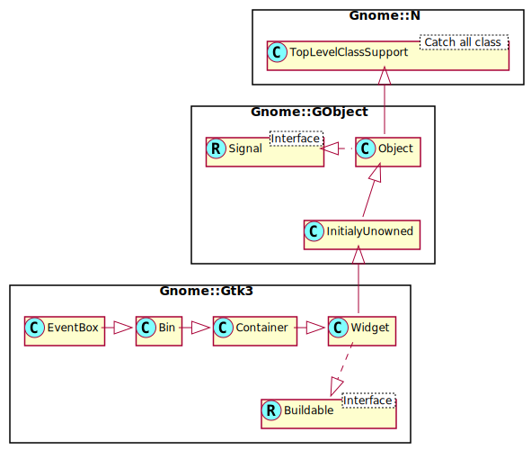

Gnome::Gtk3::EventBox
=====================

A widget used to catch events for widgets which do not have their own window

Description
===========

The **Gnome::Gtk3::EventBox** widget is a subclass of **Gnome::Gtk3::Bin** which also has its own window. It is useful since it allows you to catch events for widgets which do not have their own window.

Synopsis
========

Declaration
-----------

    unit class Gnome::Gtk3::EventBox;
    also is Gnome::Gtk3::Bin;

Uml Diagram
-----------

Methods
=======

new
---

### default, no options

Create a new EventBox object.

    multi method new ( )

### :native-object

Create a EventBox object using a native object from elsewhere. See also **Gnome::N::TopLevelClassSupport**.

    multi method new ( N-GObject :$native-object! )

### :build-id

Create a EventBox object using a native object returned from a builder. See also **Gnome::GObject::Object**.

    multi method new ( Str :$build-id! )

get-above-child
---------------

Returns whether the event box window is above or below the windows of its child. See `set-above-child()` for details.

Returns: `True` if the event box window is above the window of its child

    method get-above-child ( --> Bool )

get-visible-window
------------------

Returns whether the event box has a visible window. See `set-visible-window()` for details.

Returns: `True` if the event box window is visible

    method get-visible-window ( --> Bool )

set-above-child
---------------

Set whether the event box window is positioned above the windows of its child, as opposed to below it. If the window is above, all events inside the event box will go to the event box. If the window is below, events in windows of child widgets will first got to that widget, and then to its parents.

The default is to keep the window below the child.

    method set-above-child ( Bool $above_child )

  * Bool $above_child; `True` if the event box window is above its child

set-visible-window
------------------

Set whether the event box uses a visible or invisible child window. The default is to use visible windows.

In an invisible window event box, the window that the event box creates is a `GDK-INPUT-ONLY` window, which means that it is invisible and only serves to receive events.

A visible window event box creates a visible (`GDK-INPUT-OUTPUT`) window that acts as the parent window for all the widgets contained in the event box.

You should generally make your event box invisible if you just want to trap events. Creating a visible window may cause artifacts that are visible to the user, especially if the user is using a theme with gradients or pixmaps.

The main reason to create a non input-only event box is if you want to set the background to a different color or draw on it.

There is one unexpected issue for an invisible event box that has its window below the child. (See `set-above-child()`.) Since the input-only window is not an ancestor window of any windows that descendent widgets of the event box create, events on these windows aren’t propagated up by the windowing system, but only by GTK+. The practical effect of this is if an event isn’t in the event mask for the descendant window (see `gtk-widget-add-events()`), it won’t be received by the event box.

This problem doesn’t occur for visible event boxes, because in that case, the event box window is actually the ancestor of the descendant windows, not just at the same place on the screen.

    method set-visible-window ( Bool $visible_window )

  * Bool $visible_window; `True` to make the event box have a visible window

Properties
==========

An example of using a string type property of a **Gnome::Gtk3::Label** object. This is just showing how to set/read a property, not that it is the best way to do it. This is because a) The class initialization often provides some options to set some of the properties and b) the classes provide many methods to modify just those properties. In the case below one can use **new(:label('my text label'))** or **.set-text('my text label')**.

    my Gnome::Gtk3::Label $label .= new;
    my Gnome::GObject::Value $gv .= new(:init(G_TYPE_STRING));
    $label.get-property( 'label', $gv);
    $gv.set-string('my text label');

Supported properties
--------------------

### Above child: above-child

Whether the event-trapping window of the eventbox is above the window of the child widget as opposed to below it. Default value: False

The **Gnome::GObject::Value** type of property *above-child* is `G_TYPE_BOOLEAN`.

### Visible Window: visible-window

Whether the event box is visible, as opposed to invisible and only used to trap events. Default value: True

The **Gnome::GObject::Value** type of property *visible-window* is `G_TYPE_BOOLEAN`.

