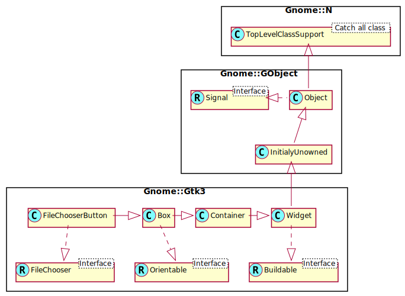

Gnome::Gtk3::FileChooserButton
==============================

A button to launch a file selection dialog

Description
===========

The **Gnome::Gtk3::FileChooserButton** is a widget that lets the user select a file. It implements the **Gnome::Gtk3::FileChooser** interface. Visually, it is a file name with a button to bring up a **Gnome::Gtk3::FileChooserDialog**. The user can then use that dialog to change the file associated with that button. This widget does not support setting the *select-multiple* property to `1`.

The **Gnome::Gtk3::FileChooserButton** supports the **GtkFileChooserAction**s (from **Gnome::Gtk3::FileChooser**) `GTK_FILE_CHOOSER_ACTION_OPEN` and `GTK_FILE_CHOOSER_ACTION_SELECT_FOLDER`.

The **Gnome::Gtk3::FileChooserButton** will ellipsize the label, and will thus request little horizontal space. To give the button more space, you should call `gtk_widget_get_preferred_size()`, `gtk_file_chooser_button_set_width_chars()`, or pack the button in such a way that other interface elements give space to the widget.

Css Nodes
---------

**Gnome::Gtk3::FileChooserButton** has a CSS node with name “filechooserbutton”, containing a subnode for the internal button with name “button” and style class “.file”.

See Also
--------

**Gnome::Gtk3::FileChooserDialog**

Synopsis
========

Declaration
-----------

    unit class Gnome::Gtk3::FileChooserButton;
    also is Gnome::Gtk3::Box;
    also does Gnome::Gtk3::FileChooser;

Inheriting this class
---------------------

Inheriting is done in a special way in that it needs a call from new() to get the native object created by the class you are inheriting from.

    use Gnome::Gtk3::FileChooserButton;

    unit class MyGuiClass;
    also is Gnome::Gtk3::FileChooserButton;

    submethod new ( |c ) {
      # let the Gnome::Gtk3::FileChooserButton class process the options
      self.bless( :GtkFileChooserButton, |c);
    }

    submethod BUILD ( ... ) {
      ...
    }

Example
-------

Create a button to let the user select a file in /etc

    use Gnome::Gtk3::FileChooser;
    use Gnome::Gtk3::FileChooserButton;

    my Gnome::Gtk3::FileChooserButton $button .= new(
      :title('Select a file'), :action(GTK_FILE_CHOOSER_ACTION_OPEN)
    );
    $button.set-current-folder("/etc");

Methods
=======

new
---

### new( :title, :action)

Create a new FileChooserButton object.

    multi method new (
      Str :$title!, GtkFileChooserAction,
      GtkFileChooserAction :$action = GTK_FILE_CHOOSER_ACTION_OPEN
    )

[[gtk_] file_chooser_button_] get_title
---------------------------------------

Retrieves the title of the browse dialog used by *button*. The returned value should not be modified or freed.

Returns: a pointer to the browse dialog’s title.

    method gtk_file_chooser_button_get_title ( --> Str )

[[gtk_] file_chooser_button_] set_title
---------------------------------------

Modifies the *title* of the browse dialog used by *button*.

    method gtk_file_chooser_button_set_title ( Str $title )

  * Str $title; the new browse dialog title.

[[gtk_] file_chooser_button_] get_width_chars
---------------------------------------------

Retrieves the width in characters of the *button* widget’s entry and/or label.

Returns: an integer width (in characters) that the button will use to size itself.

    method gtk_file_chooser_button_get_width_chars ( --> Int )

[[gtk_] file_chooser_button_] set_width_chars
---------------------------------------------

Sets the width (in characters) that *button* will use to *n_chars*.

    method gtk_file_chooser_button_set_width_chars ( Int $n_chars )

  * Int $n_chars; the new width, in characters.

Signals
=======

There are two ways to connect to a signal. The first option you have is to use `register-signal()` from **Gnome::GObject::Object**. The second option is to use `g_signal_connect_object()` directly from **Gnome::GObject::Signal**.

First method
------------

The positional arguments of the signal handler are all obligatory as well as their types. The named attributes `:$widget` and user data are optional.

    # handler method
    method mouse-event ( GdkEvent $event, :$widget ) { ... }

    # connect a signal on window object
    my Gnome::Gtk3::Window $w .= new( ... );
    $w.register-signal( self, 'mouse-event', 'button-press-event');

Second method
-------------

    my Gnome::Gtk3::Window $w .= new( ... );
    my Callable $handler = sub (
      N-GObject $native, GdkEvent $event, OpaquePointer $data
    ) {
      ...
    }

    $w.connect-object( 'button-press-event', $handler);

Also here, the types of positional arguments in the signal handler are important. This is because both methods `register-signal()` and `g_signal_connect_object()` are using the signatures of the handler routines to setup the native call interface.

Supported signals
-----------------

### file-set

The *file-set* signal is emitted when the user selects a file.

Note that this signal is only emitted when the user changes the file.

Since: 2.12

    method handler (
      Int :$_handle_id,
      Gnome::GObject::Object :_widget($widget),
      *%user-options
    );

  * $widget; the object which received the signal.

Properties
==========

An example of using a string type property of a **Gnome::Gtk3::Label** object. This is just showing how to set/read a property, not that it is the best way to do it. This is because a) The class initialization often provides some options to set some of the properties and b) the classes provide many methods to modify just those properties. In the case below one can use **new(:label('my text label'))** or **gtk_label_set_text('my text label')**.

    my Gnome::Gtk3::Label $label .= new;
    my Gnome::GObject::Value $gv .= new(:init(G_TYPE_STRING));
    $label.g-object-get-property( 'label', $gv);
    $gv.g-value-set-string('my text label');

Supported properties
--------------------

### Dialog

Instance of the **Gnome::Gtk3::FileChooserDialog** associated with the button. Widget type: GTK_TYPE_FILE_CHOOSER

The **Gnome::GObject::Value** type of property *dialog* is `G_TYPE_OBJECT`.

### Title

Title to put on the **Gnome::Gtk3::FileChooserDialog** associated with the button.

The **Gnome::GObject::Value** type of property *title* is `G_TYPE_STRING`.

### Width In Characters

The width of the entry and label inside the button, in characters.

The **Gnome::GObject::Value** type of property *width-chars* is `G_TYPE_INT`.

