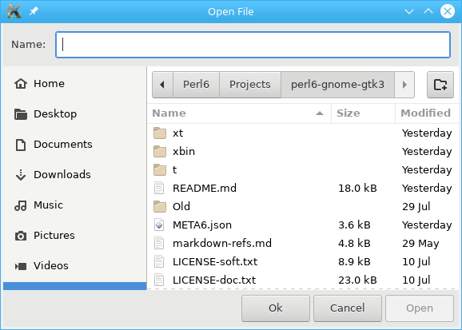

TITLE
=====

Gnome::Gtk3::FileChooserDialog

SUBTITLE
========

A file chooser dialog, suitable for “File/Open” or “File/Save” commands

Description
===========

*Gnome::Gtk3::FileChooserDialog* is a dialog box suitable for use with “File/Open” or “File/Save as” commands. This widget works by putting a *Gnome::Gtk3::FileChooserWidget* inside a *Gnome::Gtk3::Dialog*. It exposes the *Gnome::Gtk3::FileChooser* interface, so you can use all of the *Gnome::Gtk3::FileChooser* functions on the file chooser dialog as well as those for *Gnome::Gtk3::Dialog*.

Note that *Gnome::Gtk3::FileChooserDialog* does not have any methods of its own. Instead, you should use the functions that work on a *Gnome::Gtk3::FileChooser*.

If you want to integrate well with the platform you should use the *Gnome::Gtk3::FileChooserNative* API, which will use a platform-specific dialog if available and fall back to **Gnome::Gtk3::FileChooserDialog** otherwise.

Typical usage
-------------

In the simplest of cases, you can use a *Gnome::Gtk3::FileChooserDialog* to select a file for opening:

    my Gnome::Gtk3::FileChooserDialog $dialog .= new(
      :title("Open File"), :parent($top-window),
      :action(GTK_FILE_CHOOSER_ACTION_OPEN),
      :button-spec( [
          "_Cancel", GTK_RESPONSE_CANCEL,
          "_Open", GTK_RESPONSE_ACCEPT
        ]
      )
    );

    my $response = $dialog.gtk-dialog-run;
    $dialog.gtk-widget-hide;
    if $response ~~ GTK_RESPONSE_ACCEPT {
      my Str $file = $dialog.get-filename;
      note "Opening file $file";
    }

To use a dialog for saving, you can use this:

    my Gnome::Gtk3::FileChooserDialog $dialog .= new(
      :title("Open File"), :parent($top-window),
      :action(GTK_FILE_CHOOSER_ACTION_SAVE),
      :button-spec( [
          "_Cancel", GTK_RESPONSE_CANCEL,
          "_Open", GTK_RESPONSE_ACCEPT
        ]
      )
    );

    $dialog.set-do-overwrite-confirmation(1);

    if $user-edited-a-new-document {
      $dialog.set_current_name("Untitled document");
    }

    else {
      $dialog.set_filename($existing-filename);
    }

    my $response = $dialog.gtk-dialog-run;
    $dialog.gtk-widget-hide;
    if $response ~~ GTK_RESPONSE_ACCEPT {
      my Str $file = $dialog.get-filename;
      note "Saving to file $file";
    }

    $dialog.gtk-widget-destroy;

Setting up a file chooser dialog
--------------------------------

There are various cases in which you may need to use a *Gnome::Gtk3::FileChooserDialog*:

- To select a file for opening. Use *GTK_FILE_CHOOSER_ACTION_OPEN*.

- To save a file for the first time. Use *GTK_FILE_CHOOSER_ACTION_SAVE*, and suggest a name such as “Untitled” with `gtk_file_chooser_set_current_name()`.

- To save a file under a different name. Use *GTK_FILE_CHOOSER_ACTION_SAVE*, and set the existing filename with `gtk_file_chooser_set_filename()`.

- To choose a folder instead of a file. Use *GTK_FILE_CHOOSER_ACTION_SELECT_FOLDER*.

Note that old versions of the file chooser’s documentation suggested using `gtk_file_chooser_set_current_folder()` in various situations, with the intention of letting the application suggest a reasonable default folder. This is no longer considered to be a good policy, as now the file chooser is able to make good suggestions on its own. In general, you should only cause the file chooser to show a specific folder when it is appropriate to use `gtk_file_chooser_set_filename()`, i.e. when you are doing a Save As command and you already have a file saved somewhere.

Response Codes
--------------

*Gnome::Gtk3::FileChooserDialog* inherits from *Gnome::Gtk3::Dialog*, so buttons that go in its action area have response codes such as *GTK_RESPONSE_ACCEPT* and *GTK_RESPONSE_CANCEL*. For example, you could create a dialog window as follows;

    my Gnome::Gtk3::FileChooserDialog $dialog .= new(
      :title("Open File"), :parent($top-window),
      :action(GTK_FILE_CHOOSER_ACTION_OPEN),
      :button-spec( [
          "_Cancel", GTK_RESPONSE_CANCEL,
          "_Open", GTK_RESPONSE_ACCEPT
        ]
      )
    );

This will create buttons for “Cancel” and “Open” that use stock response identifiers from *ResponseType* from **Gnome::Gtk3::Dialog**. For most dialog boxes you can use your own custom response codes rather than the ones in *ResponseType*, but *Gnome::Gtk3::FileChooserDialog* assumes that its “accept”-type action, e.g. an “Open” or “Save” button, will have one of the following response codes:

  * *GTK_RESPONSE_ACCEPT*

  * *GTK_RESPONSE_OK*

  * *GTK_RESPONSE_YES*

  * *GTK_RESPONSE_APPLY*

This is because *Gnome::Gtk3::FileChooserDialog* must intercept responses and switch to folders if appropriate, rather than letting the dialog terminate — the implementation uses these known response codes to know which responses can be blocked if appropriate.

To summarize, make sure you use a *ResponseType* when you use *Gnome::Gtk3::FileChooserDialog* to ensure proper operation.

See Also
--------

**Gnome::Gtk3::FileChooser**, **Gnome::Gtk3::Dialog**.

Synopsis
========

Declaration
-----------

    unit class Gnome::Gtk3::FileChooserDialog;
    also is Gnome::Gtk3::Dialog;

Implemented Interfaces
----------------------

  * Gnome::Gtk3::Buildable

  * [Gnome::Gtk3::FileChooser](FileChooser.html)

Example
-------

An example using builder

    use Gnome::Gtk3::Dialog;
    use Gnome::Gtk3::FileChooserDialog;

    my Gnome::Gtk3::FileChooserDialog $fchoose .= new(:build-id<save-dialog>);

    # show the dialog
    my Int $response = $fchoose.gtk-dialog-run;
    if $response ~~ GTK_RESPONSE_ACCEPT {
      ...
    }

    # when dialog buttons are pressed hide it again
    $fchoose.hide;

Methods
=======

new
---

### multi method new ( GtkFileChooserAction :$action! )

    multi method new (
      GtkFileChooserAction :$action!, Str :$title, N-GObject $parent,
      Array :$buttons-spec
    )

Create an object using a native object from elsewhere. See also *gtk_file_chooser_dialog_new()* below.

### multi method new ( N-GObject :$widget! )

Create an object using a native object from elsewhere. See also **Gnome::GObject::Object**.

### multi method new ( Str :$build-id! )

Create an object using a native object from a builder. See also **Gnome::GObject::Object**.

gtk_file_chooser_dialog_new
---------------------------

Creates a new file chooser dialog. This function is analogous to `gtk_dialog_new_with_buttons()`. This method is called when creating the object using *.new(:action(...), ...)*.

Returns: a new native file chooser dialog.

Since: 2.4

    method gtk_file_chooser_dialog_new (
      Str $title, N-GObject $parent, GtkFileChooserAction $action,
      *@buttons-spec
      --> N-GObject
    )

  * Str $title; Title of the dialog, or `Any`.

  * N-GObject $parent; Transient parent of the dialog, or `Any`.

  * GtkFileChooserAction $action; Open or save mode for the dialog.

  * *@buttons-spec is a list button specifications. The list has an even number of members of which;

    * Str $button-label to go on the button.

    * $response-code, an Int, GtkResponseType or other enum (with int values) to return for the button. Taking a GtkResponseType will help the chooser dialog make a proper decision if needed. Otherwise, the user can always check codes returned by the dialog to find out what to do next.

