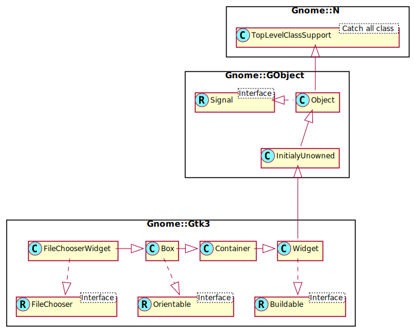

Gnome::Gtk3::FileChooserWidget
==============================

A file chooser widget

Description
===========

**Gnome::Gtk3::FileChooserWidget** is a widget for choosing files. It exposes the **Gnome::Gtk3::FileChooser** interface, and you should use the methods of this interface to interact with the widget.

Css Nodes
---------

    * GtkFileChooserWidget has a single CSS node with name filechooser.

See Also
--------

**Gnome::Gtk3::FileChooserDialog**

Synopsis
========

Declaration
-----------

    unit class Gnome::Gtk3::FileChooserWidget;
    also is Gnome::Gtk3::Box;
    also does Gnome::Gtk3::FileChooser;

Uml Diagram
-----------

Methods
=======

new
---

### :action

Create a new FileChooserWidget object.

    multi method new ( GtkFileChooserAction :$action! )

### :native-object

Create a FileChooserWidget object using a native object from elsewhere. See also **Gnome::N::TopLevelClassSupport**.

    multi method new ( N-GObject :$native-object! )

### :build-id

Create a FileChooserWidget object using a native object returned from a builder. See also **Gnome::GObject::Object**.

    multi method new ( Str :$build-id! )

Signals
=======

There are two ways to connect to a signal. The first option you have is to use `register-signal()` from **Gnome::GObject::Object**. The second option is to use `connect-object()` directly from **Gnome::GObject::Signal**.

First method
------------

The positional arguments of the signal handler are all obligatory as well as their types. The named attributes `:$widget` and user data are optional.

    # handler method
    method mouse-event ( GdkEvent $event, :$widget ) { ... }

    # connect a signal on window object
    my Gnome::Gtk3::Window $w .= new( ... );
    $w.register-signal( self, 'mouse-event', 'button-press-event');

Second method
-------------

    my Gnome::Gtk3::Window $w .= new( ... );
    my Callable $handler = sub (
      N-GObject $native, GdkEvent $event, OpaquePointer $data
    ) {
      ...
    }

    $w.connect-object( 'button-press-event', $handler);

Also here, the types of positional arguments in the signal handler are important. This is because both methods `register-signal()` and `connect-object()` are using the signatures of the handler routines to setup the native call interface.

Supported signals
-----------------

### desktop-folder

The *desktop-folder* signal is a [keybinding signal][GtkBindingSignal] which gets emitted when the user asks for it.

This is used to make the file chooser show the user's Desktop folder in the file list.

The default binding for this signal is `Alt + D`.

    method handler (
      Int :$_handle_id,
      Gnome::GObject::Object :_widget($widget),
      *%user-options
    );

  * $widget; the object which received the signal

  * $_handle_id; the registered event handler id

### down-folder

The *down-folder* signal is a [keybinding signal][GtkBindingSignal] which gets emitted when the user asks for it.

This is used to make the file chooser go to a child of the current folder in the file hierarchy. The subfolder that will be used is displayed in the path bar widget of the file chooser. For example, if the path bar is showing "/foo/bar/baz", with bar currently displayed, then this will cause the file chooser to switch to the "baz" subfolder.

The default binding for this signal is `Alt + Down`.

    method handler (
      Int :$_handle_id,
      Gnome::GObject::Object :_widget($widget),
      *%user-options
    );

  * $widget; the object which received the signal

  * $_handle_id; the registered event handler id

### home-folder

The *home-folder* signal is a [keybinding signal][GtkBindingSignal] which gets emitted when the user asks for it.

This is used to make the file chooser show the user's home folder in the file list.

The default binding for this signal is `Alt + Home`.

    method handler (
      Int :$_handle_id,
      Gnome::GObject::Object :_widget($widget),
      *%user-options
    );

  * $widget; the object which received the signal

  * $_handle_id; the registered event handler id

### location-popup

The *location-popup* signal is a [keybinding signal][GtkBindingSignal] which gets emitted when the user asks for it.

This is used to make the file chooser show a "Location" prompt which the user can use to manually type the name of the file he wishes to select.

The default bindings for this signal are `Control + L` with a *path* string of "" (the empty string). It is also bound to `/` with a *path* string of "`/`" (a slash): this lets you type `/` and immediately type a path name. On Unix systems, this is bound to `~` (tilde) with a *path* string of "~" itself for access to home directories.

    method handler (
      Str $path,
      Int :$_handle_id,
      Gnome::GObject::Object :_widget($widget),
      *%user-options
    );

  * $widget; the object which received the signal

  * $path; a string that gets put in the text entry for the file name

  * $_handle_id; the registered event handler id

### location-popup-on-paste

The *location-popup-on-paste* signal is a [keybinding signal][GtkBindingSignal] which gets emitted when the user asks for it.

This is used to make the file chooser show a "Location" prompt when the user pastes into a **Gnome::Gtk3::FileChooserWidget**.

The default binding for this signal is `Control + V`.

    method handler (
      Int :$_handle_id,
      Gnome::GObject::Object :_widget($widget),
      *%user-options
    );

  * $widget; the object which received the signal

  * $_handle_id; the registered event handler id

### location-toggle-popup

The *location-toggle-popup* signal is a [keybinding signal][GtkBindingSignal] which gets emitted when the user asks for it.

This is used to toggle the visibility of a "Location" prompt which the user can use to manually type the name of the file he wishes to select.

The default binding for this signal is `Control + L`.

    method handler (
      Int :$_handle_id,
      Gnome::GObject::Object :_widget($widget),
      *%user-options
    );

  * $widget; the object which received the signal

  * $_handle_id; the registered event handler id

### places-shortcut

The *places-shortcut* signal is a [keybinding signal][GtkBindingSignal] which gets emitted when the user asks for it.

This is used to move the focus to the places sidebar.

The default binding for this signal is `Alt + P`.

    method handler (
      Int :$_handle_id,
      Gnome::GObject::Object :_widget($widget),
      *%user-options
    );

  * $widget; the object which received the signal

  * $_handle_id; the registered event handler id

### quick-bookmark

The *quick-bookmark* signal is a [keybinding signal][GtkBindingSignal] which gets emitted when the user asks for it.

This is used to make the file chooser switch to the bookmark specified in the *bookmark-index* parameter. For example, if you have three bookmarks, you can pass 0, 1, 2 to this signal to switch to each of them, respectively.

The default binding for this signal is `Alt + 1`, `Alt + 2`, etc. until `Alt + 0`. Note that in the default binding, that `Alt + 1` is actually defined to switch to the bookmark at index 0, and so on successively; `Alt + 0` is defined to switch to the bookmark at index 10.

    method handler (
      Int $bookmark_index,
      Int :$_handle_id,
      Gnome::GObject::Object :_widget($widget),
      *%user-options
    );

  * $widget; the object which received the signal

  * $bookmark_index; the number of the bookmark to switch to

  * $_handle_id; the registered event handler id

### recent-shortcut

The *recent-shortcut* signal is a [keybinding signal][GtkBindingSignal] which gets emitted when the user asks for it.

This is used to make the file chooser show the Recent location.

The default binding for this signal is `Alt + R`.

    method handler (
      Int :$_handle_id,
      Gnome::GObject::Object :_widget($widget),
      *%user-options
    );

  * $widget; the object which received the signal

  * $_handle_id; the registered event handler id

### search-shortcut

The *search-shortcut* signal is a [keybinding signal][GtkBindingSignal] which gets emitted when the user asks for it.

This is used to make the file chooser show the search entry.

The default binding for this signal is `Alt + S`.

    method handler (
      Int :$_handle_id,
      Gnome::GObject::Object :_widget($widget),
      *%user-options
    );

  * $widget; the object which received the signal

  * $_handle_id; the registered event handler id

### show-hidden

The *show-hidden* signal is a [keybinding signal][GtkBindingSignal] which gets emitted when the user asks for it.

This is used to make the file chooser display hidden files.

The default binding for this signal is `Control + H`.

    method handler (
      Int :$_handle_id,
      Gnome::GObject::Object :_widget($widget),
      *%user-options
    );

  * $widget; the object which received the signal

  * $_handle_id; the registered event handler id

### up-folder

The *up-folder* signal is a [keybinding signal][GtkBindingSignal] which gets emitted when the user asks for it.

This is used to make the file chooser go to the parent of the current folder in the file hierarchy.

The default binding for this signal is `Alt + Up`.

    method handler (
      Int :$_handle_id,
      Gnome::GObject::Object :_widget($widget),
      *%user-options
    );

  * $widget; the object which received the signal

  * $_handle_id; the registered event handler id

Properties
==========

An example of using a string type property of a **Gnome::Gtk3::Label** object. This is just showing how to set/read a property, not that it is the best way to do it. This is because a) The class initialization often provides some options to set some of the properties and b) the classes provide many methods to modify just those properties. In the case below one can use **new(:label('my text label'))** or **.set-text('my text label')**.

    my Gnome::Gtk3::Label $label .= new;
    my Gnome::GObject::Value $gv .= new(:init(G_TYPE_STRING));
    $label.get-property( 'label', $gv);
    $gv.set-string('my text label');

Supported properties
--------------------

### Search mode: search-mode

Search mode Default value: False

The **Gnome::GObject::Value** type of property *search-mode* is `G_TYPE_BOOLEAN`.

### Subtitle: subtitle

Subtitle Default value:

The **Gnome::GObject::Value** type of property *subtitle* is `G_TYPE_STRING`.

