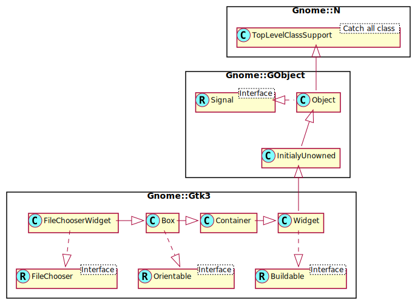

Gnome::Gtk3::FileChooserWidget
==============================

A file chooser widget

Description
===========

**Gnome::Gtk3::FileChooserWidget** is a widget for choosing files. It exposes the **Gnome::Gtk3::FileChooser** interface, and you should use the methods of this interface to interact with the widget.

Css Nodes
---------

    * GtkFileChooserWidget has a single CSS node with name filechooser.

See Also
--------

**Gnome::Gtk3::FileChooserDialog**

Synopsis
========

Declaration
-----------

    unit class Gnome::Gtk3::FileChooserWidget;
    also is Gnome::Gtk3::Box;
    also does Gnome::Gtk3::FileChooser;

Uml Diagram
-----------

Methods
=======

new
---

### :action

Create a new FileChooserWidget object.

    multi method new (
      GtkFileChooserAction :$action! = GTK_FILE_CHOOSER_ACTION_OPEN
    )

### :native-object

Create a FileChooserWidget object using a native object from elsewhere. See also **Gnome::N::TopLevelClassSupport**.

    multi method new ( N-GObject :$native-object! )

### :build-id

Create a FileChooserWidget object using a native object returned from a builder. See also **Gnome::GObject::Object**.

    multi method new ( Str :$build-id! )

Signals
=======

desktop-folder
--------------

The *desktop-folder* signal is a [keybinding signal][GtkBindingSignal] which gets emitted when the user asks for it.

This is used to make the file chooser show the user's Desktop folder in the file list.

The default binding for this signal is `Alt + D`.

    method handler (
      Int :$_handler-id,
      N-GObject :$_native-object,
      *%user-options
    )

  * $_handler-id; The handler id which is returned from the registration

  * $_native-object; The native object provided by the caller wrapped in the Raku object which registered the signal.

  * %user-options; A list of named arguments provided at the `register-signal()` method

down-folder
-----------

The *down-folder* signal is a keybinding signal which gets emitted when the user asks for it.

This is used to make the file chooser go to a child of the current folder in the file hierarchy. The subfolder that will be used is displayed in the path bar widget of the file chooser. For example, if the path bar is showing "/foo/bar/baz", with bar currently displayed, then this will cause the file chooser to switch to the "baz" subfolder.

The default binding for this signal is `Alt + Down`.

    method handler (
      Int :$_handler-id,
      N-GObject :$_native-object,
      *%user-options
    )

  * $_handler-id; The handler id which is returned from the registration

  * $_native-object; The native object provided by the caller wrapped in the Raku object which registered the signal.

  * %user-options; A list of named arguments provided at the `register-signal()` method

home-folder
-----------

The *home-folder* signal is a keybinding signal which gets emitted when the user asks for it.

This is used to make the file chooser show the user's home folder in the file list.

The default binding for this signal is `Alt + Home`.

    method handler (
      Int :$_handler-id,
      N-GObject :$_native-object,
      *%user-options
    )

  * $_handler-id; The handler id which is returned from the registration

  * $_native-object; The native object provided by the caller wrapped in the Raku object which registered the signal.

  * %user-options; A list of named arguments provided at the `register-signal()` method

location-popup
--------------

The *location-popup* signal is a keybinding signal which gets emitted when the user asks for it.

This is used to make the file chooser show a "Location" prompt which the user can use to manually type the name of the file he wishes to select.

The default bindings for this signal are `Control + L` with a *path* string of "" (the empty string). It is also bound to `/` with a *path* string of "`/`" (a slash): this lets you type `/` and immediately type a path name. On Unix systems, this is bound to `~` (tilde) with a *path* string of "~" itself for access to home directories.

    method handler (
      Str $path,
      Int :$_handler-id,
      N-GObject :$_native-object,
      *%user-options
    )

  * $path; a string that gets put in the text entry for the file name

  * $_handler-id; The handler id which is returned from the registration

  * $_native-object; The native object provided by the caller wrapped in the Raku object which registered the signal.

  * %user-options; A list of named arguments provided at the `register-signal()` method

location-popup-on-paste
-----------------------

The *location-popup-on-paste* signal is a keybinding signal which gets emitted when the user asks for it.

This is used to make the file chooser show a "Location" prompt when the user pastes into a **Gnome::Gtk3::FileChooserWidget**.

The default binding for this signal is `Control + V`.

    method handler (
      Int :$_handler-id,
      N-GObject :$_native-object,
      *%user-options
    )

  * $_handler-id; The handler id which is returned from the registration

  * $_native-object; The native object provided by the caller wrapped in the Raku object which registered the signal.

  * %user-options; A list of named arguments provided at the `register-signal()` method

location-toggle-popup
---------------------

The *location-toggle-popup* signal is a keybinding signal which gets emitted when the user asks for it.

This is used to toggle the visibility of a "Location" prompt which the user can use to manually type the name of the file he wishes to select.

The default binding for this signal is `Control + L`.

    method handler (
      Int :$_handler-id,
      N-GObject :$_native-object,
      *%user-options
    )

  * $_handler-id; The handler id which is returned from the registration

  * $_native-object; The native object provided by the caller wrapped in the Raku object which registered the signal.

  * %user-options; A list of named arguments provided at the `register-signal()` method

places-shortcut
---------------

The *places-shortcut* signal is a keybinding signal which gets emitted when the user asks for it.

This is used to move the focus to the places sidebar.

The default binding for this signal is `Alt + P`.

    method handler (
      Int :$_handler-id,
      N-GObject :$_native-object,
      *%user-options
    )

  * $_handler-id; The handler id which is returned from the registration

  * $_native-object; The native object provided by the caller wrapped in the Raku object which registered the signal.

  * %user-options; A list of named arguments provided at the `register-signal()` method

quick-bookmark
--------------

The *quick-bookmark* signal is a keybinding signal which gets emitted when the user asks for it.

This is used to make the file chooser switch to the bookmark specified in the *bookmark_index* parameter. For example, if you have three bookmarks, you can pass 0, 1, 2 to this signal to switch to each of them, respectively.

The default binding for this signal is `Alt + 1`, `Alt + 2`, etc. until `Alt + 0`. Note that in the default binding, that `Alt + 1` is actually defined to switch to the bookmark at index 0, and so on successively; `Alt + 0` is defined to switch to the bookmark at index 10.

    method handler (
      Int $bookmark_index,
      Int :$_handler-id,
      N-GObject :$_native-object,
      *%user-options
    )

  * $bookmark_index; the number of the bookmark to switch to

  * $_handler-id; The handler id which is returned from the registration

  * $_native-object; The native object provided by the caller wrapped in the Raku object which registered the signal.

  * %user-options; A list of named arguments provided at the `register-signal()` method

recent-shortcut
---------------

The *recent-shortcut* signal is a keybinding signal which gets emitted when the user asks for it.

This is used to make the file chooser show the Recent location.

The default binding for this signal is `Alt + R`.

    method handler (
      Int :$_handler-id,
      N-GObject :$_native-object,
      *%user-options
    )

  * $_handler-id; The handler id which is returned from the registration

  * $_native-object; The native object provided by the caller wrapped in the Raku object which registered the signal.

  * %user-options; A list of named arguments provided at the `register-signal()` method

search-shortcut
---------------

The *search-shortcut* signal is a keybinding signal which gets emitted when the user asks for it.

This is used to make the file chooser show the search entry.

The default binding for this signal is `Alt + S`.

    method handler (
      Int :$_handler-id,
      N-GObject :$_native-object,
      *%user-options
    )

  * $_handler-id; The handler id which is returned from the registration

  * $_native-object; The native object provided by the caller wrapped in the Raku object which registered the signal.

  * %user-options; A list of named arguments provided at the `register-signal()` method

show-hidden
-----------

The *show-hidden* signal is a keybinding signal which gets emitted when the user asks for it.

This is used to make the file chooser display hidden files.

The default binding for this signal is `Control + H`.

    method handler (
      Int :$_handler-id,
      N-GObject :$_native-object,
      *%user-options
    )

  * $_handler-id; The handler id which is returned from the registration

  * $_native-object; The native object provided by the caller wrapped in the Raku object which registered the signal.

  * %user-options; A list of named arguments provided at the `register-signal()` method

up-folder
---------

The *up-folder* signal is a keybinding signal which gets emitted when the user asks for it.

This is used to make the file chooser go to the parent of the current folder in the file hierarchy.

The default binding for this signal is `Alt + Up`.

    method handler (
      Int :$_handler-id,
      N-GObject :$_native-object,
      *%user-options
    )

  * $_handler-id; The handler id which is returned from the registration

  * $_native-object; The native object provided by the caller wrapped in the Raku object which registered the signal.

  * %user-options; A list of named arguments provided at the `register-signal()` method

Properties
==========

search-mode
-----------

Search mode

  * **Gnome::GObject::Value** type of this property is G_TYPE_BOOLEAN

  * Parameter is readable and writable.

  * Default value is FALSE.

subtitle
--------

Subtitle

  * **Gnome::GObject::Value** type of this property is G_TYPE_STRING

  * Parameter is readable.

