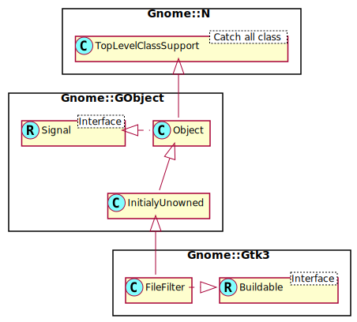

Gnome::Gtk3::FileFilter
=======================

A filter for selecting a file subset

Description
===========

A **Gnome::Gtk3::FileFilter** can be used to restrict the files being shown in a **Gnome::Gtk3::FileChooser**. Files can be filtered based on their name (with `gtk_file_filter_add_pattern()`), on their mime type (with `gtk_file_filter_add_mime_type()`), or by a custom filter function (with `gtk_file_filter_add_custom()`).

Filtering by mime types handles aliasing and subclassing of mime types; e.g. a filter for text/plain also matches a file with mime type application/rtf, since application/rtf is a subclass of text/plain. Note that **Gnome::Gtk3::FileFilter** allows wildcards for the subtype of a mime type, so you can e.g. filter for image/\*.

Normally, filters are used by adding them to a **Gnome::Gtk3::FileChooser**, see `gtk_file_chooser_add_filter()`, but it is also possible to manually use a filter on a file with `gtk_file_filter_filter()`.

**Gnome::Gtk3::FileFilter** as **Gnome::Gtk3::Buildable**
---------------------------------------------------------

The **Gnome::Gtk3::FileFilter** implementation of the **Gnome::Gtk3::Buildable** interface supports adding rules using the <mime-types>, <patterns> and <applications> elements and listing the rules within. Specifying a <mime-type> or <pattern> has the same effect as calling `gtk_file_filter_add_mime_type()` or `gtk_file_filter_add_pattern()`.

An example of a UI definition fragment specifying **Gnome::Gtk3::FileFilter** rules:

    <object class="GtkFileFilter>">
      <mime-types>
        <mime-type>text/plain</mime-type>
        <mime-type>image/ *</mime-type>
      </mime-types>
      <patterns>
        <pattern>*.txt</pattern>
        <pattern>*.png</pattern>
      </patterns>
    </object>

See Also
--------

**Gnome::Gtk3::FileChooser**

Synopsis
========

Declaration
-----------

    unit class Gnome::Gtk3::FileFilter;
    also is Gnome::GObject::InitiallyUnowned;
    also does Gnome::Gtk3::Buildable;

Uml Diagram
-----------

Types
=====

enum GtkFileFilterFlags
-----------------------

These flags indicate what parts of a **Gnome::Gtk3::FileFilterInfo** struct are filled or need to be filled.

  * GTK_FILE_FILTER_FILENAME: the filename of the file being tested

  * GTK_FILE_FILTER_URI: the URI for the file being tested

  * GTK_FILE_FILTER_DISPLAY_NAME: the string that will be used to display the file in the file chooser

  * GTK_FILE_FILTER_MIME_TYPE: the mime type of the file

class N-GtkFileFilterInfo
-------------------------

A **N-GtkFileFilterInfo**-struct is used to pass information about the tested file to `gtk_file_filter_filter()`.

  * **GtkFileFilterFlags** $.contains: Flags indicating which of the following fields need are filled

  * Str $.filename: the filename of the file being tested

  * Str $.uri: the URI for the file being tested

  * Str $.display_name: the string that will be used to display the file in the file chooser

  * Str $.mime_type: the mime type of the file

Methods
=======

new
---

### default, no options

Create a new plain object.

    multi method new ( )

### :variant

Deserialize a file filter from an a{sv} variant in the format produced by `to_gvariant()`.

    multi method new ( N-GObject :$variant! )

### :native-object

Create an object using a native object from elsewhere. See also **Gnome::N::TopLevelSupportClass**.

    multi method new ( N-GObject :$native-object! )

### :build-id

Create an object using a native object from a builder. See also **Gnome::GObject::Object**.

    multi method new ( Str :$build-id! )

add-mime-type
-------------

Adds a rule allowing a given mime type to *filter*.

    method add-mime-type ( Str $mime_type )

  * $mime_type; name of a MIME type

add-pattern
-----------

Adds a rule allowing a shell style glob to a filter.

    method add-pattern ( Str $pattern )

  * $pattern; a shell style glob

add-pixbuf-formats
------------------

Adds a rule allowing image files in the formats supported by GdkPixbuf.

    method add-pixbuf-formats ( )

get-name
--------

Gets the human-readable name for the filter. See `set_name()`.

Returns: The human-readable name of the filter, or `undefined`. This value is owned by GTK+ and must not be modified or freed.

    method get-name ( --> Str )

set-name
--------

Sets the human-readable name of the filter; this is the string that will be displayed in the file selector user interface if there is a selectable list of filters.

    method set-name ( Str $name )

  * $name; the human-readable-name for the filter, or `undefined` to remove any existing name.

to-gvariant
-----------

Serialize a file filter to an a{sv} variant.

Returns: a new, floating, **Gnome::Glib::Variant**

    method to-gvariant ( --> N-GObject )

