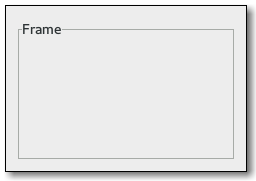

Gnome::Gtk3::Frame
==================

A bin with a decorative frame and optional label

Description
===========

The frame widget is a bin that surrounds its child with a decorative frame and an optional label. If present, the label is drawn in a gap in the top side of the frame. The position of the label can be controlled with `gtk_frame_set_label_align()`.

**Gnome::Gtk3::Frame** as **Gnome::Gtk3::Buildable**
----------------------------------------------------

The **Gnome::Gtk3::Frame** implementation of the **Gnome::Gtk3::Buildable** interface supports placing a child in the label position by specifying “label” as the “type” attribute of a <child> element. A normal content child can be specified without specifying a <child> type attribute.

An example of a UI definition fragment with **Gnome::Gtk3::Frame**:

    <object class="GtkFrame">
      <child type="label">
        <object class="GtkLabel" id="frame-label"/>
      </child>
      <child>
        <object class="GtkEntry" id="frame-content"/>
      </child>
    </object>

Css Nodes
---------

    frame
    ├── border[.flat]
    ├── <label widget>
    ╰── <child>

**Gnome::Gtk3::Frame** has a main CSS node named “frame” and a subnode named “border”. The “border” node is used to draw the visible border. You can set the appearance of the border using CSS properties like “border-style” on the “border” node.

The border node can be given the style class “.flat”, which is used by themes to disable drawing of the border. To do this from code, call `gtk_frame_set_shadow_type()` with `GTK_SHADOW_NONE` to add the “.flat” class or any other shadow type to remove it.

Synopsis
========

Declaration
-----------

    unit class Gnome::Gtk3::Frame;
    also is Gnome::Gtk3::Bin;

Inheriting this class
---------------------

Inheriting is done in a special way in that it needs a call from new() to get the native object created by the class you are inheriting from.

    use Gnome::Gtk3::Frame;

    unit class MyGuiClass;
    also is Gnome::Gtk3::Frame;

    submethod new ( |c ) {
      # let the Gnome::Gtk3::Frame class process the options
      self.bless( :GtkFrame, |c);
    }

    submethod BUILD ( ... ) {
      ...
    }

Methods
=======

new
---

Create a new default Frame.

    multi method new ( )

Create a new Frame with a label.

    multi method new ( :label! )

Create an object using a native object from elsewhere. See also **Gnome::GObject::Object**.

    multi method new ( N-GObject :$native-object! )

Create an object using a native object from a builder. See also **Gnome::GObject::Object**.

    multi method new ( Str :$build-id! )

gtk_frame_new
-------------

Creates a new **Gnome::Gtk3::Frame**, with optional label *$label*. If *$label* is `Any`, the label is omitted.

Returns: a new **Gnome::Gtk3::Frame** widget

    method gtk_frame_new ( Str $label --> N-GObject )

  * Str $label; the text to use as the label of the frame

[gtk_frame_] set_label
----------------------

Removes the current *label-widget*. If *$label* is not `Any`, creates a new **Gnome::Gtk3::Label** with that text and adds it as the *label-widget*.

    method gtk_frame_set_label ( Str $label )

  * Str $label; the text to use as the label of the frame

[gtk_frame_] get_label
----------------------

If the frame’s label widget is a **Gnome::Gtk3::Label**, returns the text in the label widget. (The frame will have a **Gnome::Gtk3::Label** for the label widget if a non-`Any` argument was passed to `gtk_frame_new()`.)

Returns: (nullable): the text in the label, or `Any` if there was no label widget or the lable widget was not a **Gnome::Gtk3::Label**. This string is owned by GTK+ and must not be modified or freed.

    method gtk_frame_get_label ( --> Str )

[gtk_frame_] set_label_widget
-----------------------------

Sets the *$label-widget* for the frame. This is the widget that will appear embedded in the top edge of the frame as a title.

    method gtk_frame_set_label_widget ( N-GObject $label_widget )

  * N-GObject $label_widget; the new label widget

[gtk_frame_] get_label_widget
-----------------------------

Retrieves the label widget for the frame. See `gtk_frame_set_label_widget()`.

Returns: (nullable) (transfer none): the label widget, or `Any` if there is none.

    method gtk_frame_get_label_widget ( --> N-GObject )

[gtk_frame_] set_label_align
----------------------------

Sets the alignment of the frame widget’s label. The default values for a newly created frame are 0.0 and 0.5.

    method gtk_frame_set_label_align ( Num $xalign, Num $yalign )

  * Num $xalign; The position of the label along the top edge of the widget. A value of 0.0 represents left alignment; 1.0 represents right alignment.

  * Num $yalign; The y alignment of the label. A value of 0.0 aligns under the frame; 1.0 aligns above the frame. If the values are exactly 0.0 or 1.0 the gap in the frame won’t be painted because the label will be completely above or below the frame.

[gtk_frame_] get_label_align
----------------------------

Retrieves the X and Y alignment of the frame’s label. See `gtk_frame_set_label_align()`.

    method gtk_frame_get_label_align ( --> List )

The list has the following items

  * Num $xalign; location to store X alignment of frame’s label, or `Any`

  * Num $yalign; location to store Y alignment of frame’s label, or `Any`

[gtk_frame_] set_shadow_type
----------------------------

Sets the *shadow-type* for *frame*, i.e. whether it is drawn without (`GTK_SHADOW_NONE`) or with (other values) a visible border. Values other than `GTK_SHADOW_NONE` are treated identically by **Gnome::Gtk3::Frame**. The chosen type is applied by removing or adding the .flat class to the CSS node named border.

    method gtk_frame_set_shadow_type ( GtkShadowType $type )

  * GtkShadowType $type; the new **Gnome::Gtk3::ShadowType**

[gtk_frame_] get_shadow_type
----------------------------

Retrieves the shadow type of the frame. See `gtk_frame_set_shadow_type()`.

Returns: the current shadow type of the frame.

    method gtk_frame_get_shadow_type ( --> GtkShadowType )

Properties
==========

An example of using a string type property of a **Gnome::Gtk3::Label** object. This is just showing how to set/read a property, not that it is the best way to do it. This is because a) The class initialization often provides some options to set some of the properties and b) the classes provide many methods to modify just those properties. In the case below one can use **new(:label('my text label'))** or **gtk_label_set_text('my text label')**.

    my Gnome::Gtk3::Label $label .= new;
    my Gnome::GObject::Value $gv .= new(:init(G_TYPE_STRING));
    $label.g-object-get-property( 'label', $gv);
    $gv.g-value-set-string('my text label');

Supported properties
--------------------

### Label

Text of the frame's label Default value: Any

The **Gnome::GObject::Value** type of property *label* is `G_TYPE_STRING`.

### Label xalign

The horizontal alignment of the label.

The **Gnome::GObject::Value** type of property *label-xalign* is `G_TYPE_FLOAT`.

### Label yalign

The vertical alignment of the label.

The **Gnome::GObject::Value** type of property *label-yalign* is `G_TYPE_FLOAT`.

### Frame shadow

Appearance of the frame border Default value: False

The **Gnome::GObject::Value** type of property *shadow-type* is `G_TYPE_ENUM`.

### Label widget

A widget to display in place of the usual frame label Widget type: GTK_TYPE_WIDGET

The **Gnome::GObject::Value** type of property *label-widget* is `G_TYPE_OBJECT`.

