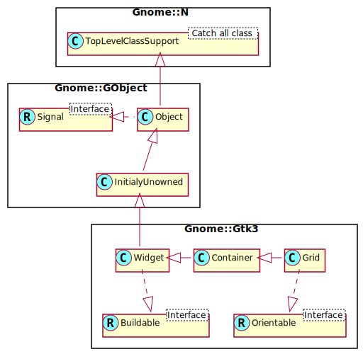

Gnome::Gtk3::Grid
=================

Pack widgets in a rows and columns

Description
===========

**Gnome::Gtk3::Grid** is a container which arranges its child widgets in rows and columns, with arbitrary positions and horizontal/vertical spans.

Children are added using `gtk_grid_attach()`. They can span multiple rows or columns. It is also possible to add a child next to an existing child, using `gtk_grid_attach_next_to()`. The behaviour of **Gnome::Gtk3::Grid** when several children occupy the same grid cell is undefined.

**Gnome::Gtk3::Grid** can be used like a **Gnome::Gtk3::Box** by just using `gtk_container_add()`, which will place children next to each other in the direction determined by the *orientation* property. However, if all you want is a single row or column, then **Gnome::Gtk3::Box** is the preferred widget.

Note that the HBox and VBox is deprecated and therefore not implemented in this Raku package.

Css Nodes
---------

**Gnome::Gtk3::Grid** uses a single CSS node with name grid.

Synopsis
========

Declaration
-----------

    unit class Gnome::Gtk3::Grid;
    also is Gnome::Gtk3::Container;
    also does Gnome::Gtk3::Orientable;

Uml Diagram
-----------

Inheriting this class
---------------------

Inheriting is done in a special way in that it needs a call from new() to get the native object created by the class you are inheriting from.

    use Gnome::Gtk3::Grid;

    unit class MyGuiClass;
    also is Gnome::Gtk3::Grid;

    submethod new ( |c ) {
      # let the Gnome::Gtk3::Grid class process the options
      self.bless( :GtkGrid, |c);
    }

    submethod BUILD ( ... ) {
      ...
    }

Methods
=======

new
---

### default, no options

Create a new Grid object.

    multi method new ( )

### :native-object

Create a Grid object using a native object from elsewhere. See also **Gnome::N::TopLevelClassSupport**.

    multi method new ( N-GObject :$native-object! )

### :build-id

Create a Grid object using a native object returned from a builder. See also **Gnome::GObject::Object**.

    multi method new ( Str :$build-id! )

attach
------

Adds a widget to the grid. The position of *$child* is determined by *$left* and *$top*. The number of “cells” that *$child* will occupy is determined by *$width* and *$height*.

    method attach (
      N-GObject $child, Int $left, Int $top, Int $width, Int $height
    )

  * N-GObject $child; the widget to add

  * Int $left; the column number to attach the left side of *child* to

  * Int $top; the row number to attach the top side of *child* to

  * Int $width; the number of columns that *child* will span

  * Int $height; the number of rows that *child* will span

attach-next-to
--------------

Adds a widget to the grid. The widget is placed next to *$sibling*, on the side determined by *$side*. When *$sibling* is undefined, the widget is placed in row (for left or right placement) or column 0 (for top or bottom placement), at the end indicated by *$side*. Attaching widgets labeled [1], [2], [3] with *$sibling* == `Any` and *$side* == `GTK_POS_LEFT` yields a layout of [3][2][1].

    method attach-next-to (
      N-GObject $child, N-GObject $sibling,
      GtkPositionType $side, Int $width, Int $height
    )

  * N-GObject $child; the widget to add

  * N-GObject $sibling; (allow-none): the child of *grid* that *child* will be placed next to, or `Any` to place *child* at the beginning or end

  * GtkPositionType $side; the side of *sibling* that *child* is positioned next to

  * Int $width; the number of columns that *child* will span

  * Int $height; the number of rows that *child* will span

get-baseline-row
----------------

Returns which row defines the global baseline of *grid*.

    method get-baseline-row ( --> Int )

get-child-at
------------

Gets the child of *grid* whose area covers the grid cell whose upper left corner is at *left*, *top*.

Returns: the child at the given position, or undefined

    method get-child-at ( Int $left, Int $top --> N-GObject )

  * Int $left; the left edge of the cell

  * Int $top; the top edge of the cell

get-column-homogeneous
----------------------

Returns whether all columns of *grid* have the same width.

    method get-column-homogeneous ( --> Bool )

get-column-spacing
------------------

Returns the amount of space between the columns of *grid*.

    method get-column-spacing ( --> UInt )

get-row-baseline-position
-------------------------

Returns the baseline position of *row* as set by `gtk_grid_set_row_baseline_position()` or the default value `GTK_BASELINE_POSITION_CENTER`.

Returns: the baseline position of *row*

    method get-row-baseline-position ( Int $row --> GtkBaselinePosition )

  * Int $row; a row index

get-row-homogeneous
-------------------

Returns whether all rows of *grid* have the same height.

    method get-row-homogeneous ( --> Bool )

get-row-spacing
---------------

Returns the amount of space between the rows of *grid*.

Returns: the row spacing of *grid*

    method get-row-spacing ( --> UInt )

insert-row
----------

Inserts a row at the specified position. Children which are attached at or below this position are moved one row down. Children which span across this position are grown to span the new row.

    method insert-row ( Int $position )

  * Int $position; the position to insert the row at

insert-column
-------------

Inserts a column at the specified position. Children which are attached at or to the right of this position are moved one column to the right. Children which span across this position are grown to span the new column.

    method insert-column ( Int $position )

  * Int $position; the position to insert the column at

insert-next-to
--------------

Inserts a row or column at the specified position. The new row or column is placed next to *sibling*, on the side determined by *side*. If *side* is `GTK_POS_TOP` or `GTK_POS_BOTTOM`, a row is inserted. If *side* is `GTK_POS_LEFT` of `GTK_POS_RIGHT`, a column is inserted.

    method insert-next-to ( N-GObject $sibling, GtkPositionType $side )

  * N-GObject $sibling; the child of *grid* that the new row or column will be placed next to

  * GtkPositionType $side; the side of *sibling* that *child* is positioned next to

remove-column
-------------

Removes a column from the grid. Children that are placed in this column are removed, spanning children that overlap this column have their width reduced by one, and children after the column are moved to the left.

    method remove-column ( Int $position )

  * Int $position; the position of the column to remove

remove-row
----------

Removes a row from the grid. Children that are placed in this row are removed, spanning children that overlap this row have their height reduced by one, and children below the row are moved up.

    method remove-row ( Int $position )

  * Int $position; the position of the row to remove

set-baseline-row
----------------

Sets which row defines the global baseline for the entire grid. Each row in the grid can have its own local baseline, but only one of those is global, meaning it will be the baseline in the parent of the *grid*.

    method set-baseline-row ( Int $row )

  * Int $row; the row index

set-column-homogeneous
----------------------

Sets whether all columns of *grid* will have the same width.

    method set-column-homogeneous ( Bool $homogeneous )

  * Int $homogeneous; `True` to make columns homogeneous

set-column-spacing
------------------

Sets the amount of space between columns of *grid*.

    method set-column-spacing ( UInt $spacing )

  * UInt $spacing; the amount of space to insert between columns

set-row-baseline-position
-------------------------

Sets how the baseline should be positioned on *row* of the grid, in case that row is assigned more space than is requested.

    method set-row-baseline-position ( Int $row, GtkBaselinePosition $pos )

  * Int $row; a row index

  * GtkBaselinePosition $pos; a **Gnome::Gtk3::BaselinePosition**

set-row-homogeneous
-------------------

Sets whether all rows of *grid* will have the same height.

    method set-row-homogeneous ( Bool $homogeneous )

  * Int $homogeneous; `True` to make rows homogeneous

set-row-spacing
---------------

Sets the amount of space between rows of *grid*.

    method set-row-spacing ( UInt $spacing )

  * UInt $spacing; the amount of space to insert between rows

