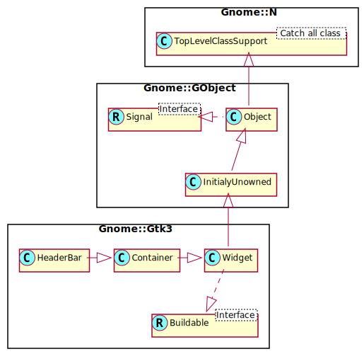

Gnome::Gtk3::HeaderBar
======================

A box with a centered child

Description
===========

GtkHeaderBar is similar to a horizontal **Gnome::Gtk3::Box**. It allows children to be placed at the start or the end. In addition, it allows a title and subtitle to be displayed. The title will be centered with respect to the width of the box, even if the children at either side take up different amounts of space. The height of the titlebar will be set to provide sufficient space for the subtitle, even if none is currently set. If a subtitle is not needed, the space reservation can be turned off with `set-has-subtitle()`.

GtkHeaderBar can add typical window frame controls, such as minimize, maximize and close buttons, or the window icon.

For these reasons, GtkHeaderBar is the natural choice for use as the custom titlebar widget of a **Gnome::Gtk3::Window** (see `Gnome::Gtk3::Window.set-titlebar()`), as it gives features typical of titlebars while allowing the addition of child widgets.

See Also
--------

**Gnome::Gtk3::Box**, **Gnome::Gtk3::ActionBar**

Synopsis
========

Declaration
-----------

    unit class Gnome::Gtk3::HeaderBar;
    also is Gnome::Gtk3::Container;

Uml Diagram
-----------

Inheriting this class
---------------------

Inheriting is done in a special way in that it needs a call from new() to get the native object created by the class you are inheriting from.

    use Gnome::Gtk3::HeaderBar:api<1>;

    unit class MyGuiClass;
    also is Gnome::Gtk3::HeaderBar;

    submethod new ( |c ) {
      # let the Gnome::Gtk3::HeaderBar class process the options
      self.bless( :GtkHeaderBar, |c);
    }

    submethod BUILD ( ... ) {
      ...
    }

Methods
=======

new
---

### default, no options

Create a new HeaderBar object.

    multi method new ( )

### :native-object

Create a HeaderBar object using a native object from elsewhere. See also **Gnome::N::TopLevelClassSupport**.

    multi method new ( N-GObject :$native-object! )

### :build-id

Create a HeaderBar object using a native object returned from a builder. See also **Gnome::GObject::Object**.

    multi method new ( Str :$build-id! )

get-custom-title
----------------

Retrieves the custom title widget of the header. See `set-custom-title()`.

Returns: the custom title widget of the header, or `undefined` if none has been set explicitly.

    method get-custom-title ( --> N-GObject )

get-decoration-layout
---------------------

Gets the decoration layout set with `set-decoration-layout()`.

Returns: the decoration layout

    method get-decoration-layout ( --> Str )

get-has-subtitle
----------------

Retrieves whether the header bar reserves space for a subtitle, regardless if one is currently set or not.

Returns: `True` if the header bar reserves space for a subtitle

    method get-has-subtitle ( --> Bool )

get-show-close-button
---------------------

Returns whether this header bar shows the standard window decorations.

Returns: `True` if the decorations are shown

    method get-show-close-button ( --> Bool )

get-subtitle
------------

Retrieves the subtitle of the header. See `set-subtitle()`.

Returns: the subtitle of the header, or `undefined` if none has been set explicitly. The returned string is owned by the widget and must not be modified or freed.

    method get-subtitle ( --> Str )

get-title
---------

Retrieves the title of the header. See `set-title()`.

Returns: the title of the header, or `undefined` if none has been set explicitly. The returned string is owned by the widget and must not be modified or freed.

    method get-title ( --> Str )

pack-end
--------

Adds *child* to *bar*, packed with reference to the end of the *bar*.

    method pack-end ( N-GObject $child )

  * N-GObject $child; the **Gnome::Gtk3::Widget** to be added to *bar*

pack-start
----------

Adds *child* to *bar*, packed with reference to the start of the *bar*.

    method pack-start ( N-GObject $child )

  * N-GObject $child; the **Gnome::Gtk3::Widget** to be added to *bar*

set-custom-title
----------------

Sets a custom title for the **Gnome::Gtk3::HeaderBar**.

The title should help a user identify the current view. This supersedes any title set by `set-title()` or `gtk-header-bar-set-subtitle()`. To achieve the same style as the builtin title and subtitle, use the “title” and “subtitle” style classes.

You should set the custom title to `undefined`, for the header title label to be visible again.

    method set-custom-title ( N-GObject $title_widget )

  * N-GObject $title_widget; a custom widget to use for a title

set-decoration-layout
---------------------

Sets the decoration layout for this header bar, overriding the *gtk-decoration-layout* setting.

There can be valid reasons for overriding the setting, such as a header bar design that does not allow for buttons to take room on the right, or only offers room for a single close button. Split header bars are another example for overriding the setting.

The format of the string is button names, separated by commas. A colon separates the buttons that should appear on the left from those on the right. Recognized button names are minimize, maximize, close, icon (the window icon) and menu (a menu button for the fallback app menu).

For example, “menu:minimize,maximize,close” specifies a menu on the left, and minimize, maximize and close buttons on the right.

    method set-decoration-layout ( Str $layout )

  * Str $layout; a decoration layout, or `undefined` to unset the layout

set-has-subtitle
----------------

Sets whether the header bar should reserve space for a subtitle, even if none is currently set.

    method set-has-subtitle ( Bool $setting )

  * Bool $setting; `True` to reserve space for a subtitle

set-show-close-button
---------------------

Sets whether this header bar shows the standard window decorations, including close, maximize, and minimize.

    method set-show-close-button ( Bool $setting )

  * Bool $setting; `True` to show standard window decorations

set-subtitle
------------

Sets the subtitle of the **Gnome::Gtk3::HeaderBar**. The title should give a user an additional detail to help him identify the current view.

Note that GtkHeaderBar by default reserves room for the subtitle, even if none is currently set. If this is not desired, set the *has-subtitle* property to `False`.

    method set-subtitle ( Str $subtitle )

  * Str $subtitle; a subtitle, or `undefined`

set-title
---------

Sets the title of the **Gnome::Gtk3::HeaderBar**. The title should help a user identify the current view. A good title should not include the application name.

    method set-title ( Str $title )

  * Str $title; a title, or `undefined`

Properties
==========

custom-title
------------

Custom title widget to display

  * **Gnome::GObject::Value** type of this property is G_TYPE_OBJECT

  * The type of this G_TYPE_OBJECT object is GTK_TYPE_WIDGET

  * Parameter is readable and writable.

decoration-layout
-----------------

The layout for window decorations

  * **Gnome::GObject::Value** type of this property is G_TYPE_STRING

  * Parameter is readable and writable.

  * Default value is undefined.

decoration-layout-set
---------------------

Whether the decoration-layout property has been set

  * **Gnome::GObject::Value** type of this property is G_TYPE_BOOLEAN

  * Parameter is readable and writable.

  * Default value is FALSE.

has-subtitle
------------

Whether to reserve space for a subtitle

  * **Gnome::GObject::Value** type of this property is G_TYPE_BOOLEAN

  * Parameter is readable and writable.

  * Default value is TRUE.

show-close-button
-----------------

Whether to show window decorations

  * **Gnome::GObject::Value** type of this property is G_TYPE_BOOLEAN

  * Parameter is readable and writable.

  * Default value is FALSE.

spacing
-------

The amount of space between children

  * **Gnome::GObject::Value** type of this property is G_TYPE_INT

  * Parameter is readable and writable.

  * Minimum value is 0.

  * Maximum value is G_MAXINT.

  * Default value is DEFAULT_SPACING.

subtitle
--------

The subtitle to display

  * **Gnome::GObject::Value** type of this property is G_TYPE_STRING

  * Parameter is readable and writable.

  * Default value is undefined.

title
-----

The title to display

  * **Gnome::GObject::Value** type of this property is G_TYPE_STRING

  * Parameter is readable and writable.

  * Default value is undefined.

Child Properties
================

pack-type
---------

A GtkPackType indicating whether the child is packed with reference to the start or end of the parent

  * **Gnome::GObject::Value** type of this property is G_TYPE_ENUM

  * The type of this G_TYPE_ENUM object is GTK_TYPE_PACK_TYPE

  * Parameter is readable and writable.

  * Default value is GTK_PACK_START.

position
--------

The index of the child in the parent

  * **Gnome::GObject::Value** type of this property is G_TYPE_INT

  * Parameter is readable and writable.

  * Minimum value is -1.

  * Maximum value is G_MAXINT.

  * Default value is 0.

