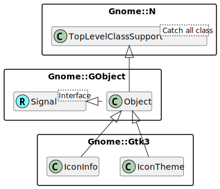

Gnome::Gtk3::IconTheme
======================

Looking up icons by name

Description
===========

**Gnome::Gtk3::IconTheme** provides a facility for looking up icons by name and size. The main reason for using a name rather than simply providing a filename is to allow different icons to be used depending on what “icon theme” is selected by the user. The operation of icon themes on Linux and Unix follows the [Icon Theme Specification](http://www.freedesktop.org/Standards/icon-theme-spec) There is a fallback icon theme, named `hicolor`, where applications should install their icons, but additional icon themes can be installed as operating system vendors and users choose.

The **Gnome::Gtk3::IconTheme** object acts as a database of all the icons in the current theme. You can create new **Gnome::Gtk3::IconTheme** objects, but it’s much more efficient to use the standard icon theme for the **Gnome::Gdk3::Screen** so that the icon information is shared with other people looking up icons.

Synopsis
========

Declaration
-----------

    unit class Gnome::Gtk3::IconTheme;
    also is Gnome::GObject::Object;

Uml Diagram
-----------

Types
=====

enum GtkIconLookupFlags
-----------------------

Used to specify options for `gtk_icon_theme_lookup_icon()`

  * GTK_ICON_LOOKUP_NO_SVG: Never get SVG icons, even if gdk-pixbuf supports them. Cannot be used together with `GTK_ICON_LOOKUP_FORCE_SVG`.

  * GTK_ICON_LOOKUP_FORCE_SVG: Get SVG icons, even if gdk-pixbuf doesn’t support them. Cannot be used together with `GTK_ICON_LOOKUP_NO_SVG`.

  * GTK_ICON_LOOKUP_USE_BUILTIN: When passed to `gtk_icon_theme_lookup_icon()` includes builtin icons as well as files. For a builtin icon, `gtk_icon_info_get_filename()` is `Any` and you need to call `gtk_icon_info_get_builtin_pixbuf()`.

  * GTK_ICON_LOOKUP_GENERIC_FALLBACK: Try to shorten icon name at '-' characters before looking at inherited themes. This flag is only supported in functions that take a single icon name. For more general fallback, see `gtk_icon_theme_choose_icon()`. Since 2.12.

  * GTK_ICON_LOOKUP_FORCE_SIZE: Always get the icon scaled to the requested size. Since 2.14.

  * GTK_ICON_LOOKUP_FORCE_REGULAR: Try to always load regular icons, even when symbolic icon names are given. Since 3.14.

  * GTK_ICON_LOOKUP_FORCE_SYMBOLIC: Try to always load symbolic icons, even when regular icon names are given. Since 3.14.

  * GTK_ICON_LOOKUP_DIR_LTR: Try to load a variant of the icon for left-to-right text direction. Since 3.14.

  * GTK_ICON_LOOKUP_DIR_RTL: Try to load a variant of the icon for right-to-left text direction. Since 3.14.

enum GtkIconThemeError
----------------------

Error codes for **Gnome::Gtk3::IconTheme** operations.

  * GTK_ICON_THEME_NOT_FOUND: The icon specified does not exist in the theme

  * GTK_ICON_THEME_FAILED: An unspecified error occurred.

class N-GtkIconTheme
--------------------

Acts as a database of information about an icon theme. Normally, you retrieve the icon theme for a particular screen using `gtk_icon_theme_get_for_screen()` and it will contain information about current icon theme for that screen, but you can also create a new **Gnome::Gtk3::IconTheme** object and set the icon theme name explicitly using `gtk_icon_theme_set_custom_theme()`.

class N-GtkIconInfo
-------------------

Contains information found when looking up an icon in an icon theme.

Methods
=======

new
---

### new()

Creates a new icon theme object. Icon theme objects are used to lookup up an icon by name in a particular icon theme. Usually, you’ll want to use `gtk_icon_theme_get_default()` or `gtk_icon_theme_get_for_screen()` rather than creating a new icon theme object from scratch.

    multi method new ( )

### new(:default)

Gets the icon theme for the default screen. See `gtk_icon_theme_get_for_screen()`. This icon theme is associated with the screen and can be used as long as the screen is open. Do not ref or unref it. Use of named attribute is enough to select this action.

    multi method new ( Bool :$default )

### new(:screen)

Gets the icon theme object associated with *$screen*; if this function has not previously been called for the given screen, a new icon theme object will be created and associated with the screen. Icon theme objects are fairly expensive to create, so using this function is usually a better choice than calling than `gtk_icon_theme_new()` and setting the screen yourself; by using this function a single icon theme object will be shared between users. Returns: (transfer none): A unique **Gnome::Gtk3::IconTheme** associated with the given screen. This icon theme is associated with the screen and can be used as long as the screen is open. Do not ref or unref it.

    multi method new ( N-GObject :$screen )

[gtk_icon_theme_] error_quark
-----------------------------

    method gtk_icon_theme_error_quark ( --> Int )

[gtk_icon_theme_] set_screen
----------------------------

Sets the screen for an icon theme; the screen is used to track the user’s currently configured icon theme, which might be different for different screens.

    method gtk_icon_theme_set_screen ( N-GObject $screen )

  * N-GObject $screen; a **Gnome::Gdk3::Screen**

[gtk_icon_theme_] append_search_path
------------------------------------

Appends a directory to the search path. See `gtk_icon_theme_set_search_path()`.

    method gtk_icon_theme_append_search_path ( Str $path )

  * Str $path; (type filename): directory name to append to the icon path

[gtk_icon_theme_] prepend_search_path
-------------------------------------

Prepends a directory to the search path. See `gtk_icon_theme_set_search_path()`.

    method gtk_icon_theme_prepend_search_path ( Str $path )

  * Str $path; (type filename): directory name to prepend to the icon path

[gtk_icon_theme_] add_resource_path
-----------------------------------

Adds a resource path that will be looked at when looking for icons, similar to search paths. This function should be used to make application-specific icons available as part of the icon theme. The resources are considered as part of the hicolor icon theme and must be located in subdirectories that are defined in the hicolor icon theme, such as `*path*/16x16/actions/run.png`. Icons that are directly placed in the resource path instead of a subdirectory are also considered as ultimate fallback.

    method gtk_icon_theme_add_resource_path ( Str $path )

  * Str $path; a resource path

[gtk_icon_theme_] set_custom_theme
----------------------------------

Sets the name of the icon theme that the **Gnome::Gtk3::IconTheme** object uses overriding system configuration. This function cannot be called on the icon theme objects returned from `gtk_icon_theme_get_default()` and `gtk_icon_theme_get_for_screen()`.

    method gtk_icon_theme_set_custom_theme ( Str $theme_name )

  * Str $theme_name; (allow-none): name of icon theme to use instead of configured theme, or `Any` to unset a previously set custom theme

[gtk_icon_theme_] has_icon
--------------------------

Checks whether an icon theme includes an icon for a particular name. Returns: `1` if *icon_theme* includes an icon for *icon_name*.

    method gtk_icon_theme_has_icon ( Str $icon_name --> Int )

  * Str $icon_name; the name of an icon

[gtk_icon_theme_] get_icon_sizes
--------------------------------

Returns an array of integers describing the sizes at which the icon is available without scaling. A size of -1 means that the icon is available in a scalable format. The array is zero-terminated. Returns: (array zero-terminated=1) (transfer full): An newly allocated array describing the sizes at which the icon is available. The array should be freed with `g_free()` when it is no longer needed.

    method gtk_icon_theme_get_icon_sizes ( Str $icon_name --> Int )

  * Str $icon_name; the name of an icon

[gtk_icon_theme_] lookup_icon
-----------------------------

Looks up a named icon and returns a **Gnome::Gtk3::IconInfo** containing information such as the filename of the icon. The icon can then be rendered into a pixbuf using `gtk_icon_info_load_icon()`. (`gtk_icon_theme_load_icon()` combines these two steps if all you need is the pixbuf.) When rendering on displays with high pixel densities you should not use a *size* multiplied by the scaling factor returned by functions like `gdk_window_get_scale_factor()`. Instead, you should use `gtk_icon_theme_lookup_icon_for_scale()`, as the assets loaded for a given scaling factor may be different. Returns: (nullable) (transfer full): a **Gnome::Gtk3::IconInfo** object containing information about the icon, or `Any` if the icon wasn’t found.

    method gtk_icon_theme_lookup_icon ( Str $icon_name, Int $size, GtkIconLookupFlags $flags --> N-GtkIconInfo )

  * Str $icon_name; the name of the icon to lookup

  * Int $size; desired icon size

  * GtkIconLookupFlags $flags; flags modifying the behavior of the icon lookup

[gtk_icon_theme_] lookup_icon_for_scale
---------------------------------------

Looks up a named icon for a particular window scale and returns a **Gnome::Gtk3::IconInfo** containing information such as the filename of the icon. The icon can then be rendered into a pixbuf using `gtk_icon_info_load_icon()`. (`gtk_icon_theme_load_icon()` combines these two steps if all you need is the pixbuf.) Returns: (nullable) (transfer full): a **Gnome::Gtk3::IconInfo** object containing information about the icon, or `Any` if the icon wasn’t found.

    method gtk_icon_theme_lookup_icon_for_scale ( Str $icon_name, Int $size, Int $scale, GtkIconLookupFlags $flags --> N-GtkIconInfo )

  * Str $icon_name; the name of the icon to lookup

  * Int $size; desired icon size

  * Int $scale; the desired scale

  * GtkIconLookupFlags $flags; flags modifying the behavior of the icon lookup

[gtk_icon_theme_] load_icon
---------------------------

Looks up an icon in an icon theme, scales it to the given size and renders it into a pixbuf. This is a convenience function; if more details about the icon are needed, use `gtk_icon_theme_lookup_icon()` followed by `gtk_icon_info_load_icon()`. Note that you probably want to listen for icon theme changes and update the icon. This is usually done by connecting to the **Gnome::Gtk3::Widget**::style-set signal. If for some reason you do not want to update the icon when the icon theme changes, you should consider using `gdk_pixbuf_copy()` to make a private copy of the pixbuf returned by this function. Otherwise GTK+ may need to keep the old icon theme loaded, which would be a waste of memory. Returns: (nullable) (transfer full): the rendered icon; this may be a newly created icon or a new reference to an internal icon, so you must not modify the icon. Use `g_object_unref()` to release your reference to the icon. `Any` if the icon isn’t found.

    method gtk_icon_theme_load_icon ( Str $icon_name, Int $size, GtkIconLookupFlags $flags, N-GError $error --> N-GObject )

  * Str $icon_name; the name of the icon to lookup

  * Int $size; the desired icon size. The resulting icon may not be exactly this size; see `gtk_icon_info_load_icon()`.

  * GtkIconLookupFlags $flags; flags modifying the behavior of the icon lookup

  * N-GError $error; (allow-none): Location to store error information on failure, or `Any`.

[gtk_icon_theme_] load_icon_for_scale
-------------------------------------

Looks up an icon in an icon theme for a particular window scale, scales it to the given size and renders it into a pixbuf. This is a convenience function; if more details about the icon are needed, use `gtk_icon_theme_lookup_icon()` followed by `gtk_icon_info_load_icon()`. Note that you probably want to listen for icon theme changes and update the icon. This is usually done by connecting to the **Gnome::Gtk3::Widget**::style-set signal. If for some reason you do not want to update the icon when the icon theme changes, you should consider using `gdk_pixbuf_copy()` to make a private copy of the pixbuf returned by this function. Otherwise GTK+ may need to keep the old icon theme loaded, which would be a waste of memory. Returns: (nullable) (transfer full): the rendered icon; this may be a newly created icon or a new reference to an internal icon, so you must not modify the icon. Use `g_object_unref()` to release your reference to the icon. `Any` if the icon isn’t found.

    method gtk_icon_theme_load_icon_for_scale ( Str $icon_name, Int $size, Int $scale, GtkIconLookupFlags $flags, N-GError $error --> N-GObject )

  * Str $icon_name; the name of the icon to lookup

  * Int $size; the desired icon size. The resulting icon may not be exactly this size; see `gtk_icon_info_load_icon()`.

  * Int $scale; desired scale

  * GtkIconLookupFlags $flags; flags modifying the behavior of the icon lookup

  * N-GError $error; (allow-none): Location to store error information on failure, or `Any`.

[gtk_icon_theme_] load_surface
------------------------------

Looks up an icon in an icon theme for a particular window scale, scales it to the given size and renders it into a cairo surface. This is a convenience function; if more details about the icon are needed, use `gtk_icon_theme_lookup_icon()` followed by `gtk_icon_info_load_surface()`. Note that you probably want to listen for icon theme changes and update the icon. This is usually done by connecting to the **Gnome::Gtk3::Widget**::style-set signal. Returns: (nullable) (transfer full): the rendered icon; this may be a newly created icon or a new reference to an internal icon, so you must not modify the icon. Use `cairo_surface_destroy()` to release your reference to the icon. `Any` if the icon isn’t found.

    method gtk_icon_theme_load_surface ( Str $icon_name, Int $size, Int $scale, N-GObject $for_window, GtkIconLookupFlags $flags, N-GError $error --> cairo_surface_t )

  * Str $icon_name; the name of the icon to lookup

  * Int $size; the desired icon size. The resulting icon may not be exactly this size; see `gtk_icon_info_load_icon()`.

  * Int $scale; desired scale

  * N-GObject $for_window; (allow-none): **Gnome::Gdk3::Window** to optimize drawing for, or `Any`

  * GtkIconLookupFlags $flags; flags modifying the behavior of the icon lookup

  * N-GError $error; (allow-none): Location to store error information on failure, or `Any`.

[gtk_icon_theme_] list_icons
----------------------------

Lists the icons in the current icon theme. Only a subset of the icons can be listed by providing a context string. The set of values for the context string is system dependent, but will typically include such values as “Applications” and “MimeTypes”. Contexts are explained in the [Icon Theme Specification](http://www.freedesktop.org/wiki/Specifications/icon-theme-spec). The standard contexts are listed in the [Icon Naming Specification](http://www.freedesktop.org/wiki/Specifications/icon-naming-spec). Also see `gtk_icon_theme_list_contexts()`.

Returns: a **GList** list holding the names of all the icons in the theme. You must first free each element in the list with `g_free()`, then free the list itself with `g_list_free()`.

    method gtk_icon_theme_list_icons ( Str $context --> N-GList )

  * Str $context; (allow-none): a string identifying a particular type of icon, or `Any` to list all icons.

[gtk_icon_theme_] list_contexts
-------------------------------

Gets the list of contexts available within the current hierarchy of icon themes. See `gtk_icon_theme_list_icons()` for details about contexts.

Returns: a **GList** list holding the names of all the contexts in the theme. You must first free each element in the list with `g_free()`, then free the list itself with `g_list_free()`.

    method gtk_icon_theme_list_contexts ( --> N-GList )

[gtk_icon_theme_] get_example_icon_name
---------------------------------------

Gets the name of an icon that is representative of the current theme (for instance, to use when presenting a list of themes to the user.)

Returns: the name of an example icon or `Any`. Free with `g_free()`.

    method gtk_icon_theme_get_example_icon_name ( --> Str )

[gtk_icon_theme_] rescan_if_needed
----------------------------------

Checks to see if the icon theme has changed; if it has, any currently cached information is discarded and will be reloaded next time *icon_theme* is accessed. Returns: `1` if the icon theme has changed and needed to be reloaded.

    method gtk_icon_theme_rescan_if_needed ( --> Int )

gtk_icon_info_new_for_pixbuf
----------------------------

Creates a **Gnome::Gtk3::IconInfo** for a **Gnome::Gdk3::Pixbuf**. Returns: (transfer full): a **Gnome::Gtk3::IconInfo**

    method gtk_icon_info_new_for_pixbuf ( N-GObject $pixbuf --> N-GtkIconInfo )

  * N-GObject $pixbuf; the pixbuf to wrap in a **Gnome::Gtk3::IconInfo**

gtk_icon_info_get_base_size
---------------------------

Gets the base size for the icon. The base size is a size for the icon that was specified by the icon theme creator. This may be different than the actual size of image; an example of this is small emblem icons that can be attached to a larger icon. These icons will be given the same base size as the larger icons to which they are attached. Note that for scaled icons the base size does not include the base scale. Returns: the base size, or 0, if no base size is known for the icon.

    method gtk_icon_info_get_base_size ( N-GtkIconInfo $icon_info --> Int )

  * N-GtkIconInfo $icon_info; a **Gnome::Gtk3::IconInfo**

gtk_icon_info_get_base_scale
----------------------------

Gets the base scale for the icon. The base scale is a scale for the icon that was specified by the icon theme creator. For instance an icon drawn for a high-dpi screen with window scale 2 for a base size of 32 will be 64 pixels tall and have a base scale of 2. Returns: the base scale

    method gtk_icon_info_get_base_scale ( N-GtkIconInfo $icon_info --> Int )

  * N-GtkIconInfo $icon_info; a **Gnome::Gtk3::IconInfo**

gtk_icon_info_get_filename
--------------------------

Gets the filename for the icon. If the `GTK_ICON_LOOKUP_USE_BUILTIN` flag was passed to `gtk_icon_theme_lookup_icon()`, there may be no filename if a builtin icon is returned; in this case, you should use `gtk_icon_info_get_builtin_pixbuf()`. Returns: (nullable) (type filename): the filename for the icon, or `Any` if `gtk_icon_info_get_builtin_pixbuf()` should be used instead. The return value is owned by GTK+ and should not be modified or freed.

    method gtk_icon_info_get_filename ( N-GtkIconInfo $icon_info --> Str )

  * N-GtkIconInfo $icon_info; a **Gnome::Gtk3::IconInfo**

gtk_icon_info_is_symbolic
-------------------------

Checks if the icon is symbolic or not. This currently uses only the file name and not the file contents for determining this. This behaviour may change in the future. Returns: `1` if the icon is symbolic, `0` otherwise

    method gtk_icon_info_is_symbolic ( N-GtkIconInfo $icon_info --> Int )

  * N-GtkIconInfo $icon_info; a **Gnome::Gtk3::IconInfo**

gtk_icon_info_load_icon
-----------------------

Renders an icon previously looked up in an icon theme using `gtk_icon_theme_lookup_icon()`; the size will be based on the size passed to `gtk_icon_theme_lookup_icon()`. Note that the resulting pixbuf may not be exactly this size; an icon theme may have icons that differ slightly from their nominal sizes, and in addition GTK+ will avoid scaling icons that it considers sufficiently close to the requested size or for which the source image would have to be scaled up too far. (This maintains sharpness.). This behaviour can be changed by passing the `GTK_ICON_LOOKUP_FORCE_SIZE` flag when obtaining the **Gnome::Gtk3::IconInfo**. If this flag has been specified, the pixbuf returned by this function will be scaled to the exact size. Returns: (transfer full): the rendered icon; this may be a newly created icon or a new reference to an internal icon, so you must not modify the icon. Use `g_object_unref()` to release your reference to the icon.

    method gtk_icon_info_load_icon ( N-GtkIconInfo $icon_info, N-GError $error --> N-GObject )

  * N-GtkIconInfo $icon_info; a **Gnome::Gtk3::IconInfo** from `gtk_icon_theme_lookup_icon()`

  * N-GError $error; (allow-none): location to store error information on failure, or `Any`.

gtk_icon_info_load_surface
--------------------------

Renders an icon previously looked up in an icon theme using `gtk_icon_theme_lookup_icon()`; the size will be based on the size passed to `gtk_icon_theme_lookup_icon()`. Note that the resulting surface may not be exactly this size; an icon theme may have icons that differ slightly from their nominal sizes, and in addition GTK+ will avoid scaling icons that it considers sufficiently close to the requested size or for which the source image would have to be scaled up too far. (This maintains sharpness.). This behaviour can be changed by passing the `GTK_ICON_LOOKUP_FORCE_SIZE` flag when obtaining the **Gnome::Gtk3::IconInfo**. If this flag has been specified, the pixbuf returned by this function will be scaled to the exact size. Returns: (transfer full): the rendered icon; this may be a newly created icon or a new reference to an internal icon, so you must not modify the icon. Use `cairo_surface_destroy()` to release your reference to the icon.

    method gtk_icon_info_load_surface ( N-GtkIconInfo $icon_info, N-GObject $for_window, N-GError $error --> cairo_surface_t )

  * N-GtkIconInfo $icon_info; a **Gnome::Gtk3::IconInfo** from `gtk_icon_theme_lookup_icon()`

  * N-GObject $for_window; (allow-none): **Gnome::Gdk3::Window** to optimize drawing for, or `Any`

  * N-GError $error; (allow-none): location for error information on failure, or `Any`

gtk_icon_info_load_symbolic
---------------------------

Loads an icon, modifying it to match the system colours for the foreground, success, warning and error colors provided. If the icon is not a symbolic one, the function will return the result from `gtk_icon_info_load_icon()`. This allows loading symbolic icons that will match the system theme. Unless you are implementing a widget, you will want to use `g_themed_icon_new_with_default_fallbacks()` to load the icon. As implementation details, the icon loaded needs to be of SVG type, contain the “symbolic” term as the last component of the icon name, and use the “fg”, “success”, “warning” and “error” CSS styles in the SVG file itself. See the [Symbolic Icons Specification](http://www.freedesktop.org/wiki/SymbolicIcons) for more information about symbolic icons. Returns: (transfer full): a **Gnome::Gdk3::Pixbuf** representing the loaded icon

    method gtk_icon_info_load_symbolic ( N-GtkIconInfo $icon_info, N-GObject $fg, N-GObject $success_color, N-GObject $warning_color, N-GObject $error_color, Int $was_symbolic, N-GError $error --> N-GObject )

  * N-GtkIconInfo $icon_info; a **Gnome::Gtk3::IconInfo**

  * N-GObject $fg; a **Gnome::Gdk3::RGBA** representing the foreground color of the icon

  * N-GObject $success_color; (allow-none): a **Gnome::Gdk3::RGBA** representing the warning color of the icon or `Any` to use the default color

  * N-GObject $warning_color; (allow-none): a **Gnome::Gdk3::RGBA** representing the warning color of the icon or `Any` to use the default color

  * N-GObject $error_color; (allow-none): a **Gnome::Gdk3::RGBA** representing the error color of the icon or `Any` to use the default color (allow-none)

  * Int $was_symbolic; (out) (allow-none): a **gboolean**, returns whether the loaded icon was a symbolic one and whether the *fg* color was applied to it.

  * N-GError $error; (allow-none): location to store error information on failure, or `Any`.

gtk_icon_info_load_symbolic_for_context
---------------------------------------

Loads an icon, modifying it to match the system colors for the foreground, success, warning and error colors provided. If the icon is not a symbolic one, the function will return the result from `gtk_icon_info_load_icon()`. This function uses the regular foreground color and the symbolic colors with the names “success_color”, “warning_color” and “error_color” from the context. This allows loading symbolic icons that will match the system theme. See `gtk_icon_info_load_symbolic()` for more details. Returns: (transfer full): a **Gnome::Gdk3::Pixbuf** representing the loaded icon

    method gtk_icon_info_load_symbolic_for_context ( N-GtkIconInfo $icon_info, N-GObject $context, Int $was_symbolic, N-GError $error --> N-GObject )

  * N-GtkIconInfo $icon_info; a **Gnome::Gtk3::IconInfo**

  * N-GObject $context; a **Gnome::Gtk3::StyleContext**

  * Int $was_symbolic; (out) (allow-none): a **gboolean**, returns whether the loaded icon was a symbolic one and whether the *fg* color was applied to it.

  * N-GError $error; (allow-none): location to store error information on failure, or `Any`.

Signals
=======

There are two ways to connect to a signal. The first option you have is to use `register-signal()` from **Gnome::GObject::Object**. The second option is to use `g_signal_connect_object()` directly from **Gnome::GObject::Signal**.

First method
------------

The positional arguments of the signal handler are all obligatory as well as their types. The named attributes `:$widget` and user data are optional.

    # handler method
    method mouse-event ( GdkEvent $event, :$widget ) { ... }

    # connect a signal on window object
    my Gnome::Gtk3::Window $w .= new( ... );
    $w.register-signal( self, 'mouse-event', 'button-press-event');

Second method
-------------

    my Gnome::Gtk3::Window $w .= new( ... );
    my Callable $handler = sub (
      N-GObject $native, GdkEvent $event, OpaquePointer $data
    ) {
      ...
    }

    $w.connect-object( 'button-press-event', $handler);

Also here, the types of positional arguments in the signal handler are important. This is because both methods `register-signal()` and `g_signal_connect_object()` are using the signatures of the handler routines to setup the native call interface.

Supported signals
-----------------

### changed

Emitted when the current icon theme is switched or GTK+ detects that a change has occurred in the contents of the current icon theme.

    method handler (
      Int :$_handle_id,
      Gnome::GObject::Object :_widget($icon_theme),
      *%user-options
    );

  * $icon_theme; the icon theme

