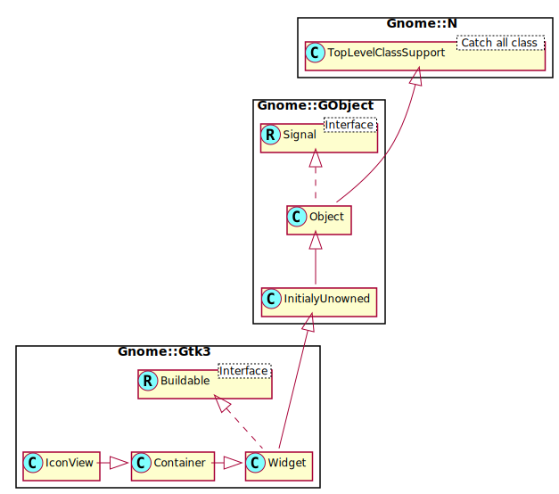

Gnome::Gtk3::IconView
=====================

A widget which displays a list of icons in a grid

Description
===========

**Gnome::Gtk3::IconView** provides an alternative view on a **Gnome::Gtk3::TreeModel**. It displays the model as a grid of icons with labels. Like **Gnome::Gtk3::TreeView**, it allows to select one or multiple items (depending on the selection mode, see `gtk_icon_view_set_selection_mode()`). In addition to selection with the arrow keys, **Gnome::Gtk3::IconView** supports rubberband selection, which is controlled by dragging the pointer.

Note that if the tree model is backed by an actual tree store (as opposed to a flat list where the mapping to icons is obvious), **Gnome::Gtk3::IconView** will only display the first level of the tree and ignore the tree’s branches.

Css Nodes
---------

    iconview.view
    ╰── [rubberband]

**Gnome::Gtk3::IconView** has a single CSS node with name iconview and style class .view. For rubberband selection, a subnode with name rubberband is used.

Synopsis
========

Declaration
-----------

    unit class Gnome::Gtk3::IconView;
    also is Gnome::Gtk3::Container;

Uml Diagram
-----------

Types
=====

enum GtkIconViewDropPosition
----------------------------

An enum for determining where a dropped item goes.

  * GTK_ICON_VIEW_NO_DROP: no drop possible

  * GTK_ICON_VIEW_DROP_INTO: dropped item replaces the item

  * GTK_ICON_VIEW_DROP_LEFT: droppped item is inserted to the left

  * GTK_ICON_VIEW_DROP_RIGHT: dropped item is inserted to the right

  * GTK_ICON_VIEW_DROP_ABOVE: dropped item is inserted above

  * GTK_ICON_VIEW_DROP_BELOW: dropped item is inserted below

Methods
=======

new
---

### new()

Creates a new **Gnome::Gtk3::IconView** widget

    multi method new ( )

[gtk_icon_view_] set_model
--------------------------

Sets the model for a **Gnome::Gtk3::IconView**. If the *icon_view* already has a model set, it will remove it before setting the new model. If *model* is `Any`, then it will unset the old model.

    method gtk_icon_view_set_model ( N-GObject $model )

  * N-GObject $model; (allow-none): The model.

[gtk_icon_view_] get_model
--------------------------

Returns the model the **Gnome::Gtk3::IconView** is based on. Returns `Any` if the model is unset.

Returns: (nullable) (transfer none): A **Gnome::Gtk3::TreeModel**, or `Any` if none is currently being used.

    method gtk_icon_view_get_model ( --> N-GObject )

[gtk_icon_view_] set_text_column
--------------------------------

Sets the column with text for *icon_view* to be *column*. The text column must be of type **G_TYPE_STRING**.

    method gtk_icon_view_set_text_column ( Int $column )

  * Int $column; A column in the currently used model, or -1 to display no text

[gtk_icon_view_] get_text_column
--------------------------------

Returns the column with text for *icon_view*.

Returns: the text column, or -1 if it’s unset.

    method gtk_icon_view_get_text_column ( --> Int )

[gtk_icon_view_] set_markup_column
----------------------------------

Sets the column with markup information for *icon_view* to be *column*. The markup column must be of type **G_TYPE_STRING**. If the markup column is set to something, it overrides the text column set by `gtk_icon_view_set_text_column()`.

    method gtk_icon_view_set_markup_column ( Int $column )

  * Int $column; A column in the currently used model, or -1 to display no text

[gtk_icon_view_] get_markup_column
----------------------------------

Returns the column with markup text for *icon_view*.

Returns: the markup column, or -1 if it’s unset.

    method gtk_icon_view_get_markup_column ( --> Int )

[gtk_icon_view_] set_pixbuf_column
----------------------------------

Sets the column with pixbufs for *icon_view* to be *column*. The pixbuf column must be of type **GDK_TYPE_PIXBUF**

    method gtk_icon_view_set_pixbuf_column ( Int $column )

  * Int $column; A column in the currently used model, or -1 to disable

[gtk_icon_view_] get_pixbuf_column
----------------------------------

Returns the column with pixbufs for *icon_view*.

Returns: the pixbuf column, or -1 if it’s unset.

    method gtk_icon_view_get_pixbuf_column ( --> Int )

[gtk_icon_view_] set_item_orientation
-------------------------------------

Sets the *item-orientation* property which determines whether the labels are drawn beside the icons instead of below.

    method gtk_icon_view_set_item_orientation ( GtkOrientation $orientation )

  * GtkOrientation $orientation; the relative position of texts and icons

[gtk_icon_view_] get_item_orientation
-------------------------------------

Returns the value of the *item-orientation* property which determines whether the labels are drawn beside the icons instead of below.

Returns: the relative position of texts and icons

    method gtk_icon_view_get_item_orientation ( --> GtkOrientation )

[gtk_icon_view_] set_columns
----------------------------

Sets the *columns* property which determines in how many columns the icons are arranged. If *columns* is -1, the number of columns will be chosen automatically to fill the available area.

    method gtk_icon_view_set_columns ( Int $columns )

  * Int $columns; the number of columns

[gtk_icon_view_] get_columns
----------------------------

Returns the value of the *columns* property.

Returns: the number of columns, or -1

    method gtk_icon_view_get_columns ( --> Int )

[gtk_icon_view_] set_item_width
-------------------------------

Sets the *item-width* property which specifies the width to use for each item. If it is set to -1, the icon view will automatically determine a suitable item size.

    method gtk_icon_view_set_item_width ( Int $item_width )

  * Int $item_width; the width for each item

[gtk_icon_view_] get_item_width
-------------------------------

Returns the value of the *item-width* property.

Returns: the width of a single item, or -1

    method gtk_icon_view_get_item_width ( --> Int )

[gtk_icon_view_] set_spacing
----------------------------

Sets the *spacing* property which specifies the space which is inserted between the cells (i.e. the icon and the text) of an item.

    method gtk_icon_view_set_spacing ( Int $spacing )

  * Int $spacing; the spacing

[gtk_icon_view_] get_spacing
----------------------------

Returns the value of the *spacing* property.

Returns: the space between cells

    method gtk_icon_view_get_spacing ( --> Int )

[gtk_icon_view_] set_row_spacing
--------------------------------

Sets the *row-spacing* property which specifies the space which is inserted between the rows of the icon view.

    method gtk_icon_view_set_row_spacing ( Int $row_spacing )

  * Int $row_spacing; the row spacing

[gtk_icon_view_] get_row_spacing
--------------------------------

Returns the value of the *row-spacing* property.

Returns: the space between rows

    method gtk_icon_view_get_row_spacing ( --> Int )

[gtk_icon_view_] set_column_spacing
-----------------------------------

Sets the *column-spacing* property which specifies the space which is inserted between the columns of the icon view.

    method gtk_icon_view_set_column_spacing ( Int $column_spacing )

  * Int $column_spacing; the column spacing

[gtk_icon_view_] get_column_spacing
-----------------------------------

Returns the value of the *column-spacing* property.

Returns: the space between columns

    method gtk_icon_view_get_column_spacing ( --> Int )

[gtk_icon_view_] set_margin
---------------------------

Sets the *margin* property which specifies the space which is inserted at the top, bottom, left and right of the icon view.

    method gtk_icon_view_set_margin ( Int $margin )

  * Int $margin; the margin

[gtk_icon_view_] get_margin
---------------------------

Returns the value of the *margin* property.

Returns: the space at the borders

    method gtk_icon_view_get_margin ( --> Int )

[gtk_icon_view_] set_item_padding
---------------------------------

Sets the *item-padding* property which specifies the padding around each of the icon view’s items.

    method gtk_icon_view_set_item_padding ( Int $item_padding )

  * Int $item_padding; the item padding

[gtk_icon_view_] get_item_padding
---------------------------------

Returns the value of the *item-padding* property.

Returns: the padding around items

    method gtk_icon_view_get_item_padding ( --> Int )

[gtk_icon_view_] get_path_at_pos
--------------------------------

Finds the path at the point (*x*, *y*), relative to bin_window coordinates. See `gtk_icon_view_get_item_at_pos()`, if you are also interested in the cell at the specified position. See `gtk_icon_view_convert_widget_to_bin_window_coords()` for converting widget coordinates to bin_window coordinates.

Returns: (nullable) (transfer full): The **Gnome::Gtk3::TreePath** corresponding to the icon or `Any` if no icon exists at that position.

    method gtk_icon_view_get_path_at_pos ( Int $x, Int $y --> N-GtkTreePath )

  * Int $x; The x position to be identified

  * Int $y; The y position to be identified

[gtk_icon_view_] get_item_at_pos
--------------------------------

Finds the path at the point (*x*, *y*), relative to bin_window coordinates. In contrast to `gtk_icon_view_get_path_at_pos()`, this function also obtains the cell at the specified position. The returned path should be freed with `gtk_tree_path_free()`. See `gtk_icon_view_convert_widget_to_bin_window_coords()` for converting widget coordinates to bin_window coordinates.

Returns: `1` if an item exists at the specified position

    method gtk_icon_view_get_item_at_pos ( Int $x, Int $y, N-GtkTreePath $path, N-GObject $cell --> Int )

  * Int $x; The x position to be identified

  * Int $y; The y position to be identified

  * N-GtkTreePath $path; (out) (allow-none): Return location for the path, or `Any`

  * N-GObject $cell; (out) (allow-none) (transfer none): Return location for the renderer responsible for the cell at (*x*, *y*), or `Any`

[gtk_icon_view_] get_visible_range
----------------------------------

Sets *start_path* and *end_path* to be the first and last visible path. Note that there may be invisible paths in between. Both paths should be freed with `gtk_tree_path_free()` after use.

Returns: `1`, if valid paths were placed in *start_path* and *end_path*

    method gtk_icon_view_get_visible_range ( N-GtkTreePath $start_path, N-GtkTreePath $end_path --> Int )

  * N-GtkTreePath $start_path; (out) (allow-none): Return location for start of region, or `Any`

  * N-GtkTreePath $end_path; (out) (allow-none): Return location for end of region, or `Any`

[gtk_icon_view_] set_activate_on_single_click
---------------------------------------------

Causes the *item-activated* signal to be emitted on a single click instead of a double click.

    method gtk_icon_view_set_activate_on_single_click ( Int $single )

  * Int $single; `1` to emit item-activated on a single click

[gtk_icon_view_] get_activate_on_single_click
---------------------------------------------

Gets the setting set by `gtk_icon_view_set_activate_on_single_click()`.

Returns: `1` if item-activated will be emitted on a single click

    method gtk_icon_view_get_activate_on_single_click ( --> Int )

[gtk_icon_view_] set_selection_mode
-----------------------------------

Sets the selection mode of the *icon_view*.

    method gtk_icon_view_set_selection_mode ( GtkSelectionMode $mode )

  * GtkSelectionMode $mode; The selection mode

[gtk_icon_view_] get_selection_mode
-----------------------------------

Gets the selection mode of the *icon_view*.

Returns: the current selection mode

    method gtk_icon_view_get_selection_mode ( --> GtkSelectionMode )

[gtk_icon_view_] select_path
----------------------------

Selects the row at *path*.

    method gtk_icon_view_select_path ( N-GtkTreePath $path )

  * N-GtkTreePath $path; The **Gnome::Gtk3::TreePath** to be selected.

[gtk_icon_view_] unselect_path
------------------------------

Unselects the row at *path*.

    method gtk_icon_view_unselect_path ( N-GtkTreePath $path )

  * N-GtkTreePath $path; The **Gnome::Gtk3::TreePath** to be unselected.

[gtk_icon_view_] path_is_selected
---------------------------------

Returns `1` if the icon pointed to by *path* is currently selected. If *path* does not point to a valid location, `0` is returned.

Returns: `1` if *path* is selected.

    method gtk_icon_view_path_is_selected ( N-GtkTreePath $path --> Int )

  * N-GtkTreePath $path; A **Gnome::Gtk3::TreePath** to check selection on.

[gtk_icon_view_] get_item_row
-----------------------------

Gets the row in which the item *path* is currently displayed. Row numbers start at 0.

Returns: The row in which the item is displayed

    method gtk_icon_view_get_item_row ( N-GtkTreePath $path --> Int )

  * N-GtkTreePath $path; the **Gnome::Gtk3::TreePath** of the item

[gtk_icon_view_] get_item_column
--------------------------------

Gets the column in which the item *path* is currently displayed. Column numbers start at 0.

Returns: The column in which the item is displayed

    method gtk_icon_view_get_item_column ( N-GtkTreePath $path --> Int )

  * N-GtkTreePath $path; the **Gnome::Gtk3::TreePath** of the item

[gtk_icon_view_] get_selected_items
-----------------------------------

Creates a list of paths of all selected items. Additionally, if you are planning on modifying the model after calling this function, you may want to convert the returned list into a list of **Gnome::Gtk3::TreeRowReferences**. To do this, you can use `gtk_tree_row_reference_new()`. To free the return value, use: |[<!-- language="C" --> g_list_free_full (list, (GDestroyNotify) gtk_tree_path_free); ]|

Returns: (element-type **Gnome::Gtk3::TreePath**) (transfer full): A **GList** containing a **Gnome::Gtk3::TreePath** for each selected row.

    method gtk_icon_view_get_selected_items ( --> N-GList )

[gtk_icon_view_] select_all
---------------------------

Selects all the icons. *icon_view* must has its selection mode set to **GTK_SELECTION_MULTIPLE**.

    method gtk_icon_view_select_all ( )

[gtk_icon_view_] unselect_all
-----------------------------

Unselects all the icons.

    method gtk_icon_view_unselect_all ( )

[gtk_icon_view_] item_activated
-------------------------------

Activates the item determined by *path*.

    method gtk_icon_view_item_activated ( N-GtkTreePath $path )

  * N-GtkTreePath $path; The **Gnome::Gtk3::TreePath** to be activated

[gtk_icon_view_] set_cursor
---------------------------

Sets the current keyboard focus to be at *path*, and selects it. This is useful when you want to focus the user’s attention on a particular item. If *cell* is not `Any`, then focus is given to the cell specified by it. Additionally, if *start_editing* is `1`, then editing should be started in the specified cell. This function is often followed by `gtk_widget_grab_focus (icon_view)` in order to give keyboard focus to the widget. Please note that editing can only happen when the widget is realized.

    method gtk_icon_view_set_cursor ( N-GtkTreePath $path, N-GObject $cell, Int $start_editing )

  * N-GtkTreePath $path; A **Gnome::Gtk3::TreePath**

  * N-GObject $cell; (allow-none): One of the cell renderers of *icon_view*, or `Any`

  * Int $start_editing; `1` if the specified cell should start being edited.

[gtk_icon_view_] get_cursor
---------------------------

Fills in *path* and *cell* with the current cursor path and cell. If the cursor isn’t currently set, then **path* will be `Any`. If no cell currently has focus, then **cell* will be `Any`. The returned **Gnome::Gtk3::TreePath** must be freed with `gtk_tree_path_free()`.

Returns: `1` if the cursor is set.

    method gtk_icon_view_get_cursor ( N-GtkTreePath $path, N-GObject $cell --> Int )

  * N-GtkTreePath $path; (out) (allow-none) (transfer full): Return location for the current cursor path, or `Any`

  * N-GObject $cell; (out) (allow-none) (transfer none): Return location the current focus cell, or `Any`

[gtk_icon_view_] scroll_to_path
-------------------------------

Moves the alignments of *icon_view* to the position specified by *path*. *row_align* determines where the row is placed, and *col_align* determines where *column* is placed. Both are expected to be between 0.0 and 1.0. 0.0 means left/top alignment, 1.0 means right/bottom alignment, 0.5 means center. If *use_align* is `0`, then the alignment arguments are ignored, and the tree does the minimum amount of work to scroll the item onto the screen. This means that the item will be scrolled to the edge closest to its current position. If the item is currently visible on the screen, nothing is done. This function only works if the model is set, and *path* is a valid row on the model. If the model changes before the *icon_view* is realized, the centered path will be modified to reflect this change.

    method gtk_icon_view_scroll_to_path ( N-GtkTreePath $path, Int $use_align, Num $row_align, Num $col_align )

  * N-GtkTreePath $path; The path of the item to move to.

  * Int $use_align; whether to use alignment arguments, or `0`.

  * Num $row_align; The vertical alignment of the item specified by *path*.

  * Num $col_align; The horizontal alignment of the item specified by *path*.

[gtk_icon_view_] set_reorderable
--------------------------------

This function is a convenience function to allow you to reorder models that support the **Gnome::Gtk3::TreeDragSourceIface** and the **Gnome::Gtk3::TreeDragDestIface**. Both **Gnome::Gtk3::TreeStore** and **Gnome::Gtk3::ListStore** support these. If *reorderable* is `1`, then the user can reorder the model by dragging and dropping rows. The developer can listen to these changes by connecting to the model's row_inserted and row_deleted signals. The reordering is implemented by setting up the icon view as a drag source and destination. Therefore, drag and drop can not be used in a reorderable view for any other purpose. This function does not give you any degree of control over the order -- any reordering is allowed. If more control is needed, you should probably handle drag and drop manually.

    method gtk_icon_view_set_reorderable ( Int $reorderable )

  * Int $reorderable; `1`, if the list of items can be reordered.

[gtk_icon_view_] get_reorderable
--------------------------------

Retrieves whether the user can reorder the list via drag-and-drop. See `gtk_icon_view_set_reorderable()`.

Returns: `1` if the list can be reordered.

    method gtk_icon_view_get_reorderable ( --> Int )

[gtk_icon_view_] set_drag_dest_item
-----------------------------------

Sets the item that is highlighted for feedback.

    method gtk_icon_view_set_drag_dest_item ( N-GtkTreePath $path, GtkIconViewDropPosition $pos )

  * N-GtkTreePath $path; (allow-none): The path of the item to highlight, or `Any`.

  * GtkIconViewDropPosition $pos; Specifies where to drop, relative to the item

[gtk_icon_view_] get_drag_dest_item
-----------------------------------

Gets information about the item that is highlighted for feedback.

    method gtk_icon_view_get_drag_dest_item ( N-GtkTreePath $path, GtkIconViewDropPosition $pos )

  * N-GtkTreePath $path; (out) (allow-none): Return location for the path of the highlighted item, or `Any`.

  * GtkIconViewDropPosition $pos; (out) (allow-none): Return location for the drop position, or `Any`

[gtk_icon_view_] get_dest_item_at_pos
-------------------------------------

Determines the destination item for a given position.

Returns: whether there is an item at the given position.

    method gtk_icon_view_get_dest_item_at_pos ( Int $drag_x, Int $drag_y, N-GtkTreePath $path, GtkIconViewDropPosition $pos --> Int )

  * Int $drag_x; the position to determine the destination item for

  * Int $drag_y; the position to determine the destination item for

  * N-GtkTreePath $path; (out) (allow-none): Return location for the path of the item, or `Any`.

  * GtkIconViewDropPosition $pos; (out) (allow-none): Return location for the drop position, or `Any`

[gtk_icon_view_] create_drag_icon
---------------------------------

Creates a **cairo_surface_t** representation of the item at *path*. This image is used for a drag icon.

Returns: (transfer full): a newly-allocated surface of the drag icon.

    method gtk_icon_view_create_drag_icon ( N-GtkTreePath $path --> cairo_surface_t )

  * N-GtkTreePath $path; a **Gnome::Gtk3::TreePath** in *icon_view*

[gtk_icon_view_] convert_widget_to_bin_window_coords
----------------------------------------------------

Converts widget coordinates to coordinates for the bin_window, as expected by e.g. `gtk_icon_view_get_path_at_pos()`.

    method gtk_icon_view_convert_widget_to_bin_window_coords ( Int $wx, Int $wy, Int $bx, Int $by )

  * Int $wx; X coordinate relative to the widget

  * Int $wy; Y coordinate relative to the widget

  * Int $bx; (out): return location for bin_window X coordinate

  * Int $by; (out): return location for bin_window Y coordinate

[gtk_icon_view_] get_cell_rect
------------------------------

Fills the bounding rectangle in widget coordinates for the cell specified by *path* and *cell*. If *cell* is `Any` the main cell area is used. This function is only valid if *icon_view* is realized.

Returns: `0` if there is no such item, `1` otherwise

    method gtk_icon_view_get_cell_rect ( N-GtkTreePath $path, N-GObject $cell, N-GObject $rect --> Int )

  * N-GtkTreePath $path; a **Gnome::Gtk3::TreePath**

  * N-GObject $cell; (allow-none): a **Gnome::Gtk3::CellRenderer** or `Any`

  * N-GObject $rect; (out): rectangle to fill with cell rect

[gtk_icon_view_] set_tooltip_item
---------------------------------

Sets the tip area of *tooltip* to be the area covered by the item at *path*. See also `gtk_icon_view_set_tooltip_column()` for a simpler alternative. See also `gtk_tooltip_set_tip_area()`.

    method gtk_icon_view_set_tooltip_item ( N-GObject $tooltip, N-GtkTreePath $path )

  * N-GObject $tooltip; a **Gnome::Gtk3::Tooltip**

  * N-GtkTreePath $path; a **Gnome::Gtk3::TreePath**

[gtk_icon_view_] set_tooltip_cell
---------------------------------

Sets the tip area of *tooltip* to the area which *cell* occupies in the item pointed to by *path*. See also `gtk_tooltip_set_tip_area()`. See also `gtk_icon_view_set_tooltip_column()` for a simpler alternative.

    method gtk_icon_view_set_tooltip_cell ( N-GObject $tooltip, N-GtkTreePath $path, N-GObject $cell )

  * N-GObject $tooltip; a **Gnome::Gtk3::Tooltip**

  * N-GtkTreePath $path; a **Gnome::Gtk3::TreePath**

  * N-GObject $cell; (allow-none): a **Gnome::Gtk3::CellRenderer** or `Any`

[gtk_icon_view_] get_tooltip_context
------------------------------------

This function is supposed to be used in a *query-tooltip* signal handler for **Gnome::Gtk3::IconView**. The *x*, *y* and *keyboard_tip* values which are received in the signal handler, should be passed to this function without modification. The return value indicates whether there is an icon view item at the given coordinates (`1`) or not (`0`) for mouse tooltips. For keyboard tooltips the item returned will be the cursor item. When `1`, then any of *model*, *path* and *iter* which have been provided will be set to point to that row and the corresponding model. *x* and *y* will always be converted to be relative to *icon_view*’s bin_window if *keyboard_tooltip* is `0`.

Returns: whether or not the given tooltip context points to a item

    method gtk_icon_view_get_tooltip_context ( Int $x, Int $y, Int $keyboard_tip, N-GObject $model, N-GtkTreePath $path, N-GtkTreeIter $iter --> Int )

  * Int $x; (inout): the x coordinate (relative to widget coordinates)

  * Int $y; (inout): the y coordinate (relative to widget coordinates)

  * Int $keyboard_tip; whether this is a keyboard tooltip or not

  * N-GObject $model; (out) (allow-none) (transfer none): a pointer to receive a **Gnome::Gtk3::TreeModel** or `Any`

  * N-GtkTreePath $path; (out) (allow-none): a pointer to receive a **Gnome::Gtk3::TreePath** or `Any`

  * N-GtkTreeIter $iter; (out) (allow-none): a pointer to receive a **Gnome::Gtk3::TreeIter** or `Any`

[gtk_icon_view_] set_tooltip_column
-----------------------------------

If you only plan to have simple (text-only) tooltips on full items, you can use this function to have **Gnome::Gtk3::IconView** handle these automatically for you. *column* should be set to the column in *icon_view*’s model containing the tooltip texts, or -1 to disable this feature. When enabled, *has-tooltip* will be set to `1` and *icon_view* will connect a *query-tooltip* signal handler. Note that the signal handler sets the text with `gtk_tooltip_set_markup()`, so &, <, etc have to be escaped in the text.

    method gtk_icon_view_set_tooltip_column ( Int $column )

  * Int $column; an integer, which is a valid column number for *icon_view*’s model

[gtk_icon_view_] get_tooltip_column
-----------------------------------

Returns the column of *icon_view*’s model which is being used for displaying tooltips on *icon_view*’s rows.

Returns: the index of the tooltip column that is currently being used, or -1 if this is disabled.

    method gtk_icon_view_get_tooltip_column ( --> Int )

Signals
=======

There are two ways to connect to a signal. The first option you have is to use `register-signal()` from **Gnome::GObject::Object**. The second option is to use `g_signal_connect_object()` directly from **Gnome::GObject::Signal**.

First method
------------

The positional arguments of the signal handler are all obligatory as well as their types. The named attributes `:$widget` and user data are optional.

    # handler method
    method mouse-event ( GdkEvent $event, :$widget ) { ... }

    # connect a signal on window object
    my Gnome::Gtk3::Window $w .= new( ... );
    $w.register-signal( self, 'mouse-event', 'button-press-event');

Second method
-------------

    my Gnome::Gtk3::Window $w .= new( ... );
    my Callable $handler = sub (
      N-GObject $native, GdkEvent $event, OpaquePointer $data
    ) {
      ...
    }

    $w.connect-object( 'button-press-event', $handler);

Also here, the types of positional arguments in the signal handler are important. This is because both methods `register-signal()` and `g_signal_connect_object()` are using the signatures of the handler routines to setup the native call interface.

Supported signals
-----------------

### item-activated

The *item-activated* signal is emitted when the method `gtk_icon_view_item_activated()` is called, when the user double clicks an item with the "activate-on-single-click" property set to `0`, or when the user single clicks an item when the "activate-on-single-click" property set to `1`. It is also emitted when a non-editable item is selected and one of the keys: Space, Return or Enter is pressed.

    method handler (
      Unknown type GTK_TYPE_TREE_PATH $path,
      Int :$_handle_id,
      Gnome::GObject::Object :_widget($iconview),
      *%user-options
    );

  * $iconview; the object on which the signal is emitted

  * $path; the **Gnome::Gtk3::TreePath** for the activated item

### selection-changed

The *selection-changed* signal is emitted when the selection (i.e. the set of selected items) changes.

    method handler (
      Int :$_handle_id,
      Gnome::GObject::Object :_widget($iconview),
      *%user-options
    );

  * $iconview; the object on which the signal is emitted

### select-all

A [keybinding signal][**Gnome::Gtk3::BindingSignal**] which gets emitted when the user selects all items.

Applications should not connect to it, but may emit it with `g_signal_emit_by_name()` if they need to control selection programmatically.

The default binding for this signal is Ctrl-a.

    method handler (
      Int :$_handle_id,
      Gnome::GObject::Object :_widget($iconview),
      *%user-options
    );

  * $iconview; the object on which the signal is emitted

### unselect-all

A [keybinding signal][**Gnome::Gtk3::BindingSignal**] which gets emitted when the user unselects all items.

Applications should not connect to it, but may emit it with `g_signal_emit_by_name()` if they need to control selection programmatically.

The default binding for this signal is Ctrl-Shift-a.

    method handler (
      Int :$_handle_id,
      Gnome::GObject::Object :_widget($iconview),
      *%user-options
    );

  * $iconview; the object on which the signal is emitted

### select-cursor-item

A [keybinding signal][**Gnome::Gtk3::BindingSignal**] which gets emitted when the user selects the item that is currently focused.

Applications should not connect to it, but may emit it with `g_signal_emit_by_name()` if they need to control selection programmatically.

There is no default binding for this signal.

    method handler (
      Int :$_handle_id,
      Gnome::GObject::Object :_widget($iconview),
      *%user-options
    );

  * $iconview; the object on which the signal is emitted

### toggle-cursor-item

A [keybinding signal][**Gnome::Gtk3::BindingSignal**] which gets emitted when the user toggles whether the currently focused item is selected or not. The exact effect of this depend on the selection mode.

Applications should not connect to it, but may emit it with `g_signal_emit_by_name()` if they need to control selection programmatically.

There is no default binding for this signal is Ctrl-Space.

    method handler (
      Int :$_handle_id,
      Gnome::GObject::Object :_widget($iconview),
      *%user-options
    );

  * $iconview; the object on which the signal is emitted

### activate-cursor-item

A [keybinding signal][**Gnome::Gtk3::BindingSignal**] which gets emitted when the user activates the currently focused item.

Applications should not connect to it, but may emit it with `g_signal_emit_by_name()` if they need to control activation programmatically.

The default bindings for this signal are Space, Return and Enter.

    method handler (
      Int :$_handle_id,
      Gnome::GObject::Object :_widget($iconview),
      *%user-options
      --> Int
    );

  * $iconview; the object on which the signal is emitted

### move-cursor

The *move-cursor* signal is a [keybinding signal][**Gnome::Gtk3::BindingSignal**] which gets emitted when the user initiates a cursor movement.

Applications should not connect to it, but may emit it with `g_signal_emit_by_name()` if they need to control the cursor programmatically.

The default bindings for this signal include - Arrow keys which move by individual steps - Home/End keys which move to the first/last item - PageUp/PageDown which move by "pages" All of these will extend the selection when combined with the Shift modifier.

    method handler (
      Unknown type GTK_TYPE_MOVEMENT_STEP $step,
      Int $count,
      Int :$_handle_id,
      Gnome::GObject::Object :_widget($iconview),
      *%user-options
      --> Int
    );

  * $iconview; the object which received the signal

  * $step; the granularity of the move, as a **Gnome::Gtk3::MovementStep**

  * $count; the number of *step* units to move

Properties
==========

An example of using a string type property of a **Gnome::Gtk3::Label** object. This is just showing how to set/read a property, not that it is the best way to do it. This is because a) The class initialization often provides some options to set some of the properties and b) the classes provide many methods to modify just those properties. In the case below one can use **new(:label('my text label'))** or **gtk_label_set_text('my text label')**.

    my Gnome::Gtk3::Label $label .= new;
    my Gnome::GObject::Value $gv .= new(:init(G_TYPE_STRING));
    $label.g-object-get-property( 'label', $gv);
    $gv.g-value-set-string('my text label');

Supported properties
--------------------

### Selection mode

The *selection-mode* property specifies the selection mode of icon view. If the mode is **GTK_SELECTION_MULTIPLE**, rubberband selection is enabled, for the other modes, only keyboard selection is possible.

    * Since: 2.6Widget type: GTK_TYPE_SELECTION_MODE

The **Gnome::GObject::Value** type of property *selection-mode* is `G_TYPE_ENUM`.

### Pixbuf column

The *pixbuf-column* property contains the number of the model column containing the pixbufs which are displayed. The pixbuf column must be of type **GDK_TYPE_PIXBUF**. Setting this property to -1 turns off the display of pixbufs.

    * Since: 2.6

The **Gnome::GObject::Value** type of property *pixbuf-column* is `G_TYPE_INT`.

### Text column

The *text-column* property contains the number of the model column containing the texts which are displayed. The text column must be of type **G_TYPE_STRING**. If this property and the *markup-column* property are both set to -1, no texts are displayed.

    * Since: 2.6

The **Gnome::GObject::Value** type of property *text-column* is `G_TYPE_INT`.

### Markup column

The *markup-column* property contains the number of the model column containing markup information to be displayed. The markup column must be of type **G_TYPE_STRING**. If this property and the *text-column* property are both set to column numbers, it overrides the text column. If both are set to -1, no texts are displayed.

    * Since: 2.6

The **Gnome::GObject::Value** type of property *markup-column* is `G_TYPE_INT`.

### Icon View Model

The model for the icon view Widget type: GTK_TYPE_TREE_MODEL

The **Gnome::GObject::Value** type of property *model* is `G_TYPE_OBJECT`.

### Number of columns

The columns property contains the number of the columns in which the items should be displayed. If it is -1, the number of columns will be chosen automatically to fill the available area.

    * Since: 2.6

The **Gnome::GObject::Value** type of property *columns* is `G_TYPE_INT`.

### Width for each item

The item-width property specifies the width to use for each item. If it is set to -1, the icon view will automatically determine a suitable item size.

    * Since: 2.6

The **Gnome::GObject::Value** type of property *item-width* is `G_TYPE_INT`.

### Spacing

The spacing property specifies the space which is inserted between the cells (i.e. the icon and the text) of an item.

    * Since: 2.6

The **Gnome::GObject::Value** type of property *spacing* is `G_TYPE_INT`.

### Row Spacing

The row-spacing property specifies the space which is inserted between the rows of the icon view.

    * Since: 2.6

The **Gnome::GObject::Value** type of property *row-spacing* is `G_TYPE_INT`.

### Column Spacing

The column-spacing property specifies the space which is inserted between the columns of the icon view.

    * Since: 2.6

The **Gnome::GObject::Value** type of property *column-spacing* is `G_TYPE_INT`.

### Margin

The margin property specifies the space which is inserted at the edges of the icon view.

    * Since: 2.6

The **Gnome::GObject::Value** type of property *margin* is `G_TYPE_INT`.

### Item Orientation

The item-orientation property specifies how the cells (i.e. the icon and the text) of the item are positioned relative to each other.

    * Since: 2.6Widget type: GTK_TYPE_ORIENTATION

The **Gnome::GObject::Value** type of property *item-orientation* is `G_TYPE_ENUM`.

### Reorderable

The reorderable property specifies if the items can be reordered by DND.

    * Since: 2.8

The **Gnome::GObject::Value** type of property *reorderable* is `G_TYPE_BOOLEAN`.

### Tooltip Column

The **Gnome::GObject::Value** type of property *tooltip-column* is `G_TYPE_INT`.

### Item Padding

The item-padding property specifies the padding around each of the icon view's item.

    * Since: 2.18

The **Gnome::GObject::Value** type of property *item-padding* is `G_TYPE_INT`.

### Cell Area

The **Gnome::Gtk3::CellArea** used to layout cell renderers for this view.

If no area is specified when creating the icon view with `gtk_icon_view_new_with_area()` a **Gnome::Gtk3::CellAreaBox** will be used.

    * Since: 3.0Widget type: GTK_TYPE_CELL_AREA

The **Gnome::GObject::Value** type of property *cell-area* is `G_TYPE_OBJECT`.

### Activate on Single Click

The activate-on-single-click property specifies whether the "item-activated" signal will be emitted after a single click.

    * Since: 3.8

The **Gnome::GObject::Value** type of property *activate-on-single-click* is `G_TYPE_BOOLEAN`.

