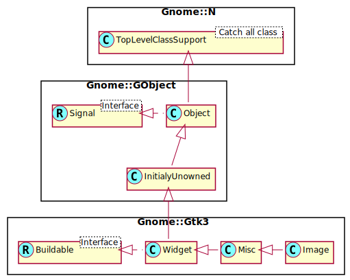

Gnome::Gtk3::Image
==================

A widget displaying an image

Description
===========

The **Gnome::Gtk3::Image** widget displays an image. Various kinds of object can be displayed as an image; most typically, you would load a **Gnome::Gdk3::Pixbuf** ("pixel buffer") from a file, and then display that. There’s a convenience function to do this, `set_from_file()`, used as follows:

    my Gnome::Gtk3::Image $image .= new;
    $image.set-from-file("myfile.png");

To make it shorter;

    my Gnome::Gtk3::Image $image .= new(:file<myfile.png>);

If the file isn’t loaded successfully, the image will contain a “broken image” icon similar to that used in many web browsers. If you want to handle errors in loading the file yourself, for example by displaying an error message, then load the image like next example

    my Gnome::Gdk3::Pixbuf $pixbuf .= new(:$file);
    die $e.message if $pixbuf.last-error.is-valid;
    my Gnome::Gtk3::Image $image .= new(:$pixbuf);

The image file may contain an animation, if so the **Gnome::Gtk3::Image** will display an animation

**Gnome::Gtk3::Image** is a “no window” widget (has no **Gnome::Gdk3::Window** of its own), so by default does not receive events. If you want to receive events on the image, such as button clicks, place the image inside a **Gnome::Gtk3::EventBox**, then connect to the event signals on the event box.

When handling events on the event box, keep in mind that coordinates in the image may be different from event box coordinates due to the alignment and padding settings on the image (see **Gnome::Gtk3::Misc**). The simplest way to solve this is to set the alignment to 0.0 (left/top), and set the padding to zero. Then the origin of the image will be the same as the origin of the event box.

A note: **Gnome::Gtk3::Misc** is almost completely deprecated. It exists only to support the inheritance tree below the Misc class. For alignment and padding look for the methods in **Gnome::Gtk3::Widget**.

Css Nodes
---------

**Gnome::Gtk3::Image** has a single CSS node with the name image.

Synopsis
========

Declaration
-----------

    unit class Gnome::Gtk3::Image;
    also is Gnome::Gtk3::Misc;

Uml Diagram
-----------

Inheriting this class
---------------------

Inheriting is done in a special way in that it needs a call from new() to get the native object created by the class you are inheriting from.

    use Gnome::Gtk3::Image:api<1>;

    unit class MyGuiClass;
    also is Gnome::Gtk3::Image;

    submethod new ( |c ) {
      # let the Gnome::Gtk3::Image class process the options
      self.bless( :GtkImage, |c);
    }

    submethod BUILD ( ... ) {
      ...
    }

Example
-------

### Handling button press events on a Gnome::Gtk3::Image.

    # Define a button press event handler
    method button-press-handler (
      N-GdkEventButton $event, Gnome::Gtk3::EventBox :widget($event-box)
      --> Bool
    ) {
      say "Event box clicked at coordinates $event.x(), $event.y()");

      # Returning True means we handled the event, so the signal
      # emission should be stopped (don’t call any further callbacks
      # that may be connected). Return False to continue invoking callbacks.
      True
    }

    # Create an image and setup a button click event on the image.
    # Return the result image object
    method create-image ( Str $image-file --> Gnome::Gtk3::Image ) {
      my Gnome::Gtk3::Image $image .= new(:filename($image-file));
      my Gnome::Gtk3::EventBox $eb .= new;
      $eb.add($image);
      $eb.register-signal( self, button-press-handler, 'button_press_event');

      $image
    }

Types
=====

enum GtkImageType
-----------------

Describes the image data representation used by a **Gnome::Gtk3::Image**. If you want to get the image from the widget, you can only get the currently-stored representation. e.g. if the `gtk_image_get_storage_type()` returns **GTK_IMAGE_PIXBUF**, then you can call `gtk_image_get_pixbuf()` but not `gtk_image_get_stock()`. For empty images, you can request any storage type (call any of the "get" functions), but they will all return `Any` values.

  * GTK_IMAGE_EMPTY: there is no image displayed by the widget

  * GTK_IMAGE_PIXBUF: the widget contains a **Gnome::Gdk3::Pixbuf**

  * GTK_IMAGE_STOCK: the widget contains a [stock item name][gtkstock]

  * GTK_IMAGE_ICON_SET: the widget contains a **Gnome::Gtk3::IconSet**

  * GTK_IMAGE_ANIMATION: the widget contains a **Gnome::Gdk3::PixbufAnimation**

  * GTK_IMAGE_ICON_NAME: the widget contains a named icon.

  * GTK_IMAGE_GICON: the widget contains a **GIcon**.

  * GTK_IMAGE_SURFACE: the widget contains a **cairo_surface_t**.

Methods
=======

new
---

### default, no options

Create a new plain object without an image.

    multi method new ( )

### :file

Creates a new **Gnome::Gtk3::Image** displaying the file *filename*. If the file isn’t found or can’t be loaded, the resulting **Gnome::Gtk3::Image** will display a “broken image” icon.

If the file contains an animation, the image will contain an animation.

If you need to detect failures to load the file, use `gdk_pixbuf_new_from_file()` to load the file yourself, then create the **Gnome::Gtk3::Image** from the pixbuf.

The storage type (`gtk_image_get_storage_type()`) of the returned image is not defined, it will be whatever is appropriate for displaying the file. Create a new object and load an image from file.

    multi method new ( Str :$file! )

### :gicon, :size

Creates a **Gnome::Gtk3::Image** displaying an icon created by one of the `Gnome::Gio` icon modules.

    multi method new (
      N-GObject():D :$gicon!, GtkIconSize :$size = GTK_ICON_SIZE_DIALOG
    )

  * $gicon; an icon from Gnome::Gio::Icon

  * $size; a stock icon size (an enum **GtkIconSize**)

### :icon-name, :size

Creates a **Gnome::Gtk3::Image** displaying an icon from the current icon theme. If the icon name isn’t known, a “broken image” icon will be displayed instead. If the current icon theme is changed, the icon will be updated appropriately. You can use the program `gtk3-icon-browser` to get the available names in the current selected theme.

    multi method new (
      Str:D :$icon-name!, GtkIconSize :$size = GTK_ICON_SIZE_BUTTON
    )

  * $icon_name; an icon name

  * $size; a stock icon size (an enum **GtkIconSize**)

### :pixbuf

Creates a new **Gnome::Gtk3::Image** displaying *$pixbuf*. The **Gnome::Gtk3::Image** does not assume a reference to the pixbuf; you still need to unref it if you own references. **Gnome::Gtk3::Image** will add its own reference rather than adopting yours.

Note that this function just creates an **Gnome::Gtk3::Image** from the pixbuf. The **Gnome::Gtk3::Image** created will not react to state changes. Should you want that, you should use `gtk_image_new_from_icon_name()`.

    multi method new ( N-GObject() :$pixbuf! )

### :resource-path

Creates a new **Gnome::Gtk3::Image** displaying the resource file *$resource-path*. If the file isn’t found or can’t be loaded, the resulting **Gnome::Gtk3::Image** will display a “broken image” icon. This function never returns `Any`, it always returns a valid **Gnome::Gtk3::Image** widget.

If the file contains an animation, the image will contain an animation.

If you need to detect failures to load the file, use `gdk_pixbuf_new_from_file()` to load the file yourself, then create the **Gnome::Gtk3::Image** from the pixbuf. (Or for animations, use `gdk_pixbuf_animation_new_from_file()`).

The storage type (`gtk_image_get_storage_type()`) of the returned image is not defined, it will be whatever is appropriate for displaying the file.

    multi method new ( Str :$resource-path! )

### :surface

Creates a new **Gnome::Gtk3::Image** displaying *surface*. The **Gnome::Gtk3::Image** does not assume a reference to the surface; you still need to unref it if you own references. **Gnome::Gtk3::Image** will add its own reference rather than adopting yours.

    multi method new ( cairo_surface_t:D :$surface! )

### :native-object

Create a Image object using a native object from elsewhere. See also **Gnome::N::TopLevelClassSupport**.

    multi method new ( N-GObject() :$native-object! )

### :build-id

Create a Image object using a native object returned from a builder. See also **Gnome::GObject::Object**.

    multi method new ( Str :$build-id! )

clear
-----

Resets the image to be empty.

    method clear ( )

get-gicon
---------

Gets the **Gnome::Gtk3::Icon** and size being displayed by the **Gnome::Gtk3::Image**. The storage type of the image must be `GTK-IMAGE-EMPTY` or `GTK-IMAGE-GICON` (see `get-storage-type()`). The caller of this function does not own a reference to the returned **Gnome::Gtk3::Icon**.

    method get-gicon ( --> List )

The method returns a list consisting of;

  * N-GObject; A native Gnome::Gio::Icon

  * GtkIconSize; The icon size enum type

Example to get the icon assuming that the icon type was a file icon;

    my Gnome::Gio::FileIcon() $fi2;
    my GtkIconSize() $size;
    ( $fi2, $size) = $i3.get-gicon;

get-icon-name
-------------

Gets the icon name and size being displayed by the **Gnome::Gtk3::Image**. The storage type of the image must be `GTK-IMAGE-EMPTY` or `GTK-IMAGE-ICON-NAME` (see `get-storage-type()`). The returned string is owned by the **Gnome::Gtk3::Image** and should not be freed.

    method get-icon-name ( --> List )

  * CArray[Str] $icon_name; place to store an icon name, or `undefined`

  * GtkIconSize $size; (type int): place to store an icon size (**Gnome::Gtk3::IconSize**), or `undefined`

get-pixbuf
----------

Gets the **Gnome::Gtk3::Pixbuf** being displayed by the **Gnome::Gtk3::Image**. The storage type of the image must be `GTK-IMAGE-EMPTY` or `GTK-IMAGE-PIXBUF` (see `get-storage-type()`). The caller of this function does not own a reference to the returned pixbuf.

Returns: the displayed pixbuf, or `undefined` if the image is empty

    method get-pixbuf ( --> N-GObject )

get-pixel-size
--------------

Gets the pixel size used for named icons.

Returns: the pixel size used for named icons.

    method get-pixel-size ( --> Int )

get-storage-type
----------------

Gets the type of representation being used by the **Gnome::Gtk3::Image** to store image data. If the **Gnome::Gtk3::Image** has no image data, the return value will be `GTK-IMAGE-EMPTY`.

Returns: image representation being used

    method get-storage-type ( --> GtkImageType )

set-from-file
-------------

See `new-from-file()` for details.

    method set-from-file ( Str $filename )

  * $filename; a filename or `undefined`

set-from-gicon
--------------

See `new-from-gicon()` for details.

    method set-from-gicon ( N-GObject() $icon, GtkIconSize $size )

  * $icon; an icon defined by one of the icon modules in **Gnome::Gio**

  * $size; (type int): an icon size (**Gnome::Gtk3::IconSize**)

set-from-icon-name
------------------

See `new-from-icon-name()` for details.

    method set-from-icon-name ( Str $icon_name, GtkIconSize $size )

  * $icon_name; an icon name or `undefined`

  * $size; an icon size

set-from-pixbuf
---------------

See `new-from-pixbuf()` for details.

    method set-from-pixbuf ( N-GObject $pixbuf )

  * $pixbuf; a **Gnome::Gtk3::Pixbuf** or `undefined`

set-from-resource
-----------------

See `new-from-resource()` for details.

    method set-from-resource ( Str $resource_path )

  * $resource_path; a resource path or `undefined`

set-from-surface
----------------

See `new-from-surface()` for details.

    method set-from-surface ( cairo_surface_t $surface )

  * $surface; a cairo-surface-t or `undefined`

set-pixel-size
--------------

Sets the pixel size to use for named icons. If the pixel size is set to a value != -1, it is used instead of the icon size set by `set-from-icon-name()`.

    method set-pixel-size ( Int() $pixel_size )

  * $pixel_size; the new pixel size

Properties
==========

An example of using a string type property of a **Gnome::Gtk3::Label** object. This is just showing how to set/read a property, not that it is the best way to do it. This is because a) The class initialization often provides some options to set some of the properties and b) the classes provide many methods to modify just those properties. In the case below one can use **new(:label('my text label'))** or **.set-text('my text label')**.

    my Gnome::Gtk3::Label $label .= new;
    my Gnome::GObject::Value $gv .= new(:init(G_TYPE_STRING));
    $label.get-property( 'label', $gv);
    $gv.set-string('my text label');

Supported properties
--------------------

### Filename: file

Filename to load and display Default value: Any

The **Gnome::GObject::Value** type of property *file* is `G_TYPE_STRING`.

### Icon Name: icon-name

The name of the icon in the icon theme. If the icon theme is changed, the image will be updated automatically.

The **Gnome::GObject::Value** type of property *icon-name* is `G_TYPE_STRING`.

### Pixbuf: pixbuf

A GdkPixbuf to display Widget type: GDK-TYPE-PIXBUF

The **Gnome::GObject::Value** type of property *pixbuf* is `G_TYPE_OBJECT`.

### Resource: resource

A path to a resource file to display.

The **Gnome::GObject::Value** type of property *resource* is `G_TYPE_STRING`.

### Storage type: storage-type

The representation being used for image data Default value: False

The **Gnome::GObject::Value** type of property *storage-type* is `G_TYPE_ENUM`.

### Surface: surface

The **Gnome::GObject::Value** type of property *surface* is `G_TYPE_BOXED`.

### Use Fallback: use-fallback

Whether the icon displayed in the GtkImage will use standard icon names fallback. The value of this property is only relevant for images of type `GTK-IMAGE-ICON-NAME` and `GTK-IMAGE-GICON`.

The **Gnome::GObject::Value** type of property *use-fallback* is `G_TYPE_BOOLEAN`.

