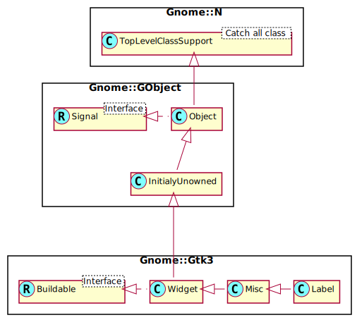

Gnome::Gtk3::Label
==================

A widget that displays a small to medium amount of text

Description
===========

The **Gnome::Gtk3::Label** widget displays a small amount of text. As the name implies, most labels are used to label another widget such as a **Gnome::Gtk3::Button**, a **Gnome::Gtk3::MenuItem**, or a **Gnome::Gtk3::ComboBox**.

Css Nodes
---------

    label
    ├── [selection]
    ├── [link]
    ┊
    ╰── [link]

**Gnome::Gtk3::Label** has a single CSS node with the name label. A wide variety of style classes may be applied to labels, such as .title, .subtitle, .dim-label, etc. In the **Gnome::Gtk3::ShortcutsWindow**, labels are used with the .keycap style class.

If the label has a selection, it gets a subnode with name selection.

If the label has links, there is one subnode per link. These subnodes carry the link or visited state depending on whether they have been visited.

Gnome::Gtk3::Label as Gnome::Gtk3::Buildable
--------------------------------------------

The **Gnome::Gtk3::Label** implementation of the **Gnome::Gtk3::Buildable** interface supports a custom <attributes> element, which supports any number of <attribute> elements. The <attribute> element has attributes named “name“, “value“, “start“ and “end“ and allows you to specify **PangoAttribute** values for this label.

An example of a UI definition fragment specifying Pango attributes:

    <object class="GtkLabel">
      <attributes>
        <attribute name="weight" value="PANGO_WEIGHT_BOLD"/>
        <attribute name="background" value="red" start="5" end="10"/>"
      </attributes>
    </object>

The start and end attributes specify the range of characters to which the Pango attribute applies. If start and end are not specified, the attribute is applied to the whole text. Note that specifying ranges does not make much sense with translatable attributes. Use markup embedded in the translatable content instead.

Mnemonics
---------

Labels may contain “mnemonics”. Mnemonics are underlined characters in the label, used for keyboard navigation. Mnemonics are created by providing a string with an underscore before the mnemonic character, such as `"_File"`, to the functions `gtk_label_new_with_mnemonic()` or `gtk_label_set_text_with_mnemonic()`.

Mnemonics automatically activate any activatable widget the label is inside, such as a **Gnome::Gtk3::Button**; if the label is not inside the mnemonic’s target widget, you have to tell the label about the target using `.new(:mnemonic())`. Here’s a simple example where the label is inside a button:

    # Pressing Alt+H will activate this button
    my Gnome::Gtk3::Button $b .= new;
    my Gnome::Gtk3::Label $l .= new(:mnemonic<_Hello>);
    $b.add($l);

There’s a convenience function to create buttons with a mnemonic label already inside:

    # Pressing Alt+H will activate this button
    my Gnome::Gtk3::Button $b .= new(:mnemonic<_Hello>);

To create a mnemonic for a widget alongside the label, such as a **Gnome::Gtk3::Entry**, you have to point the label at the entry with `set-mnemonic-widget()`:

    # Pressing Alt+H will focus the entry
    my Gnome::Gtk3::Entry $entry .= new;
    my Gnome::Gtk3::Label $label .= new(:mnemonic<_Hello>);
    $label.set-mnemonic-widget($entry);

Markup (styled text)
--------------------

To make it easy to format text in a label (changing colors, fonts, etc.), label text can be provided in a simple [markup format][PangoMarkupFormat].

Here’s how to create a label with a small font:

    my Gnome::Gtk3::Label $label .= new;
    $label.set-markup("<small>Small text</small>");

See [complete documentation](https://developer.gnome.org/pygtk/stable/pango-markup-language.html) of available tags in the Pango manual.

The markup passed to `set-markup()` must be valid; for example, literal <, > and & characters must be escaped as &lt;, &gt;, and &amp;.

Markup strings are just a convenient way to set the **PangoAttrList** on a label; `set-attributes()` may be a simpler way to set attributes in some cases. Be careful though; **PangoAttrList** tends to cause internationalization problems, unless you’re applying attributes to the entire string (i.e. unless you set the range of each attribute to [0, `G_MAXINT`)). The reason is that specifying the start_index and end_index for a **PangoAttribute** requires knowledge of the exact string being displayed, so translations will cause problems.

Selectable labels
-----------------

Labels can be made selectable with `gtk_label_set_selectable()`. Selectable labels allow the user to copy the label contents to the clipboard. Only labels that contain useful-to-copy information — such as error messages — should be made selectable.

Text layout
-----------

A label can contain any number of paragraphs, but will have performance problems if it contains more than a small number. Paragraphs are separated by newlines or other paragraph separators understood by Pango.

Labels can automatically wrap text if you call `set-line-wrap()`.

`set-justify()` sets how the lines in a label align with one another. If you want to set how the label as a whole aligns in its available space, see the *halign* and *valign* properties.

The *width-chars* and *max-width-chars* properties can be used to control the size allocation of ellipsized or wrapped labels. For ellipsizing labels, if either is specified (and less than the actual text size), it is used as the minimum width, and the actual text size is used as the natural width of the label. For wrapping labels, width-chars is used as the minimum width, if specified, and max-width-chars is used as the natural width. Even if max-width-chars specified, wrapping labels will be rewrapped to use all of the available width.

Note that the interpretation of *width-chars* and *max-width-chars* has changed a bit with the introduction of width-for-height geometry management.

Links
-----

Since 2.18, GTK+ supports markup for clickable hyperlinks in addition to regular Pango markup. The markup for links is borrowed from HTML, using the `<a>` with “href“ and “title“ attributes. GTK+ renders links similar to the way they appear in web browsers, with colored, underlined text. The “title“ attribute is displayed as a tooltip on the link.

An example looks like this:

    my Str $text = [+] "Go to the",
      "<a href=\"http://www.gtk.org title="&lt;i&gt;Our&lt;/i&gt; website\">",
      "GTK+ website</a> for more...";
    my Gnome::Gtk3::Label $l .= new;
    $l.set-markup($text);

It is possible to implement custom handling for links and their tooltips with the *activate-link* signal and the `gtk_label_get_current_uri()` function.

Synopsis
========

Declaration
-----------

    unit class Gnome::Gtk3::Label;
    also is Gnome::Gtk3::Misc;

Uml Diagram
-----------

Inheriting this class
---------------------

Inheriting is done in a special way in that it needs a call from new() to get the native object created by the class you are inheriting from.

    use Gnome::Gtk3::Label;

    unit class MyGuiClass;
    also is Gnome::Gtk3::Label;

    submethod new ( |c ) {
      # let the Gnome::Gtk3::Label class process the options
      self.bless( :GtkLabel, |c);
    }

    submethod BUILD ( ... ) {
      ...
    }

Methods
=======

new
---

### :text

Creates a new label with the given text inside it. You can pass an undefined string to get an empty label widget.

    multi method new ( Str :$text! )

### :mnemonic

Create a new object with mnemonic.

If characters in a string are preceded by an underscore, they are underlined. If you need a literal underscore character in a label, use '__' (two underscores). The first underlined character represents a keyboard accelerator called a mnemonic. The mnemonic key can be used to activate another widget, chosen automatically, or explicitly using `set-mnemonic-widget()`.

If `set-mnemonic-widget()` is not called, then the first activatable ancestor of the **Gnome::Gtk3::Label** will be chosen as the mnemonic widget. For instance, if the label is inside a button or menu item, the button or menu item will automatically become the mnemonic widget and be activated by the mnemonic.

    multi method new ( Str :$mnemonic! )

### :native-object

Create an object using a native object from elsewhere. See also **Gnome::N::TopLevelSupportClass**.

    multi method new ( N-GObject :$native-object! )

### :build-id

Create an object using a native object from a builder. See also **Gnome::GObject::Object**.

    multi method new ( Str :$build-id! )

set-text
--------

Sets the text within the **Gnome::Gtk3::Label** widget. It overwrites any text that was there before.

This function will clear any previously set mnemonic accelerators, and set the *use-underline* property to `0` as a side effect. The function will also set the *use-markup* property to `0` as a side effect.

See also: `set-markup()`

    method set-text ( Str $str )

  * Str $str; The text you want to set

get-text
--------

Fetches the text from a label widget, as displayed on the screen. This does not include any embedded underlines indicating mnemonics or Pango markup. (See `gtk_label_get_label()`)

Returns: the text in the label widget. This is the internal string used by the label, and must not be modified.

    method get-text ( --> Str )

set-label
---------

Sets the text of the label. The label is interpreted as including embedded underlines and/or Pango markup depending on the values of the *use-underline* and *use-markup* properties.

    method set-label ( Str $str )

  * Str $str; the new text to set for the label

get-label
---------

Fetches the text from a label widget including any embedded underlines indicating mnemonics and Pango markup. (See `get-text()`).

Returns: the text of the label widget. This string is owned by the widget and must not be modified or freed.

    method get-label ( --> Str )

set-markup
----------

Parses *$str* which is marked up with the Pango text markup language, setting the label’s text and attribute list based on the parse results.

This function will set the *use-markup* property to `1` as a side effect.

If you set the label contents using the *label* property you should also ensure that you set the *use-markup* property accordingly.

See also: `set-text()`.

    method set-markup ( Str $str )

  * Str $str; a markup string. See also [Pango markup format](https://developer.gnome.org/pygtk/stable/pango-markup-language.html).

set-use-markup
--------------

Sets whether the text of the label contains markup in [Pango’s text markup language](https://developer.gnome.org/pygtk/stable/pango-markup-language.html).

See `set-markup()`.

    method set-use-markup ( Bool $setting )

  * Bool $setting; `True` if the label’s text should be parsed for markup.

get-use-markup
--------------

Returns whether the label’s text is interpreted as marked up with the Pango text markup language. See `set-use-markup()`.

Returns: `True` if the label’s text will be parsed for markup.

    method get-use-markup ( --> Bool )

set-use-underline
-----------------

If `True`, an underline in the text indicates the next character should be used for the mnemonic accelerator key.

    method set-use-underline ( Bool $setting )

  * Bool $setting; `True` if underlines in the text indicate mnemonics

get-use-underline
-----------------

Returns whether an embedded underline in the label indicates a mnemonic. See `set-use-underline()`.

Returns: `True` whether an embedded underline in the label indicates the mnemonic accelerator keys.

    method get-use-underline ( --> Bool )

set-markup-with-mnemonic
------------------------

Parses *$str* which is marked up with the [Pango text markup language](https://developer.gnome.org/pygtk/stable/pango-markup-language.html),setting the label’s text and attribute list based on the parse results. If characters in *str* are preceded by an underscore, they are underlined indicating that they represent a keyboard accelerator called a mnemonic.

The mnemonic key can be used to activate another widget, chosen automatically, or explicitly using `set-mnemonic-widget()`.

    method set-markup-with-mnemonic ( Str $str )

  * Str $str; a markup string (see [Pango markup format][PangoMarkupFormat])

get-mnemonic-keyval
-------------------

If the label has been set so that it has an mnemonic key this function returns the keyval used for the mnemonic accelerator. If there is no mnemonic set up it returns **GDK_KEY_VoidSymbol**.

Returns: GDK keyval usable for accelerators, or **GDK_KEY_VoidSymbol**

    method get-mnemonic-keyval ( --> UInt  )

set-mnemonic-widget
-------------------

If the label has been set so that it has an mnemonic key (using e.g. `set-markup-with-mnemonic()`, `set-text-with-mnemonic()`, `new(:mnemonic)` or the “use_underline” property) the label can be associated with a widget that is the target of the mnemonic. When the label is inside a widget (like a **Gnome::Gtk3::Button** or a **Gnome::Gtk3::Notebook** tab) it is automatically associated with the correct widget, but sometimes (e.g. when the target is a **Gnome::Gtk3::Entry** next to the label) you need to set it explicitly using this function.

The target widget will be accelerated by emitting the **Gnome::Gtk3::Widget**::mnemonic-activate signal on it. The default handler for this signal will activate the widget if there are no mnemonic collisions and toggle focus between the colliding widgets otherwise.

    method set-mnemonic-widget ( N-GObject $widget )

  * N-GObject $widget; the target **Gnome::Gtk3::Widget** or undefined

get-mnemonic-widget
-------------------

Retrieves the target of the mnemonic (keyboard shortcut) of this label. See `set-mnemonic-widget()`.

Returns: the target of the label’s mnemonic, or undefined if none has been set and the default algorithm will be used.

    method get-mnemonic-widget ( --> N-GObject )

set-text-with-mnemonic
----------------------

Sets the label’s text from the string *$str*. If characters in *$str* are preceded by an underscore, they are underlined indicating that they represent a keyboard accelerator called a mnemonic. The mnemonic key can be used to activate another widget, chosen automatically, or explicitly using `set-mnemonic-widget()`.

    method set-text-with-mnemonic ( Str $str )

  * Str $str; a string

set-justify
-----------

Sets the alignment of the lines in the text of the label relative to each other. `GTK_JUSTIFY_LEFT` is the default value when the widget is first created with `gtk_label_new()`. If you instead want to set the alignment of the label as a whole, use `gtk_widget_set_halign()` instead. `gtk_label_set_justify()` has no effect on labels containing only a single line.

    method set-justify ( GtkJustification $jtype )

  * GtkJustification $jtype; a `GtkJustification` enum type

get-justify
-----------

Returns the justification of the label. See `set-justify()`.

    method get-justify ( --> GtkJustification )

set-width-chars
---------------

Sets the desired width in characters of this label to *$n_chars*.

    method set-width-chars ( Int $n_chars )

  * Int $n_chars; the new desired width, in characters.

get_width_chars
---------------

Retrieves the desired width of *label*, in characters. See `set-width-chars()`.

Returns: the width of the label in characters.

    method get_width_chars ( --> Int )

set-max-width-chars
-------------------

Sets the desired maximum width in characters of this label to *n_chars*.

    method set-max-width-chars ( Int $n_chars )

  * Int $n_chars; the new desired maximum width, in characters.

get-max-width-chars
-------------------

Retrieves the desired maximum width of this label, in characters. See `set-width-chars()`.

Returns: the maximum width of the label in characters.

    method get-max-width-chars ( --> Int )

set-lines
---------

Sets the number of lines to which an ellipsized, wrapping label should be limited. This has no effect if the label is not wrapping or ellipsized. Set this to -1 if you don’t want to limit the number of lines.

    method set-lines ( Int $lines )

  * Int $lines; the desired number of lines, or -1

get-lines
---------

Gets the number of lines to which an ellipsized, wrapping label should be limited. See `set-lines()`.

Returns: The number of lines

    method get-lines ( --> Int  )

set-pattern
-----------

The pattern of underlines you want under the existing text within the **Gnome::Gtk3::Label** widget. For example if the current text of the label says “FooBarBaz” passing a pattern of “___ ___” will underline “Foo” and “Baz” but not “Bar”.

    method set-pattern ( Str $pattern )

  * Str $pattern; The pattern as described above.

set-line-wrap
-------------

Toggles line wrapping within the **Gnome::Gtk3::Label** widget. `True` makes it break lines if text exceeds the widget’s size. `False` lets the text get cut off by the edge of the widget if it exceeds the widget size.

Note that setting line wrapping to `True` does not make the label wrap at its parent container’s width, because GTK+ widgets conceptually can’t make their requisition depend on the parent container’s size. For a label that wraps at a specific position, set the label’s width using `set-size-request()`.

    method set-line-wrap ( Int $wrap )

  * Int $wrap; the setting

get-line-wrap
-------------

Returns whether lines in the label are automatically wrapped. See `gtk_label_set_line_wrap()`.

Returns: `True` if the lines of the label are automatically wrapped.

    method get-line-wrap ( --> Bool )

set-selectable
--------------

Selectable labels allow the user to select text from the label, for copy-and-paste.

    method set-selectable ( Bool $setting )

  * Int $setting; `True` to allow selecting text in the label

get-selectable
--------------

Gets the value set by `set-selectable()`.

Returns: `True` if the user can copy text from the label

    method get-selectable ( --> Bool )

set-angle
---------

Sets the angle of rotation for the label. An angle of 90 reads from bottom to top, an angle of 270, from top to bottom. The angle setting for the label is ignored if the label is selectable, wrapped, or ellipsized.

    method set-angle ( Num $angle )

  * Num $angle; the angle that the baseline of the label makes with the horizontal, in degrees, measured counterclockwise

get-angle
---------

Gets the angle of rotation for the label. See `set-angle()`.

Returns: the angle of rotation for the label

    method get-angle ( --> Num )

select-region
-------------

Selects a range of characters in the label, if the label is selectable. See `set-selectable()`. If the label is not selectable, this function has no effect. If *$start_offset* or *$end_offset* are -1, then the end of the label will be substituted.

    method select-region ( Int $start_offset, Int $end_offset )

  * Int $start_offset; start offset (in characters not bytes)

  * Int $end_offset; end offset (in characters not bytes)

get-selection-bounds
--------------------

Gets the selected range of characters in the label, returning `True` if there’s a selection.

    method gtk_label_get_selection_bounds ( --> List )

This method returns a list of which

  * Bool $non-empty: `True` if selection is non-empty

  * Int $start; start of selection, as a character offset

  * Int $end; end of selection, as a character offset

set-single-line-mode
--------------------

Sets whether the label is in single line mode.

    method set-single-line-mode ( Bool $single_line_mode )

  * Int $single_line_mode; `True` if the label should be in single line mode

get-single-line-mode
--------------------

Returns whether the label is in single line mode.

Returns: `True` when the label is in single line mode.

    method get-single-line-mode ( --> Bool )

get-current-uri
---------------

Returns the URI for the currently active link in the label. The active link is the one under the mouse pointer or, in a selectable label, the link in which the text cursor is currently positioned.

This function is intended for use in a *activate-link* handler or for use in a *query-tooltip* handler.

Returns: the currently active URI. The string is owned by GTK+ and must not be freed or modified.

    method get-current-uri ( --> Str )

set-track-visited-links
-----------------------

Sets whether the label should keep track of clicked links (and use a different color for them).

    method set-track-visited-links ( Bool $track_links )

  * Bool $track_links; `True` to track visited links

get-track-visited-links
-----------------------

Returns whether the label is currently keeping track of clicked links.

Returns: `True` if clicked links are remembered

    method get-track-visited-links ( --> Bool )

set-xalign
----------

Sets the *xalign* property for *label*.

    method set-xalign ( Num $xalign )

  * Num $xalign; the new xalign value, between 0 and 1

get-xalign
----------

Gets the *xalign* property for *label*.

Returns: the xalign property

    method get-xalign ( --> Num  )

set-yalign
----------

Sets the *yalign* property for *label*.

    method set-yalign ( Num $yalign )

  * Num $yalign; the new yalign value, between 0 and 1

get-yalign
----------

Gets the *yalign* property for *label*.

Returns: the yalign property

    method get-yalign ( --> Num  )

Signals
=======

There are two ways to connect to a signal. The first option you have is to use `register-signal()` from **Gnome::GObject::Object**. The second option is to use `g_signal_connect_object()` directly from **Gnome::GObject::Signal**.

First method
------------

The positional arguments of the signal handler are all obligatory as well as their types. The named attributes `:$widget` and user data are optional.

    # handler method
    method mouse-event ( N-GdkEvent $event, :$widget ) { ... }

    # connect a signal on window object
    my Gnome::Gtk3::Window $w .= new( ... );
    $w.register-signal( self, 'mouse-event', 'button-press-event');

Second method
-------------

    my Gnome::Gtk3::Window $w .= new( ... );
    my Callable $handler = sub (
      N-GObject $native, N-GdkEvent $event, OpaquePointer $data
    ) {
      ...
    }

    $w.connect-object( 'button-press-event', $handler);

Also here, the types of positional arguments in the signal handler are important. This is because both methods `register-signal()` and `g_signal_connect_object()` are using the signatures of the handler routines to setup the native call interface.

Supported signals
-----------------

### copy-clipboard

The *copy-clipboard* signal is a keybinding signal which gets emitted to copy the selection to the clipboard.

The default binding for this signal is `Ctrl-c`.

    method handler (
      Int :$_handler_id,
      Gnome::GObject::Object :_widget($label),
      *%user-options
    );

  * $label; the object which received the signal

### populate-popup

The *populate-popup* signal gets emitted before showing the context menu of the label. Note that only selectable labels have context menus.

If you need to add items to the context menu, connect to this signal and append your menuitems to the *menu*.

    method handler (
      N-GObject $menu, # a native Gnome::Gtk3::Menu
      Int :$_handler_id,
      Gnome::GObject::Object :_widget($label),
      *%user-options
    );

  * $label; The label on which the signal is emitted

  * $menu; the menu that is being populated

### activate-current-link

A keybinding signal which gets emitted when the user activates a link in the label.

Applications may also emit the signal with `g_signal_emit_by_name()` if they need to control activation of URIs programmatically.

The default bindings for this signal are all forms of the `Enter` key.

    method handler (
      Int :$_handler_id,
      Gnome::GObject::Object :_widget($label),
      *%user-options
    );

  * $label; The label on which the signal was emitted

### activate-link

The signal which gets emitted to activate a URI. Applications may connect to it to override the default behaviour, which is to call `gtk_show_uri()`.

Returns: `1` if the link has been activated

    method handler (
      Str $uri,
      Int :$_handler_id,
      Gnome::GObject::Object :_widget($label),
      *%user-options
      --> Int
    );

  * $label; The label on which the signal was emitted

  * $uri; the URI that is activated

Properties
==========

An example of using a string type property of a **Gnome::Gtk3::Label** object. This is just showing how to set/read a property, not that it is the best way to do it. This is because a) The class initialization often provides some options to set some of the properties and b) the classes provide many methods to modify just those properties. In the case below one can use **new(:label('my text label'))** or **gtk_label_set_text('my text label')**.

    my Gnome::Gtk3::Label $label .= new;
    my Gnome::GObject::Value $gv .= new(:init(G_TYPE_STRING));
    $label.g-object-get-property( 'label', $gv);
    $gv.g-value-set-string('my text label');

Supported properties
--------------------

### Label

The contents of the label. If the string contains [Pango XML markup][PangoMarkupFormat], you will have to set the *use-markup* property to `1` in order for the label to display the markup attributes. See also `gtk_label_set_markup()` for a convenience function that sets both this property and the *use-markup* property at the same time. If the string contains underlines acting as mnemonics, you will have to set the *use-underline* property to `1` in order for the label to display them.

The **Gnome::GObject::Value** type of property *label* is `G_TYPE_STRING`.

### Attributes

The **Gnome::GObject::Value** type of property *attributes* is `G_TYPE_BOXED`.

### Use markup

The text of the label includes XML markup. See `pango_parse_markup()` Default value: 0

The **Gnome::GObject::Value** type of property *use-markup* is `G_TYPE_BOOLEAN`.

### Use underline

If set, an underline in the text indicates the next character should be used for the mnemonic accelerator key Default value: 0

The **Gnome::GObject::Value** type of property *use-underline* is `G_TYPE_BOOLEAN`.

### Justification

The alignment of the lines in the text of the label relative to each other. This does NOT affect the alignment of the label within its allocation. See **Gnome::Gtk3::Label**:xalign for that Default value: False

The **Gnome::GObject::Value** type of property *justify* is `G_TYPE_ENUM`.

### X align

The xalign property determines the horizontal aligment of the label text inside the labels size allocation. Compare this to *halign*, which determines how the labels size allocation is positioned in the space available for the label.

The **Gnome::GObject::Value** type of property *xalign* is `G_TYPE_FLOAT`.

### Y align

The yalign property determines the vertical aligment of the label text inside the labels size allocation. Compare this to *valign*, which determines how the labels size allocation is positioned in the space available for the label.

The **Gnome::GObject::Value** type of property *yalign* is `G_TYPE_FLOAT`.

### Pattern

A string with _ characters in positions correspond to characters in the text to underline. Default value: Any

The **Gnome::GObject::Value** type of property *pattern* is `G_TYPE_STRING`.

### Line wrap

If set, wrap lines if the text becomes too wide Default value: False

The **Gnome::GObject::Value** type of property *wrap* is `G_TYPE_BOOLEAN`.

### Line wrap mode

If line wrapping is on (see the *wrap* property) this controls how the line wrapping is done. The default is `PANGO_WRAP_WORD`, which means wrap on word boundaries. Widget type: PANGO_TYPE_WRAP_MODE

The **Gnome::GObject::Value** type of property *wrap-mode* is `G_TYPE_ENUM`.

### Selectable

Whether the label text can be selected with the mouse Default value: False

The **Gnome::GObject::Value** type of property *selectable* is `G_TYPE_BOOLEAN`.

### Mnemonic key

The **Gnome::GObject::Value** type of property *mnemonic-keyval* is `G_TYPE_UINT`.

### Mnemonic widget

The widget to be activated when the label's mnemonic key is pressed Widget type: GTK_TYPE_WIDGET

The **Gnome::GObject::Value** type of property *mnemonic-widget* is `G_TYPE_OBJECT`.

### Cursor Position

The **Gnome::GObject::Value** type of property *cursor-position* is `G_TYPE_INT`.

### Selection Bound

The **Gnome::GObject::Value** type of property *selection-bound* is `G_TYPE_INT`.

### Ellipsize

The preferred place to ellipsize the string, if the label does not have enough room to display the entire string, specified as a **PangoEllipsizeMode**. Note that setting this property to a value other than `PANGO_ELLIPSIZE_NONE` has the side-effect that the label requests only enough space to display the ellipsis "...". In particular, this means that ellipsizing labels do not work well in notebook tabs, unless the **Gnome::Gtk3::Notebook** tab-expand child property is set to `1`. Other ways to set a label's width are `gtk_widget_set_size_request()` and `gtk_label_set_width_chars()`. Widget type: PANGO_TYPE_ELLIPSIZE_MODE

The **Gnome::GObject::Value** type of property *ellipsize* is `G_TYPE_ENUM`.

### Width In Characters

The desired width of the label, in characters. If this property is set to -1, the width will be calculated automatically. See the section on [text layout][label-text-layout] for details of how *width-chars* and *max-width-chars* determine the width of ellipsized and wrapped labels.

The **Gnome::GObject::Value** type of property *width-chars* is `G_TYPE_INT`.

### Single Line Mode

Whether the label is in single line mode. In single line mode, the height of the label does not depend on the actual text, it is always set to ascent + descent of the font. This can be an advantage in situations where resizing the label because of text changes would be distracting, e.g. in a statusbar.

The **Gnome::GObject::Value** type of property *single-line-mode* is `G_TYPE_BOOLEAN`.

### Angle

The angle that the baseline of the label makes with the horizontal, in degrees, measured counterclockwise. An angle of 90 reads from from bottom to top, an angle of 270, from top to bottom. Ignored if the label is selectable.

The **Gnome::GObject::Value** type of property *angle* is `G_TYPE_DOUBLE`.

### Maximum Width In Characters

The desired maximum width of the label, in characters. If this property is set to -1, the width will be calculated automatically. See the section on [text layout][label-text-layout] for details of how *width-chars* and *max-width-chars* determine the width of ellipsized and wrapped labels.

The **Gnome::GObject::Value** type of property *max-width-chars* is `G_TYPE_INT`.

### Track visited links

Set this property to `1` to make the label track which links have been visited. It will then apply the **GTK_STATE_FLAG_VISITED** when rendering this link, in addition to **GTK_STATE_FLAG_LINK**.

The **Gnome::GObject::Value** type of property *track-visited-links* is `G_TYPE_BOOLEAN`.

### Number of lines

The number of lines to which an ellipsized, wrapping label should be limited. This property has no effect if the label is not wrapping or ellipsized. Set this property to -1 if you don't want to limit the number of lines.

The **Gnome::GObject::Value** type of property *lines* is `G_TYPE_INT`.

