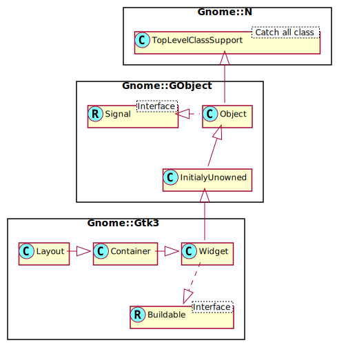
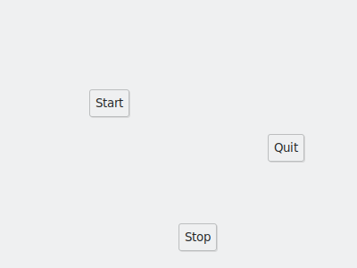

Gnome::Gtk3::Layout
===================

Infinite scrollable area containing child widgets and/or custom drawing

Description
===========

**Gnome::Gtk3::Layout** is similar to **Gnome::Gtk3::DrawingArea** in that it’s a “blank slate” and doesn’t do anything except paint a blank background by default. It’s different in that it supports scrolling natively due to implementing **Gnome::Gtk3::Scrollable**, and can contain child widgets since it’s a **Gnome::Gtk3::Container**.

If you just want to draw, a **Gnome::Gtk3::DrawingArea** is a better choice since it has lower overhead. If you just need to position child widgets at specific points, then **Gnome::Gtk3::Fixed** provides that functionality on its own.

When handling expose events on a **Gnome::Gtk3::Layout**, you must draw to the **Gnome::Gtk3::Window** returned by `get-bin-window()`, rather than to the one returned by `Gnome::Gtk3::Widget.get-window()` as you would for a **Gnome::Gtk3::DrawingArea**.

See Also
--------

**Gnome::Gtk3::DrawingArea**, **Gnome::Gtk3::Fixed**

Synopsis
========

Declaration
-----------

    unit class Gnome::Gtk3::Layout;
    also is Gnome::Gtk3::Container;
    also does Gnome::Gtk3::Scrollable;

Uml Diagram
-----------

Inheriting this class
---------------------

Inheriting is done in a special way in that it needs a call from new() to get the native object created by the class you are inheriting from.

    use Gnome::Gtk3::Layout:api<1>;

    unit class MyGuiClass;
    also is Gnome::Gtk3::Layout;

    submethod new ( |c ) {
      # let the Gnome::Gtk3::Layout class process the options
      self.bless( :GtkLayout, |c);
    }

    submethod BUILD ( ... ) {
      ...
    }

Example
-------

An example where 3 buttons are placed somewhere on a **Gnome::Gtk3::Layout**. In this case a **Gnome::Gtk3::Fixed** would as described above.

    given my Gnome::Gtk3::Layout $l .= new {
      .set-size( 400, 300);
      my Gnome::Gtk3::Button $b .= new(:label<Start>);
      .put( $b, 100, 100);
      $b .= new(:label<Stop>);
      .put( $b, 100, 100);
      .move( $b, 200, 250);
      $b .= new(:label<Quit>);
      .put( $b, 300, 150);
    }

This displays as; 

Methods
=======

new
---

### Default, no arguments

Creates a new **Gnome::Gtk3::Layout**. The horizontal and vertical adjustments are set to default values.

    multi method new ( )

### :hadjustment, :vadjustment

Creates a new **Gnome::Gtk3::Layout**. Unless you have a specific adjustment you’d like the layout to use for scrolling, pass `undefined` for *$hadjustment* and *$vadjustment*.

    multi method new ( N-GObject :$hadjustment!, N-GObject :$vadjustment! )

### :native-object

Create a Layout object using a native object from elsewhere. See also **Gnome::N::TopLevelClassSupport**.

    multi method new ( N-GObject :$native-object! )

### :build-id

Create a Layout object using a native object returned from a builder. See also **Gnome::GObject::Object**.

    multi method new ( Str :$build-id! )

get-bin-window
--------------

Retrieve the bin window of the layout used for drawing operations.

Returns: a **Gnome::Gtk3::Window**

    method get-bin-window ( --> N-GObject )

get-size
--------

Gets the size that has been set on the layout, and that determines the total extents of the layout’s scrollbar area. See `set-size()`.

    method get-size ( --> List )

The list returns;

  * UInt width; width set on *layout*, or `undefined`

  * UInt height; height set on *layout*, or `undefined`

move
----

Moves a current child of *layout* to a new position.

    method move ( N-GObject $child_widget, Int() $x, Int() $y )

  * N-GObject $child_widget; a current child of *layout*

  * Int() $x; X position to move to

  * Int() $y; Y position to move to

put
---

Adds *child-widget* to *layout*, at position (*x*,*y*). *layout* becomes the new parent container of *child-widget*.

    method put ( N-GObject $child_widget, Int() $x, Int() $y )

  * N-GObject $child_widget; child widget

  * Int() $x; X position of child widget

  * Int() $y; Y position of child widget

set-size
--------

Sets the size of the scrollable area of the layout.

    method set-size ( UInt $width, UInt $height )

  * UInt $width; width of entire scrollable area

  * UInt $height; height of entire scrollable area

Properties
==========

An example of using a string type property of a **Gnome::Gtk3::Label** object. This is just showing how to set/read a property, not that it is the best way to do it. This is because a) The class initialization often provides some options to set some of the properties and b) the classes provide many methods to modify just those properties. In the case below one can use **new(:label('my text label'))** or **.set-text('my text label')**.

    my Gnome::Gtk3::Label $label .= new;
    my Gnome::GObject::Value $gv .= new(:init(G_TYPE_STRING));
    $label.get-property( 'label', $gv);
    $gv.set-string('my text label');

Supported properties
--------------------

### Height: height

The **Gnome::GObject::Value** type of property *height* is `G_TYPE_UINT`.

### Width: width

The **Gnome::GObject::Value** type of property *width* is `G_TYPE_UINT`.

