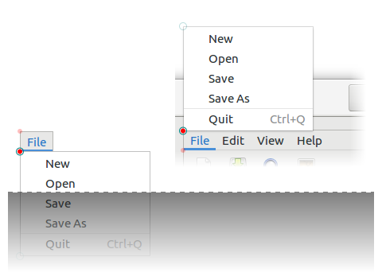

Gnome::Gtk3::Menu
=================

A menu widget

Description
===========

A **Gnome::Gtk3::Menu** is a **Gnome::Gtk3::MenuShell** that implements a drop down menu consisting of a list of **Gnome::Gtk3::MenuItem** objects which can be navigated and activated by the user to perform application functions.

A **Gnome::Gtk3::Menu** is most commonly dropped down by activating a **Gnome::Gtk3::MenuItem** in a **Gnome::Gtk3::MenuBar** or popped up by activating a **Gnome::Gtk3::MenuItem** in another **Gnome::Gtk3::Menu**.

A **Gnome::Gtk3::Menu** can also be popped up by activating a **Gnome::Gtk3::ComboBox**. Other composite widgets such as the **Gnome::Gtk3::Notebook** can pop up a **Gnome::Gtk3::Menu** as well.

Applications can display a **Gnome::Gtk3::Menu** as a popup menu by calling the `gtk_menu_popup()` function. The example below shows how an application can pop up a menu when the 3rd mouse button is pressed.

Connecting the popup signal handler.
------------------------------------

    class HandlerClass {

      method popup-handler (
        GdkEvent $event, Gnome::Gtk3::Window :widget($window), :$menu
        --> Int
      ) {

        my Int $ret-value = 0;

        if $event.event-any.type ~~ GDK_BUTTON_PRESS {
          my GdkEventButton $event-button = $event;
          if $event-button.button ~~ GDK_BUTTON_SECONDARY {
            $menu.gtk_menu_popup(
              Any, Any, Any, Any, $event-button.button, $event-button.time
            );

            $ret-value = 1;
          }
        }

        $ret-value
      }
    }

    # Setup the menu
    my Gnome::Gtk3::Menu $menu .= new;
    ...

    # Create a window and register a handler for the button press signal
    my Gnome::Gtk3::Window $w .= new(:title('My Window'));
    $w.register-signal(
      HandlerClass.new, 'popup-handler', 'button_press_event', :$menu
    );

Css Nodes
---------

    menu
    ├── arrow.top
    ├── <child>
    ┊
    ├── <child>
    ╰── arrow.bottom

The main CSS node of **Gnome::Gtk3::Menu** has name **menu**, and there are two subnodes with name arrow, for scrolling menu arrows. These subnodes get the .top and .bottom style classes.

Implemented Interfaces
----------------------

Gnome::Gtk3::Menu implements

  * [Gnome::Gtk3::Buildable](Buildable.html)

Synopsis
========

Declaration
-----------

    unit class Gnome::Gtk3::Menu;
    also is Gnome::Gtk3::MenuShell;
    also does Gnome::Gtk3::Buildable;

Types
=====

enum GtkArrowPlacement
----------------------

Used to specify the placement of scroll arrows in scrolling menus.

  * GTK_ARROWS_BOTH: Place one arrow on each end of the menu.

  * GTK_ARROWS_START: Place both arrows at the top of the menu.

  * GTK_ARROWS_END: Place both arrows at the bottom of the menu.

Methods
=======

new
---

Create a new plain object.

    multi method new ( )

Create an object using a native object from elsewhere. See also **Gnome::GObject::Object**.

    multi method new ( N-GObject :$native-object! )

Create an object using a native object from a builder. See also **Gnome::GObject::Object**.

    multi method new ( Str :$build-id! )

[gtk_] menu_new
---------------

Creates a new **Gnome::Gtk3::Menu**

Returns: a new **Gnome::Gtk3::Menu**

    method gtk_menu_new ( --> N-GObject  )

[gtk_] menu_reposition
----------------------

Repositions the menu according to its position function.

    method gtk_menu_reposition ( )

[gtk_] menu_popdown
-------------------

Removes the menu from the screen.

    method gtk_menu_popdown ( )

[[gtk_] menu_] get_active
-------------------------

Returns the selected menu item from the menu. This is used by the **Gnome::Gtk3::ComboBox**.

Returns: (transfer none): the **Gnome::Gtk3::MenuItem** that was last selected in the menu. If a selection has not yet been made, the first menu item is selected.

    method gtk_menu_get_active ( --> N-GObject  )

[[gtk_] menu_] set_active
-------------------------

Selects the specified menu item within the menu. This is used by the **Gnome::Gtk3::ComboBox** and should not be used by anyone else.

    method gtk_menu_set_active ( UInt $index )

  * UInt $index; the index of the menu item to select. Index values are from 0 to n-1

[[gtk_] menu_] set_accel_group
------------------------------

Set the **Gnome::Gtk3::AccelGroup** which holds global accelerators for the menu. This accelerator group needs to also be added to all windows that this menu is being used in with `gtk_window_add_accel_group()`, in order for those windows to support all the accelerators contained in this group.

    method gtk_menu_set_accel_group ( N-GObject $accel_group )

  * N-GObject $accel_group; (allow-none): the **Gnome::Gtk3::AccelGroup** to be associated with the menu.

[[gtk_] menu_] get_accel_group
------------------------------

Gets the **Gnome::Gtk3::AccelGroup** which holds global accelerators for the menu. See `gtk_menu_set_accel_group()`.

Returns: (transfer none): the **Gnome::Gtk3::AccelGroup** associated with the menu

    method gtk_menu_get_accel_group ( --> N-GObject  )

[[gtk_] menu_] set_accel_path
-----------------------------

Sets an accelerator path for this menu from which accelerator paths for its immediate children, its menu items, can be constructed. The main purpose of this function is to spare the programmer the inconvenience of having to call `gtk_menu_item_set_accel_path()` on each menu item that should support runtime user changable accelerators. Instead, by just calling `gtk_menu_set_accel_path()` on their parent, each menu item of this menu, that contains a label describing its purpose, automatically gets an accel path assigned.

For example, a menu containing menu items “New” and “Exit”, will, after `gtk_menu_set_accel_path (menu, "<Gnumeric-Sheet>/File");` has been called, assign its items the accel paths: `"<Gnumeric-Sheet>/File/New"` and `"<Gnumeric-Sheet>/File/Exit"`.

Assigning accel paths to menu items then enables the user to change their accelerators at runtime. More details about accelerator paths and their default setups can be found at `gtk_accel_map_add_entry()`.

Note that *accel_path* string will be stored in a **GQuark**. Therefore, if you pass a static string, you can save some memory by interning it first with `g_intern_static_string()`.

    method gtk_menu_set_accel_path ( Str $accel_path )

  * Str $accel_path; (allow-none): a valid accelerator path

[[gtk_] menu_] get_accel_path
-----------------------------

Retrieves the accelerator path set on the menu.

Returns: the accelerator path set on the menu.

Since: 2.14

    method gtk_menu_get_accel_path ( --> Str  )

[gtk_] menu_detach
------------------

Detaches the menu from the widget to which it had been attached. This function will call the callback function, *detacher*, provided when the `gtk_menu_attach_to_widget()` function was called.

    method gtk_menu_detach ( )

[[gtk_] menu_] get_attach_widget
--------------------------------

Returns the **Gnome::Gtk3::Widget** that the menu is attached to.

Returns: (transfer none): the **Gnome::Gtk3::Widget** that the menu is attached to

    method gtk_menu_get_attach_widget ( --> N-GObject  )

[[gtk_] menu_] reorder_child
----------------------------

Moves *child* to a new *position* in the list of *menu* children.

    method gtk_menu_reorder_child ( N-GObject $child, Int $position )

  * N-GObject $child; the **Gnome::Gtk3::MenuItem** to move

  * Int $position; the new position to place *child*. Positions are numbered from 0 to n - 1

[[gtk_] menu_] set_screen
-------------------------

Sets the **Gnome::Gdk3::Screen** on which the menu will be displayed.

Since: 2.2

    method gtk_menu_set_screen ( N-GObject $screen )

  * N-GObject $screen; (allow-none): a **Gnome::Gdk3::Screen**, or `Any` if the screen should be determined by the widget the menu is attached to

[gtk_] menu_attach
------------------

Adds a new **Gnome::Gtk3::MenuItem** to a (table) menu. The number of “cells” that an item will occupy is specified by *left_attach*, *right_attach*, *top_attach* and *bottom_attach*. These each represent the leftmost, rightmost, uppermost and lower column and row numbers of the table. (Columns and rows are indexed from zero).

Note that this function is not related to `gtk_menu_detach()`.

Since: 2.4

    method gtk_menu_attach ( N-GObject $child, UInt $left_attach, UInt $right_attach, UInt $top_attach, UInt $bottom_attach )

  * N-GObject $child; a **Gnome::Gtk3::MenuItem**

  * UInt $left_attach; The column number to attach the left side of the item to

  * UInt $right_attach; The column number to attach the right side of the item to

  * UInt $top_attach; The row number to attach the top of the item to

  * UInt $bottom_attach; The row number to attach the bottom of the item to

[[gtk_] menu_] set_monitor
--------------------------

Informs GTK+ on which monitor a menu should be popped up. See `gdk_monitor_get_geometry()`.

This function should be called from a **Gnome::Gtk3::MenuPositionFunc** if the menu should not appear on the same monitor as the pointer. This information can’t be reliably inferred from the coordinates returned by a **Gnome::Gtk3::MenuPositionFunc**, since, for very long menus, these coordinates may extend beyond the monitor boundaries or even the screen boundaries.

Since: 2.4

    method gtk_menu_set_monitor ( Int $monitor_num )

  * Int $monitor_num; the number of the monitor on which the menu should be popped up

[[gtk_] menu_] get_monitor
--------------------------

Retrieves the number of the monitor on which to show the menu.

Returns: the number of the monitor on which the menu should be popped up or -1, if no monitor has been set

Since: 2.14

    method gtk_menu_get_monitor ( --> Int  )

[[gtk_] menu_] place_on_monitor
-------------------------------

    method gtk_menu_place_on_monitor ( N-GObject $monitor )

  * N-GObject $monitor;

[[gtk_] menu_] get_for_attach_widget
------------------------------------

Returns a list of the menus which are attached to this widget. This list is owned by GTK+ and must not be modified.

Returns: (element-type **Gnome::Gtk3::Widget**) (transfer none): the list of menus attached to his widget.

Since: 2.6

    method gtk_menu_get_for_attach_widget ( N-GObject $widget --> N-GList  )

  * N-GObject $widget; a **Gnome::Gtk3::Widget**

[[gtk_] menu_] set_reserve_toggle_size
--------------------------------------

Sets whether the menu should reserve space for drawing toggles or icons, regardless of their actual presence.

Since: 2.18

    method gtk_menu_set_reserve_toggle_size ( Int $reserve_toggle_size )

  * Int $reserve_toggle_size; whether to reserve size for toggles

[[gtk_] menu_] get_reserve_toggle_size
--------------------------------------

Returns whether the menu reserves space for toggles and icons, regardless of their actual presence.

Returns: Whether the menu reserves toggle space

Since: 2.18

    method gtk_menu_get_reserve_toggle_size ( --> Int  )

Signals
=======

There are two ways to connect to a signal. The first option you have is to use `register-signal()` from **Gnome::GObject::Object**. The second option is to use `g_signal_connect_object()` directly from **Gnome::GObject::Signal**.

First method
------------

The positional arguments of the signal handler are all obligatory as well as their types. The named attributes `:$widget` and user data are optional.

    # handler method
    method mouse-event ( GdkEvent $event, :$widget ) { ... }

    # connect a signal on window object
    my Gnome::Gtk3::Window $w .= new( ... );
    $w.register-signal( self, 'mouse-event', 'button-press-event');

Second method
-------------

    my Gnome::Gtk3::Window $w .= new( ... );
    my Callable $handler = sub (
      N-GObject $native, GdkEvent $event, OpaquePointer $data
    ) {
      ...
    }

    $w.connect-object( 'button-press-event', $handler);

Also here, the types of positional arguments in the signal handler are important. This is because both methods `register-signal()` and `g_signal_connect_object()` are using the signatures of the handler routines to setup the native call interface.

Supported signals
-----------------

### move-scroll

    method handler (
      Unknown type GTK_TYPE_SCROLL_TYPE $scroll_type,
      Gnome::GObject::Object :widget($menu),
      *%user-options
    );

  * $menu; a **Gnome::Gtk3::Menu**

  * $scroll_type; a **Gnome::Gtk3::ScrollType**

### popped-up

Emitted when the position of *menu* is finalized after being popped up using `gtk_menu_popup_at_rect()`, `gtk_menu_popup_at_widget()`, or `gtk_menu_popup_at_pointer()`.

*menu* might be flipped over the anchor rectangle in order to keep it on-screen, in which case *flipped_x* and *flipped_y* will be set to `1` accordingly.

*flipped_rect* is the ideal position of *menu* after any possible flipping, but before any possible sliding. *final_rect* is *flipped_rect*, but possibly translated in the case that flipping is still ineffective in keeping *menu* on-screen.

The blue menu is *menu*'s ideal position, the green menu is *flipped_rect*, and the red menu is *final_rect*.

See `gtk_menu_popup_at_rect()`, `gtk_menu_popup_at_widget()`, `gtk_menu_popup_at_pointer()`, *anchor-hints*, *rect-anchor-dx*, *rect-anchor-dy*, and *menu-type-hint*.

Since: 3.22 Stability: Unstable

    method handler (
      Unknown type G_TYPE_POINTER $flipped_rect,
      Unknown type G_TYPE_POINTER $final_rect,
      Int $flipped_x,
      Int $flipped_y,
      Gnome::GObject::Object :widget($menu),
      *%user-options
    );

  * $menu; the **Gnome::Gtk3::Menu** that popped up

  * $flipped_rect; (nullable): the position of *menu* after any possible flipping or `Any` if the backend can't obtain it

  * $final_rect; (nullable): the final position of *menu* or `Any` if the backend can't obtain it

  * $flipped_x; `1` if the anchors were flipped horizontally

  * $flipped_y; `1` if the anchors were flipped vertically

Properties
==========

An example of using a string type property of a **Gnome::Gtk3::Label** object. This is just showing how to set/read a property, not that it is the best way to do it. This is because a) The class initialization often provides some options to set some of the properties and b) the classes provide many methods to modify just those properties. In the case below one can use **new(:label('my text label'))** or **gtk_label_set_text('my text label')**.

    my Gnome::Gtk3::Label $label .= new;
    my Gnome::GObject::Value $gv .= new(:init(G_TYPE_STRING));
    $label.g-object-get-property( 'label', $gv);
    $gv.g-value-set-string('my text label');

Supported properties
--------------------

### Active

The index of the currently selected menu item, or -1 if no menu item is selected. Since: 2.14

The **Gnome::GObject::Value** type of property *active* is `G_TYPE_INT`.

### Accel Group

The accel group holding accelerators for the menu. Since: 2.14

Widget type: GTK_TYPE_ACCEL_GROUP

The **Gnome::GObject::Value** type of property *accel-group* is `G_TYPE_OBJECT`.

### Accel Path

An accel path used to conveniently construct accel paths of child items. Since: 2.14

The **Gnome::GObject::Value** type of property *accel-path* is `G_TYPE_STRING`.

### Attach Widget

The widget the menu is attached to. Setting this property attaches the menu without a **Gnome::Gtk3::MenuDetachFunc**. If you need to use a detacher, use `gtk_menu_attach_to_widget()` directly. Since: 2.14

Widget type: GTK_TYPE_WIDGET

The **Gnome::GObject::Value** type of property *attach-widget* is `G_TYPE_OBJECT`.

### Monitor

The monitor the menu will be popped up on. Since: 2.14

The **Gnome::GObject::Value** type of property *monitor* is `G_TYPE_INT`.

### Reserve Toggle Size

A boolean that indicates whether the menu reserves space for toggles and icons, regardless of their actual presence. This property should only be changed from its default value for special-purposes such as tabular menus. Regular menus that are connected to a menu bar or context menus should reserve toggle space for consistency. Since: 2.18

The **Gnome::GObject::Value** type of property *reserve-toggle-size* is `G_TYPE_BOOLEAN`.

### Anchor hints

Positioning hints for aligning the menu relative to a rectangle. These hints determine how the menu should be positioned in the case that the menu would fall off-screen if placed in its ideal position.  For example, `GDK_ANCHOR_FLIP_Y` will replace `GDK_GRAVITY_NORTH_WEST` with `GDK_GRAVITY_SOUTH_WEST` and vice versa if the menu extends beyond the bottom edge of the monitor. See `gtk_menu_popup_at_rect()`, `gtk_menu_popup_at_widget()`, `gtk_menu_popup_at_pointer()`, *rect-anchor-dx*, *rect-anchor-dy*, *menu-type-hint*, and *popped-up*. Since: 3.22 Stability: Unstable

The **Gnome::GObject::Value** type of property *anchor-hints* is `G_TYPE_FLAGS`.

### Rect anchor dx

Horizontal offset to apply to the menu, i.e. the rectangle or widget anchor. See `gtk_menu_popup_at_rect()`, `gtk_menu_popup_at_widget()`, `gtk_menu_popup_at_pointer()`, *anchor-hints*, *rect-anchor-dy*, *menu-type-hint*, and *popped-up*. Since: 3.22 Stability: Unstable

The **Gnome::GObject::Value** type of property *rect-anchor-dx* is `G_TYPE_INT`.

### Rect anchor dy

Vertical offset to apply to the menu, i.e. the rectangle or widget anchor. See `gtk_menu_popup_at_rect()`, `gtk_menu_popup_at_widget()`, `gtk_menu_popup_at_pointer()`, *anchor-hints*, *rect-anchor-dx*, *menu-type-hint*, and *popped-up*. Since: 3.22 Stability: Unstable

The **Gnome::GObject::Value** type of property *rect-anchor-dy* is `G_TYPE_INT`.

### Menu type hint

The **Gnome::Gdk3::WindowTypeHint** to use for the menu's **Gnome::Gdk3::Window**. See `gtk_menu_popup_at_rect()`, `gtk_menu_popup_at_widget()`, `gtk_menu_popup_at_pointer()`, *anchor-hints*, *rect-anchor-dx*, *rect-anchor-dy*, and *popped-up*. Since: 3.22 Stability: Unstable Widget type: GDK_TYPE_WINDOW_TYPE_HINT

The **Gnome::GObject::Value** type of property *menu-type-hint* is `G_TYPE_ENUM`.

