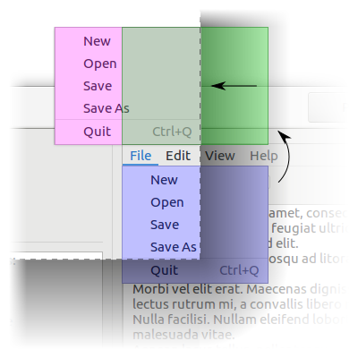

TITLE
=====

Gnome::Gtk3::Menu

SUBTITLE
========

A menu widget

Description
===========

A `Gnome::Gtk3::Menu` is a `Gnome::Gtk3::MenuShell` that implements a drop down menu consisting of a list of `Gnome::Gtk3::MenuItem` objects which can be navigated and activated by the user to perform application functions.

A `Gnome::Gtk3::Menu` is most commonly dropped down by activating a `Gnome::Gtk3::MenuItem` in a `Gnome::Gtk3::MenuBar` or popped up by activating a `Gnome::Gtk3::MenuItem` in another `Gnome::Gtk3::Menu`.

A `Gnome::Gtk3::Menu` can also be popped up by activating a `Gnome::Gtk3::ComboBox`. Other composite widgets such as the `Gnome::Gtk3::Notebook` can pop up a `Gnome::Gtk3::Menu` as well.

Applications can display a `Gnome::Gtk3::Menu` as a popup menu by calling the `gtk_menu_popup()` function. The example below shows how an application can pop up a menu when the 3rd mouse button is pressed.

## Connecting the popup signal handler.

|[<!-- language="C" --> // connect our handler which will popup the menu g_signal_connect_swapped (window, "button_press_event", G_CALLBACK (my_popup_handler), menu); ]|

## Signal handler which displays a popup menu.

|[<!-- language="C" --> static gint my_popup_handler (`Gnome::Gtk3::Widget` *widget, `Gnome::Gdk3::Event` *event) { `Gnome::Gtk3::Menu` *menu; `Gnome::Gdk3::EventButton` *event_button;

    g_return_val_if_fail (widget != NULL, FALSE);
    g_return_val_if_fail (GTK_IS_MENU (widget), FALSE);
    g_return_val_if_fail (event != NULL, FALSE);

    // The "widget" is the menu that was supplied when
    // C<g_signal_connect_swapped()> was called.
    menu = GTK_MENU (widget);

    if (event->type == GDK_BUTTON_PRESS)
      {
        event_button = (C<Gnome::Gdk3::EventButton> *) event;
        if (event_button->button == GDK_BUTTON_SECONDARY)
          {
            gtk_menu_popup (menu, NULL, NULL, NULL, NULL,
                            event_button->button, event_button->time);
            return TRUE;
          }
      }

    return FALSE;

} ]|

Css Nodes
---------

    menu
    ├── arrow.top
    ├── <child>
    ┊
    ├── <child>
    ╰── arrow.bottom

The main CSS node of `Gnome::Gtk3::Menu` has name **menu**, and there are two subnodes with name arrow, for scrolling menu arrows. These subnodes get the .top and .bottom style classes.

Synopsis
========

Declaration
-----------

    unit class Gnome::Gtk3::Menu;
    also is Gnome::Gtk3::MenuShell;

Example
-------

Methods
=======

new
---

    multi method new ( Bool :$empty! )

Create a new plain object. The value doesn't have to be True nor False. The name only will suffice.

    multi method new ( Gnome::GObject::Object :$widget! )

Create an object using a native object from elsewhere. See also `Gnome::GObject::Object`.

    multi method new ( Str :$build-id! )

Create an object using a native object from a builder. See also `Gnome::GObject::Object`.

Types
=====

enum GtkArrowPlacement
----------------------

Used to specify the placement of scroll arrows in scrolling menus.

  * GTK_ARROWS_BOTH: Place one arrow on each end of the menu.

  * GTK_ARROWS_START: Place both arrows at the top of the menu.

  * GTK_ARROWS_END: Place both arrows at the bottom of the menu.

gtk_menu_new
------------

Creates a new `Gnome::Gtk3::Menu`

Returns: a new `Gnome::Gtk3::Menu`

    method gtk_menu_new ( --> N-GObject  )

[gtk_menu_] new_from_model
--------------------------

Creates a `Gnome::Gtk3::Menu` and populates it with menu items and submenus according to *model*.

The created menu items are connected to actions found in the `Gnome::Gtk3::ApplicationWindow` to which the menu belongs - typically by means of being attached to a widget (see `gtk_menu_attach_to_widget()`) that is contained within the `Gnome::Gtk3::ApplicationWindows` widget hierarchy.

Actions can also be added using `gtk_widget_insert_action_group()` on the menu's attach widget or on any of its parent widgets.

Returns: a new `Gnome::Gtk3::Menu`

Since: 3.4

    method gtk_menu_new_from_model ( N-GObject $model --> N-GObject  )

  * N-GObject $model; a `GMenuModel`

[gtk_menu_] popup_at_rect
-------------------------

Displays *menu* and makes it available for selection.

See `gtk_menu_popup_at_widget()` and `gtk_menu_popup_at_pointer()`, which handle more common cases for popping up menus.

*menu* will be positioned at *rect*, aligning their anchor points. *rect* is relative to the top-left corner of *rect_window*. *rect_anchor* and *menu_anchor* determine anchor points on *rect* and *menu* to pin together. *menu* can optionally be offset by prop `rect-anchor-dx` and prop `rect-anchor-dy`.

Anchors should be specified under the assumption that the text direction is left-to-right; they will be flipped horizontally automatically if the text direction is right-to-left.

Other properties that influence the behaviour of this function are prop `anchor-hints` and prop `menu-type-hint`. Connect to the sig `popped-up` signal to find out how it was actually positioned.

Since: 3.22 Stability: Unstable

    method gtk_menu_popup_at_rect ( N-GObject $rect_window, N-GObject $rect, GdkGravity $rect_anchor, GdkGravity $menu_anchor, GdkEvent $trigger_event )

  * N-GObject $rect_window; (not nullable): the `Gnome::Gdk3::Window` *rect* is relative to

  * N-GObject $rect; (not nullable): the `Gnome::Gdk3::Rectangle` to align *menu* with

  * GdkGravity $rect_anchor; the point on *rect* to align with *menu*'s anchor point

  * GdkGravity $menu_anchor; the point on *menu* to align with *rect*'s anchor point

  * GdkEvent $trigger_event; (nullable): the `Gnome::Gdk3::Event` that initiated this request or `Any` if it's the current event

[gtk_menu_] popup_at_widget
---------------------------

Displays *menu* and makes it available for selection.

See `gtk_menu_popup_at_pointer()` to pop up a menu at the master pointer. `gtk_menu_popup_at_rect()` also allows you to position a menu at an arbitrary rectangle.

*menu* will be positioned at *widget*, aligning their anchor points. *widget_anchor* and *menu_anchor* determine anchor points on *widget* and *menu* to pin together. *menu* can optionally be offset by prop `rect-anchor-dx` and prop `rect-anchor-dy`.

Anchors should be specified under the assumption that the text direction is left-to-right; they will be flipped horizontally automatically if the text direction is right-to-left.

Other properties that influence the behaviour of this function are prop `anchor-hints` and prop `menu-type-hint`. Connect to the sig `popped-up` signal to find out how it was actually positioned.

Since: 3.22 Stability: Unstable

    method gtk_menu_popup_at_widget ( N-GObject $widget, GdkGravity $widget_anchor, GdkGravity $menu_anchor, GdkEvent $trigger_event )

  * N-GObject $widget; (not nullable): the `Gnome::Gtk3::Widget` to align *menu* with

  * GdkGravity $widget_anchor; the point on *widget* to align with *menu*'s anchor point

  * GdkGravity $menu_anchor; the point on *menu* to align with *widget*'s anchor point

  * GdkEvent $trigger_event; (nullable): the `Gnome::Gdk3::Event` that initiated this request or `Any` if it's the current event

[gtk_menu_] popup_at_pointer
----------------------------

Displays *menu* and makes it available for selection.

See `gtk_menu_popup_at_widget()` to pop up a menu at a widget. `gtk_menu_popup_at_rect()` also allows you to position a menu at an arbitrary rectangle.

*menu* will be positioned at the pointer associated with *trigger_event*.

Properties that influence the behaviour of this function are prop `anchor-hints`, prop `rect-anchor-dx`, prop `rect-anchor-dy`, and prop `menu-type-hint`. Connect to the sig `popped-up` signal to find out how it was actually positioned.

Since: 3.22 Stability: Unstable

    method gtk_menu_popup_at_pointer ( GdkEvent $trigger_event )

  * GdkEvent $trigger_event; (nullable): the `Gnome::Gdk3::Event` that initiated this request or `Any` if it's the current event

gtk_menu_reposition
-------------------

Repositions the menu according to its position function.

    method gtk_menu_reposition ( )

gtk_menu_popdown
----------------

Removes the menu from the screen.

    method gtk_menu_popdown ( )

[gtk_menu_] get_active
----------------------

Returns the selected menu item from the menu. This is used by the `Gnome::Gtk3::ComboBox`.

Returns: (transfer none): the `Gnome::Gtk3::MenuItem` that was last selected in the menu. If a selection has not yet been made, the first menu item is selected.

    method gtk_menu_get_active ( --> N-GObject  )

[gtk_menu_] set_active
----------------------

Selects the specified menu item within the menu. This is used by the `Gnome::Gtk3::ComboBox` and should not be used by anyone else.

    method gtk_menu_set_active ( UInt $index )

  * UInt $index; the index of the menu item to select. Index values are from 0 to n-1

[gtk_menu_] set_accel_group
---------------------------

Set the `Gnome::Gtk3::AccelGroup` which holds global accelerators for the menu. This accelerator group needs to also be added to all windows that this menu is being used in with `gtk_window_add_accel_group()`, in order for those windows to support all the accelerators contained in this group.

    method gtk_menu_set_accel_group ( N-GObject $accel_group )

  * N-GObject $accel_group; (allow-none): the `Gnome::Gtk3::AccelGroup` to be associated with the menu.

[gtk_menu_] get_accel_group
---------------------------

Gets the `Gnome::Gtk3::AccelGroup` which holds global accelerators for the menu. See `gtk_menu_set_accel_group()`.

Returns: (transfer none): the `Gnome::Gtk3::AccelGroup` associated with the menu

    method gtk_menu_get_accel_group ( --> N-GObject  )

[gtk_menu_] set_accel_path
--------------------------

Sets an accelerator path for this menu from which accelerator paths for its immediate children, its menu items, can be constructed. The main purpose of this function is to spare the programmer the inconvenience of having to call `gtk_menu_item_set_accel_path()` on each menu item that should support runtime user changable accelerators. Instead, by just calling `gtk_menu_set_accel_path()` on their parent, each menu item of this menu, that contains a label describing its purpose, automatically gets an accel path assigned.

For example, a menu containing menu items “New” and “Exit”, will, after `gtk_menu_set_accel_path (menu, "<Gnumeric-Sheet>/File");` has been called, assign its items the accel paths: `"<Gnumeric-Sheet>/File/New"` and `"<Gnumeric-Sheet>/File/Exit"`.

Assigning accel paths to menu items then enables the user to change their accelerators at runtime. More details about accelerator paths and their default setups can be found at `gtk_accel_map_add_entry()`.

Note that *accel_path* string will be stored in a `GQuark`. Therefore, if you pass a static string, you can save some memory by interning it first with `g_intern_static_string()`.

    method gtk_menu_set_accel_path ( Str $accel_path )

  * Str $accel_path; (allow-none): a valid accelerator path

[gtk_menu_] get_accel_path
--------------------------

Retrieves the accelerator path set on the menu.

Returns: the accelerator path set on the menu.

Since: 2.14

    method gtk_menu_get_accel_path ( --> Str  )

gtk_menu_detach
---------------

Detaches the menu from the widget to which it had been attached. This function will call the callback function, *detacher*, provided when the `gtk_menu_attach_to_widget()` function was called.

    method gtk_menu_detach ( )

[gtk_menu_] get_attach_widget
-----------------------------

Returns the `Gnome::Gtk3::Widget` that the menu is attached to.

Returns: (transfer none): the `Gnome::Gtk3::Widget` that the menu is attached to

    method gtk_menu_get_attach_widget ( --> N-GObject  )

[gtk_menu_] reorder_child
-------------------------

Moves *child* to a new *position* in the list of *menu* children.

    method gtk_menu_reorder_child ( N-GObject $child, Int $position )

  * N-GObject $child; the `Gnome::Gtk3::MenuItem` to move

  * Int $position; the new position to place *child*. Positions are numbered from 0 to n - 1

[gtk_menu_] set_screen
----------------------

Sets the `Gnome::Gdk3::Screen` on which the menu will be displayed.

Since: 2.2

    method gtk_menu_set_screen ( N-GObject $screen )

  * N-GObject $screen; (allow-none): a `Gnome::Gdk3::Screen`, or `Any` if the screen should be determined by the widget the menu is attached to

gtk_menu_attach
---------------

Adds a new `Gnome::Gtk3::MenuItem` to a (table) menu. The number of “cells” that an item will occupy is specified by *left_attach*, *right_attach*, *top_attach* and *bottom_attach*. These each represent the leftmost, rightmost, uppermost and lower column and row numbers of the table. (Columns and rows are indexed from zero).

Note that this function is not related to `gtk_menu_detach()`.

Since: 2.4

    method gtk_menu_attach ( N-GObject $child, UInt $left_attach, UInt $right_attach, UInt $top_attach, UInt $bottom_attach )

  * N-GObject $child; a `Gnome::Gtk3::MenuItem`

  * UInt $left_attach; The column number to attach the left side of the item to

  * UInt $right_attach; The column number to attach the right side of the item to

  * UInt $top_attach; The row number to attach the top of the item to

  * UInt $bottom_attach; The row number to attach the bottom of the item to

[gtk_menu_] set_monitor
-----------------------

Informs GTK+ on which monitor a menu should be popped up. See `gdk_monitor_get_geometry()`.

This function should be called from a `Gnome::Gtk3::MenuPositionFunc` if the menu should not appear on the same monitor as the pointer. This information can’t be reliably inferred from the coordinates returned by a `Gnome::Gtk3::MenuPositionFunc`, since, for very long menus, these coordinates may extend beyond the monitor boundaries or even the screen boundaries.

Since: 2.4

    method gtk_menu_set_monitor ( Int $monitor_num )

  * Int $monitor_num; the number of the monitor on which the menu should be popped up

[gtk_menu_] get_monitor
-----------------------

Retrieves the number of the monitor on which to show the menu.

Returns: the number of the monitor on which the menu should be popped up or -1, if no monitor has been set

Since: 2.14

    method gtk_menu_get_monitor ( --> Int  )

[gtk_menu_] place_on_monitor
----------------------------

    method gtk_menu_place_on_monitor ( N-GObject $monitor )

  * N-GObject $monitor;

[gtk_menu_] get_for_attach_widget
---------------------------------

Returns a list of the menus which are attached to this widget. This list is owned by GTK+ and must not be modified.

Returns: (element-type `Gnome::Gtk3::Widget`) (transfer none): the list of menus attached to his widget.

Since: 2.6

    method gtk_menu_get_for_attach_widget ( N-GObject $widget --> N-GObject  )

  * N-GObject $widget; a `Gnome::Gtk3::Widget`

[gtk_menu_] set_reserve_toggle_size
-----------------------------------

Sets whether the menu should reserve space for drawing toggles or icons, regardless of their actual presence.

Since: 2.18

    method gtk_menu_set_reserve_toggle_size ( Int $reserve_toggle_size )

  * Int $reserve_toggle_size; whether to reserve size for toggles

[gtk_menu_] get_reserve_toggle_size
-----------------------------------

Returns whether the menu reserves space for toggles and icons, regardless of their actual presence.

Returns: Whether the menu reserves toggle space

Since: 2.18

    method gtk_menu_get_reserve_toggle_size ( --> Int  )

List of not yet implemented methods and classes
===============================================

### method gtk_menu_attach_to_widget (...)

### handler GtkMenuDetachFunc (...)

List of deprecated (not implemented!) methods
=============================================

Since 3.10
----------

### method gtk_menu_set_tearoff_state ( Int $torn_off )

### method gtk_menu_get_tearoff_state ( --> Int )

### method gtk_menu_set_title ( Str $title )

### method gtk_menu_get_title ( --> Str )

Since 3.22.
-----------

### method gtk_menu_popup ( N-GObject $parent_menu_shell, N-GObject $parent_menu_item, GtkMenuPositionFunc $func, gpointer $data, UInt $button, UInt $activate_time )

### method gtk_menu_popup_for_device ( N-GObject $device, N-GObject $parent_menu_shell, N-GObject $parent_menu_item, GtkMenuPositionFunc $func, gpointer $data, GDestroyNotify $destroy, UInt $button, UInt $activate_time )

Signals
=======

Register any signal as follows. See also `Gnome::GObject::Object`.

    my Bool $is-registered = $my-widget.register-signal (
      $handler-object, $handler-name, $signal-name,
      :$user-option1, ..., $user-optionN
    )

Not yet supported signals
-------------------------

### move-scroll

    method handler (
      :$menu, :$scroll_type,
      :$user-option1, ..., $user-optionN
    );

  * $menu; a `Gnome::Gtk3::Menu`

  * $scroll_type; a `Gnome::Gtk3::ScrollType`

### popped-up

Emitted when the position of *menu* is finalized after being popped up using `gtk_menu_popup_at_rect()`, `gtk_menu_popup_at_widget()`, or `gtk_menu_popup_at_pointer()`.

*menu* might be flipped over the anchor rectangle in order to keep it on-screen, in which case *flipped_x* and *flipped_y* will be set to `1` accordingly.

*flipped_rect* is the ideal position of *menu* after any possible flipping, but before any possible sliding. *final_rect* is *flipped_rect*, but possibly translated in the case that flipping is still ineffective in keeping *menu* on-screen.

The blue menu is *menu*'s ideal position, the green menu is *flipped_rect*, and the red menu is *final_rect*.

See `gtk_menu_popup_at_rect()`, `gtk_menu_popup_at_widget()`, `gtk_menu_popup_at_pointer()`, prop `anchor-hints`, prop `rect-anchor-dx`, prop `rect-anchor-dy`, and prop `menu-type-hint`.

Since: 3.22 Stability: Unstable

    method handler (
      Gnome::GObject::Object :widget($menu),
      :handle-arg0($flipped_rect),
      :handle-arg1($final_rect),
      :handle-arg2($flipped_x),
      :handle-arg3($flipped_y),
      :$user-option1, ..., :$user-optionN
    );

  * $menu; the `Gnome::Gtk3::Menu` that popped up

  * $flipped_rect; (nullable): the position of *menu* after any possible flipping or `Any` if the backend can't obtain it

  * $final_rect; (nullable): the final position of *menu* or `Any` if the backend can't obtain it

  * $flipped_x; `1` if the anchors were flipped horizontally

  * $flipped_y; `1` if the anchors were flipped vertically

Properties
==========

An example of using a string type property of a `Gnome::Gtk3::Label` object. This is just showing how to set/read a property, not that it is the best way to do it. This is because a) The class initialization often provides some options to set some of the properties and b) the classes provide many methods to modify just those properties. In the case below one can use **new(:label('my text label'))** or **gtk_label_set_text('my text label')**.

    my Gnome::Gtk3::Label $label .= new(:empty);
    my Gnome::GObject::Value $gv .= new(:init(G_TYPE_STRING));
    $label.g-object-get-property( 'label', $gv);
    $gv.g-value-set-string('my text label');

Not yet supported properties
----------------------------

### accel-group

The `Gnome::GObject::Value` type of property *accel-group* is `G_TYPE_OBJECT`.

The accel group holding accelerators for the menu.

### attach-widget

The `Gnome::GObject::Value` type of property *attach-widget* is `G_TYPE_OBJECT`.

The widget the menu is attached to. Setting this property attaches the menu without a `Gnome::Gtk3::MenuDetachFunc`. If you need to use a detacher, use `gtk_menu_attach_to_widget()` directly.

### anchor-hints

The `Gnome::GObject::Value` type of property *anchor-hints* is `G_TYPE_FLAGS`.

Positioning hints for aligning the menu relative to a rectangle.

These hints determine how the menu should be positioned in the case that the menu would fall off-screen if placed in its ideal position.

For example, `GDK_ANCHOR_FLIP_Y` will replace `GDK_GRAVITY_NORTH_WEST` with `GDK_GRAVITY_SOUTH_WEST` and vice versa if the menu extends beyond the bottom edge of the monitor.

See `gtk_menu_popup_at_rect()`, `gtk_menu_popup_at_widget()`, `gtk_menu_popup_at_pointer()`, prop `rect-anchor-dx`, prop `rect-anchor-dy`, prop `menu-type-hint`, and sig `popped-up`.

Stability: Unstable

