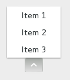
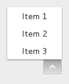

Gnome::Gtk3::MenuButton
=======================

A widget that shows a popup when clicked on

Description
===========

The **Gnome::Gtk3::MenuButton** widget is used to display a popup when clicked on. This popup can be provided either as a **Gnome::Gtk3::Menu**, a **Gnome::Gtk3::Popover** or an abstract `MenuModel`.

The **Gnome::Gtk3::MenuButton** widget can hold any valid child widget. That is, it can hold almost any other standard **Gnome::Gtk3::Widget**. The most commonly used child is **Gnome::Gtk3::Image**. If no widget is explicitely added to the **Gnome::Gtk3::MenuButton**, a **Gnome::Gtk3::Image** is automatically created, using an arrow image oriented according to `direction` or the generic "view-context-menu" icon if the direction is not set.

The positioning of the popup is determined by the `direction` property of the menu button.

For menus, the `halign` and `valign` properties of the menu are also taken into account. For example, when the direction is `GTK_ARROW_DOWN` and the horizontal alignment is `GTK_ALIGN_START`, the menu will be positioned below the button, with the starting edge (depending on the text direction) of the menu aligned with the starting edge of the button. If there is not enough space below the button, the menu is popped up above the button instead. If the alignment would move part of the menu offscreen, it is “pushed in”.

Direction = Down
----------------

  * halign = start

    

  * halign = center

    

  * halign = end

    

Direction = Up
--------------

  * halign = start

    

  * halign = center

    

  * halign = end

    

Direction = Left
----------------

  * valign = start

    

  * valign = center

    

  * valign = end

    

Direction = Right
-----------------

  * valign = start

    

  * valign = center

    

  * valign = end

    

Css Nodes
---------

**Gnome::Gtk3::MenuButton** has a single CSS node with name button. To differentiate it from a plain **Gnome::Gtk3::Button**, it gets the .popup style class.

Synopsis
========

Declaration
-----------

    unit class Gnome::Gtk3::MenuButton;
    also is Gnome::Gtk3::ToggleButton;

Uml Diagram
-----------

Inheriting this class
---------------------

Inheriting is done in a special way in that it needs a call from new() to get the native object created by the class you are inheriting from.

    use Gnome::Gtk3::MenuButton;

    unit class MyGuiClass;
    also is Gnome::Gtk3::MenuButton;

    submethod new ( |c ) {
      # let the Gnome::Gtk3::MenuButton class process the options
      self.bless( :GtkMenuButton, |c);
    }

    submethod BUILD ( ... ) {
      ...
    }

Methods
=======

new
---

### default, no options

Creates a new **Gnome::Gtk3::MenuButton** widget with downwards-pointing arrow as the only child. You can replace the child widget with another **Gnome::Gtk3::Widget** should you wish to.

    multi method new ( )

### :native-object

Create an object using a native object from elsewhere. See also **Gnome::GObject::Object**.

    multi method new ( N-GObject :$native-object! )

### :build-id

Create an object using a native object from a builder. See also **Gnome::GObject::Object**.

    multi method new ( Str :$build-id! )

get-align-widget
----------------

Returns the parent widget to use to line up with menu.

Returns: a **Gnome::Gtk3::Widget** value or `undefined`

    method get-align-widget ( --> N-GObject )

get-direction
-------------

Returns the direction the popup will be pointing at when popped up.

Returns: a **Gnome::Gtk3::ArrowType** value

    method get-direction ( --> GtkArrowType )

get-menu-model
--------------

Returns the **Gnome::Gio::MenuModel** used to generate the popup.

Returns: a **Gnome::Gio::MenuModel** or an `invalid` object.

    method get-menu-model ( --> Gnome::Gio::MenuModel )

get-popover
-----------

Returns the **Gnome::Gtk3::Popover** that pops out of the button. If the button is not using a **Gnome::Gtk3::Popover**, this function returns an invalid popover object.

    method get-popover ( --> Gnome::Gtk3::Popover )

get-popup
---------

Returns the **Gnome::Gtk3::Menu** that pops out of the button. If the button does not use a **Gnome::Gtk3::Menu**, this function returns an invalid menu object.

    method get-popup ( --> Gnome::Gtk3::Menu )

get-use-popover
---------------

Returns whether a **Gnome::Gtk3::Popover** or a **Gnome::Gtk3::Menu** will be constructed from the menu model.

Returns: `True` if using a **Gnome::Gtk3::Popover**

    method get-use-popover ( --> Bool )

set-align-widget
----------------

Sets the **Gnome::Gtk3::Widget** to use to line the menu with when popped up. Note that the *$align-widget* must contain the **Gnome::Gtk3::MenuButton** itself.

Setting it to `undefined` means that the menu will be aligned with the button itself.

Note that this property is only used with menus currently, and not for popovers.

    method set-align-widget ( N-GObject $align_widget )

  * N-GObject $align_widget; a **Gnome::Gtk3::Widget**

set-direction
-------------

Sets the direction in which the popup will be popped up, as well as changing the arrow’s direction. The child will not be changed to an arrow if it was customized.

If the does not fit in the available space in the given direction, GTK+ will its best to keep it inside the screen and fully visible.

If you pass `GTK-ARROW-NONE` for a *$direction*, the popup will behave as if you passed `GTK-ARROW-DOWN` (although you won’t see any arrows).

    method set-direction ( GtkArrowType $direction )

  * GtkArrowType $direction; a **Gnome::Gtk3::ArrowType**

set-menu-model
--------------

Sets the **Gnome::Gio::MenuModel** from which the popup will be constructed, or `undefined` to dissociate any existing menu model and disable the button.

Depending on the value of *use-popover*, either a **Gnome::Gtk3::Menu** will be created, or a **Gnome::Gtk3::Popover**. In either case, actions will be connected as documented for these functions.

If *popup* or *popover* are already set, those widgets are dissociated from the *menu-button*, and those properties are set to `undefined`.

    method set-menu-model ( N-GObject $menu_model )

  * N-GObject $menu_model; a **Gnome::Gio::MenuModel**, or `undefined` to unset and disable the button

set-popover
-----------

Sets the **Gnome::Gtk3::Popover** that will be popped up when the *menu-button* is clicked, or `undefined` to dissociate any existing popover and disable the button.

If *menu-model* or *popup* are set, those objects are dissociated from the *menu-button*, and those properties are set to `undefined`.

    method set-popover ( N-GObject $popover )

  * N-GObject $popover; a **Gnome::Gtk3::Popover**, or `undefined` to unset and disable the button

set-popup
---------

Sets the **Gnome::Gtk3::Menu** that will be popped up when the *menu-button* is clicked, or `undefined` to dissociate any existing menu and disable the button.

If *menu-model* or *popover* are set, those objects are dissociated from the *menu-button*, and those properties are set to `undefined`.

    method set-popup ( N-GObject $menu )

  * N-GObject $menu; a **Gnome::Gtk3::Menu**, or `undefined` to unset and disable the button

set-use-popover
---------------

Sets whether to construct a **Gnome::Gtk3::Popover** instead of **Gnome::Gtk3::Menu** when `set-menu-model()` is called. Note that this property is only consulted when a new menu model is set.

    method set-use-popover ( Bool $use_popover )

  * Bool $use_popover; `True` to construct a popover from the menu model

Properties
==========

An example of using a string type property of a **Gnome::Gtk3::Label** object. This is just showing how to set/read a property, not that it is the best way to do it. This is because a) The class initialization often provides some options to set some of the properties and b) the classes provide many methods to modify just those properties. In the case below one can use **new(:label('my text label'))** or **.set-text('my text label')**.

    my Gnome::Gtk3::Label $label .= new;
    my Gnome::GObject::Value $gv .= new(:init(G_TYPE_STRING));
    $label.get-property( 'label', $gv);
    $gv.set-string('my text label');

Supported properties
--------------------

### Align with: align-widget

The **Gnome::Gtk3::Widget** to use to align the menu with.

    Widget type: GTK_TYPE_CONTAINER

The **Gnome::GObject::Value** type of property *align-widget* is `G_TYPE_OBJECT`.

### Direction: direction

The GtkArrowType representing the direction in which the menu or popover will be popped out.

    Widget type: GTK_TYPE_ARROW_TYPE

The **Gnome::GObject::Value** type of property *direction* is `G_TYPE_ENUM`.

### Menu model: menu-model

The **Gnome::Gio::MenuModel** from which the popup will be created. Depending on the *use-popover* property, that may be a menu or a popover.

See `set-menu-model()` for the interaction with the *popup* property.

    Widget type: G_TYPE_MENU_MODEL

The **Gnome::GObject::Value** type of property *menu-model* is `G_TYPE_OBJECT`.

### Popover: popover

The **Gnome::Gtk3::Popover** that will be popped up when the button is clicked.

    Widget type: GTK_TYPE_POPOVER

The **Gnome::GObject::Value** type of property *popover* is `G_TYPE_OBJECT`.

### Popup: popup

The **Gnome::Gtk3::Menu** that will be popped up when the button is clicked.

    Widget type: GTK_TYPE_MENU

The **Gnome::GObject::Value** type of property *popup* is `G_TYPE_OBJECT`.

### Use a popover: use-popover

Whether to construct a **Gnome::Gtk3::Popover** from the menu model, or a **Gnome::Gtk3::Menu**.

The **Gnome::GObject::Value** type of property *use-popover* is `G_TYPE_BOOLEAN`.

