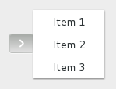
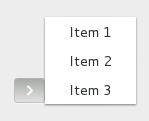

Gnome::Gtk3::MenuButton
=======================

A widget that shows a popup when clicked on

Description
===========

The **Gnome::Gtk3::MenuButton** widget is used to display a popup when clicked on. This popup can be provided either as a **Gnome::Gtk3::Menu**, a **Gnome::Gtk3::Popover** or an abstract `MenuModel`.

The **Gnome::Gtk3::MenuButton** widget can hold any valid child widget. That is, it can hold almost any other standard **Gnome::Gtk3::Widget**. The most commonly used child is **Gnome::Gtk3::Image**. If no widget is explicitely added to the **Gnome::Gtk3::MenuButton**, a **Gnome::Gtk3::Image** is automatically created, using an arrow image oriented according to `direction` or the generic "view-context-menu" icon if the direction is not set.

The positioning of the popup is determined by the `direction` property of the menu button.

For menus, the `halign` and `valign` properties of the menu are also taken into account. For example, when the direction is `GTK_ARROW_DOWN` and the horizontal alignment is `GTK_ALIGN_START`, the menu will be positioned below the button, with the starting edge (depending on the text direction) of the menu aligned with the starting edge of the button. If there is not enough space below the button, the menu is popped up above the button instead. If the alignment would move part of the menu offscreen, it is “pushed in”.

Direction = Down
----------------

- halign = start

    

- halign = center

    

- halign = end

    

Direction = Up
--------------

- halign = start

    

- halign = center

    

- halign = end

    

Direction = Left
----------------

- valign = start

    

- valign = center

    

- valign = end

    

Direction = Right
-----------------

- valign = start

    

- valign = center

    

- valign = end

    

Css Nodes
---------

**Gnome::Gtk3::MenuButton** has a single CSS node with name button. To differentiate it from a plain **Gnome::Gtk3::Button**, it gets the .popup style class.

Known implementations
---------------------

  * [Gnome::Gtk3::Buildable](Buildable.html)

  * Gnome::Gtk3::Actionable

  * Gnome::Gtk3::Activatable

Synopsis
========

Declaration
-----------

    unit class Gnome::Gtk3::MenuButton;
    also is Gnome::Gtk3::ToggleButton;
    also does Gnome::Gtk3::Buildable;

Methods
=======

new
---

Create a new plain object.

    multi method new ( )

Create an object using a native object from elsewhere. See also **Gnome::GObject::Object**.

    multi method new ( N-GObject :$native-object! )

Create an object using a native object from a builder. See also **Gnome::GObject::Object**.

    multi method new ( Str :$build-id! )

[gtk_] menu_button_new
----------------------

Creates a new **Gnome::Gtk3::MenuButton** widget with downwards-pointing arrow as the only child. You can replace the child widget with another **Gnome::Gtk3::Widget** should you wish to.

Returns: The newly created **Gnome::Gtk3::MenuButton** widget

Since: 3.6

    method gtk_menu_button_new ( --> N-GObject  )

[[gtk_] menu_button_] set_popup
-------------------------------

Sets the **Gnome::Gtk3::Menu** that will be popped up when the button is clicked, or `Any` to disable the button. If *menu-model* or *popover* are set, they will be set to `Any`.

Since: 3.6

    method gtk_menu_button_set_popup ( N-GObject $menu )

  * N-GObject $menu; (allow-none): a **Gnome::Gtk3::Menu**

[[gtk_] menu_button_] get_popup
-------------------------------

Returns the **Gnome::Gtk3::Menu** that pops out of the button. If the button does not use a **Gnome::Gtk3::Menu**, this function returns `Any`.

Returns: (nullable) (transfer none): a **Gnome::Gtk3::Menu** or `Any`

Since: 3.6

    method gtk_menu_button_get_popup ( --> N-GObject  )

[[gtk_] menu_button_] set_popover
---------------------------------

Sets the **Gnome::Gtk3::Popover** that will be popped up when the button is clicked, or `Any` to disable the button. If *menu-model* or *popup* are set, they will be set to `Any`.

Since: 3.12

    method gtk_menu_button_set_popover ( N-GObject $popover )

  * N-GObject $popover; (allow-none): a **Gnome::Gtk3::Popover**

[[gtk_] menu_button_] get_popover
---------------------------------

Returns the **Gnome::Gtk3::Popover** that pops out of the button. If the button is not using a **Gnome::Gtk3::Popover**, this function returns `Any`.

Returns: (nullable) (transfer none): a **Gnome::Gtk3::Popover** or `Any`

Since: 3.12

    method gtk_menu_button_get_popover ( --> N-GObject  )

[[gtk_] menu_button_] set_direction
-----------------------------------

Sets the direction in which the popup will be popped up, as well as changing the arrow’s direction. The child will not be changed to an arrow if it was customized.

If the does not fit in the available space in the given direction, GTK+ will its best to keep it inside the screen and fully visible.

If you pass `GTK_ARROW_NONE` for a *direction*, the popup will behave as if you passed `GTK_ARROW_DOWN` (although you won’t see any arrows).

Since: 3.6

    method gtk_menu_button_set_direction ( GtkArrowType $direction )

  * GtkArrowType $direction; a **Gnome::Gtk3::ArrowType**

[[gtk_] menu_button_] get_direction
-----------------------------------

Returns the direction the popup will be pointing at when popped up.

Returns: a **Gnome::Gtk3::ArrowType** value

Since: 3.6

    method gtk_menu_button_get_direction ( --> GtkArrowType  )

[[gtk_] menu_button_] set_menu_model
------------------------------------

Sets the **GMenuModel** from which the popup will be constructed, or `Any` to disable the button.

Depending on the value of *use-popover*, either a **Gnome::Gtk3::Menu** will be created with `gtk_menu_new_from_model()`, or a **Gnome::Gtk3::Popover** with `gtk_popover_new_from_model()`. In either case, actions will be connected as documented for these functions.

If *popup* or *popover* are already set, their content will be lost and replaced by the newly created popup.

Since: 3.6

    method gtk_menu_button_set_menu_model ( N-GObject $menu_model )

  * N-GObject $menu_model; (allow-none): a **GMenuModel**

[[gtk_] menu_button_] get_menu_model
------------------------------------

Returns the **GMenuModel** used to generate the popup.

Returns: (nullable) (transfer none): a **GMenuModel** or `Any`

Since: 3.6

    method gtk_menu_button_get_menu_model ( --> N-GObject  )

[[gtk_] menu_button_] set_align_widget
--------------------------------------

Sets the **Gnome::Gtk3::Widget** to use to line the menu with when popped up. Note that the *align_widget* must contain the **Gnome::Gtk3::MenuButton** itself.

Setting it to `Any` means that the menu will be aligned with the button itself.

Note that this property is only used with menus currently, and not for popovers.

Since: 3.6

    method gtk_menu_button_set_align_widget ( N-GObject $align_widget )

  * N-GObject $align_widget; (allow-none): a **Gnome::Gtk3::Widget**

[[gtk_] menu_button_] get_align_widget
--------------------------------------

Returns the parent **Gnome::Gtk3::Widget** to use to line up with menu.

Returns: (nullable) (transfer none): a **Gnome::Gtk3::Widget** value or `Any`

Since: 3.6

    method gtk_menu_button_get_align_widget ( --> N-GObject  )

[[gtk_] menu_button_] set_use_popover
-------------------------------------

Sets whether to construct a **Gnome::Gtk3::Popover** instead of **Gnome::Gtk3::Menu** when `gtk_menu_button_set_menu_model()` is called. Note that this property is only consulted when a new menu model is set.

Since: 3.12

    method gtk_menu_button_set_use_popover ( Int $use_popover )

  * Int $use_popover; `1` to construct a popover from the menu model

[[gtk_] menu_button_] get_use_popover
-------------------------------------

Returns whether a **Gnome::Gtk3::Popover** or a **Gnome::Gtk3::Menu** will be constructed from the menu model.

Returns: `1` if using a **Gnome::Gtk3::Popover**

Since: 3.12

    method gtk_menu_button_get_use_popover ( --> Int  )

Properties
==========

An example of using a string type property of a **Gnome::Gtk3::Label** object. This is just showing how to set/read a property, not that it is the best way to do it. This is because a) The class initialization often provides some options to set some of the properties and b) the classes provide many methods to modify just those properties. In the case below one can use **new(:label('my text label'))** or **gtk_label_set_text('my text label')**.

    my Gnome::Gtk3::Label $label .= new;
    my Gnome::GObject::Value $gv .= new(:init(G_TYPE_STRING));
    $label.g-object-get-property( 'label', $gv);
    $gv.g-value-set-string('my text label');

Supported properties
--------------------

### Popup

The **Gnome::Gtk3::Menu** that will be popped up when the button is clicked. Since: 3.6 Widget type: GTK_TYPE_MENU

The **Gnome::GObject::Value** type of property *popup* is `G_TYPE_OBJECT`.

### Menu model

The **GMenuModel** from which the popup will be created. Depending on the *use-popover* property, that may be a menu or a popover. See `gtk_menu_button_set_menu_model()` for the interaction with the *popup* property. Since: 3.6 Widget type: G_TYPE_MENU_MODEL

The **Gnome::GObject::Value** type of property *menu-model* is `G_TYPE_OBJECT`.

### Align with

The **Gnome::Gtk3::Widget** to use to align the menu with. Since: 3.6 Widget type: GTK_TYPE_CONTAINER

The **Gnome::GObject::Value** type of property *align-widget* is `G_TYPE_OBJECT`.

### Direction

The **Gnome::Gtk3::ArrowType** representing the direction in which the menu or popover will be popped out. Since: 3.6 Widget type: GTK_TYPE_ARROW_TYPE

The **Gnome::GObject::Value** type of property *direction* is `G_TYPE_ENUM`.

### Use a popover

Whether to construct a **Gnome::Gtk3::Popover** from the menu model, or a **Gnome::Gtk3::Menu**. Since: 3.12

The **Gnome::GObject::Value** type of property *use-popover* is `G_TYPE_BOOLEAN`.

### Popover

The **Gnome::Gtk3::Popover** that will be popped up when the button is clicked. Since: 3.12 Widget type: GTK_TYPE_POPOVER

The **Gnome::GObject::Value** type of property *popover* is `G_TYPE_OBJECT`.

