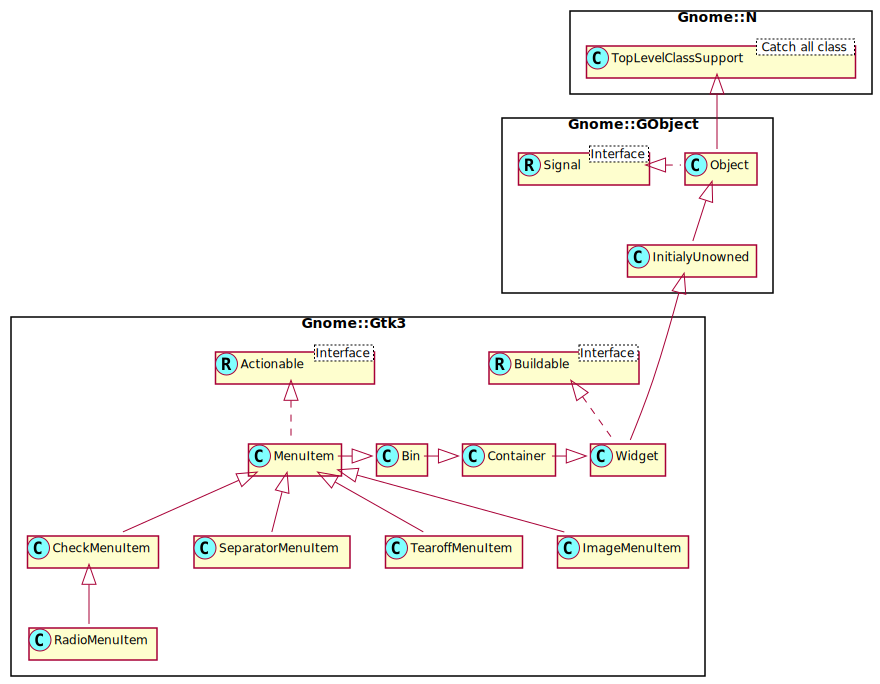

Gnome::Gtk3::MenuItem
=====================

The widget used for item in menus

Description
===========

The **Gnome::Gtk3::MenuItem** widget and the derived widgets are the only valid children for menus. Their function is to correctly handle highlighting, alignment, events and submenus.

As a **Gnome::Gtk3::MenuItem** derives from **Gnome::Gtk3::Bin** it can hold any valid child widget, although only a few are really useful.

By default, a **Gnome::Gtk3::MenuItem** sets a **Gnome::Gtk3::AccelLabel** as its child. **Gnome::Gtk3::MenuItem** has direct functions to set the label and its mnemonic. For more advanced label settings, you can fetch the child widget from the **Gnome::Gtk3::Bin**.

Gnome::Gtk3::MenuItem as Gnome::Gtk3::Buildable
-----------------------------------------------

The **Gnome::Gtk3::MenuItem** implementation of the **Gnome::Gtk3::Buildable** interface supports adding a submenu by specifying “submenu” as the “type” attribute of a <child> element.

An example of UI definition fragment with submenus:

    <object class="B<Gnome::Gtk3::MenuItem>">
      <child type="submenu">
        <object class="B<Gnome::Gtk3::Menu>"/>
      </child>
    </object>

Css Nodes
---------

    menuitem
    ├── <child>
    ╰── [arrow.right]

**Gnome::Gtk3::MenuItem** has a single CSS node with name menuitem. If the menuitem has a submenu, it gets another CSS node with name arrow, which has the .left or .right style class.

See Also
--------

**Gnome::Gtk3::Bin**, **Gnome::Gtk3::MenuShell**

Synopsis
========

Declaration
-----------

    unit class Gnome::Gtk3::MenuItem;
    also is Gnome::Gtk3::Bin;
    also does Gnome::Gtk3::Actionable;

Uml Diagram
-----------

Methods
=======

new
---

### default, no options

Create a new plain object.

    multi method new ( )

### :label

Create a new object with a label.

    multi method new ( Str :$label! )

### :mnemonic

Create a new object with a mnemonic.

    multi method new ( Str :$mnemonic! )

### :native-object

Create a MenuItem object using a native object from elsewhere. See also **Gnome::N::TopLevelClassSupport**.

    multi method new ( N-GObject :$native-object! )

### :build-id

Create a MenuItem object using a native object returned from a builder. See also **Gnome::GObject::Object**.

    multi method new ( Str :$build-id! )

activate
--------

Emits the *activate* signal on the given item.

    method activate ( )

deselect
--------

Emits the *deselect* signal on the given item.

    method deselect ( )

get-accel-path
--------------

Retrieve the accelerator path that was previously set on *menu-item*.

See `set-accel-path()` for details.

Returns: the accelerator path corresponding to this menu item’s functionality, or `undefined` if not set

    method get-accel-path ( --> Str )

get-label
---------

Sets *text* on the *menu-item* label

Returns: The text in the *menu-item* label. This is the internal string used by the label, and must not be modified.

    method get-label ( --> Str )

get-reserve-indicator
---------------------

Returns whether the *menu-item* reserves space for the submenu indicator, regardless if it has a submenu or not.

Returns: `True` if *menu-item* always reserves space for the submenu indicator

    method get-reserve-indicator ( --> Bool )

get-submenu
-----------

Gets the submenu underneath this menu item, if any. See `set-submenu()`.

Returns: submenu for this menu item, or `undefined` if none

    method get-submenu ( --> N-GObject )

get-use-underline
-----------------

Checks if an underline in the text indicates the next character should be used for the mnemonic accelerator key.

Returns: `True` if an embedded underline in the label indicates the mnemonic accelerator key.

    method get-use-underline ( --> Bool )

select
------

Emits the *select* signal on the given item.

    method select ( )

set-accel-path
--------------

Set the accelerator path on the *menu-item*, through which runtime changes of the menu item’s accelerator caused by the user can be identified and saved to persistent storage (see `Gnome::Gtk3::AccelMap.save()` on this). To set up a default accelerator for this menu item, call `Gnome::Gtk3::AccelMap.add-entry()` with the same *accel-path*. See also `Gnome::Gtk3::AccelMap.add-entry()` on the specifics of accelerator paths, and `Gnome::Gtk3::Menu.set-accel-path()` for a more convenient variant of this function.

This function is basically a convenience wrapper that handles calling `Gnome::Gtk3::Widget.set-accel-path()` with the appropriate accelerator group for the menu item.

Note that you do need to set an accelerator on the parent menu with `Gnome::Gtk3::Menu.set-accel-group()` for this to work.

    method set-accel-path ( Str $accel_path )

  * Str $accel_path; accelerator path, corresponding to this menu item’s functionality, or `undefined` to unset the current path.

set-label
---------

Sets *$label* on the *menu-item* label

    method set-label ( Str $label )

  * Str $label; the text you want to set

set-reserve-indicator
---------------------

Sets whether the *menu-item* should reserve space for the submenu indicator, regardless if it actually has a submenu or not.

There should be little need for applications to call this functions.

    method set-reserve-indicator ( Bool $reserve )

  * Bool $reserve; the new value

set-submenu
-----------

Sets or replaces the menu item’s submenu, or removes it when a `undefined` submenu is passed.

    method set-submenu ( N-GObject $submenu )

  * N-GObject $submenu; (type Gnome::Gtk3::Menu): the submenu, or `undefined`

set-use-underline
-----------------

If true, an underline in the text indicates the next character should be used for the mnemonic accelerator key.

    method set-use-underline ( Bool $setting )

  * Bool $setting; `True` if underlines in the text indicate mnemonics

toggle-size-allocate
--------------------

Emits the *toggle-size-allocate* signal on the given item.

    method toggle-size-allocate ( Int() $allocation )

  * Int() $allocation; the allocation to use as signal data.

toggle-size-request
-------------------

Emits the *toggle-size-request* signal on the given item.

    method toggle-size-request ( --> Int )

The method returns an integer $requisition;

Signals
=======

There are two ways to connect to a signal. The first option you have is to use `register-signal()` from **Gnome::GObject::Object**. The second option is to use `connect-object()` directly from **Gnome::GObject::Signal**.

First method
------------

The positional arguments of the signal handler are all obligatory as well as their types. The named attributes `:$widget` and user data are optional.

    # handler method
    method mouse-event ( GdkEvent $event, :$widget ) { ... }

    # connect a signal on window object
    my Gnome::Gtk3::Window $w .= new( ... );
    $w.register-signal( self, 'mouse-event', 'button-press-event');

Second method
-------------

    my Gnome::Gtk3::Window $w .= new( ... );
    my Callable $handler = sub (
      N-GObject $native, GdkEvent $event, OpaquePointer $data
    ) {
      ...
    }

    $w.connect-object( 'button-press-event', $handler);

Also here, the types of positional arguments in the signal handler are important. This is because both methods `register-signal()` and `connect-object()` are using the signatures of the handler routines to setup the native call interface.

Supported signals
-----------------

### activate

Emitted when the item is activated.

    method handler (
      Int :$_handle_id,
      Gnome::GObject::Object :_widget($menuitem),
      *%user-options
    );

  * $menuitem; the object which received the signal.

  * $_handle_id; the registered event handler id

### activate-item

Emitted when the item is activated, but also if the menu item has a submenu. For normal applications, the relevant signal is *activate*.

    method handler (
      Int :$_handle_id,
      Gnome::GObject::Object :_widget($menuitem),
      *%user-options
    );

  * $menuitem; the object which received the signal.

  * $_handle_id; the registered event handler id

### deselect

    method handler (
      Int :$_handle_id,
      Gnome::GObject::Object :_widget($menuitem),
      *%user-options
    );

  * $menuitem;

  * $_handle_id; the registered event handler id

### select

    method handler (
      Int :$_handle_id,
      Gnome::GObject::Object :_widget($menuitem),
      *%user-options
    );

  * $menuitem;

  * $_handle_id; the registered event handler id

### toggle-size-allocate

    method handler (
      Int $int,
      Int :$_handle_id,
      Gnome::GObject::Object :_widget($menuitem),
      *%user-options
    );

  * $menuitem;

  * $int;

  * $_handle_id; the registered event handler id

### toggle-size-request

    method handler (
      Unknown type G_TYPE_POINTER $unknown type g_type_pointer,
      Int :$_handle_id,
      Gnome::GObject::Object :_widget($menuitem),
      *%user-options
    );

  * $menuitem;

  * $unknown type g_type_pointer;

  * $_handle_id; the registered event handler id

Properties
==========

An example of using a string type property of a **Gnome::Gtk3::Label** object. This is just showing how to set/read a property, not that it is the best way to do it. This is because a) The class initialization often provides some options to set some of the properties and b) the classes provide many methods to modify just those properties. In the case below one can use **new(:label('my text label'))** or **.set-text('my text label')**.

    my Gnome::Gtk3::Label $label .= new;
    my Gnome::GObject::Value $gv .= new(:init(G_TYPE_STRING));
    $label.get-property( 'label', $gv);
    $gv.set-string('my text label');

Supported properties
--------------------

### Accel Path: accel-path

Sets the accelerator path of the menu item, through which runtime changes of the menu item's accelerator caused by the user can be identified and saved to persistant storage.

The **Gnome::GObject::Value** type of property *accel-path* is `G_TYPE_STRING`.

### Label: label

The text for the child label.

The **Gnome::GObject::Value** type of property *label* is `G_TYPE_STRING`.

### Right Justified: right-justified

Sets whether the menu item appears justified at the right side of a menu bar.

The **Gnome::GObject::Value** type of property *right-justified* is `G_TYPE_BOOLEAN`.

### Submenu: submenu

The submenu attached to the menu item, or `undefined` if it has none.

    Widget type: GTK_TYPE_MENU

The **Gnome::GObject::Value** type of property *submenu* is `G_TYPE_OBJECT`.

### Use underline: use-underline

`True` if underlines in the text indicate mnemonics.

The **Gnome::GObject::Value** type of property *use-underline* is `G_TYPE_BOOLEAN`.

