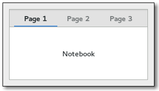

Gnome::Gtk3::Notebook
=====================

A tabbed notebook container

Description
===========

The **Gnome::Gtk3::Notebook** widget is a **Gnome::Gtk3::Container** whose children are pages that can be switched between using tab labels along one edge.

There are many configuration options for **Gnome::Gtk3::Notebook**. Among other things, you can choose on which edge the tabs appear (see `gtk_notebook_set_tab_pos()`), whether, if there are too many tabs to fit the notebook should be made bigger or scrolling arrows added (see `gtk_notebook_set_scrollable()`), and whether there will be a popup menu allowing the users to switch pages. (see `gtk_notebook_popup_enable()`, `gtk_notebook_popup_disable()`)

**Gnome::Gtk3::Notebook** as **Gnome::Gtk3::Buildable**
-------------------------------------------------------

The **Gnome::Gtk3::Notebook** implementation of the **Gnome::Gtk3::Buildable** interface supports placing children into tabs by specifying “tab” as the “type” attribute of a <child> element. Note that the content of the tab must be created before the tab can be filled. A tab child can be specified without specifying a <child> type attribute.

To add a child widget in the notebooks action area, specify "action-start" or “action-end” as the “type” attribute of the <child> element.

An example of a UI definition fragment with **Gnome::Gtk3::Notebook**:

    <object class="GtkNotebook">
      <child>
        <object class="GtkLabel" id="notebook-content">
          <property name="label">Content</property>
        </object>
      </child>
      <child type="tab">
        <object class="GtkLabel" id="notebook-tab">
          <property name="label">Tab</property>
        </object>
      </child>
    </object>

Css Nodes
---------

    notebook
    ├── header.top
    │   ├── [<action widget>]
    │   ├── tabs
    │   │   ├── [arrow]
    │   │   ├── tab
    │   │   │   ╰── <tab label>
    ┊   ┊   ┊
    │   │   ├── tab[.reorderable-page]
    │   │   │   ╰── <tab label>
    │   │   ╰── [arrow]
    │   ╰── [<action widget>]
    │
    ╰── stack
        ├── <child>
        ┊
        ╰── <child>

**Gnome::Gtk3::Notebook** has a main CSS node with name notebook, a subnode with name header and below that a subnode with name tabs which contains one subnode per tab with name tab.

If action widgets are present, their CSS nodes are placed next to the tabs node. If the notebook is scrollable, CSS nodes with name arrow are placed as first and last child of the tabs node.

The main node gets the .frame style class when the notebook has a border (see `gtk_notebook_set_show_border()`).

The header node gets one of the style class .top, .bottom, .left or .right, depending on where the tabs are placed. For reorderable pages, the tab node gets the .reorderable-page class.

A tab node gets the .dnd style class while it is moved with drag-and-drop.

The nodes are always arranged from left-to-right, regardless of text direction.

See Also
--------

**Gnome::Gtk3::Container**

Synopsis
========

Declaration
-----------

    unit class Gnome::Gtk3::Notebook;
    also is Gnome::Gtk3::Container;

Inheriting this class
---------------------

Inheriting is done in a special way in that it needs a call from new() to get the native object created by the class you are inheriting from.

    use Gnome::Gtk3::Notebook;

    unit class MyGuiClass;
    also is Gnome::Gtk3::Notebook;

    submethod new ( |c ) {
      # let the Gnome::Gtk3::Notebook class process the options
      self.bless( :GtkNotebook, |c);
    }

    submethod BUILD ( ... ) {
      ...
    }

Methods
=======

new
---

Create a new Notebook object.

    multi method new ( )

Create a Notebook object using a native object from elsewhere. See also **Gnome::GObject::Object**.

    multi method new ( N-GObject :$native-object! )

Create a Notebook object using a native object returned from a builder. See also **Gnome::GObject::Object**.

    multi method new ( Str :$build-id! )

[gtk_notebook_] append_page
---------------------------

Appends a page to the *notebook*.

Returns: the index (starting from 0) of the appended page in the notebook, or -1 if function fails

    method gtk_notebook_append_page (
      N-GObject $child, N-GObject $tab_label
      --> Int
    )

  * N-GObject $child; the **Gnome::Gtk3::Widget** to use as the contents of the page.

  * N-GObject $tab_label; the **Gnome::Gtk3::Widget** to be used as the label for the page, or an undefined value to use the default label, “page N”

[gtk_notebook_] append_page_menu
--------------------------------

Appends a page to *notebook*, specifying the widget to use as the label in the popup menu.

Returns: the index (starting from 0) of the appended page in the notebook, or -1 if function fails

    method gtk_notebook_append_page_menu ( N-GObject $child, N-GObject $tab_label, N-GObject $menu_label --> Int )

  * N-GObject $child; the **Gnome::Gtk3::Widget** to use as the contents of the page

  * N-GObject $tab_label; (allow-none): the **Gnome::Gtk3::Widget** to be used as the label for the page, or `Any` to use the default label, “page N”

  * N-GObject $menu_label; (allow-none): the widget to use as a label for the page-switch menu, if that is enabled. If `Any`, and *tab_label* is a **Gnome::Gtk3::Label** or `Any`, then the menu label will be a newly created label with the same text as *tab_label*; if *tab_label* is not a **Gnome::Gtk3::Label**, *menu_label* must be specified if the page-switch menu is to be used.

[gtk_notebook_] prepend_page
----------------------------

Prepends a page to *notebook*.

Returns: the index (starting from 0) of the prepended page in the notebook, or -1 if function fails

    method gtk_notebook_prepend_page ( N-GObject $child, N-GObject $tab_label --> Int )

  * N-GObject $child; the **Gnome::Gtk3::Widget** to use as the contents of the page

  * N-GObject $tab_label; (allow-none): the **Gnome::Gtk3::Widget** to be used as the label for the page, or `Any` to use the default label, “page N”

[gtk_notebook_] prepend_page_menu
---------------------------------

Prepends a page to *notebook*, specifying the widget to use as the label in the popup menu.

Returns: the index (starting from 0) of the prepended page in the notebook, or -1 if function fails

    method gtk_notebook_prepend_page_menu ( N-GObject $child, N-GObject $tab_label, N-GObject $menu_label --> Int )

  * N-GObject $child; the **Gnome::Gtk3::Widget** to use as the contents of the page

  * N-GObject $tab_label; (allow-none): the **Gnome::Gtk3::Widget** to be used as the label for the page, or `Any` to use the default label, “page N”

  * N-GObject $menu_label; (allow-none): the widget to use as a label for the page-switch menu, if that is enabled. If `Any`, and *tab_label* is a **Gnome::Gtk3::Label** or `Any`, then the menu label will be a newly created label with the same text as *tab_label*; if *tab_label* is not a **Gnome::Gtk3::Label**, *menu_label* must be specified if the page-switch menu is to be used.

[gtk_notebook_] insert_page
---------------------------

Insert a page into *notebook* at the given position.

Returns: the index (starting from 0) of the inserted page in the notebook, or -1 if function fails

    method gtk_notebook_insert_page ( N-GObject $child, N-GObject $tab_label, Int $position --> Int )

  * N-GObject $child; the **Gnome::Gtk3::Widget** to use as the contents of the page

  * N-GObject $tab_label; (allow-none): the **Gnome::Gtk3::Widget** to be used as the label for the page, or `Any` to use the default label, “page N”

  * Int $position; the index (starting at 0) at which to insert the page, or -1 to append the page after all other pages

[gtk_notebook_] insert_page_menu
--------------------------------

Insert a page into *notebook* at the given position, specifying the widget to use as the label in the popup menu.

Returns: the index (starting from 0) of the inserted page in the notebook

    method gtk_notebook_insert_page_menu ( N-GObject $child, N-GObject $tab_label, N-GObject $menu_label, Int $position --> Int )

  * N-GObject $child; the **Gnome::Gtk3::Widget** to use as the contents of the page

  * N-GObject $tab_label; (allow-none): the **Gnome::Gtk3::Widget** to be used as the label for the page, or `Any` to use the default label, “page N”

  * N-GObject $menu_label; (allow-none): the widget to use as a label for the page-switch menu, if that is enabled. If `Any`, and *tab_label* is a **Gnome::Gtk3::Label** or `Any`, then the menu label will be a newly created label with the same text as *tab_label*; if *tab_label* is not a **Gnome::Gtk3::Label**, *menu_label* must be specified if the page-switch menu is to be used.

  * Int $position; the index (starting at 0) at which to insert the page, or -1 to append the page after all other pages.

[gtk_notebook_] remove_page
---------------------------

Removes a page from the notebook given its index in the notebook.

    method gtk_notebook_remove_page ( Int $page_num )

  * Int $page_num; the index of a notebook page, starting from 0. If -1, the last page will be removed.

[gtk_notebook_] set_group_name
------------------------------

Sets a group name for *notebook*.

Notebooks with the same name will be able to exchange tabs via drag and drop. A notebook with a `Any` group name will not be able to exchange tabs with any other notebook.

Since: 2.24

    method gtk_notebook_set_group_name ( Str $group_name )

  * Str $group_name; (allow-none): the name of the notebook group, or `Any` to unset it

[gtk_notebook_] get_group_name
------------------------------

Gets the current group name for *notebook*.

Returns: (nullable) (transfer none): the group name, or `Any` if none is set

Since: 2.24

    method gtk_notebook_get_group_name ( --> Str )

[gtk_notebook_] get_current_page
--------------------------------

Returns the page number of the current page.

Returns: the index (starting from 0) of the current page in the notebook. If the notebook has no pages, then -1 will be returned.

    method gtk_notebook_get_current_page ( --> Int )

[gtk_notebook_] get_nth_page
----------------------------

Returns the child widget contained in page number *page_num*.

Returns: (nullable) (transfer none): the child widget, or `Any` if *page_num* is out of bounds

    method gtk_notebook_get_nth_page ( Int $page_num --> N-GObject )

  * Int $page_num; the index of a page in the notebook, or -1 to get the last page

[gtk_notebook_] get_n_pages
---------------------------

Gets the number of pages in a notebook.

Returns: the number of pages in the notebook

Since: 2.2

    method gtk_notebook_get_n_pages ( --> Int )

[gtk_notebook_] page_num
------------------------

Finds the index of the page which contains the given child widget.

Returns: the index of the page containing *child*, or -1 if *child* is not in the notebook

    method gtk_notebook_page_num ( N-GObject $child --> Int )

  * N-GObject $child; a **Gnome::Gtk3::Widget**

[gtk_notebook_] set_current_page
--------------------------------

Switches to the page number *page_num*.

Note that due to historical reasons, **Gnome::Gtk3::Notebook** refuses to switch to a page unless the child widget is visible. Therefore, it is recommended to show child widgets before adding them to a notebook.

    method gtk_notebook_set_current_page ( Int $page_num )

  * Int $page_num; index of the page to switch to, starting from 0. If negative, the last page will be used. If greater than the number of pages in the notebook, nothing will be done.

[gtk_notebook_] next_page
-------------------------

Switches to the next page. Nothing happens if the current page is the last page.

    method gtk_notebook_next_page ( )

[gtk_notebook_] prev_page
-------------------------

Switches to the previous page. Nothing happens if the current page is the first page.

    method gtk_notebook_prev_page ( )

[gtk_notebook_] set_show_border
-------------------------------

Sets whether a bevel will be drawn around the notebook pages. This only has a visual effect when the tabs are not shown. See `gtk_notebook_set_show_tabs()`.

    method gtk_notebook_set_show_border ( Int $show_border )

  * Int $show_border; `1` if a bevel should be drawn around the notebook

[gtk_notebook_] get_show_border
-------------------------------

Returns whether a bevel will be drawn around the notebook pages. See `gtk_notebook_set_show_border()`.

Returns: `1` if the bevel is drawn

    method gtk_notebook_get_show_border ( --> Int )

[gtk_notebook_] set_show_tabs
-----------------------------

Sets whether to show the tabs for the notebook or not.

    method gtk_notebook_set_show_tabs ( Int $show_tabs )

  * Int $show_tabs; `1` if the tabs should be shown

[gtk_notebook_] get_show_tabs
-----------------------------

Returns whether the tabs of the notebook are shown. See `gtk_notebook_set_show_tabs()`.

Returns: `1` if the tabs are shown

    method gtk_notebook_get_show_tabs ( --> Int )

[gtk_notebook_] set_tab_pos
---------------------------

Sets the edge at which the tabs for switching pages in the notebook are drawn.

    method gtk_notebook_set_tab_pos ( GtkPositionType $pos )

  * GtkPositionType $pos; the edge to draw the tabs at

[gtk_notebook_] get_tab_pos
---------------------------

Gets the edge at which the tabs for switching pages in the notebook are drawn.

Returns: the edge at which the tabs are drawn

    method gtk_notebook_get_tab_pos ( --> GtkPositionType )

[gtk_notebook_] set_scrollable
------------------------------

Sets whether the tab label area will have arrows for scrolling if there are too many tabs to fit in the area.

    method gtk_notebook_set_scrollable ( Int $scrollable )

  * Int $scrollable; `1` if scroll arrows should be added

[gtk_notebook_] get_scrollable
------------------------------

Returns whether the tab label area has arrows for scrolling. See `gtk_notebook_set_scrollable()`.

Returns: `1` if arrows for scrolling are present

    method gtk_notebook_get_scrollable ( --> Int )

[gtk_notebook_] popup_enable
----------------------------

Enables the popup menu: if the user clicks with the right mouse button on the tab labels, a menu with all the pages will be popped up.

    method gtk_notebook_popup_enable ( )

[gtk_notebook_] popup_disable
-----------------------------

Disables the popup menu.

    method gtk_notebook_popup_disable ( )

[gtk_notebook_] get_tab_label
-----------------------------

Returns the tab label widget for the page *child*. `Any` is returned if *child* is not in *notebook* or if no tab label has specifically been set for *child*.

Returns: (transfer none) (nullable): the tab label

    method gtk_notebook_get_tab_label ( N-GObject $child --> N-GObject )

  * N-GObject $child; the page

[gtk_notebook_] set_tab_label
-----------------------------

Changes the tab label for *child*. If `Any` is specified for *tab_label*, then the page will have the label “page N”.

    method gtk_notebook_set_tab_label ( N-GObject $child, N-GObject $tab_label )

  * N-GObject $child; the page

  * N-GObject $tab_label; (allow-none): the tab label widget to use, or `Any` for default tab label

[gtk_notebook_] set_tab_label_text
----------------------------------

Creates a new label and sets it as the tab label for the page containing *child*.

    method gtk_notebook_set_tab_label_text ( N-GObject $child, Str $tab_text )

  * N-GObject $child; the page

  * Str $tab_text; the label text

[gtk_notebook_] get_tab_label_text
----------------------------------

Retrieves the text of the tab label for the page containing *child*.

Returns: (nullable): the text of the tab label, or `Any` if the tab label widget is not a **Gnome::Gtk3::Label**. The string is owned by the widget and must not be freed.

    method gtk_notebook_get_tab_label_text ( N-GObject $child --> Str )

  * N-GObject $child; a widget contained in a page of *notebook*

[gtk_notebook_] get_menu_label
------------------------------

Retrieves the menu label widget of the page containing *child*.

Returns: (nullable) (transfer none): the menu label, or `Any` if the notebook page does not have a menu label other than the default (the tab label).

    method gtk_notebook_get_menu_label ( N-GObject $child --> N-GObject )

  * N-GObject $child; a widget contained in a page of *notebook*

[gtk_notebook_] set_menu_label
------------------------------

Changes the menu label for the page containing *child*.

    method gtk_notebook_set_menu_label ( N-GObject $child, N-GObject $menu_label )

  * N-GObject $child; the child widget

  * N-GObject $menu_label; (allow-none): the menu label, or `Any` for default

[gtk_notebook_] set_menu_label_text
-----------------------------------

Creates a new label and sets it as the menu label of *child*.

    method gtk_notebook_set_menu_label_text ( N-GObject $child, Str $menu_text )

  * N-GObject $child; the child widget

  * Str $menu_text; the label text

[gtk_notebook_] get_menu_label_text
-----------------------------------

Retrieves the text of the menu label for the page containing *child*.

Returns: (nullable): the text of the tab label, or `Any` if the widget does not have a menu label other than the default menu label, or the menu label widget is not a **Gnome::Gtk3::Label**. The string is owned by the widget and must not be freed.

    method gtk_notebook_get_menu_label_text ( N-GObject $child --> Str )

  * N-GObject $child; the child widget of a page of the notebook.

[gtk_notebook_] reorder_child
-----------------------------

Reorders the page containing *child*, so that it appears in position *position*. If *position* is greater than or equal to the number of children in the list or negative, *child* will be moved to the end of the list.

    method gtk_notebook_reorder_child ( N-GObject $child, Int $position )

  * N-GObject $child; the child to move

  * Int $position; the new position, or -1 to move to the end

[gtk_notebook_] get_tab_reorderable
-----------------------------------

Gets whether the tab can be reordered via drag and drop or not.

Returns: `1` if the tab is reorderable.

Since: 2.10

    method gtk_notebook_get_tab_reorderable ( N-GObject $child --> Int )

  * N-GObject $child; a child **Gnome::Gtk3::Widget**

[gtk_notebook_] set_tab_reorderable
-----------------------------------

Sets whether the notebook tab can be reordered via drag and drop or not.

Since: 2.10

    method gtk_notebook_set_tab_reorderable ( N-GObject $child, Int $reorderable )

  * N-GObject $child; a child **Gnome::Gtk3::Widget**

  * Int $reorderable; whether the tab is reorderable or not

[gtk_notebook_] get_tab_detachable
----------------------------------

Returns whether the tab contents can be detached from *notebook*.

Returns: `1` if the tab is detachable.

Since: 2.10

    method gtk_notebook_get_tab_detachable ( N-GObject $child --> Int )

  * N-GObject $child; a child **Gnome::Gtk3::Widget**

[gtk_notebook_] set_tab_detachable
----------------------------------

Sets whether the tab can be detached from *notebook* to another notebook or widget.

Note that 2 notebooks must share a common group identificator (see `gtk_notebook_set_group_name()`) to allow automatic tabs interchange between them.

If you want a widget to interact with a notebook through DnD (i.e.: accept dragged tabs from it) it must be set as a drop destination and accept the target “GTK_NOTEBOOK_TAB”. The notebook will fill the selection with a **Gnome::Gtk3::Widget**** pointing to the child widget that corresponds to the dropped tab.

Note that you should use `gtk_notebook_detach_tab()` instead of `gtk_container_remove()` if you want to remove the tab from the source notebook as part of accepting a drop. Otherwise, the source notebook will think that the dragged tab was removed from underneath the ongoing drag operation, and will initiate a drag cancel animation.

|[<!-- language="C" --> static void on_drag_data_received (**Gnome::Gtk3::Widget** *widget, **Gnome::Gdk3::DragContext** *context, gint x, gint y, **Gnome::Gtk3::SelectionData** *data, guint info, guint time, gpointer user_data) { **Gnome::Gtk3::Widget** *notebook; **Gnome::Gtk3::Widget** **child;

notebook = gtk_drag_get_source_widget (context); child = (void*) gtk_selection_data_get_data (data);

// process_widget (*child);

gtk_notebook_detach_tab (GTK_NOTEBOOK (notebook), *child); } ]|

If you want a notebook to accept drags from other widgets, you will have to set your own DnD code to do it.

Since: 2.10

    method gtk_notebook_set_tab_detachable ( N-GObject $child, Int $detachable )

  * N-GObject $child; a child **Gnome::Gtk3::Widget**

  * Int $detachable; whether the tab is detachable or not

[gtk_notebook_] detach_tab
--------------------------

Removes the child from the notebook.

This function is very similar to `gtk_container_remove()`, but additionally informs the notebook that the removal is happening as part of a tab DND operation, which should not be cancelled.

Since: 3.16

    method gtk_notebook_detach_tab ( N-GObject $child )

  * N-GObject $child; a child

[gtk_notebook_] get_action_widget
---------------------------------

Gets one of the action widgets. See `gtk_notebook_set_action_widget()`.

Returns: (nullable) (transfer none): The action widget with the given *pack_type* or `Any` when this action widget has not been set

Since: 2.20

    method gtk_notebook_get_action_widget ( GtkPackType $pack_type --> N-GObject )

  * GtkPackType $pack_type; pack type of the action widget to receive

[gtk_notebook_] set_action_widget
---------------------------------

Sets *widget* as one of the action widgets. Depending on the pack type the widget will be placed before or after the tabs. You can use a **Gnome::Gtk3::Box** if you need to pack more than one widget on the same side.

Note that action widgets are “internal” children of the notebook and thus not included in the list returned from `gtk_container_foreach()`.

Since: 2.20

    method gtk_notebook_set_action_widget ( N-GObject $widget, GtkPackType $pack_type )

  * N-GObject $widget; a **Gnome::Gtk3::Widget**

  * GtkPackType $pack_type; pack type of the action widget

Signals
=======

There are two ways to connect to a signal. The first option you have is to use `register-signal()` from **Gnome::GObject::Object**. The second option is to use `g_signal_connect_object()` directly from **Gnome::GObject::Signal**.

First method
------------

The positional arguments of the signal handler are all obligatory as well as their types. The named attributes `:$widget` and user data are optional.

    # handler method
    method mouse-event ( GdkEvent $event, :$widget ) { ... }

    # connect a signal on window object
    my Gnome::Gtk3::Window $w .= new( ... );
    $w.register-signal( self, 'mouse-event', 'button-press-event');

Second method
-------------

    my Gnome::Gtk3::Window $w .= new( ... );
    my Callable $handler = sub (
      N-GObject $native, GdkEvent $event, OpaquePointer $data
    ) {
      ...
    }

    $w.connect-object( 'button-press-event', $handler);

Also here, the types of positional arguments in the signal handler are important. This is because both methods `register-signal()` and `g_signal_connect_object()` are using the signatures of the handler routines to setup the native call interface.

Supported signals
-----------------

### switch-page

Emitted when the user or a function changes the current page.

    method handler (
      N-GObject #`{ is widget } $page,
      UInt $page_num,
      Int :$_handler_id,
      Gnome::GObject::Object :_widget($notebook),
      *%user-options
      --> Int
    );

  * $notebook; the object which received the signal.

  * $page; the new current page

  * $page_num; the index of the page

### page-reordered

the *page-reordered* signal is emitted in the notebook right after a page has been reordered.

Since: 2.10

    method handler (
      N-GObject #`{ is widget } $child,
      UInt $page_num,
      Int :$_handler_id,
      Gnome::GObject::Object :_widget($notebook),
      *%user-options
      --> Int
    );

  * $notebook; the **Gnome::Gtk3::Notebook**

  * $child; the child **Gnome::Gtk3::Widget** affected

  * $page_num; the new page number for *child*

### page-removed

the *page-removed* signal is emitted in the notebook right after a page is removed from the notebook.

Since: 2.10

    method handler (
      N-GObject #`{ is widget } $child,
      UInt $page_num,
      Int :$_handler_id,
      Gnome::GObject::Object :_widget($notebook),
      *%user-options
      --> Int
    );

  * $notebook; the **Gnome::Gtk3::Notebook**

  * $child; the child **Gnome::Gtk3::Widget** affected

  * $page_num; the *child* page number

### page-added

the *page-added* signal is emitted in the notebook right after a page is added to the notebook.

Since: 2.10

    method handler (
      N-GObject #`{ is widget } $child,
      UInt $page_num,
      Int :$_handler_id,
      Gnome::GObject::Object :_widget($notebook),
      *%user-options
      --> Int
    );

  * $notebook; the **Gnome::Gtk3::Notebook**

  * $child; the child **Gnome::Gtk3::Widget** affected

  * $page_num; the new page number for *child*

### create-window

The *create-window* signal is emitted when a detachable tab is dropped on the root window.

A handler for this signal can create a window containing a notebook where the tab will be attached. It is also responsible for moving/resizing the window and adding the necessary properties to the notebook (e.g. the *group-name* ).

Returns: a **Gnome::Gtk3::Notebook** that *page* should be added to, or `Any`.

Since: 2.12

    method handler (
      N-GObject #`{ is widget } $page,
      Int $x,
      Int $y,
      Int :$_handler_id,
      Gnome::GObject::Object :_widget($notebook),
      *%user-options
    );

  * $notebook; the **Gnome::Gtk3::Notebook** emitting the signal

  * $page; the tab of *notebook* that is being detached

  * $x; the X coordinate where the drop happens

  * $y; the Y coordinate where the drop happens

### reorder-tab

    method handler (
      Int $arg1, #`{ GtkDirectionType }
      Int $arg2, #`{ Bool }
      Int :$_handler_id,
      Gnome::GObject::Object :_widget($notebook),
      *%user-options
      --> Int
    );

  * $notebook; the **Gnome::Gtk3::Notebook** emitting the signal

  * $arg1; ?

  * $arg2; ?

### page-reordered

    method handler (
      N-GObject $child, #`{ is widget }
      uint $page-num,
      Int :$_handler_id,
      Gnome::GObject::Object :_widget($notebook),
      *%user-options
      --> Int
    );

  * $notebook; the **Gnome::Gtk3::Notebook** emitting the signal

  * $child; the child Gtk Widget affected

  * $page-num; the new page number for child

### page-removed

    method handler (
      N-GObject $child, #`{ is widget }
      uint $page-num,
      Int :$_handler_id,
      Gnome::GObject::Object :_widget($notebook),
      *%user-options
      --> Int
    );

  * $notebook; the **Gnome::Gtk3::Notebook** emitting the signal

  * $child; the child Gtk Widget affected

  * $page-num; the new page number for child

### page-added

    method handler (
      N-GObject $child, #`{ is widget }
      uint $page-num,
      Int :$_handler_id,
      Gnome::GObject::Object :_widget($notebook),
      *%user-options
      --> Int
    );

  * $notebook; the **Gnome::Gtk3::Notebook** emitting the signal

  * $child; the child Gtk Widget affected

  * $page-num; the new page number for child

### create-window

    method handler (
      N-GObject #`{ is widget } $n-gobject #`{ is widget },
      Int $int,
      Int $int,
      Int :$_handler_id,
      Gnome::GObject::Object :_widget($notebook),
      *%user-options
      --> Unknown type GTK_TYPE_NOTEBOOK
    );

  * $notebook;

  * $n-gobject #`{ is widget };

  * $int;

  * $int;

