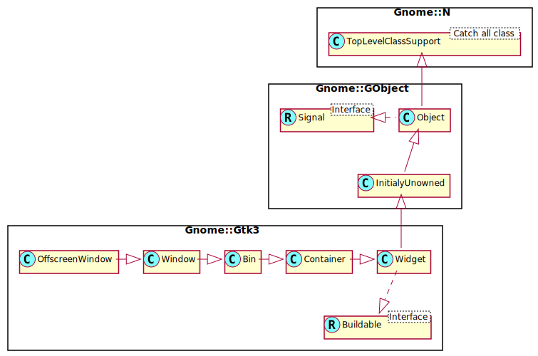

Gnome::Gtk3::OffscreenWindow
============================

A toplevel to manage offscreen rendering of child widgets

Description
===========

GtkOffscreenWindow is strictly intended to be used for obtaining snapshots of widgets that are not part of a normal widget hierarchy. Since **Gnome::Gtk3::OffscreenWindow** is a toplevel widget you cannot obtain snapshots of a full window with it since you cannot pack a toplevel widget in another toplevel.

The idea is to take a widget and manually set the state of it, add it to a GtkOffscreenWindow and then retrieve the snapshot as a **cairo-surface-t** or **Gnome::Gtk3::Pixbuf**.

GtkOffscreenWindow derives from **Gnome::Gtk3::Window** only as an implementation detail. Applications should not use any API specific to **Gnome::Gtk3::Window** to operate on this object. It should be treated as a **Gnome::Gtk3::Bin** that has no parent widget.

When contained offscreen widgets are redrawn, GtkOffscreenWindow will emit a *damage-event* signal.

Synopsis
========

Declaration
-----------

    unit class Gnome::Gtk3::OffscreenWindow;
    also is Gnome::Gtk3::Window;

Uml Diagram
-----------

Example
-------

An example where a grid with two buttons are rendered and saved in a png and a jpg image file.

    # Setup something to show in an image.
    my Gnome::Gtk3::Button $b1 .= new(:label<Stop>);
    my Gnome::Gtk3::Button $b2 .= new(:label<Start>);
    my Gnome::Gtk3::Grid $g  .= new;
    $g.attach( $b1, 0, 0, 1, 1);
    $g.attach( $b2, 1, 0, 1, 1);
    $ow.add($g);
    $ow.show-all;

    # Must process pending events, otherwise nothing is shown! Note,
    # that this is written outside the main event loop in the test program!
    # Otherwise, this is not necessary.
    my Gnome::Gtk3::Main $main .= new;
    while $main.gtk-events-pending() { $main.iteration-do(False); }

    # Now we can try to get the contents of the widget. First using
    # a cairo_surface
    my Gnome::Cairo::ImageSurface $image-surface .= new(
      :native-object($ow.get-surface)
    );
    $image-surface.write_to_png("OffscreenWindow-surface.png");
    $image-surface.clear-object;

    # Then using a pixbuf
    my Gnome::Gdk3::Pixbuf $pb = $ow.get-pixbuf-rk;
    my Gnome::Glib::Error $e = $pb.savev(
      "OffscreenWindow-pixbuf.jpg", 'jpeg', ['quality'], ['100']
    );

The result of the png and jpg file;

Methods
=======

new
---

This widget can only be created by calling `new()` without any options. Importing from other widgets using `:native-object` is not very useful. The glade GUI designer program has the offscreen window widget which can be placed in your design so the `:build-id` is still possible.

### default, no options

Creates a toplevel container widget that is used to retrieve snapshots of widgets without showing them on the screen.

    multi method new ( )

### :build-id

Create a OffscreenWindow object using a native object returned from a builder. See also **Gnome::GObject::Object**.

    multi method new ( Str :$build-id! )

get-pixbuf, get-pixbuf-rk
-------------------------

Retrieves a snapshot of the contained widget in the form of a **Gnome::Gdk3::Pixbuf**. This is a new pixbuf with a reference count of 1, and the application should unreference it once it is no longer needed.

    method get-pixbuf ( --> N-GObject )
    method get-pixbuf-rk ( --> Gnome::Gdk3::Pixbuf )

get-surface, get-surface-rk
---------------------------

Retrieves a snapshot of the contained widget in the form of a **cairo-surface-t**. If you need to keep this around over window resizes then you should add a reference to it.

Returns: A **cairo-surface-t** pointer to the offscreen surface, or `undefined`.

    method get-surface ( --> cairo_surface_t )
    method get-surface-rk ( --> Gnome::Cairo::Surface )

