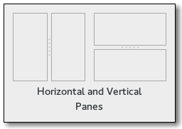

Gnome::Gtk3::Paned
==================

A widget with two adjustable panes

Description
===========

**Gnome::Gtk3::Paned** has two panes, arranged either horizontally or vertically. The division between the two panes is adjustable by the user by dragging a handle.

Child widgets are added to the panes of the widget with `gtk_paned_pack1()` and `gtk_paned_pack2()`. The division between the two children is set by default from the size requests of the children, but it can be adjusted by the user.

A paned widget draws a separator between the two child widgets and a small handle that the user can drag to adjust the division. It does not draw any relief around the children or around the separator. (The space in which the separator is called the gutter.) Often, it is useful to put each child inside a **Gnome::Gtk3::Frame** with the shadow type set to `GTK_SHADOW_IN` so that the gutter appears as a ridge. No separator is drawn if one of the children is missing.

Each child has two options that can be set, *resize* and *shrink*. If *resize* is true, then when the **Gnome::Gtk3::Paned** is resized, that child will expand or shrink along with the paned widget. If *shrink* is true, then that child can be made smaller than its requisition by the user. Setting *shrink* to `0` allows the application to set a minimum size. If *resize* is false for both children, then this is treated as if *resize* is true for both children.

The application can set the position of the slider as if it were set by the user, by calling `gtk_paned_set_position()`.

Css Nodes
---------

    paned
    ├── <child>
    ├── separator[.wide]
    ╰── <child>

**Gnome::Gtk3::Paned** has a main CSS node with name paned, and a subnode for the separator with name separator. The subnodes gets a .wide style class when the paned is supposed to be wide.

In horizontal orientation, the nodes of the children are always arranged from left to right. So *first-child* will always select the leftmost child, regardless of text direction.

Implemented Interfaces
----------------------

Gnome::Gtk3::Paned implements

  * [Gnome::Gtk3::Buildable](Buildable.html)

  * [Gnome::Gtk3::Orientable](Orientable.html)

Synopsis
========

Declaration
-----------

    unit class Gnome::Gtk3::Paned;
    also is Gnome::Gtk3::Container;
    also does Gnome::Gtk3::Buildable;
    also does Gnome::Gtk3::Orientable;

Example
-------

    my Gnome::Gtk3::Paned $p .= new(:orientation(GTK_ORIENTATION_HORIZONTAL));
    my Gnome::Gtk3::ListBox $lb1 .= new(:empty);
    my Gnome::Gtk3::ListBox $lb2 .= new(:empty);
    $p.gtk-paned-add1($lb1);
    $p.gtk-paned-add2($lb2);

Methods
=======

new
---

Create a new object with an orientation set to `GTK_ORIENTATION_HORIZONTAL` or `GTK_ORIENTATION_VERTICAL`.

    multi method new ( :$orientation! )

Create an object using a native object from elsewhere. See also **Gnome::GObject::Object**.

    multi method new ( N-GObject :$widget! )

Create an object using a native object from a builder. See also **Gnome::GObject::Object**.

    multi method new ( Str :$build-id! )

[gtk_] paned_new
----------------

Creates a new **Gnome::Gtk3::Paned** widget.

Returns: a new **Gnome::Gtk3::Paned**.

Since: 3.0

    method gtk_paned_new ( GtkOrientation $orientation --> N-GObject  )

  * GtkOrientation $orientation; the paned’s orientation.

[gtk_] paned_add1
-----------------

Adds a child to the top or left pane with default parameters. This is equivalent to `gtk_paned_pack1 (paned, child, FALSE, TRUE)`.

    method gtk_paned_add1 ( N-GObject $child )

  * N-GObject $child; the child to add

[gtk_] paned_add2
-----------------

Adds a child to the bottom or right pane with default parameters. This is equivalent to `gtk_paned_pack2 (paned, child, TRUE, TRUE)`.

    method gtk_paned_add2 ( N-GObject $child )

  * N-GObject $child; the child to add

[gtk_] paned_pack1
------------------

Adds a child to the top or left pane.

    method gtk_paned_pack1 ( N-GObject $child, Int $resize, Int $shrink )

  * N-GObject $child; the child to add

  * Int $resize; should this child expand when the paned widget is resized.

  * Int $shrink; can this child be made smaller than its requisition.

[gtk_] paned_pack2
------------------

Adds a child to the bottom or right pane.

    method gtk_paned_pack2 ( N-GObject $child, Int $resize, Int $shrink )

  * N-GObject $child; the child to add

  * Int $resize; should this child expand when the paned widget is resized.

  * Int $shrink; can this child be made smaller than its requisition.

[[gtk_] paned_] get_position
----------------------------

Obtains the position of the divider between the two panes.

Returns: position of the divider

    method gtk_paned_get_position ( --> Int  )

[[gtk_] paned_] set_position
----------------------------

Sets the position of the divider between the two panes.

    method gtk_paned_set_position ( Int $position )

  * Int $position; pixel position of divider, a negative value means that the position is unset.

[[gtk_] paned_] get_child1
--------------------------

Obtains the first child of the paned widget.

Returns: (nullable) (transfer none): first child, or `Any` if it is not set.

Since: 2.4

    method gtk_paned_get_child1 ( --> N-GObject  )

[[gtk_] paned_] get_child2
--------------------------

Obtains the second child of the paned widget.

Returns: (nullable) (transfer none): second child, or `Any` if it is not set.

Since: 2.4

    method gtk_paned_get_child2 ( --> N-GObject  )

[[gtk_] paned_] get_handle_window
---------------------------------

Returns the **Gnome::Gdk3::Window** of the handle. This function is useful when handling button or motion events because it enables the callback to distinguish between the window of the paned, a child and the handle.

Returns: (transfer none): the paned’s handle window.

Since: 2.20

    method gtk_paned_get_handle_window ( --> N-GObject  )

[[gtk_] paned_] set_wide_handle
-------------------------------

Sets the *wide-handle* property.

Since: 3.16

    method gtk_paned_set_wide_handle ( Int $wide )

  * Int $wide; the new value for the *wide-handle* property

[[gtk_] paned_] get_wide_handle
-------------------------------

Gets the *wide-handle* property.

Returns: `1` if the paned should have a wide handle

Since: 3.16

    method gtk_paned_get_wide_handle ( --> Int  )

Signals
=======

There are two ways to connect to a signal. The first option you have is to use `register-signal()` from **Gnome::GObject::Object**. The second option is to use `g_signal_connect_object()` directly from **Gnome::GObject::Signal**.

First method
------------

The positional arguments of the signal handler are all obligatory as well as their types. The named attributes `:$widget` and user data are optional.

    # handler method
    method mouse-event ( GdkEvent $event, :$widget ) { ... }

    # connect a signal on window object
    my Gnome::Gtk3::Window $w .= new( ... );
    $w.register-signal( self, 'mouse-event', 'button-press-event');

Second method
-------------

    my Gnome::Gtk3::Window $w .= new( ... );
    my Callable $handler = sub (
      N-GObject $native, GdkEvent $event, OpaquePointer $data
    ) {
      ...
    }

    $w.connect-object( 'button-press-event', $handler);

Also here, the types of positional arguments in the signal handler are important. This is because both methods `register-signal()` and `g_signal_connect_object()` are using the signatures of the handler routines to setup the native call interface.

Supported signals
-----------------

### cycle-child-focus

The *cycle-child-focus* signal is a [keybinding signal][**Gnome::Gtk3::BindingSignal**] which gets emitted to cycle the focus between the children of the paned.

The default binding is f6.

Since: 2.0

    method handler (
      Int $reversed,
      Gnome::GObject::Object :widget($widget),
      *%user-options
      --> Int
    );

  * $widget; the object that received the signal

  * $reversed; whether cycling backward or forward

### toggle-handle-focus

The *toggle-handle-focus* is a [keybinding signal][**Gnome::Gtk3::BindingSignal**] which gets emitted to accept the current position of the handle and then move focus to the next widget in the focus chain.

The default binding is Tab.

Since: 2.0

    method handler (
      Gnome::GObject::Object :widget($widget),
      *%user-options
      --> Int
    );

  * $widget; the object that received the signal

### move-handle

The *move-handle* signal is a [keybinding signal][**Gnome::Gtk3::BindingSignal**] which gets emitted to move the handle when the user is using key bindings to move it.

Since: 2.0

    method handler (
      Int $scroll_type,
      Gnome::GObject::Object :widget($widget),
      *%user-options
      --> Int
    );

  * $widget; the object that received the signal

  * $scroll_type; a **Gnome::Gtk3::ScrollType**

### cycle-handle-focus

The *cycle-handle-focus* signal is a keybinding signal which gets emitted to cycle whether the paned should grab focus to allow the user to change position of the handle by using key bindings.

The default binding for this signal is f8.

Since: 2.0

    method handler (
      Int $reversed,
      Gnome::GObject::Object :widget($widget),
      *%user-options
      --> Int
    );

  * $widget; the object that received the signal

  * $reversed; whether cycling backward or forward

### accept-position

The *accept-position* signal is a [keybinding signal][**Gnome::Gtk3::BindingSignal**] which gets emitted to accept the current position of the handle when moving it using key bindings.

The default binding for this signal is Return or Space.

Since: 2.0

    method handler (
      Gnome::GObject::Object :widget($widget),
      *%user-options
      --> Int
    );

  * $widget; the object that received the signal

Properties
==========

An example of using a string type property of a **Gnome::Gtk3::Label** object. This is just showing how to set/read a property, not that it is the best way to do it. This is because a) The class initialization often provides some options to set some of the properties and b) the classes provide many methods to modify just those properties. In the case below one can use **new(:label('my text label'))** or **gtk_label_set_text('my text label')**.

    my Gnome::Gtk3::Label $label .= new(:empty);
    my Gnome::GObject::Value $gv .= new(:init(G_TYPE_STRING));
    $label.g-object-get-property( 'label', $gv);
    $gv.g-value-set-string('my text label');

Supported properties
--------------------

### Position

The **Gnome::GObject::Value** type of property *position* is `G_TYPE_INT`.

### Position Set

TRUE if the Position property should be used Default value: False

The **Gnome::GObject::Value** type of property *position-set* is `G_TYPE_BOOLEAN`.

### Minimal Position

The smallest possible value for the position property. This property is derived from the size and shrinkability of the widget's children. Since: 2.4

The **Gnome::GObject::Value** type of property *min-position* is `G_TYPE_INT`.

### Maximal Position

The largest possible value for the position property. This property is derived from the size and shrinkability of the widget's children. Since: 2.4

The **Gnome::GObject::Value** type of property *max-position* is `G_TYPE_INT`.

### Wide Handle

Setting this property to `1` indicates that the paned needs to provide stronger visual separation (e.g. because it separates between two notebooks, whose tab rows would otherwise merge visually). Since: 3.16

The **Gnome::GObject::Value** type of property *wide-handle* is `G_TYPE_BOOLEAN`.

