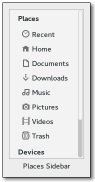

Gnome::Gtk3::PlacesSidebar
==========================

Sidebar that displays frequently-used places in the file system

Description
===========

**Gnome::Gtk3::PlacesSidebar** is a widget that displays a list of frequently-used places in the file system: the user’s home directory, the user’s bookmarks, and volumes and drives. This widget is used as a sidebar in **Gnome::Gtk3::FileChooser** and may be used by file managers and similar programs.

The places sidebar displays drives and volumes, and will automatically mount or unmount them when the user selects them.

Applications can hook to various signals in the places sidebar to customize its behavior. For example, they can add extra commands to the context menu of the sidebar.

While bookmarks are completely in control of the user, the places sidebar also allows individual applications to provide extra shortcut folders that are unique to each application. For example, a Paint program may want to add a shortcut for a Clipart folder. You can do this with `gtk_places_sidebar_add_shortcut()`.

To make use of the places sidebar, an application at least needs to connect to the *open-location* signal. This is emitted when the user selects in the sidebar a location to open. The application should also call `gtk_places_sidebar_set_location()` when it changes the currently-viewed location.

Css Nodes
---------

**Gnome::Gtk3::PlacesSidebar** uses a single CSS node with name placessidebar and style class .sidebar.

Among the children of the places sidebar, the following style classes can be used:

  * .sidebar-new-bookmark-row for the 'Add new bookmark' row

  * .sidebar-placeholder-row for a row that is a placeholder

  * .has-open-popup when a popup is open for a row

See Also
--------

**Gnome::Gtk3::FileChooser**

Synopsis
========

Declaration
-----------

    unit class Gnome::Gtk3::PlacesSidebar;
    also is Gnome::Gtk3::ScrolledWindow;

Types
=====

enum GtkPlacesOpenFlags
-----------------------

These flags serve two purposes. First, the application can call `gtk_places_sidebar_set_open_flags()` using these flags as a bitmask. This tells the sidebar that the application is able to open folders selected from the sidebar in various ways, for example, in new tabs or in new windows in addition to the normal mode.

Second, when one of these values gets passed back to the application in the *open-location* signal, it means that the application should open the selected location in the normal way, in a new tab, or in a new window. The sidebar takes care of determining the desired way to open the location, based on the modifier keys that the user is pressing at the time the selection is made.

If the application never calls `gtk_places_sidebar_set_open_flags()`, then the sidebar will only use **GTK_PLACES_OPEN_NORMAL** in the *open-location* signal. This is the default mode of operation.

  * GTK_PLACES_OPEN_NORMAL: This is the default mode that **Gnome::Gtk3::PlacesSidebar** uses if no other flags are specified. It indicates that the calling application should open the selected location in the normal way, for example, in the folder view beside the sidebar.

  * GTK_PLACES_OPEN_NEW_TAB: When passed to `gtk_places_sidebar_set_open_flags()`, this indicates that the application can open folders selected from the sidebar in new tabs. This value will be passed to the *open-location* signal when the user selects that a location be opened in a new tab instead of in the standard fashion.

  * GTK_PLACES_OPEN_NEW_WINDOW: Similar to *GTK_PLACES_OPEN_NEW_TAB*, but indicates that the application can open folders in new windows.

Methods
=======

new
---

Create a new PlacesSidebar object.

    multi method new ( )

Create a PlacesSidebar object using a native object from elsewhere. See also **Gnome::N::TopLevelClassSupport**.

    multi method new ( N-GObject :$native-object! )

Create a PlacesSidebar object using a native object returned from a builder. See also **Gnome::GObject::Object**.

    multi method new ( Str :$build-id! )

[gtk_places_sidebar_] get_open_flags
------------------------------------

Gets the open flags.

Returns: the **GtkPlacesOpenFlags** of *sidebar*

    method gtk_places_sidebar_get_open_flags ( --> GtkPlacesOpenFlags )

[gtk_places_sidebar_] set_open_flags
------------------------------------

Sets the way in which the calling application can open new locations from the places sidebar. For example, some applications only open locations “directly” into their main view, while others may support opening locations in a new notebook tab or a new window.

This function is used to tell the places *sidebar* about the ways in which the application can open new locations, so that the sidebar can display (or not) the “Open in new tab” and “Open in new window” menu items as appropriate.

When the *open-location* signal is emitted, its flags argument will be set to one of the *flags* that was passed in `gtk_places_sidebar_set_open_flags()`.

Passing 0 for *flags* will cause **GTK_PLACES_OPEN_NORMAL** to always be sent to callbacks for the “open-location” signal.

    method gtk_places_sidebar_set_open_flags ( GtkPlacesOpenFlags $flags )

  * GtkPlacesOpenFlags $flags; Bitmask of modes in which the calling application can open locations

[gtk_places_sidebar_] get_location
----------------------------------

Gets the currently selected location in the *sidebar*. This can be `Any` when nothing is selected, for example, when `gtk_places_sidebar_set_location()` has been called with a location that is not among the sidebar’s list of places to show.

You can use this function to get the selection in the *sidebar*. Also, if you connect to the *populate-popup* signal, you can use this function to get the location that is being referred to during the callbacks for your menu items.

Returns: (nullable) (transfer full): a **N-GFile** with the selected location, or `Any` if nothing is visually selected.

    method gtk_places_sidebar_get_location ( --> N-GFile )

[gtk_places_sidebar_] set_location
----------------------------------

Sets the location that is being shown in the widgets surrounding the *sidebar*, for example, in a folder view in a file manager. In turn, the *sidebar* will highlight that location if it is being shown in the list of places, or it will unhighlight everything if the *location* is not among the places in the list.

    method gtk_places_sidebar_set_location ( N-GFile $location )

  * N-GFile $location; (nullable): location to select, or `Any` for no current path

[gtk_places_sidebar_] get_show_recent
-------------------------------------

Returns the value previously set with `gtk_places_sidebar_set_show_recent()`

Returns: `1` if the sidebar will display a builtin shortcut for recent files

    method gtk_places_sidebar_get_show_recent ( --> Int )

[gtk_places_sidebar_] set_show_recent
-------------------------------------

Sets whether the *sidebar* should show an item for recent files. The default value for this option is determined by the desktop environment, but this function can be used to override it on a per-application basis.

    method gtk_places_sidebar_set_show_recent ( Int $show_recent )

  * Int $show_recent; whether to show an item for recent files

[gtk_places_sidebar_] get_show_desktop
--------------------------------------

Returns the value previously set with `gtk_places_sidebar_set_show_desktop()`

Returns: `1` if the sidebar will display a builtin shortcut to the desktop folder.

    method gtk_places_sidebar_get_show_desktop ( --> Int )

[gtk_places_sidebar_] set_show_desktop
--------------------------------------

Sets whether the *sidebar* should show an item for the Desktop folder. The default value for this option is determined by the desktop environment and the user’s configuration, but this function can be used to override it on a per-application basis.

    method gtk_places_sidebar_set_show_desktop ( Int $show_desktop )

  * Int $show_desktop; whether to show an item for the Desktop folder

[gtk_places_sidebar_] get_show_enter_location
---------------------------------------------

Returns the value previously set with `gtk_places_sidebar_set_show_enter_location()`

Returns: `1` if the sidebar will display an “Enter Location” item.

    method gtk_places_sidebar_get_show_enter_location ( --> Int )

[gtk_places_sidebar_] set_show_enter_location
---------------------------------------------

Sets whether the *sidebar* should show an item for entering a location; this is off by default. An application may want to turn this on if manually entering URLs is an expected user action.

If you enable this, you should connect to the *show-enter-location* signal.

    method gtk_places_sidebar_set_show_enter_location ( Int $show_enter_location )

  * Int $show_enter_location; whether to show an item to enter a location

[gtk_places_sidebar_] set_local_only
------------------------------------

Sets whether the *sidebar* should only show local files.

    method gtk_places_sidebar_set_local_only ( Int $local_only )

  * Int $local_only; whether to show only local files

[gtk_places_sidebar_] get_local_only
------------------------------------

Returns the value previously set with `gtk_places_sidebar_set_local_only()`.

Returns: `1` if the sidebar will only show local files.

    method gtk_places_sidebar_get_local_only ( --> Int )

[gtk_places_sidebar_] add_shortcut
----------------------------------

Applications may want to present some folders in the places sidebar if they could be immediately useful to users. For example, a drawing program could add a “/usr/share/clipart” location when the sidebar is being used in an “Insert Clipart” dialog box.

This function adds the specified *location* to a special place for immutable shortcuts. The shortcuts are application-specific; they are not shared across applications, and they are not persistent. If this function is called multiple times with different locations, then they are added to the sidebar’s list in the same order as the function is called.

    method gtk_places_sidebar_add_shortcut ( N-GFile $location )

  * N-GFile $location; location to add as an application-specific shortcut

[gtk_places_sidebar_] remove_shortcut
-------------------------------------

Removes an application-specific shortcut that has been previously been inserted with `gtk_places_sidebar_add_shortcut()`. If the *location* is not a shortcut in the sidebar, then nothing is done.

    method gtk_places_sidebar_remove_shortcut ( N-GFile $location )

  * N-GFile $location; location to remove

[gtk_places_sidebar_] list_shortcuts
------------------------------------

Gets the list of shortcuts.

Returns: (element-type N-GFile) (transfer full): A **GSList** of **N-GFile** of the locations that have been added as application-specific shortcuts with `gtk_places_sidebar_add_shortcut()`.

    method gtk_places_sidebar_list_shortcuts ( --> N-GSList )

[gtk_places_sidebar_] get_nth_bookmark
--------------------------------------

This function queries the bookmarks added by the user to the places sidebar, and returns one of them. This function is used by **Gnome::Gtk3::FileChooser** to implement the “Alt-1”, “Alt-2”, etc. shortcuts, which activate the cooresponding bookmark.

Returns: (nullable) (transfer full): The bookmark specified by the index *n*, or `Any` if no such index exist. Note that the indices start at 0, even though the file chooser starts them with the keyboard shortcut "Alt-1".

    method gtk_places_sidebar_get_nth_bookmark ( Int $n --> N-GFile )

  * Int $n; index of the bookmark to query

[gtk_places_sidebar_] get_show_trash
------------------------------------

Returns the value previously set with `gtk_places_sidebar_set_show_trash()`

Returns: `1` if the sidebar will display a “Trash” item.

    method gtk_places_sidebar_get_show_trash ( --> Int )

[gtk_places_sidebar_] set_show_trash
------------------------------------

Sets whether the *sidebar* should show an item for the Trash location.

    method gtk_places_sidebar_set_show_trash ( Int $show_trash )

  * Int $show_trash; whether to show an item for the Trash location

[gtk_places_sidebar_] set_show_other_locations
----------------------------------------------

Sets whether the *sidebar* should show an item for the application to show an Other Locations view; this is off by default. When set to `1`, persistent devices such as hard drives are hidden, otherwise they are shown in the sidebar. An application may want to turn this on if it implements a way for the user to see and interact with drives and network servers directly.

If you enable this, you should connect to the *show-other-locations* signal.

    method gtk_places_sidebar_set_show_other_locations ( Int $show_other_locations )

  * Int $show_other_locations; whether to show an item for the Other Locations view

[gtk_places_sidebar_] get_show_other_locations
----------------------------------------------

Returns the value previously set with `gtk_places_sidebar_set_show_other_locations()`

Returns: `1` if the sidebar will display an “Other Locations” item.

    method gtk_places_sidebar_get_show_other_locations ( --> Int )

[gtk_places_sidebar_] set_show_starred_location
-----------------------------------------------

If you enable this, you should connect to the *show-starred-location* signal. .26

    method gtk_places_sidebar_set_show_starred_location ( Int $show_starred_location )

  * Int $show_starred_location; whether to show an item for Starred files

[gtk_places_sidebar_] get_show_starred_location
-----------------------------------------------

Returns the value previously set with `gtk_places_sidebar_set_show_starred_location()`

Returns: `1` if the sidebar will display a Starred item. .26

    method gtk_places_sidebar_get_show_starred_location ( --> Int )

Signals
=======

There are two ways to connect to a signal. The first option you have is to use `register-signal()` from **Gnome::GObject::Object**. The second option is to use `g_signal_connect_object()` directly from **Gnome::GObject::Signal**.

First method
------------

The positional arguments of the signal handler are all obligatory as well as their types. The named attributes `:$widget` and user data are optional.

    # handler method
    method mouse-event ( GdkEvent $event, :$widget ) { ... }

    # connect a signal on window object
    my Gnome::Gtk3::Window $w .= new( ... );
    $w.register-signal( self, 'mouse-event', 'button-press-event');

Second method
-------------

    my Gnome::Gtk3::Window $w .= new( ... );
    my Callable $handler = sub (
      N-GObject $native, GdkEvent $event, OpaquePointer $data
    ) {
      ...
    }

    $w.connect-object( 'button-press-event', $handler);

Also here, the types of positional arguments in the signal handler are important. This is because both methods `register-signal()` and `g_signal_connect_object()` are using the signatures of the handler routines to setup the native call interface.

Supported signals
-----------------

### open-location

The places sidebar emits this signal when the user selects a location in it. The calling application should display the contents of that location; for example, a file manager should show a list of files in the specified location.

    method handler (
      Unknown type G_TYPE_OBJECT $location,
      Unknown type GTK_TYPE_PLACES_OPEN_FLAGS $open_flags,
      Int :$_handler_id,
      Gnome::GObject::Object :_widget($sidebar),
      *%user-options
    );

  * $sidebar; the object which received the signal.

  * $location; (type Gio.File): **N-GFile** to which the caller should switch.

  * $open_flags; a single value from **GtkPlacesOpenFlags** specifying how the *location* should be opened.

### populate-popup

The places sidebar emits this signal when the user invokes a contextual popup on one of its items. In the signal handler, the application may add extra items to the menu as appropriate. For example, a file manager may want to add a "Properties" command to the menu.

It is not necessary to store the *selected_item* for each menu item; during their callbacks, the application can use `gtk_places_sidebar_get_location()` to get the file to which the item refers.

The *selected_item* argument may be `Any` in case the selection refers to a volume. In this case, *selected_volume* will be non-`Any`. In this case, the calling application will have to `g_object_ref()` the *selected_volume* and keep it around to use it in the callback.

The *container* and all its contents are destroyed after the user dismisses the popup. The popup is re-created (and thus, this signal is emitted) every time the user activates the contextual menu.

Before 3.18, the *container* always was a **Gnome::Gtk3::Menu**, and you were expected to add your items as **Gnome::Gtk3::MenuItems**. Since 3.18, the popup may be implemented as a **Gnome::Gtk3::Popover**, in which case *container* will be something else, e.g. a **Gnome::Gtk3::Box**, to which you may add **Gnome::Gtk3::ModelButtons** or other widgets, such as **Gnome::Gtk3::Entries**, **Gnome::Gtk3::SpinButtons**, etc. If your application can deal with this situation, you can set *populate-all* to `1` to request that this signal is emitted for populating popovers as well.

    method handler (
      N-GObject #`{ is widget } $container,
      Unknown type G_TYPE_FILE $selected_item,
      Unknown type G_TYPE_VOLUME $selected_volume,
      Int :$_handler_id,
      Gnome::GObject::Object :_widget($sidebar),
      *%user-options
    );

  * $sidebar; the object which received the signal.

  * $container; (type **Gnome::Gtk3::.Widget**): a **Gnome::Gtk3::Menu** or another **Gnome::Gtk3::Container**

  * $selected_item; (type Gio.File) (nullable): **N-GFile** with the item to which the popup should refer, or `Any` in the case of a *selected_volume*. =item $selected_volume; (type Gio.Volume) (nullable): **GVolume** if the selected item is a volume, or `Any` if it is a file.

### show-error-message

The places sidebar emits this signal when it needs the calling application to present an error message. Most of these messages refer to mounting or unmounting media, for example, when a drive cannot be started for some reason.

    method handler (
      Str $primary,
      Str $secondary,
      Int :$_handler_id,
      Gnome::GObject::Object :_widget($sidebar),
      *%user-options
    );

  * $sidebar; the object which received the signal.

  * $primary; primary message with a summary of the error to show.

  * $secondary; secondary message with details of the error to show.

### show-connect-to-server

The places sidebar emits this signal when it needs the calling application to present an way to connect directly to a network server. For example, the application may bring up a dialog box asking for a URL like "sftp://ftp.example.com". It is up to the application to create the corresponding mount by using, for example, `g_file_mount_enclosing_volume()`.

Deprecated: 3.18: use the *show-other-locations* signal to connect to network servers.

    method handler (
      Int :$_handler_id,
      Gnome::GObject::Object :_widget($sidebar),
      *%user-options
    );

  * $sidebar; the object which received the signal.

### show-enter-location

The places sidebar emits this signal when it needs the calling application to present an way to directly enter a location. For example, the application may bring up a dialog box asking for a URL like "http://http.example.com".

    method handler (
      Int :$_handler_id,
      Gnome::GObject::Object :_widget($sidebar),
      *%user-options
    );

  * $sidebar; the object which received the signal.

### drag-action-requested

When the user starts a drag-and-drop operation and the sidebar needs to ask the application for which drag action to perform, then the sidebar will emit this signal.

The application can evaluate the *context* for customary actions, or it can check the type of the files indicated by *source_file_list* against the possible actions for the destination *dest_file*.

The drag action to use must be the return value of the signal handler.

Returns: The drag action to use, for example, **GDK_ACTION_COPY** or **GDK_ACTION_MOVE**, or 0 if no action is allowed here (i.e. drops are not allowed in the specified *dest_file*).

    method handler (
      Unknown type GDK_TYPE_DRAG_CONTEXT $context,
      Unknown type G_TYPE_OBJECT $dest_file,
      Unknown type G_TYPE_POINTER /* GList of N-GFile */  $source_file_list,
      Int :$_handler_id,
      Gnome::GObject::Object :_widget($sidebar),
      *%user-options
      --> Int
    );

  * $sidebar; the object which received the signal.

  * $context; (type **Gnome::Gdk3::.DragContext**): **Gnome::Gdk3::DragContext** with information about the drag operation

  * $dest_file; (type Gio.File): **N-GFile** with the tentative location that is being hovered for a drop

  * $source_file_list; (type GLib.List) (element-type N-GFile) (transfer none): List of **N-GFile** that are being dragged

### drag-action-ask

The places sidebar emits this signal when it needs to ask the application to pop up a menu to ask the user for which drag action to perform.

Returns: the final drag action that the sidebar should pass to the drag side of the drag-and-drop operation.

    method handler (
      Int $actions,
      Int :$_handler_id,
      Gnome::GObject::Object :_widget($sidebar),
      *%user-options
      --> Int
    );

  * $sidebar; the object which received the signal.

  * $actions; Possible drag actions that need to be asked for.

### drag-perform-drop

The places sidebar emits this signal when the user completes a drag-and-drop operation and one of the sidebar's items is the destination. This item is in the *dest_file*, and the *source_file_list* has the list of files that are dropped into it and which should be copied/moved/etc. based on the specified *action*.

    method handler (
      Unknown type G_TYPE_OBJECT $dest_file,
      Unknown type G_TYPE_POINTER $source_file_list,
      Unknown type /* GList of N-GFile */
                          G_TYPE_INT $action,
      Int :$_handler_id,
      Gnome::GObject::Object :_widget($sidebar),
      *%user-options
    );

  * $sidebar; the object which received the signal.

  * $dest_file; (type Gio.File): Destination **N-GFile**.

  * $source_file_list; (type GLib.List) (element-type N-GFile) (transfer none): **GList** of **N-GFile** that got dropped.

  * $action; Drop action to perform.

### show-other-locations

The places sidebar emits this signal when it needs the calling application to present a way to show other locations e.g. drives and network access points. For example, the application may bring up a page showing persistent volumes and discovered network addresses.

Deprecated: 3.20: use the *show-other-locations-with-flags* which includes the open flags in order to allow the user to specify to open in a new tab or window, in a similar way than *open-location*

    method handler (
      Int :$_handler_id,
      Gnome::GObject::Object :_widget($sidebar),
      *%user-options
    );

  * $sidebar; the object which received the signal.

### show-other-locations-with-flags

The places sidebar emits this signal when it needs the calling application to present a way to show other locations e.g. drives and network access points. For example, the application may bring up a page showing persistent volumes and discovered network addresses.

    method handler (
      Unknown type GTK_TYPE_PLACES_OPEN_FLAGS $open_flags,
      Int :$_handler_id,
      Gnome::GObject::Object :_widget($sidebar),
      *%user-options
    );

  * $sidebar; the object which received the signal.

  * $open_flags; a single value from **GtkPlacesOpenFlags** specifying how it should be opened.

### mount

The places sidebar emits this signal when it starts a new operation because the user clicked on some location that needs mounting. In this way the application using the **Gnome::Gtk3::PlacesSidebar** can track the progress of the operation and, for example, show a notification.

    method handler (
      Unknown type G_TYPE_MOUNT_OPERATION $mount_operation,
      Int :$_handler_id,
      Gnome::GObject::Object :_widget($sidebar),
      *%user-options
    );

  * $sidebar; the object which received the signal.

  * $mount_operation; the **GMountOperation** that is going to start.

### unmount

The places sidebar emits this signal when it starts a new operation because the user for example ejected some drive or unmounted a mount. In this way the application using the **Gnome::Gtk3::PlacesSidebar** can track the progress of the operation and, for example, show a notification.

    method handler (
      Unknown type G_TYPE_MOUNT_OPERATION $mount_operation,
      Int :$_handler_id,
      Gnome::GObject::Object :_widget($sidebar),
      *%user-options
    );

  * $sidebar; the object which received the signal.

  * $mount_operation; the **GMountOperation** that is going to start.

### show-starred-location

The places sidebar emits this signal when it needs the calling application to present a way to show the starred files. In GNOME, starred files are implemented by setting the nao:predefined-tag-favorite tag in the tracker database.

    method handler (
      Unknown type GTK_TYPE_PLACES_OPEN_FLAGS $open_flags,
      Int :$_handler_id,
      Gnome::GObject::Object :_widget($sidebar),
      *%user-options
    );

  * $sidebar; the object which received the signal.

  * $open_flags; a single value from **GtkPlacesOpenFlags** specifying how the starred file should be opened.

