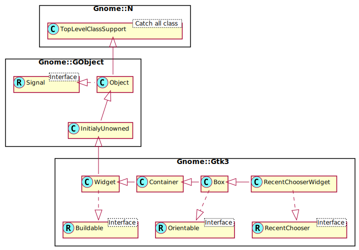

Gnome::Gtk3::RecentChooserWidget
================================

Displays recently used files

Description
===========

**Gnome::Gtk3::RecentChooserWidget** is a widget suitable for selecting recently used files. It is the main building block of a **Gnome::Gtk3::RecentChooserDialog**. Most applications will only need to use the latter; you can use **Gnome::Gtk3::RecentChooserWidget** as part of a larger window if you have special needs.

Note that **Gnome::Gtk3::RecentChooserWidget** does not have any methods of its own. Instead, you can use the functions added by the interface **Gnome::Gtk3::RecentChooser**.

See Also
--------

**Gnome::Gtk3::RecentChooser**, **Gnome::Gtk3::RecentChooserDialog**

Synopsis
========

Declaration
-----------

    unit class Gnome::Gtk3::RecentChooserWidget;
    also is Gnome::Gtk3::Box;
    also does Gnome::Gtk3::RecentChooser;

Uml Diagram
-----------

Methods
=======

new
---

### default, no options

Create a new RecentChooserWidget object.

    multi method new ( )

### :manager

Creates a object with a specified recent manager. This is useful if you have implemented your own recent manager, or if you have a customized instance of a **Gnome::Gtk3::RecentManager** object.

    multi method new ( N-GObject :$manager! )

### :native-object

Create a RecentChooserWidget object using a native object from elsewhere. See also **Gnome::N::TopLevelClassSupport**.

    multi method new ( N-GObject :$native-object! )

### :build-id

Create a RecentChooserWidget object using a native object returned from a builder. See also **Gnome::GObject::Object**.

    multi method new ( Str :$build-id! )

